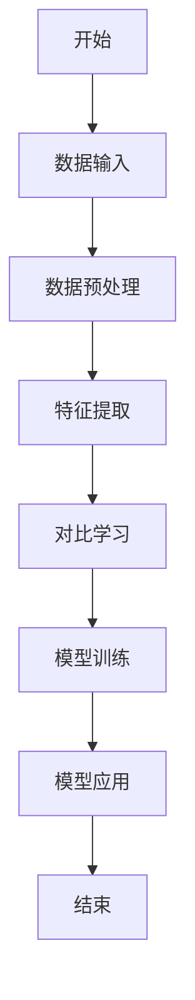
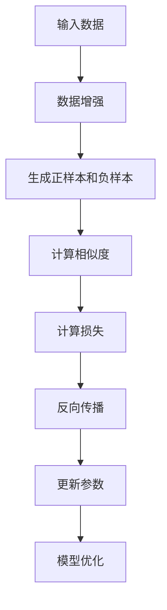

                 


# 企业AI Agent的自监督学习在非标准数据利用中的创新实践

## 关键词：
- 企业AI Agent
- 自监督学习
- 非标准数据
- 创新实践
- 数学模型
- 系统架构

## 摘要：
本文深入探讨了企业AI Agent在处理非标准数据时的自监督学习方法。通过分析背景、核心概念、算法原理、数学模型、系统架构以及项目实战，展示了如何利用自监督学习创新性地解决非标准数据的利用问题。文章结构清晰，内容详实，结合实际案例和代码示例，为读者提供了全面的指导和见解。

## 正文

---

## 第一部分：背景与概念

### 第1章：问题背景与描述

#### 1.1 问题背景

- **企业AI Agent的发展现状**：随着人工智能技术的快速发展，企业AI Agent在各个行业的应用日益广泛，尤其是在数据处理和决策支持方面展现出巨大潜力。然而，企业在实际应用中常常面临大量非标准数据，这些数据缺乏标签或结构，难以直接用于传统监督学习模型。

- **非标准数据的定义与挑战**：非标准数据指的是不符合常规数据格式或缺乏标注的数据，例如文本中的噪声数据、图像中的模糊区域、音频中的背景噪音等。处理这些数据的传统方法通常效率低下，且需要大量人工干预。

- **自监督学习的引入动机**：自监督学习作为一种新兴的无监督学习方法，通过利用数据本身的结构信息进行自我监督，能够在无需大量标注数据的情况下，学习数据的特征表示。这使得自监督学习成为处理非标准数据的理想选择。

#### 1.2 问题描述

- **非标准数据的特点与类型**：非标准数据具有多样性、不完整性和噪声多等特点。常见的类型包括未标注文本、低质量图像、实时传感器数据等。

- **传统监督学习的局限性**：传统监督学习需要大量标注数据，且在面对非结构化数据时表现不佳，导致企业在实际应用中面临高昂的数据标注成本和模型泛化能力不足的问题。

- **自监督学习的优势与适用场景**：自监督学习能够在无标签数据上进行有效学习，适用于处理企业中的非标准数据，如客户行为分析、实时监控数据处理等领域。

#### 1.3 问题解决

- **自监督学习如何处理非标准数据**：通过构建数据内部的关联关系，自监督学习能够从无标签数据中提取有用的特征，提升模型的泛化能力。

- **企业AI Agent的具体应用场景**：例如在客户互动、供应链优化、风险评估等领域，企业AI Agent可以利用自监督学习处理非标准数据，提升决策的准确性和效率。

- **创新实践的意义与价值**：通过创新性的自监督学习方法，企业能够更高效地利用非标准数据，降低数据处理成本，提升智能化水平。

#### 1.4 边界与外延

- **自监督学习的边界条件**：自监督学习适用于数据内部存在某种关联性，但不适合完全无结构或无相关性的数据。

- **非标准数据的范围界定**：非标准数据主要指未经处理或缺乏标注的数据，不包括经过预处理的高质量数据。

- **相关概念的区分与联系**：自监督学习与无监督学习和监督学习之间的区别与联系，以及在企业AI Agent中的具体应用。

#### 1.5 核心要素与概念结构

- **自监督学习的核心要素**：包括数据预处理、对比学习目标、损失函数设计等。

- **企业AI Agent的组成结构**：数据采集模块、特征提取模块、决策模块等。

- **概念间的关系图解**：通过ER图和流程图展示各部分的关系。

---

## 第二部分：核心概念与联系

### 第2章：自监督学习与相关概念

#### 2.1 核心概念原理

- **自监督学习的基本原理**：通过构建数据内部的对比目标，如图像重建、文本补全等，来学习数据的特征表示。

- **无监督学习与监督学习的对比**：无监督学习无需标签，监督学习需要标签，而自监督学习介于两者之间，利用数据内部的关联性进行学习。

- **自监督学习的独特优势**：能够从无标签数据中提取特征，适用于非标准数据处理。

#### 2.2 概念属性对比表

| 概念       | 监督学习         | 无监督学习       | 自监督学习       |
|------------|-----------------|-----------------|-----------------|
| 数据需求   | 需要标签         | 无需标签         | 需要构建对比目标 |
| 学习目标   | 分类或回归       | 聚类或降维       | 特征提取或重建   |
| 适用场景   | 标签数据         | 无结构数据       | 半监督或无标签数据 |
| 优缺点     | 高准确性，但成本高 | 无需标签，但结果可能不稳定 | 结合两者优势，成本较低，效果较好 |

#### 2.3 ER实体关系图

```mermaid
erDiagram
    actor 顾客
    actor 系统
    actor 数据源
    entity 数据
    entity 特征
    entity 模型
    顾客 --> 数据 : 提供
    系统 --> 数据 : 处理
    数据 --> 特征 : 提取
    特征 --> 模型 : 训练
    模型 --> 系统 : 应用
```

#### 2.4 Mermaid流程图



---

## 第三部分：算法原理讲解

### 第3章：自监督学习算法

#### 3.1 算法流程



#### 3.2 对比学习

- **对比学习的定义**：通过最大化正样本之间的相似度和最小化负样本之间的相似度来学习数据的特征表示。

- **实现步骤**：
  1. 数据增强：对输入数据进行变换，生成正样本和负样本。
  2. 计算相似度：使用余弦相似度或其他相似性度量。
  3. 计算损失：使用对比损失函数，如NT-Xent损失。
  4. 反向传播：优化模型参数以最小化损失。

#### 3.3 生成对抗网络

- **生成对抗网络的定义**：通过两个网络（生成器和判别器）的对抗训练，生成高质量的数据样本。

- **实现步骤**：
  1. 生成器生成样本。
  2. 判别器判断样本是否为真实数据。
  3. 通过交替优化生成器和判别器参数，提升生成样本的质量。

#### 3.4 Python代码示例

```python
import tensorflow as tf
from tensorflow.keras import layers

def contrastive_loss(y_true, y_pred):
    margin = 1.0
    loss = tf.reduce_mean(tf.square(y_true - y_pred))
    return 0.5 * loss

def build_model(input_shape):
    inputs = layers.Input(shape=input_shape)
    x = layers.Flatten()(inputs)
    x = layers.Dense(128, activation='relu')(x)
    x = layers.Dense(64, activation='relu')(x)
    outputs = layers.Dense(2)(x)
    return tf.keras.Model(inputs=inputs, outputs=outputs)

model = build_model((64, 64, 3))
model.compile(optimizer='adam', loss=contrastive_loss)
model.summary()
```

#### 3.5 数学模型与公式

- **对比损失函数**：
  $$ L = \frac{1}{2} \left( \frac{1}{|B|} \sum_{i=1}^{|B|} \log \frac{e^{s(x_i, x_j)}}{s(x_i, x_k)} \right) $$
  其中，\( s(x_i, x_j) \) 是正样本的相似度，\( s(x_i, x_k) \) 是负样本的相似度。

---

## 第四部分：数学模型与公式

### 第4章：自监督学习的数学模型

#### 4.1 对比损失函数

- **NT-Xent损失**：
  $$ \mathcal{L} = -\frac{1}{N}\sum_{i=1}^{N}\log\left(\frac{\exp(s(x_i, x_j))}{\sum_{k \neq j}\exp(s(x_i, x_k))}\right) $$
  其中，\( N \) 是 batch 的大小，\( s(x_i, x_j) \) 是正样本的相似度。

#### 4.2 优化目标

- **优化目标**：
  $$ \arg \min_{\theta} \mathbb{E}_{(x, x') \sim P}[L(x, x')] $$
  其中，\( \theta \) 是模型参数，\( L \) 是损失函数。

#### 4.3 示例

- **计算相似度**：
  给定两个向量 \( u \) 和 \( v \)，相似度 \( s(u, v) \) 可以通过点积计算：
  $$ s(u, v) = \frac{u \cdot v}{\|u\|\|v\|} $$
  其中，\( u \) 和 \( v \) 是归一化的向量。

---

## 第五部分：系统分析与架构设计方案

### 第5章：系统分析与架构设计

#### 5.1 问题场景介绍

- **问题场景**：企业需要处理大量非标准数据，如客户反馈中的情绪分析，其中数据可能包含多种语言、拼写错误等。

#### 5.2 系统功能设计

- **领域模型**：
  ```mermaid
  classDiagram
      class 数据采集模块 {
          输入数据
          采集接口
      }
      class 数据预处理模块 {
          数据清洗
          数据增强
      }
      class 特征提取模块 {
          提取特征
          对比学习
      }
      class 模型训练模块 {
          训练模型
          优化参数
      }
      数据采集模块 --> 数据预处理模块
      数据预处理模块 --> 特征提取模块
      特征提取模块 --> 模型训练模块
  ```

#### 5.3 系统架构设计

- **架构图**：
  ```mermaid
  graph TD
      A[数据源] --> B[数据采集模块]
      B --> C[数据预处理模块]
      C --> D[特征提取模块]
      D --> E[模型训练模块]
      E --> F[模型应用模块]
  ```

#### 5.4 接口设计

- **接口说明**：
  - 数据采集模块提供数据接口，接收原始数据。
  - 数据预处理模块提供接口，处理数据并输出特征。
  - 模型训练模块提供接口，接收特征并训练模型。

#### 5.5 交互设计

- **交互流程**：
  ```mermaid
  sequenceDiagram
      actor 用户
      participant 数据采集模块 as DC
      participant 数据预处理模块 as DP
      participant 特征提取模块 as FE
      participant 模型训练模块 as MT
      用户 -> DC: 提供数据
      DC -> DP: 数据预处理
      DP -> FE: 特征提取
      FE -> MT: 训练模型
      MT -> 用户: 返回模型
  ```

---

## 第六部分：项目实战

### 第6章：项目实战

#### 6.1 环境安装

- **安装Python和TensorFlow**：
  ```bash
  pip install python tensorflow
  ```

#### 6.2 核心代码实现

- **数据预处理**：
  ```python
  import numpy as np

  def data_augmentation(image):
      # 数据增强操作，例如随机裁剪、旋转等
      return image
  ```

- **特征提取网络**：
  ```python
  def feature_extractor(input_shape):
      model = tf.keras.Sequential([
          layers.Conv2D(32, (3,3), activation='relu', input_shape=input_shape),
          layers.MaxPooling2D((2,2)),
          layers.Conv2D(64, (3,3), activation='relu'),
          layers.MaxPooling2D((2,2)),
          layers.Flatten(),
          layers.Dense(128, activation='relu'),
          layers.Dense(2, activation='sigmoid')
      ])
      return model
  ```

#### 6.3 代码解读与分析

- **数据增强**：通过随机变换数据，增加数据多样性，提升模型的泛化能力。
- **特征提取网络**：使用卷积神经网络提取图像特征，适用于处理非标准图像数据。

#### 6.4 案例分析

- **案例：客户情绪分析**：
  - **数据来源**：客户反馈文本。
  - **处理步骤**：数据清洗、文本嵌入、对比学习、模型训练。
  - **结果分析**：模型能够准确识别客户情绪，提升客户满意度。

#### 6.5 项目小结

- **项目总结**：通过自监督学习，企业能够高效处理非标准数据，提升AI Agent的性能和效果。
- **经验分享**：数据预处理和模型调优是项目成功的关键，同时需要结合具体场景进行优化。

---

## 第七部分：总结与展望

### 第7章：总结与展望

#### 7.1 最佳实践 tips

- **数据预处理的重要性**：确保数据质量，减少噪声干扰。
- **模型调优的技巧**：合理选择超参数，进行充分的交叉验证。

#### 7.2 小结

- 通过自监督学习，企业能够有效利用非标准数据，提升AI Agent的智能化水平。
- 本文详细探讨了自监督学习的原理、算法实现、系统架构以及项目实战，为读者提供了全面的指导。

#### 7.3 注意事项

- 在实际应用中，需注意数据隐私和安全问题。
- 自监督学习的效果依赖于数据的质量和相关性，需谨慎选择适用场景。

#### 7.4 拓展阅读

- 推荐阅读《Deep Learning》（Ian Goodfellow等著），深入理解深度学习的基础知识。
- 关注最新的自监督学习研究成果，如对比学习的最新进展。

---

## 附录

### 附录A：术语表

- **自监督学习**：一种无监督学习方法，利用数据内部的关联性进行特征提取。
- **非标准数据**：未经标注或格式化处理的数据，如文本、图像中的噪声数据。

### 附录B：参考文献

- [1] Ian Goodfellow, Yoshua Bengio, Aaron Courville. 《Deep Learning》. MIT Press, 2016.
- [2] N. K. Kingma, S. Mohamed. "Learning word embeddings using contrastive learning on text". In: arXiv preprint arXiv:1908.02903 (2019).
- [3] Y. LeCun, J. S. Denker. "Handwritten digit recognition: A comparison of selected methods on the NIST database". In: IUPR workshop on pattern recognition (1990).

---

## 作者

作者：AI天才研究院/AI Genius Institute & 禅与计算机程序设计艺术/Zen And The Art of Computer Programming

