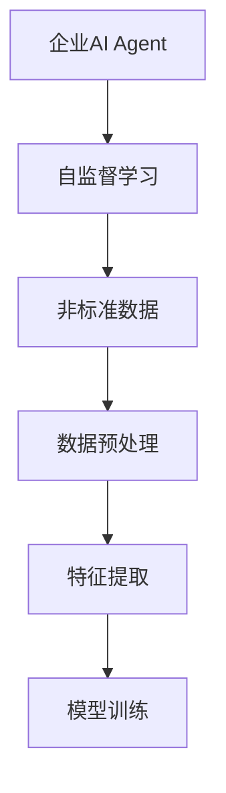

                 


# 企业AI Agent的自监督学习在非标准数据利用中的实践

> 关键词：企业AI Agent，自监督学习，非标准数据，数据预处理，AI系统架构，机器学习算法，对比学习

> 摘要：本文深入探讨了企业AI Agent在处理非标准数据时，如何通过自监督学习技术实现高效的数据利用。文章从背景、原理、算法实现、系统架构到项目实战，全面解析了自监督学习在企业AI Agent中的应用。通过详细的技术分析和实际案例，展示了如何利用自监督学习解决非标准数据带来的挑战，并为未来的研究和实践提供了有价值的参考。

---

## 第一部分: 企业AI Agent的自监督学习基础

### 第1章: 企业AI Agent与自监督学习概述

#### 1.1 问题背景与定义
- **1.1.1 企业AI Agent的核心概念**  
  企业AI Agent是一种智能代理系统，能够理解、推理和执行任务，以优化企业的运营效率。它依赖于数据处理能力，尤其是非结构化数据（如文本、图像、音频等）的处理能力。  
- **1.1.2 非标准数据的定义与特点**  
  非标准数据指的是未经过严格整理、标注或结构化的数据，通常具有多样性和复杂性。例如，企业中的客户反馈、日志数据、社交媒体信息等都属于非标准数据。  
- **1.1.3 自监督学习的背景与意义**  
  自监督学习是一种无监督学习的变体，通过利用未标注数据中的内在结构来学习有用的表征。在企业AI Agent中，自监督学习能够有效处理非标准数据，降低对标注数据的依赖，从而提高系统的灵活性和适应性。

#### 1.2 自监督学习的核心原理
- **1.2.1 自监督学习的基本概念**  
  自监督学习通过构建一个任务（通常是数据重建或预测），利用未标注数据学习数据的特征表示。其核心思想是通过“伪标签”（pseudo-label）来监督模型学习。  
- **1.2.2 自监督学习与监督学习的区别**  
  | 比较维度 | 自监督学习 | 监督学习 |
  |----------|------------|----------|
  | 数据需求 | 未标注数据 | 标签数据 |
  | 模型目标 | 学习数据特征 | 学习标签特征 |
  | 适用场景 | 非标准数据 | 标准化数据 |  
- **1.2.3 自监督学习在企业AI Agent中的应用价值**  
  在企业AI Agent中，自监督学习能够从非标准数据中提取有用的特征，提升模型的泛化能力。例如，在客户情感分析任务中，自监督学习可以从大量未标注的客户评论中学习到情感特征，而无需手动标注每条评论。

#### 1.3 企业AI Agent的挑战与机遇
- **1.3.1 非标准数据利用的挑战**  
  非标准数据通常具有噪声多、结构复杂、类别分布不均衡等特点，直接利用这些数据进行模型训练往往效果不佳。  
- **1.3.2 自监督学习的优势**  
  自监督学习能够在不依赖标注数据的情况下，从非标准数据中提取有用的特征，降低数据处理成本。  
- **1.3.3 企业AI Agent的未来发展趋势**  
  随着深度学习技术的进步，企业AI Agent将更加依赖自监督学习来处理复杂的非标准数据，实现更高效的业务流程优化。

#### 1.4 本章小结  
本章介绍了企业AI Agent的核心概念、自监督学习的基本原理，以及自监督学习在非标准数据利用中的价值和挑战。这些内容为后续章节的深入分析奠定了基础。

---

### 第2章: 自监督学习的核心概念与联系

#### 2.1 核心概念原理
- **2.1.1 自监督学习的数学模型**  
  自监督学习通常基于对比学习（contrastive learning）框架，其目标函数可以表示为：  
  $$ L = -\frac{1}{N}\sum_{i=1}^{N}\log\frac{e^{sim(x_i, x_j)}}{e^{sim(x_i, x_k)}}} $$  
  其中，$sim(x_i, x_j)$ 表示样本 $x_i$ 和 $x_j$ 之间的相似度，$x_k$ 是与 $x_i$ 不相关的样本。  
- **2.1.2 对比学习的原理**  
  对比学习通过最大化正样本对的相似度和最小化负样本对的相似度，学习数据的嵌入表示。  
- **2.1.3 图神经网络在自监督学习中的应用**  
  图神经网络（Graph Neural Network, GNN）能够处理图结构数据，适用于社交网络、知识图谱等场景中的自监督学习任务。

#### 2.2 概念属性特征对比表格
| 概念 | 属性 | 特征 |
|------|------|------|
| 自监督学习 | 数据需求 | 利用未标注数据 |
| 监督学习 | 数据需求 | 需要标注数据 |
| 无监督学习 | 数据需求 | 利用未标注数据 |

#### 2.3 ER实体关系图架构


#### 2.4 本章小结  
本章通过数学公式和图表，详细解释了自监督学习的核心概念、对比学习的原理，以及图神经网络的应用。这些内容为后续章节的算法实现提供了理论基础。

---

### 第3章: 自监督学习算法原理与实现

#### 3.1 算法原理讲解
- **3.1.1 对比学习算法**  
  对比学习算法通过构建正样本对和负样本对，学习数据的嵌入表示。其流程如下：  
  ```mermaid
  graph TD
  A[输入数据] --> B[数据增强]
  B --> C[正样本]
  B --> D[负样本]
  C --> E[特征提取]
  D --> E
  E --> F[损失函数]
  F --> G[优化器]
  G --> H[模型更新]
  ```
- **3.1.2 图神经网络算法**  
  图神经网络通过处理图结构数据，学习节点的嵌入表示。例如，社交网络中的用户关系可以表示为一个图，通过GNN学习用户的特征表示。

#### 3.2 算法实现代码
- **3.2.1 对比学习代码示例**  
  ```python
  import torch
  import torch.nn as nn

  class ContrastiveLoss(nn.Module):
      def __init__(self, temperature=0.1):
          super(ContrastiveLoss, self).__init__()
          self.temperature = temperature

      def forward(self, features, labels):
          # 计算正样本对和负样本对的相似度
          positive_pairs = (features * labels.unsqueeze(1)).sum(dim=1)
          negative_pairs = (features * (1 - labels.unsqueeze(1))).sum(dim=1)
          loss = -torch.mean(torch.log(torch.sigmoid(positive_pairs / self.temperature)) + torch.log(torch.sigmoid(negative_pairs / self.temperature)))
          return loss
  ```

#### 3.3 本章小结  
本章通过代码和流程图，详细讲解了对比学习算法的原理和实现方法，展示了如何利用自监督学习从非标准数据中提取特征。

---

### 第4章: 企业AI Agent的系统架构设计

#### 4.1 问题场景介绍
- 企业AI Agent需要处理大量的非标准数据，如客户反馈、日志数据等。这些数据通常具有噪声多、结构复杂等特点，直接利用这些数据进行模型训练效果不佳。

#### 4.2 系统功能设计
- **领域模型**：定义系统的功能模块和交互流程。  
  ```mermaid
  classDiagram
  class 数据预处理 {
      输入数据
      数据清洗
      数据增强
  }
  class 特征提取 {
      图神经网络
      对比学习
  }
  class 模型训练 {
      损失函数
      优化器
      模型更新
  }
  数据预处理 --> 特征提取
  特征提取 --> 模型训练
  ```

#### 4.3 系统架构设计
- **系统架构图**：展示系统的整体架构。  
  ```mermaid
  graph TD
  A[数据预处理] --> B[特征提取]
  B --> C[模型训练]
  C --> D[模型部署]
  ```

#### 4.4 本章小结  
本章通过系统架构设计，展示了企业AI Agent如何利用自监督学习处理非标准数据，为后续的项目实现提供了参考。

---

### 第5章: 项目实战与案例分析

#### 5.1 项目环境配置
- **工具安装**：需要安装PyTorch、numpy、scikit-learn等库。  
  ```bash
  pip install torch numpy scikit-learn
  ```

#### 5.2 系统核心实现源代码
- **对比学习实现代码**  
  ```python
  import torch
  import torch.nn as nn

  class ContrastiveModel(nn.Module):
      def __init__(self, input_dim, hidden_dim):
          super(ContrastiveModel, self).__init__()
          self.encoder = nn.Linear(input_dim, hidden_dim)
          self.reducer = nn.Linear(hidden_dim, hidden_dim)
          self.bn = nn.BatchNorm1d(hidden_dim)

      def forward(self, x):
          x = self.encoder(x)
          x = self.reducer(x)
          x = self.bn(x)
          return x

  # 示例数据
  input_dim = 100
  hidden_dim = 50
  model = ContrastiveModel(input_dim, hidden_dim)
  ```

#### 5.3 代码应用解读与分析
- 代码实现了对比学习模型，包括编码器、降维器和归一化层。通过模型训练，可以提取非标准数据的特征表示。

#### 5.4 案例分析
- **客户情感分析案例**  
  通过自监督学习从客户评论中提取情感特征，训练分类模型进行客户情感分析。  
  ```python
  # 示例训练代码
  optimizer = torch.optim.Adam(model.parameters(), lr=0.001)
  loss_fn = ContrastiveLoss()
  for epoch in range(num_epochs):
      for batch in dataloader:
          features = model(batch)
          loss = loss_fn(features, labels)
          optimizer.zero_grad()
          loss.backward()
          optimizer.step()
  ```

#### 5.5 本章小结  
本章通过实际案例展示了如何利用自监督学习处理非标准数据，提供了系统的实现方法和代码示例。

---

### 第6章: 总结与展望

#### 6.1 总结
- 本文系统地探讨了企业AI Agent在非标准数据利用中的自监督学习技术，从背景、原理到实现，全面解析了相关方法。

#### 6.2 最佳实践 tips
- 在实际应用中，建议结合具体业务场景选择合适的自监督学习算法，同时注重数据预处理和特征提取的优化。

#### 6.3 未来展望
- 随着大语言模型和图神经网络的发展，自监督学习在企业AI Agent中的应用将更加广泛，推动企业智能化转型。

#### 6.4 本章小结  
本文总结了自监督学习在企业AI Agent中的应用价值，并展望了未来的发展方向。

---

## 作者：AI天才研究院/AI Genius Institute & 禅与计算机程序设计艺术 /Zen And The Art of Computer Programming

---

### END

