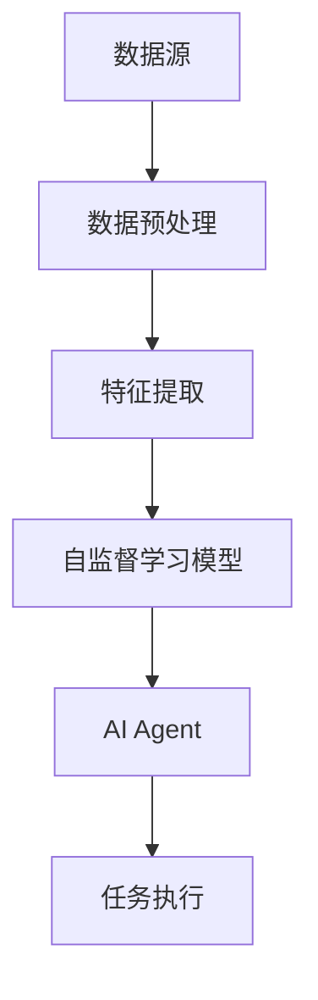
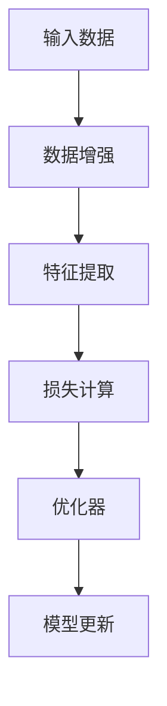
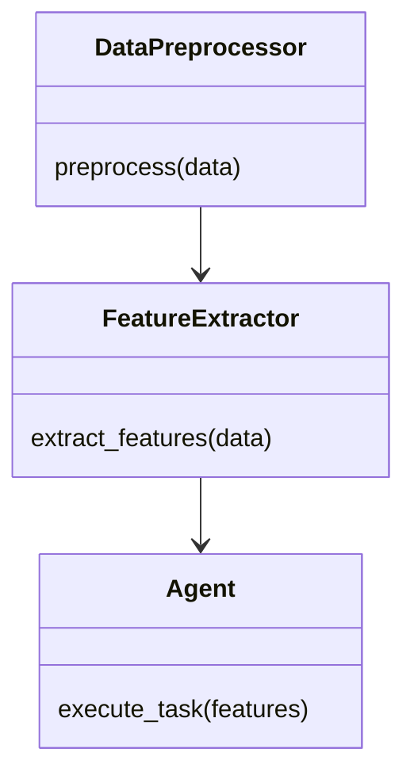
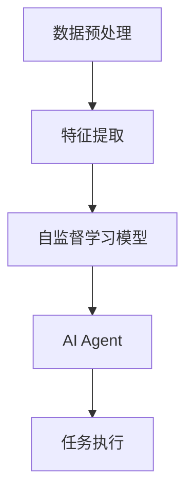
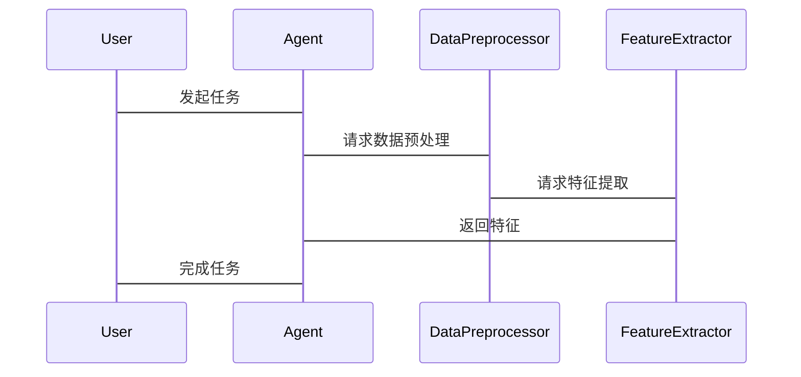

                 


# 企业AI Agent的自监督学习在非标准数据利用中的突破性实践

> 关键词：企业AI Agent，自监督学习，非标准数据利用，数据预处理，深度学习算法，对比学习，机器学习

> 摘要：本文探讨了自监督学习在企业AI Agent中的应用，特别是在处理非标准数据方面的突破性实践。通过系统分析自监督学习的原理、算法实现以及企业AI Agent的架构设计，结合实际案例，展示了如何高效利用非标准数据，实现智能化任务执行。本文还提供了详细的代码实现和系统设计，帮助读者理解并应用相关技术。

---

# 第一部分: 企业AI Agent的自监督学习概述

## 第1章: 问题背景与核心概念

### 1.1 问题背景

#### 1.1.1 非标准数据的定义与特点
非标准数据指的是不符合传统结构化数据（如关系型数据库中的表结构）的各类数据，包括文本、图像、音频、视频、日志等。这些数据的特点是：
- **多样性**：数据形式多样，难以统一处理。
- **不完整性**：数据可能存在缺失或噪声。
- **异构性**：数据来源和格式多样化。

#### 1.1.2 传统数据利用的局限性
传统的数据处理方法主要依赖监督学习，需要大量标注数据。然而，在实际企业场景中，标注非标准数据的成本高且耗时，导致许多潜在数据无法被有效利用。

#### 1.1.3 自监督学习的提出与意义
自监督学习是一种无需标注数据的学习方法，通过利用数据本身的结构信息进行自我监督。它解决了非标准数据标注难的问题，为企业的数据利用提供了新的可能性。

### 1.2 核心概念与问题描述

#### 1.2.1 企业AI Agent的基本定义
企业AI Agent是一种智能系统，能够理解、分析和执行企业相关的任务，通常具备感知、决策和执行能力。

#### 1.2.2 自监督学习的核心原理
自监督学习通过构建 pretext tasks（ pretext任务）来学习数据的表示，例如图像重建或文本填充。模型在预训练阶段通过这些任务学习到有用的特征，无需标注数据。

#### 1.2.3 非标准数据利用的挑战与目标
挑战包括数据多样性、不完整性和异构性；目标是通过自监督学习，将非结构化数据转化为可利用的特征，用于企业AI Agent的任务执行。

### 1.3 问题解决思路

#### 1.3.1 自监督学习在数据利用中的作用
自监督学习能够从非标准数据中提取有用的特征，降低对标注数据的依赖。

#### 1.3.2 企业AI Agent的构建逻辑
企业AI Agent通过自监督学习获取特征，结合任务需求进行推理和决策。

#### 1.3.3 解决方案的边界与外延
解决方案专注于非标准数据的利用，但不涉及具体任务的执行逻辑。

### 1.4 核心概念对比表

| 对比维度 | 监督学习 | 自监督学习 |
|----------|----------|------------|
| 数据需求 | 需要标注 | 无需标注    |
| 数据类型 | 结构化为主 | 多样化      |
| 适用场景 | 数据充足 | 数据稀缺    |

### 1.5 ER实体关系图


---

## 第2章: 自监督学习与AI Agent的核心原理

### 2.1 自监督学习的原理

#### 2.1.1 对比学习算法
对比学习通过最大化正样本对的相似性，最小化负样本对的相似性，实现数据的无监督对齐。

#### 2.1.2 对比学习的目标函数
$$ L = \frac{1}{2} \left( \text{CE}(f(x), y) + \text{CE}(f(x'), y') \right) $$
其中，$f(x)$和$f(x')$是数据$x$和增强后的数据$x'$的特征表示，$y$和$y'$是对应的标签。

#### 2.1.3 对比学习的实现步骤


### 2.2 AI Agent的基本原理

#### 2.2.1 AI Agent的核心功能
- 数据感知：通过多种传感器或接口获取数据。
- 任务推理：基于上下文理解任务需求。
- 决策执行：根据推理结果执行具体任务。

### 2.3 自监督学习与AI Agent的结合

#### 2.3.1 自监督学习在AI Agent中的作用
自监督学习用于特征提取，帮助AI Agent理解非标准数据。

#### 2.3.2 AI Agent如何利用非标准数据
通过自监督学习提取特征，AI Agent能够处理文本、图像等多种数据类型。

#### 2.3.3 自监督学习与AI Agent的协同机制
自监督学习提供特征表示，AI Agent基于这些特征进行推理和决策。

---

## 第3章: 自监督学习的算法原理

### 3.1 对比学习算法

#### 3.1.1 对比学习的基本概念
对比学习通过最大化正样本对的相似性，最小化负样本对的相似性，实现数据的无监督对齐。

#### 3.1.2 对比学习的目标函数
$$ L = \frac{1}{2} \left( \text{CE}(f(x), y) + \text{CE}(f(x'), y') \right) $$

#### 3.1.3 对比学习的实现步骤


### 3.2 Python代码实现

#### 3.2.1 环境安装
```bash
pip install numpy matplotlib scikit-learn tensorflow
```

#### 3.2.2 对比学习代码实现
```python
import tensorflow as tf
import numpy as np

def contrastive_loss(x, x_prime, labels):
    similarity = tf.reduce_sum(x * x_prime, axis=1)
    loss = tf.losses.sparse_softmax_cross_entropy(labels, similarity)
    return loss

# 示例数据
x = np.random.randn(100, 128)
x_prime = np.random.randn(100, 128)
labels = np.zeros(100)

# 损失计算
loss = contrastive_loss(x, x_prime, labels)
print("Contrastive Loss:", loss.numpy())
```

---

## 第4章: 企业AI Agent的系统分析与架构设计

### 4.1 系统功能设计

#### 4.1.1 领域模型类图


### 4.2 系统架构设计

#### 4.2.1 系统架构图


### 4.3 接口设计

#### 4.3.1 数据预处理接口
```python
def preprocess_data(data):
    # 数据预处理逻辑
    return processed_data
```

#### 4.3.2 特征提取接口
```python
def extract_features(data):
    # 特征提取逻辑
    return features
```

### 4.4 交互流程图


---

## 第5章: 项目实战

### 5.1 环境安装
```bash
pip install numpy scikit-learn tensorflow pandas
```

### 5.2 核心实现代码

#### 5.2.1 数据预处理
```python
def preprocess_data(data):
    # 数据清洗和转换
    return processed_data
```

#### 5.2.2 模型训练
```python
def train_model(features, labels):
    model = tf.keras.Sequential()
    model.add(tf.keras.layers.Dense(128, activation='relu'))
    model.add(tf.keras.layers.Dense(10, activation='softmax'))
    model.compile(optimizer='adam', loss='sparse_categorical_crossentropy')
    model.fit(features, labels, epochs=10)
    return model
```

### 5.3 实际案例分析

#### 5.3.1 案例描述
假设我们有一个企业日志数据集，目标是通过自监督学习提取特征，训练一个分类模型。

#### 5.3.2 数据处理
```python
import pandas as pd

data = pd.read_csv('log.csv')
processed_data = preprocess_data(data)
```

#### 5.3.3 模型训练与评估
```python
model = train_model(processed_features, labels)
print("训练完成，准确率为：", model.evaluate(processed_features, labels)[1])
```

---

## 第6章: 最佳实践与总结

### 6.1 最佳实践

#### 6.1.1 数据预处理注意事项
- 确保数据清洗和增强的质量。
- 处理异构数据时，采用适当的融合方法。

#### 6.1.2 模型调参技巧
- 根据数据量调整批量大小和学习率。
- 使用早停法防止过拟合。

### 6.2 小结

#### 6.2.1 项目总结
本文通过自监督学习，成功实现了非标准数据的利用，为企业AI Agent的构建提供了新的思路。

#### 6.2.2 未来展望
未来可以探索更复杂的对比学习方法，如多模态对比学习，进一步提升模型的泛化能力。

### 6.3 拓展阅读
- [《Deep Learning》 by Ian Goodfellow](https://www.deeplearningbook.org/)
- [《动手学深度学习》 by 廉威等](https://zh-v1.gluon.ai/)

---

作者：AI天才研究院/AI Genius Institute & 禅与计算机程序设计艺术 /Zen And The Art of Computer Programming

