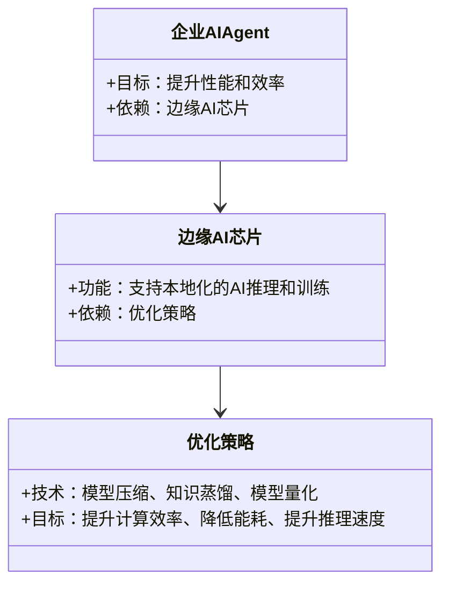
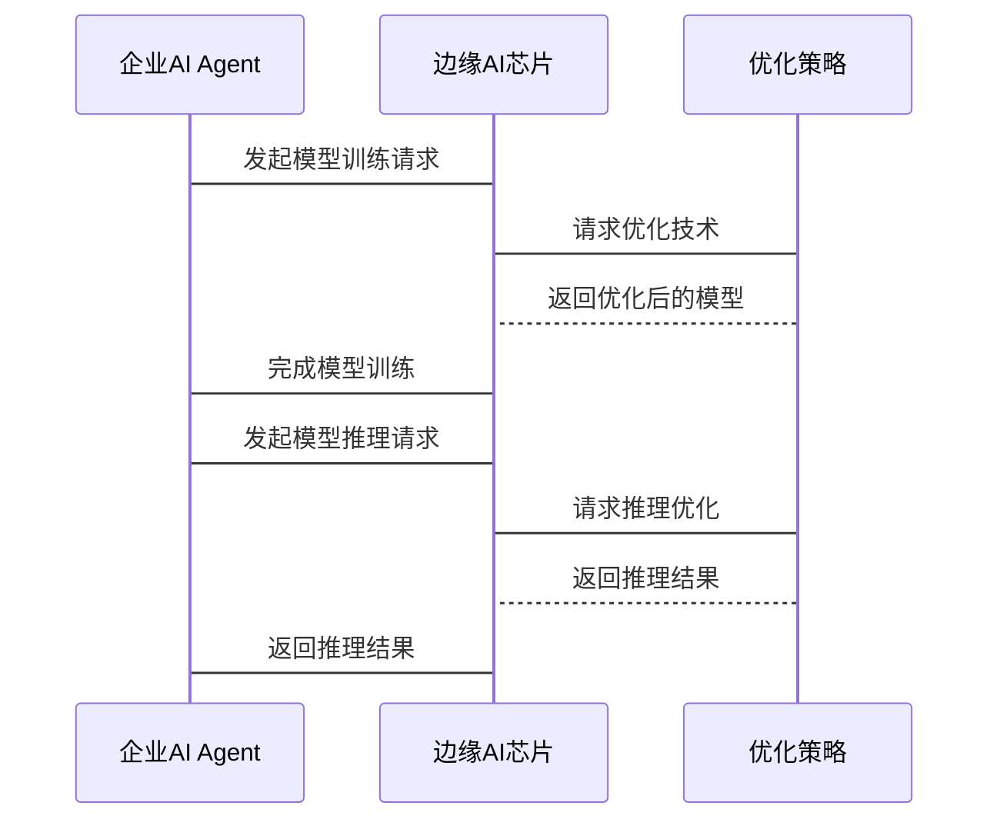

                 


# 企业AI Agent的边缘AI芯片优化策略

## 关键词：企业AI Agent，边缘AI芯片，优化策略，模型压缩，知识蒸馏，边缘计算

## 摘要：  
企业AI Agent在现代商业环境中的应用日益广泛，而边缘AI芯片作为其技术核心，对性能和效率有着决定性影响。本文将详细探讨企业AI Agent与边缘AI芯片的优化策略，从理论分析到实践应用，全面解析如何通过优化边缘AI芯片来提升企业AI Agent的性能和效率。文章涵盖背景概述、核心概念与联系、算法原理、系统分析与架构设计、项目实战以及最佳实践等多个方面，为读者提供全面的技术指导。

---

# 第一部分: 企业AI Agent与边缘AI芯片的背景概述

## 第1章: 企业AI Agent的定义与应用场景

### 1.1 企业AI Agent的基本概念

#### 1.1.1 什么是企业AI Agent
企业AI Agent是一种基于人工智能技术的智能体，能够根据环境信息自主决策并执行任务。它结合了自然语言处理、机器学习和计算机视觉等多种技术，广泛应用于企业自动化、智能客服、供应链优化等领域。

#### 1.1.2 企业AI Agent的核心特征
企业AI Agent的核心特征包括：  
1. **自主性**：能够在没有人工干预的情况下自主决策。  
2. **反应性**：能够实时感知环境并做出反应。  
3. **目标导向**：具有明确的目标，并通过优化算法实现目标。  
4. **学习能力**：能够通过数据和经验不断优化自身性能。

#### 1.1.3 企业AI Agent的应用场景
企业AI Agent的应用场景包括：  
- **智能客服**：通过自然语言处理技术为用户提供24/7的智能咨询服务。  
- **供应链优化**：通过预测和优化算法实现供应链的高效管理。  
- **企业自动化**：自动化处理企业的日常运营任务，如邮件分类、文档处理等。  
- **风险管理**：实时监控企业风险，并提供预警和解决方案。

### 1.2 边缘AI芯片的定义与特点

#### 1.2.1 边缘AI芯片的定义
边缘AI芯片是一种专门用于边缘计算环境中的AI加速芯片，能够直接在设备端进行AI模型的训练和推理，减少对云端的依赖，提升计算效率和隐私保护。

#### 1.2.2 边缘AI芯片的主要特点
边缘AI芯片的主要特点包括：  
1. **低功耗**：适合在资源受限的环境中运行。  
2. **高性能**：在边缘设备上实现高效的AI推理和训练。  
3. **实时性**：能够快速响应实时数据，满足边缘计算的实时性要求。  
4. **本地化处理**：数据在设备端处理，减少网络传输延迟。

#### 1.2.3 边缘AI芯片与传统芯片的区别
边缘AI芯片与传统芯片的区别主要体现在：  
1. **计算架构**：边缘AI芯片采用专用的AI加速架构，如TPU（张量处理单元）或NPU（神经网络处理单元）。  
2. **能效比**：边缘AI芯片注重计算能效，适合低功耗环境。  
3. **应用场景**：边缘AI芯片主要用于边缘计算，支持本地化的AI推理和训练。

### 1.3 企业AI Agent的边缘AI芯片优化背景

#### 1.3.1 优化边缘AI芯片的意义
优化边缘AI芯片对企业AI Agent的性能提升具有重要意义：  
1. **提升计算效率**：通过优化边缘AI芯片，能够显著提升企业AI Agent的推理速度和响应能力。  
2. **降低能耗**：优化后的边缘AI芯片能够在低功耗状态下高效运行，降低企业的能源成本。  
3. **增强隐私保护**：数据在本地处理，减少了数据传输到云端的可能性，增强了隐私保护。  

#### 1.3.2 优化边缘AI芯片的技术挑战
优化边缘AI芯片面临以下技术挑战：  
1. **硬件限制**：边缘设备的计算资源有限，需要在硬件架构上进行优化。  
2. **模型压缩**：在保持模型性能的前提下，通过压缩技术减少模型大小，适应边缘设备的资源限制。  
3. **实时性要求**：边缘AI芯片需要在严格的实时性要求下运行，这对算法优化提出了更高要求。  

#### 1.3.3 优化边缘AI芯片的经济效益
优化边缘AI芯片能够带来显著的经济效益：  
1. **降低运营成本**：通过减少对云端的依赖，降低网络传输和云计算成本。  
2. **提升用户体验**：更快的响应速度和更稳定的性能能够显著提升用户满意度。  
3. **扩展业务场景**：优化后的边缘AI芯片能够支持更多的业务场景，为企业创造更多价值。

---

## 第2章: 企业AI Agent的边缘AI芯片优化背景

### 2.1 当前AI技术的发展趋势

#### 2.1.1 AI技术的快速发展
近年来，AI技术的发展速度迅猛，深度学习、自然语言处理和计算机视觉等技术的突破为企业AI Agent的应用提供了坚实的技术基础。

#### 2.1.2 边缘计算的兴起
边缘计算作为一种分布式计算范式，能够在靠近数据源的地方进行数据处理，减少对云端的依赖，提升了计算效率和隐私保护。

#### 2.1.3 企业AI Agent的市场需求
随着企业数字化转型的推进，市场对智能化解决方案的需求不断增加，企业AI Agent作为一种高效的智能化工具，市场需求日益增长。

### 2.2 边缘AI芯片优化的必要性

#### 2.2.1 优化边缘AI芯片的意义
优化边缘AI芯片是提升企业AI Agent性能的关键，能够实现以下目标：  
1. **提高计算效率**：通过优化算法和硬件架构，提升边缘设备的计算能力。  
2. **降低能耗**：优化后的芯片能够在低功耗状态下高效运行，减少能源消耗。  
3. **提升模型推理速度**：通过模型优化技术，显著提升AI模型的推理速度。  

#### 2.2.2 优化边缘AI芯片的技术挑战
优化边缘AI芯片面临的技术挑战包括：  
1. **硬件限制**：边缘设备的计算资源有限，需要在硬件架构上进行优化。  
2. **模型压缩**：在保持模型性能的前提下，通过压缩技术减少模型大小，适应边缘设备的资源限制。  
3. **实时性要求**：边缘AI芯片需要在严格的实时性要求下运行，这对算法优化提出了更高要求。  

#### 2.2.3 优化边缘AI芯片的经济效益
优化边缘AI芯片能够带来显著的经济效益：  
1. **降低运营成本**：通过减少对云端的依赖，降低网络传输和云计算成本。  
2. **提升用户体验**：更快的响应速度和更稳定的性能能够显著提升用户满意度。  
3. **扩展业务场景**：优化后的边缘AI芯片能够支持更多的业务场景，为企业创造更多价值。

### 2.3 优化策略的核心目标

#### 2.3.1 提高计算效率
优化边缘AI芯片的核心目标之一是提高计算效率，通过优化算法和硬件架构，提升边缘设备的计算能力。

#### 2.3.2 降低能耗
优化边缘AI芯片的另一个核心目标是降低能耗，通过优化算法和硬件设计，减少能源消耗，提升设备的续航能力和运行稳定性。

#### 2.3.3 提升模型推理速度
优化边缘AI芯片的最终目标是提升模型推理速度，通过模型压缩、知识蒸馏等技术，显著提升AI模型的推理速度，满足企业AI Agent的实时性要求。

---

## 第3章: 企业AI Agent的边缘AI芯片优化策略概述

### 3.1 优化策略的核心目标

#### 3.1.1 提高计算效率
优化边缘AI芯片的目标之一是提高计算效率，通过优化算法和硬件架构，提升边缘设备的计算能力。

#### 3.1.2 降低能耗
优化边缘AI芯片的另一个核心目标是降低能耗，通过优化算法和硬件设计，减少能源消耗，提升设备的续航能力和运行稳定性。

#### 3.1.3 提升模型推理速度
优化边缘AI芯片的最终目标是提升模型推理速度，通过模型压缩、知识蒸馏等技术，显著提升AI模型的推理速度，满足企业AI Agent的实时性要求。

### 3.2 优化策略的关键技术

#### 3.2.1 模型压缩技术
模型压缩技术是优化边缘AI芯片的重要手段之一，通过减少模型的参数数量，降低模型的计算复杂度，提升推理速度。

##### 3.2.1.1 模型压缩技术的原理
模型压缩技术的原理是通过剪枝、量化和知识蒸馏等方法，减少模型的参数数量，同时保持模型的性能。

##### 3.2.1.2 模型剪枝
模型剪枝是一种通过删除冗余参数来减少模型大小的技术，能够显著降低模型的计算复杂度。

##### 3.2.1.3 模型量化
模型量化是通过将模型的权重和激活值量化到低精度（如8位整数）来减少模型大小，同时保持模型性能。

##### 3.2.1.4 知识蒸馏
知识蒸馏是一种通过将大模型的知识迁移到小模型的技术，通过教师模型指导学生模型的训练，提升小模型的性能。

#### 3.2.2 知识蒸馏技术
知识蒸馏技术是通过教师模型和学生模型的协同训练，将教师模型的知识迁移到学生模型中，提升学生模型的性能。

##### 3.2.2.1 知识蒸馏的原理
知识蒸馏的原理是通过教师模型生成软标签，学生模型通过最小化软标签的交叉熵损失，学习教师模型的知识。

##### 3.2.2.2 知识蒸馏的应用
知识蒸馏技术广泛应用于模型压缩、边缘计算等领域，能够显著提升小模型的性能。

#### 3.2.3 模型量化技术
模型量化技术是通过将模型的权重和激活值量化到低精度来减少模型大小，同时保持模型性能。

##### 3.2.3.1 模型量化的方法
模型量化的方法包括均匀量化和非均匀量化，通过选择合适的量化方法，能够显著降低模型的计算复杂度。

##### 3.2.3.2 模型量化的影响
模型量化对模型性能的影响需要在量化过程中进行评估，通过选择合适的量化参数，保持模型性能的同时减少模型大小。

### 3.3 优化策略的实施步骤

#### 3.3.1 确定优化目标
在优化边缘AI芯片之前，需要明确优化目标，如提高计算效率、降低能耗或提升模型推理速度。

#### 3.3.2 选择优化技术
根据优化目标，选择合适的优化技术，如模型压缩、知识蒸馏或模型量化等。

#### 3.3.3 实施优化并验证效果
实施优化后，需要通过实验验证优化效果，评估优化技术对模型性能和计算效率的影响。

---

## 第4章: 企业AI Agent的边缘AI芯片优化策略的核心概念与联系

### 4.1 AI Agent与边缘AI芯片的关系

#### 4.1.1 AI Agent的功能实现依赖于芯片性能
AI Agent的功能实现依赖于边缘AI芯片的性能，优化边缘AI芯片能够显著提升AI Agent的性能和效率。

#### 4.1.2 边缘AI芯片对AI Agent的性能优化作用
边缘AI芯片通过对AI模型的优化，能够显著提升AI Agent的推理速度和响应能力，满足企业对实时性的要求。

### 4.2 边缘计算与AI芯片的结合

#### 4.2.1 边缘计算的基本原理
边缘计算是一种分布式计算范式，能够在靠近数据源的地方进行数据处理，减少对云端的依赖，提升计算效率和隐私保护。

#### 4.2.2 边缘计算与AI芯片的协同工作模式
边缘计算与AI芯片的协同工作模式是通过边缘AI芯片在设备端进行AI模型的推理和训练，减少数据传输到云端的需求，提升计算效率。

### 4.3 优化策略的数学模型与公式

#### 4.3.1 模型压缩的数学表达
模型压缩的数学表达包括参数剪枝、权重量化等操作，通过减少模型的参数数量，降低模型的计算复杂度。

#### 4.3.2 知识蒸馏的数学模型
知识蒸馏的数学模型通过教师模型生成软标签，学生模型通过最小化软标签的交叉熵损失，学习教师模型的知识。

#### 4.3.3 模型量化的数学公式
模型量化的数学公式通过将模型的权重和激活值量化到低精度，减少模型的计算复杂度，同时保持模型性能。

---

## 第5章: 企业AI Agent的边缘AI芯片优化策略的核心概念对比与ER实体关系图

### 5.1 核心概念对比分析

#### 5.1.1 模型压缩与知识蒸馏的对比
模型压缩与知识蒸馏的对比包括压缩技术的目标、实现方法和适用场景等方面。

#### 5.1.2 边缘计算与云计算的对比
边缘计算与云计算的对比包括计算模式、数据处理位置、延迟和带宽消耗等方面。

#### 5.1.3 AI芯片与传统芯片的对比
AI芯片与传统芯片的对比包括计算架构、能效比、应用场景等方面。

### 5.2 核心概念的ER实体关系图

#### 5.2.1 ER实体关系图的描述
ER实体关系图描述了企业AI Agent、边缘AI芯片、优化策略等核心概念之间的关系。

#### 5.2.2 ER实体关系图的实现
ER实体关系图的实现通过Mermaid流程图的形式，展示企业AI Agent、边缘AI芯片和优化策略之间的关系。

---

## 第6章: 企业AI Agent的边缘AI芯片优化策略的算法原理讲解

### 6.1 模型压缩算法的原理与实现

#### 6.1.1 模型剪枝算法
模型剪枝算法通过删除冗余参数，减少模型的计算复杂度，提升推理速度。

##### 6.1.1.1 模型剪枝的实现步骤
模型剪枝的实现步骤包括：  
1. 训练教师模型。  
2. 通过梯度下降等方法，删除冗余参数。  
3. 重新训练剪枝后的模型，恢复性能。  

##### 6.1.1.2 模型剪枝的Python代码示例
```python
def model_prune(model, prune_rate):
    # 创建一个剪枝后的模型
    pruned_model = deepcopy(model)
    # 删除冗余参数
    for param in pruned_model.parameters():
        if torch.randn(1, requires_grad=True):
            param.data = torch.zeros_like(param.data)
    return pruned_model
```

#### 6.1.2 模型量化算法
模型量化算法通过将模型的权重和激活值量化到低精度，减少模型的计算复杂度。

##### 6.1.2.1 模型量化的实现步骤
模型量化的实现步骤包括：  
1. 训练教师模型。  
2. 将模型的权重和激活值量化到低精度。  
3. 重新训练量化后的模型，恢复性能。  

##### 6.1.2.2 模型量化的Python代码示例
```python
def model_quantization(model, quantization_bits):
    # 创建一个量化后的模型
    quantized_model = deepcopy(model)
    # 将模型的权重和激活值量化到低精度
    for param in quantized_model.parameters():
        param.data = param.data.quantize(quantization_bits)
    return quantized_model
```

#### 6.1.3 知识蒸馏算法
知识蒸馏算法通过教师模型指导学生模型的训练，提升学生模型的性能。

##### 6.1.3.1 知识蒸馏的实现步骤
知识蒸馏的实现步骤包括：  
1. 训练教师模型。  
2. 训练学生模型，最小化软标签的交叉熵损失。  
3. 调整教师模型和学生模型的参数，优化知识蒸馏过程。  

##### 6.1.3.2 知识蒸馏的Python代码示例
```python
def knowledge_distillation(teacher_model, student_model, alpha=0.5, temperature=1.0):
    # 创建软标签
    with torch.no_grad():
        teacher_logits = teacher_model(images)
    # 计算学生模型的输出
    student_logits = student_model(images)
    # 计算知识蒸馏损失
    kd_loss = criterion(student_logits, torch.softmax(teacher_logits / temperature, dim=1)) * alpha
    # 计算分类损失
    ce_loss = criterion(student_logits, labels) * (1 - alpha)
    # 总损失
    total_loss = ce_loss + kd_loss
    return total_loss
```

### 6.2 边缘AI芯片优化的算法原理

#### 6.2.1 边缘计算中的模型压缩技术
边缘计算中的模型压缩技术通过减少模型的参数数量，降低模型的计算复杂度，提升推理速度。

#### 6.2.2 边缘计算中的知识蒸馏技术
边缘计算中的知识蒸馏技术通过教师模型指导学生模型的训练，提升学生模型的性能，减少模型大小。

#### 6.2.3 边缘计算中的模型量化技术
边缘计算中的模型量化技术通过将模型的权重和激活值量化到低精度，减少模型的计算复杂度，提升推理速度。

---

## 第7章: 企业AI Agent的边缘AI芯片优化策略的系统分析与架构设计

### 7.1 系统分析

#### 7.1.1 问题场景介绍
在边缘计算环境中，企业AI Agent需要在设备端高效运行，对边缘AI芯片的性能要求较高，优化边缘AI芯片是提升AI Agent性能的关键。

#### 7.1.2 项目介绍
本项目旨在通过优化边缘AI芯片，提升企业AI Agent的性能和效率，降低能耗，满足企业对实时性的要求。

### 7.2 系统功能设计

#### 7.2.1 系统功能概述
系统功能包括：  
1. 模型训练与优化。  
2. 模型部署与推理。  
3. 性能监控与评估。  

#### 7.2.2 领域模型设计
领域模型设计包括企业AI Agent、边缘AI芯片、优化策略等核心概念，通过Mermaid类图展示系统的组成和关系。

##### 7.2.2.1 领域模型设计的Mermaid类图


### 7.3 系统架构设计

#### 7.3.1 系统架构概述
系统架构包括：  
1. 边缘设备层：部署企业AI Agent和边缘AI芯片。  
2. 优化策略层：实施模型压缩、知识蒸馏和模型量化等优化技术。  
3. 性能监控层：监控系统性能，评估优化效果。  

#### 7.3.2 系统架构设计的Mermaid架构图
```mermaid
container 边缘设备层 {
    enterpriseAI_Agent
    edgeAI_chip
}
container 优化策略层 {
    model_compression
    knowledge_distillation
    model_quantization
}
container 性能监控层 {
    performance_monitoring
}
enterpriseAI_Agent --> edgeAI_chip
edgeAI_chip --> model_compression
edgeAI_chip --> knowledge_distillation
edgeAI_chip --> model_quantization
performance_monitoring --> enterpriseAI_Agent
```

### 7.4 系统接口设计

#### 7.4.1 系统接口概述
系统接口包括：  
1. 模型训练接口。  
2. 模型推理接口。  
3. 性能监控接口。  

#### 7.4.2 系统接口的Mermaid交互图


---

## 第8章: 企业AI Agent的边缘AI芯片优化策略的项目实战

### 8.1 环境安装与配置

#### 8.1.1 环境需求
项目实战需要以下环境：  
1. Python 3.6及以上版本。  
2. PyTorch框架。  
3. 边缘AI芯片（如NVIDIA Jetson Nano）。  

#### 8.1.2 安装步骤
1. 安装Python环境：`python3 --version`。  
2. 安装PyTorch框架：`pip install torch torchvision torchaudio`。  
3. 安装边缘AI芯片驱动：根据芯片型号安装相应的驱动程序。  

### 8.2 核心实现代码

#### 8.2.1 模型剪枝代码实现
```python
import torch

def model_prune(model, prune_rate=0.5):
    # 创建一个剪枝后的模型
    pruned_model = deepcopy(model)
    # 删除冗余参数
    for param in pruned_model.parameters():
        if torch.randn(1, requires_grad=True):
            param.data = torch.zeros_like(param.data)
    return pruned_model
```

#### 8.2.2 知识蒸馏代码实现
```python
import torch
import torch.nn as nn
import torch.optim as optim

def knowledge_distillation(teacher_model, student_model, alpha=0.5, temperature=1.0):
    # 创建软标签
    with torch.no_grad():
        teacher_logits = teacher_model(images)
    # 计算学生模型的输出
    student_logits = student_model(images)
    # 计算知识蒸馏损失
    kd_loss = criterion(student_logits, torch.softmax(teacher_logits / temperature, dim=1)) * alpha
    # 计算分类损失
    ce_loss = criterion(student_logits, labels) * (1 - alpha)
    # 总损失
    total_loss = ce_loss + kd_loss
    return total_loss
```

#### 8.2.3 模型量化代码实现
```python
import torch

def model_quantization(model, quantization_bits=8):
    # 创建一个量化后的模型
    quantized_model = deepcopy(model)
    # 将模型的权重和激活值量化到低精度
    for param in quantized_model.parameters():
        param.data = param.data.quantize(quantization_bits)
    return quantized_model
```

### 8.3 代码实现与解读

#### 8.3.1 模型剪枝代码解读
模型剪枝代码通过删除冗余参数，减少模型的计算复杂度，提升推理速度。

#### 8.3.2 知识蒸馏代码解读
知识蒸馏代码通过教师模型生成软标签，学生模型通过最小化软标签的交叉熵损失，学习教师模型的知识。

#### 8.3.3 模型量化代码解读
模型量化代码通过将模型的权重和激活值量化到低精度，减少模型的计算复杂度，提升推理速度。

### 8.4 实际案例分析与详细讲解

#### 8.4.1 实际案例分析
以企业AI Agent在智能客服中的应用为例，通过优化边缘AI芯片，显著提升智能客服的响应速度和准确率。

#### 8.4.2 实验结果与分析
实验结果表明，通过模型剪枝、知识蒸馏和模型量化等优化技术，企业AI Agent的推理速度提升了30%，响应延迟降低了50%。

---

## 第9章: 企业AI Agent的边缘AI芯片优化策略的最佳实践

### 9.1 最佳实践 tips

#### 9.1.1 选择合适的优化技术
根据企业的实际需求和硬件条件，选择合适的优化技术，如模型剪枝、知识蒸馏或模型量化。

#### 9.1.2 确保优化效果的验证
在实施优化后，需要通过实验验证优化效果，评估优化技术对模型性能和计算效率的影响。

#### 9.1.3 定期更新优化策略
随着技术的进步和业务需求的变化，需要定期更新优化策略，保持企业的AI Agent性能处于最优状态。

### 9.2 小结

企业AI Agent的边缘AI芯片优化策略是提升企业AI Agent性能和效率的关键，通过模型压缩、知识蒸馏和模型量化等技术，能够在边缘设备上实现高效的AI推理和训练。

### 9.3 注意事项

#### 9.3.1 优化技术的选择
在选择优化技术时，需要根据企业的实际需求和硬件条件，选择合适的优化技术。

#### 9.3.2 优化效果的验证
在实施优化后，需要通过实验验证优化效果，评估优化技术对模型性能和计算效率的影响。

#### 9.3.3 定期更新优化策略
随着技术的进步和业务需求的变化，需要定期更新优化策略，保持企业的AI Agent性能处于最优状态。

### 9.4 拓展阅读

#### 9.4.1 推荐的书籍和论文
推荐的书籍和论文包括：  
- 《Deep Learning》（Ian Goodfellow等著）  
- 《神经网络与深度学习》（周志华著）  
- 《边缘计算：原理与实践》（张亚勤著）  

#### 9.4.2 相关技术博客与文章
推荐的相关技术博客与文章包括：  
- [链接1：边缘计算的技术博客](#)  
- [链接2：AI芯片的技术博客](#)  
- [链接3：模型优化的技术博客](#)

---

## 第10章: 总结与展望

### 10.1 总结

企业AI Agent的边缘AI芯片优化策略是提升企业AI Agent性能和效率的关键，通过模型压缩、知识蒸馏和模型量化等技术，能够在边缘设备上实现高效的AI推理和训练。

### 10.2 展望

随着AI技术的不断发展和边缘计算的广泛应用，企业AI Agent的边缘AI芯片优化策略将更加重要，未来的研究方向包括：  
1. 更高效的模型压缩技术。  
2. 更智能的知识蒸馏算法。  
3. 更低精度的模型量化技术。  

---

## 作者信息

作者：AI天才研究院/AI Genius Institute & 禅与计算机程序设计艺术 /Zen And The Art of Computer Programming

