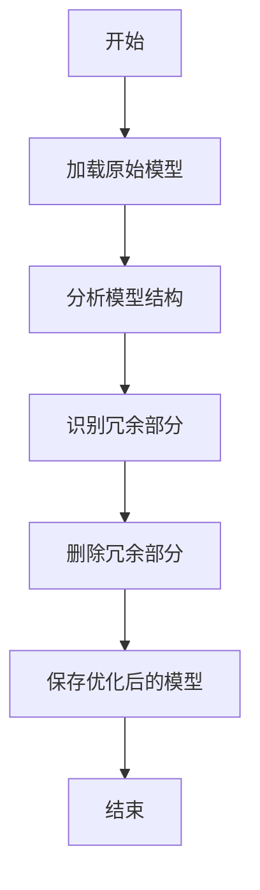
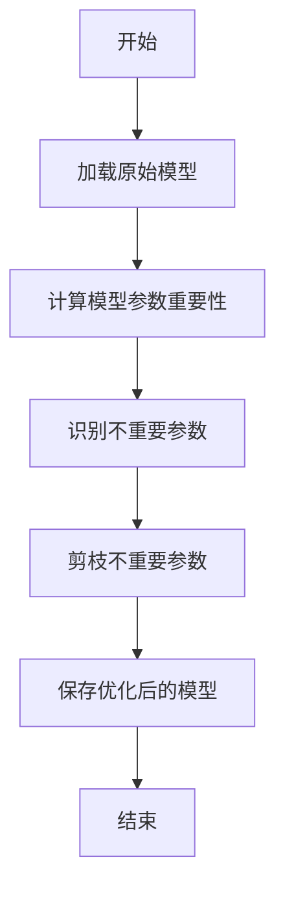
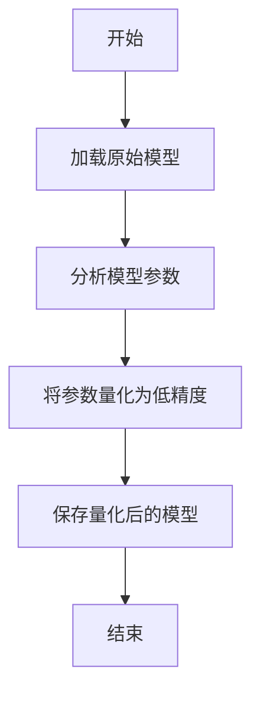
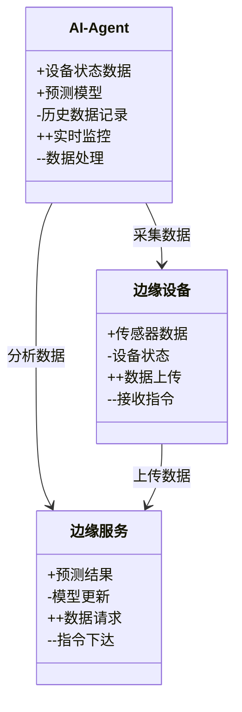

                 


# 企业AI Agent的边缘AI部署策略

> 关键词：企业AI Agent，边缘AI，AI部署，模型优化，边缘计算

> 摘要：本文深入探讨了企业AI Agent在边缘AI部署中的策略，分析了边缘AI部署的核心概念、算法原理、系统架构设计以及实际应用案例。文章详细讲解了模型优化技术、边缘计算架构、系统接口设计，并通过案例分析展示了如何在实际项目中实现高效的边缘AI部署。

---

## 第1章: 企业AI Agent与边缘AI部署概述

### 1.1 企业AI Agent的定义与特点

#### 1.1.1 企业AI Agent的定义
企业AI Agent是一种智能代理，能够感知环境、执行任务并自主决策。它通过与企业系统和数据源交互，为企业提供自动化和智能化的服务。

#### 1.1.2 企业AI Agent的核心特点
- **自主性**：能够自主决策和执行任务。
- **反应性**：实时感知环境变化并做出响应。
- **社交能力**：能够与人或其他系统进行交互。
- **学习能力**：通过数据和经验不断优化自身行为。

#### 1.1.3 企业AI Agent与传统AI的区别
| 特性             | 传统AI                 | 企业AI Agent             |
|------------------|-----------------------|--------------------------|
| 执行方式         | 离线计算，按规则执行   | 实时响应，自主决策       |
| 适应性           | 固定，需人工调整       | 自适应，可根据环境变化调整 |
| 交互能力         | 单向输入输出           | 支持双向交互             |

### 1.2 边缘AI部署的背景与意义

#### 1.2.1 边缘计算的定义与特点
边缘计算是在靠近数据源的地方进行数据处理和存储，减少对云端的依赖，提升实时性和响应速度。

#### 1.2.2 边缘AI部署的必要性
- **降低延迟**：边缘计算减少了数据传输到云端的时间，提升实时性。
- **节省带宽**：在边缘处理数据，减少云端传输的数据量。
- **提高隐私性**：本地处理数据，保护敏感信息不被泄露。

#### 1.2.3 边缘AI部署的优势与挑战
| 优势             | 挑战               |
|------------------|-------------------|
| 实时响应          | 边缘设备计算能力有限 |
| 数据隐私保护      | 网络连接不稳定      |
| 网络带宽优化      | 边缘设备管理复杂    |

### 1.3 企业AI Agent在边缘AI部署中的应用前景

#### 1.3.1 企业AI Agent的潜在应用领域
- **智能制造**：实时监控生产线，预测设备故障。
- **智能零售**：分析客户行为，提供个性化服务。
- **智慧城市**：管理交通流量，优化城市资源。

#### 1.3.2 企业采用AI Agent的优势
- **提升效率**：自动化处理任务，减少人工干预。
- **增强决策能力**：通过实时数据分析，做出更明智的决策。
- **降低成本**：通过边缘计算减少云端资源消耗，降低运营成本。

#### 1.3.3 AI Agent应用的挑战与机遇
- **挑战**：技术复杂性高，需要专业团队支持。
- **机遇**：推动企业数字化转型，提升竞争力。

---

## 第2章: 核心概念与联系

### 2.1 核心概念原理

#### 2.1.1 AI Agent的工作原理
AI Agent通过感知环境、理解需求、制定计划、执行任务和反馈结果，实现智能化操作。

#### 2.1.2 边缘AI部署的核心原理
边缘AI部署将AI模型部署在边缘设备上，利用边缘计算的能力进行实时数据分析和处理。

### 2.2 概念属性特征对比表格

| 属性             | AI Agent               | 边缘AI部署             |
|------------------|-----------------------|------------------------|
| 部署位置         | 云端或本地             | 本地边缘设备           |
| 响应时间         | 较长                   | 较短                   |
| 数据隐私         | 较低                   | 较高                   |
| 计算资源消耗      | 高                    | 中等                   |

### 2.3 ER实体关系图架构

```mermaid
erdiagram
actor(AI Agent) -|{通信}|- device(边缘设备)
actor(AI Agent) -|{请求}|- service(边缘服务)
device(边缘设备) -|{数据}|- database(边缘数据库)
```

---

## 第3章: 算法原理讲解

### 3.1 算法原理概述

#### 3.1.1 模型压缩技术
通过去除模型中的冗余参数，减少模型大小，提升运行效率。

#### 3.1.2 模型剪枝技术
删除模型中不重要的神经元或层，降低计算复杂度。

#### 3.1.3 模型量化技术
将模型中的参数从高精度（如浮点）降低到低精度（如整数），减少存储和计算需求。

### 3.2 算法流程图

#### 3.2.1 模型压缩流程图



#### 3.2.2 模型剪枝流程图



#### 3.2.3 模型量化流程图



### 3.3 算法实现代码示例

#### 3.3.1 Python代码实现

```python
import numpy as np

def model_pruning(model):
    # 示例：模型剪枝代码
    for param in model.parameters():
        if param.size()[1] == 512:  # 假设要剪枝的是512维的参数
            param.data = torch.zeros_like(param.data)
    return model

def model_quantization(model):
    # 示例：模型量化代码
    for param in model.parameters():
        param.data = param.data.round()
    return model
```

#### 3.3.2 模型压缩代码示例

```python
def model_compression(model):
    # 示例：模型压缩代码
    compressed_model = torch.quantize_model(model, ' qint8')
    return compressed_model
```

### 3.4 数学模型与公式讲解

#### 3.4.1 线性回归模型

线性回归是最简单的回归模型，其数学表达式为：

$$ y = \beta_0 + \beta_1 x + \epsilon $$

其中，$\beta_0$ 是截距，$\beta_1$ 是斜率，$\epsilon$ 是误差项。

#### 3.4.2 神经网络模型

多层感知机（MLP）的数学表达式为：

$$ y = \sigma(w_2 \cdot \sigma(w_1 \cdot x + b_1) + b_2) $$

其中，$\sigma$ 是激活函数，$w_1$ 和 $w_2$ 是权重，$b_1$ 和 $b_2$ 是偏置。

#### 3.4.3 深度学习模型

深度学习模型通常包含多个隐藏层，例如：

$$ y = f(W_n f(W_{n-1} \dots f(W_1 x + b_1) + b_2) \dots + b_n) $$

其中，$W_i$ 是第i层的权重，$b_i$ 是第i层的偏置，$f$ 是激活函数。

---

## 第4章: 系统分析与架构设计

### 4.1 项目介绍

#### 4.1.1 项目场景介绍
假设我们正在为一家制造企业设计一个边缘AI部署方案，用于实时监控生产线设备的运行状态。

### 4.2 系统功能设计

#### 4.2.1 领域模型类图



### 4.3 系统架构设计

#### 4.3.1 系统架构图


#### 4.3.2 接口设计

| 接口名称   | 接口功能           | 数据格式       |
|------------|-------------------|----------------|
| 数据上传   | 上传设备数据到边缘服务器 | JSON格式       |
| 模型更新   | 更新AI Agent的预测模型 | 模型文件格式   |
| 指令下达   | 下达控制指令到边缘设备 | JSON指令格式   |

#### 4.3.3 交互流程图

```mermaid
sequenceDiagram
actor(AI-Agent) -> edge(Edge Server): 上传设备数据
edge(Edge Server) -> actor(AI-Agent): 返回预测结果
actor(AI-Agent) -> devices(Edge Devices): 下达控制指令
devices(Edge Devices) -> actor(AI-Agent): 返回设备状态
```

---

## 第5章: 项目实战

### 5.1 环境安装

#### 5.1.1 安装Python和相关库
```bash
pip install numpy torch onnx
```

#### 5.1.2 安装边缘计算框架
```bash
pip install tensorflowlite
```

### 5.2 核心实现

#### 5.2.1 模型优化代码

```python
import torch

def optimize_model(model):
    # 示例：模型优化代码
    model.quantize()  # 量化模型
    torch.save(model, 'optimized_model.pth')
    return model

# 加载原始模型
original_model = torch.load('original_model.pth')
# 优化模型
optimized_model = optimize_model(original_model)
# 部署优化后的模型到边缘设备
```

#### 5.2.2 系统集成代码

```python
import requests

def send_request(data):
    # 示例：向边缘服务发送请求
    response = requests.post('http://localhost:5000/api', json=data)
    return response.json()

# 发送数据到边缘服务
data = {'key': 'value'}
result = send_request(data)
print(result)
```

### 5.3 案例分析

#### 5.3.1 应用场景
在智能制造中，AI Agent可以实时监控生产线设备的状态，预测可能出现的故障，并及时通知维护人员。

#### 5.3.2 详细实现步骤
1. **数据采集**：通过传感器收集设备运行数据。
2. **数据处理**：在边缘设备上进行数据预处理。
3. **模型预测**：使用优化后的模型进行故障预测。
4. **反馈控制**：根据预测结果，调整设备运行参数或通知维护人员。

### 5.4 项目小结

通过实际案例分析，展示了企业AI Agent在边缘AI部署中的应用价值。优化的模型和高效的系统架构设计是实现成功部署的关键。

---

## 第6章: 总结与展望

### 6.1 总结

企业AI Agent的边缘AI部署策略通过将AI模型部署在边缘设备上，显著提升了实时性和数据隐私保护。通过模型优化、边缘计算架构设计和高效的系统集成，企业能够充分发挥AI Agent的优势。

### 6.2 未来展望

随着边缘计算技术的不断发展，企业AI Agent的应用场景将更加广泛。未来，可以进一步研究如何在边缘环境中实现更高效的模型更新和更智能的任务调度，推动企业智能化转型。

---

作者：AI天才研究院 & 禅与计算机程序设计艺术

