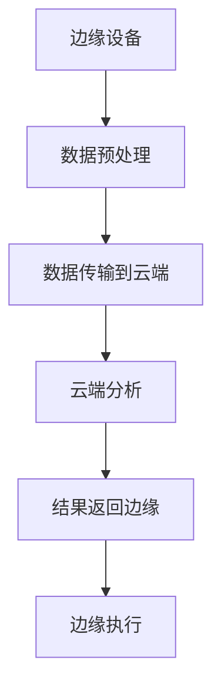
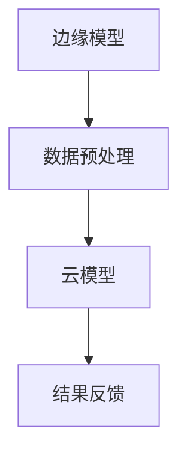

                 


# 企业AI Agent的边缘智能与云智能协同策略

## 关键词：企业AI Agent、边缘智能、云智能、协同策略、分布式计算、边缘计算、云计算

## 摘要：企业AI Agent的边缘智能与云智能协同策略探讨了在企业环境中，AI Agent如何在边缘计算和云计算之间实现智能协同。文章详细分析了边缘智能与云智能的核心概念、算法原理、系统架构设计，并通过实际案例展示了如何在企业中实现这种协同。通过本文，读者将了解如何通过边缘智能和云智能的协同优化企业AI Agent的性能和效率。

---

## 第一部分: 企业AI Agent的背景与概念

### 第1章: 企业AI Agent的背景与概念

#### 1.1 AI Agent的基本概念

- **1.1.1 AI Agent的定义与特点**
  - AI Agent（人工智能代理）是指能够感知环境、自主决策并执行任务的智能实体。
  - 特点：自主性、反应性、目标导向、社交能力。

- **1.1.2 企业AI Agent的核心功能与作用**
  - 核心功能：数据采集、分析、决策、执行。
  - 作用：提高企业效率、优化资源配置、提升决策质量。

- **1.1.3 AI Agent与传统自动化系统的区别**
  - AI Agent具有自主决策能力，而传统系统依赖预定义规则。
  - AI Agent能够适应环境变化，传统系统则需要人工干预。

#### 1.2 边缘计算与云计算的背景

- **1.2.1 边缘计算的概念与发展**
  - 边缘计算：在数据源附近进行数据处理和存储的分布式计算模式。
  - 发展：随着物联网和5G技术的发展，边缘计算逐渐成为主流。

- **1.2.2 云计算的概念与发展**
  - 云计算：通过互联网提供按需计算资源的服务模式。
  - 发展：从虚拟化技术到容器化、微服务架构的演进。

- **1.2.3 边缘计算与云计算的对比与协同**
  - 对比：边缘计算强调实时性和低延迟，云计算强调资源弹性和数据集中处理。
  - 协同：边缘计算处理实时数据，云计算进行深度分析和训练。

#### 1.3 企业AI Agent的边缘智能与云智能协同

- **1.3.1 边缘智能与云智能的协同需求**
  - 边缘智能需要快速响应，云智能需要深度计算能力。
  - 协同需求：数据实时处理与集中分析的结合。

- **1.3.2 企业AI Agent的典型应用场景**
  - 智能制造：实时监控和预测维护。
  - 智慧城市：实时交通管理和环境监测。
  - 金融服务：实时交易监控和欺诈检测。

- **1.3.3 协同策略的核心价值与意义**
  - 提高效率：边缘处理实时数据，云处理复杂任务。
  - 节省资源：边缘减少数据传输，云集中处理大数据。
  - 提升可靠性：边缘和云的协同增强系统的容错能力。

---

## 第二部分: 边缘智能与云智能的核心概念与联系

### 第2章: 边缘智能与云智能的核心概念与联系

#### 2.1 边缘智能与云智能的核心概念

- **2.1.1 边缘智能的定义与关键特征**
  - 定义：在数据源附近进行智能处理和决策。
  - 关键特征：实时性、本地化、低延迟。

- **2.1.2 云智能的定义与关键特征**
  - 定义：利用云计算资源进行智能处理和分析。
  - 关键特征：弹性扩展、集中化、深度学习能力。

- **2.1.3 边缘智能与云智能的协同机制**
  - 数据协同：边缘采集数据，云进行分析。
  - 计算协同：边缘处理轻量任务，云处理复杂任务。
  - 决策协同：边缘快速响应，云提供长期优化。

#### 2.2 边缘智能与云智能的对比分析

- **2.2.1 技术架构对比**
  - 边缘：分布式架构，靠近数据源。
  - 云：集中式架构，依赖网络连接。

- **2.2.2 计算能力对比**
  - 边缘：计算能力有限，适合轻量任务。
  - 云：计算能力强大，适合复杂任务。

- **2.2.3 数据处理能力对比**
  - 边缘：实时处理，低延迟。
  - 云：批量处理，深度分析。

#### 2.3 边缘智能与云智能的协同关系

- **2.3.1 协同的必要性与重要性**
  - 必要性：边缘无法独立处理所有任务，云无法实时处理所有数据。
  - 重要性：协同能够充分发挥两边优势，提高整体效率。

- **2.3.2 协同的实现方式与技术路径**
  - 实现方式：数据同步、任务分配、结果反馈。
  - 技术路径：边缘计算、云计算、数据通信、智能协同。

- **2.3.3 协同的典型案例与应用场景**
  - 智能制造：边缘监控设备状态，云进行预测性维护。
  - 智慧交通：边缘实时处理交通数据，云优化交通流量。

---

### 图2-1: 边缘智能与云智能的对比特征

```mermaid
table
| 特征       | 边缘智能         | 云智能           |
|------------|-----------------|-----------------|
| 计算能力     | 较低            | 高              |
| 数据延迟     | 低              | 高              |
| 适用场景     | 实时处理         | 大数据分析       |
```

---

### 第3章: 边缘智能与云智能协同的算法原理

#### 3.1 分布式计算算法

- **3.1.1 分布式计算的基本原理**
  - 分布式计算：将任务分解成多个部分，分布在不同节点上执行。
  - 边缘计算中的分布式计算：节点在边缘设备上，数据本地处理。
  - 云计算中的分布式计算：任务分布在云服务器上，集中处理。

- **3.1.2 分布式计算在边缘智能中的应用**
  - 应用场景：实时数据处理、边缘设备协同。
  - 示例：边缘设备采集数据，分布式算法进行初步分析。

- **3.1.3 分布式计算在云智能中的应用**
  - 应用场景：大规模数据处理、深度学习模型训练。
  - 示例：云服务器集群处理海量数据，训练机器学习模型。

#### 3.2 跨邊緣与云的协同算法

- **3.2.1 跨邊缘与云的协同算法概述**
  - 算法目标：实现边缘与云之间的高效协同。
  - 协同机制：数据传输、任务分配、结果反馈。

- **3.2.2 跨邊缘与云的协同算法实现**
  - 算法步骤：
    1. 边缘设备采集数据并预处理。
    2. 数据传输到云端，进行深度分析。
    3. 云端返回分析结果，边缘设备执行反馈。
  - 示例代码：
    ```python
    def edge_processing(data):
        # 数据预处理
        processed_data = data.preprocessing()
        return processed_data

    def cloud_analysis(processed_data):
        # 深度分析
        result = model.predict(processed_data)
        return result

    def协同算法(data):
        processed_data = edge_processing(data)
        result = cloud_analysis(processed_data)
        return result
    ```

- **3.2.3 跨邊缘与云的协同算法优化**
  - 优化策略：数据压缩、并行计算、结果缓存。
  - 优化效果：减少数据传输延迟，提高计算效率。

---

### 图3-1: 跨邊缘与云的协同算法流程图



---

### 第4章: 边缘智能与云智能协同的数学模型与公式

#### 4.1 边缘智能的数学模型

- **模型描述**
  - 边缘智能模型用于实时数据处理，模型结构简单，适合边缘设备计算。

- **数学公式**
  - 数据预处理：$$processed\_data = f(data)$$
  - 边缘决策：$$action = \arg\min_{a} \sum_{i=1}^{n} (y_i - a)^2$$

#### 4.2 云智能的数学模型

- **模型描述**
  - 云智能模型用于深度学习和复杂任务处理，模型结构复杂，依赖云计算资源。

- **数学公式**
  - 数据分析：$$result = g(data)$$
  - 模型训练：$$w = w - \eta \nabla L(w)$$，其中L是损失函数，η是学习率。

---

### 图4-1: 边缘与云协同的数学模型



---

## 第三部分: 企业AI Agent的边缘智能与云智能协同策略的系统架构设计

### 第5章: 系统架构设计

#### 5.1 项目介绍

- 项目名称：企业AI Agent边缘与云协同系统。
- 目标：实现边缘智能与云智能的高效协同，提升企业AI Agent的性能和效率。

#### 5.2 系统功能设计

- **功能模块**
  - 数据采集模块：边缘设备采集数据。
  - 数据处理模块：边缘设备预处理数据，云服务器进行深度分析。
  - 任务管理模块：分配和管理任务。
  - 结果反馈模块：将分析结果反馈给边缘设备执行。

- **领域模型类图**
  ```mermaid
  classDiagram
      class EdgeDevice {
          data: Data
          process(data): ProcessedData
      }
      class CloudServer {
          analyze(data): AnalysisResult
          train_model(): Model
      }
      EdgeDevice --> CloudServer
  ```

#### 5.3 系统架构设计

- **系统架构图**
  ```mermaid
  architecture
      EdgeLayer --> CloudLayer
      EdgeLayer --> EdgeManager
      CloudLayer --> CloudManager
  ```

- **系统接口设计**
  - 边缘层接口：数据采集、数据处理、任务请求。
  - 云端接口：数据分析、模型训练、结果返回。

- **系统交互流程图**
  ```mermaid
  sequenceDiagram
      EdgeDevice ->> EdgeManager: 发送数据
      EdgeManager ->> CloudManager: 请求分析
      CloudManager ->> CloudServer: 分析数据
      CloudServer ->> CloudManager: 返回结果
      CloudManager ->> EdgeManager: 发送结果
      EdgeManager ->> EdgeDevice: 执行反馈
  ```

#### 5.4 环境安装与代码实现

- **环境安装**
  - 边缘设备：安装边缘计算框架（如Kafka、Flink）。
  - 云端：安装云计算框架（如AWS、Google Cloud）。

- **代码实现**
  ```python
  import kafka
  from flask import Flask

  # 边缘设备代码
  def edge_task():
      producer = kafka.Producer()
      producer.send('edge_topic', data)
      producer.close()

  # 云端代码
  app = Flask(__name__)
  @app.route('/analyze', methods=['POST'])
  def cloud_task():
      data = request.json['data']
      result = model.predict(data)
      return jsonify(result)

  if __name__ == '__main__':
      app.run()
  ```

---

## 第四部分: 项目实战与案例分析

### 第6章: 边缘侧项目实战

- **环境搭建**
  - 安装Kafka、Flink等边缘计算框架。

- **代码实现**
  ```python
  from flink import StreamExecutionEnvironment
  from kafka import KafkaProducer

  def edge_processing():
      env = StreamExecutionEnvironment.get_execution_environment()
      data_stream = env.add_source(KafkaSource('edge_topic'))
      data_stream.map(process_data).sink(PrintSink())
      env.execute()
  ```

- **案例分析**
  - 应用场景：智能制造中的设备状态监控。
  - 实现步骤：边缘设备采集数据，Flink处理数据，Kafka传输到云端。

### 第7章: 云端项目实战

- **环境搭建**
  - 安装TensorFlow、Kubernetes等云计算框架。

- **代码实现**
  ```python
  import tensorflow as tf
  from kubernetes import client

  def cloud_analysis():
      model = tf.keras.Sequential([...])
      model.fit(train_data, train_labels)
      client.deploy_model(model)
  ```

- **案例分析**
  - 应用场景：金融行业的交易欺诈检测。
  - 实现步骤：边缘设备采集交易数据，云端进行实时分析和模型训练。

---

## 第五部分: 总结与展望

### 第8章: 总结与展望

#### 8.1 最佳实践 Tips

- 数据隐私：边缘处理敏感数据，云端进行非敏感数据处理。
- 资源优化：合理分配计算资源，避免资源浪费。
- 安全性：加强边缘与云端的安全防护，防止数据泄露。

#### 8.2 小结

- 企业AI Agent的边缘智能与云智能协同策略是一种高效的数据处理方式。
- 通过边缘处理实时数据，云端进行深度分析，能够充分发挥两边的优势。

#### 8.3 展望

- 技术趋势：边缘计算与云计算的协同将进一步深化。
- 应用场景：更多行业将采用这种协同策略，提升企业效率。

---

## 作者：AI天才研究院/AI Genius Institute & 禅与计算机程序设计艺术 /Zen And The Art of Computer Programming

---

感谢您的耐心阅读，希望本文对您理解企业AI Agent的边缘智能与云智能协同策略有所帮助！

