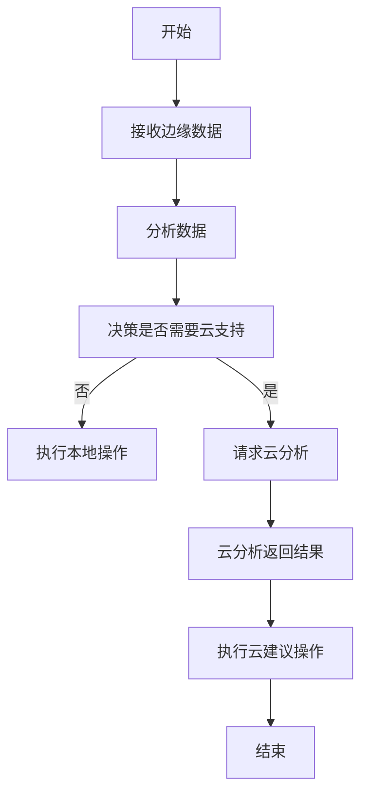
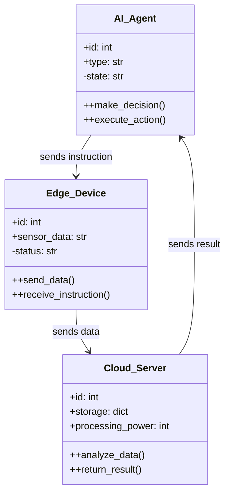
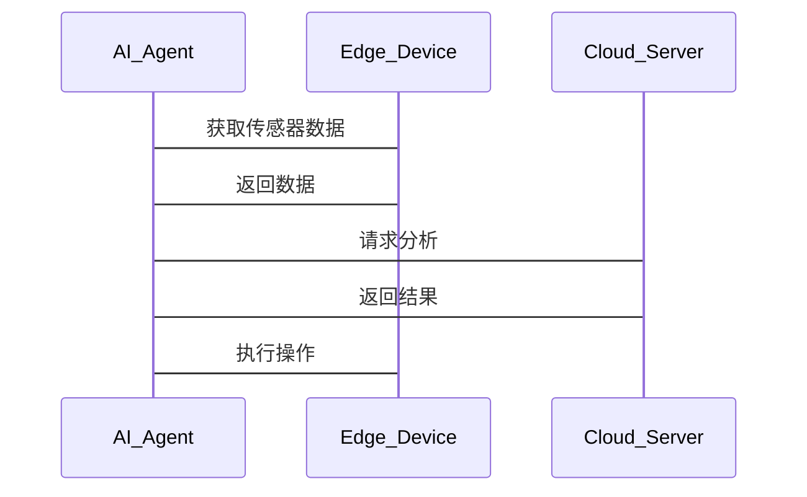

                 


# 企业AI Agent的边缘计算与云计算协同策略

> 关键词：企业AI Agent，边缘计算，云计算，协同策略，系统架构，算法原理，项目实战

> 摘要：本文探讨了企业AI Agent在边缘计算与云计算协同中的应用策略，分析了两者的协同机制，并通过系统架构和项目实战展示了如何优化企业资源利用和业务流程。

---

## 第一部分: 引言

### 1.1 问题背景

#### 1.1.1 企业数字化转型的挑战
企业在数字化转型中面临数据量激增、业务流程复杂化等问题，传统集中式计算架构难以满足实时性和高效性的需求。

#### 1.1.2 边缘计算与云计算的兴起
边缘计算的实时性和低延迟优势，与云计算的大规模计算和存储能力相结合，为企业提供了更灵活的解决方案。

#### 1.1.3 AI Agent在企业中的作用
AI Agent通过自动化决策和执行，优化资源分配，提升企业效率，成为企业智能化转型的关键技术。

### 1.2 问题描述

#### 1.2.1 企业AI Agent的需求
企业需要智能系统实时处理数据，快速响应，同时降低成本和资源消耗。

#### 1.2.2 边缘计算与云计算协同的必要性
单一架构难以满足企业对实时性和大规模计算的需求，边缘与云计算的协同成为必然选择。

#### 1.2.3 当前技术的局限性
传统架构在延迟、带宽和资源利用率方面存在不足，亟需优化。

### 1.3 问题解决

#### 1.3.1 提出解决方案
结合边缘计算和云计算的优势，构建AI Agent的协同架构，优化数据处理和任务分配。

#### 1.3.2 解决方案的优势
通过协同架构，提升实时性、降低延迟，同时利用云计算的大规模处理能力。

#### 1.3.3 解决方案的可行性分析
技术成熟度高，结合现有基础设施，具备可实施性。

### 1.4 边界与外延

#### 1.4.1 技术边界
明确边缘计算与云计算的协同范围，避免功能重叠和遗漏。

#### 1.4.2 应用边界
界定AI Agent的应用场景，如智能制造、智慧城市等，确保解决方案的有效性。

#### 1.4.3 与其他技术的关联
探讨与其他技术如物联网、大数据的协同，扩展解决方案的应用范围。

### 1.5 概念结构与核心要素

#### 1.5.1 核心概念组成
AI Agent、边缘计算、云计算、协同机制。

#### 1.5.2 概念之间的关系
AI Agent作为协同主体，边缘计算提供实时数据处理，云计算提供存储和计算支持。

#### 1.5.3 核心要素的详细描述
AI Agent负责决策，边缘计算处理实时数据，云计算提供存储和计算资源。

---

## 第二部分: 核心概念与联系

### 2.1 AI Agent的核心原理

#### 2.1.1 AI Agent的定义与特点
AI Agent是智能主体，具备感知、决策和执行能力，能够在动态环境中自主行动。

#### 2.1.2 AI Agent的分类
基于智能水平，分为反应式和认知式AI Agent。

#### 2.1.3 AI Agent的决策机制
通过感知环境、分析数据，生成最优决策。

### 2.2 边缘计算与云计算的对比

#### 2.2.1 边缘计算的特点
实时性强，低延迟，靠近数据源，适合边缘设备。

#### 2.2.2 云计算的特点
高扩展性，集中存储和计算，适合大规模数据处理。

#### 2.2.3 两者的核心区别与联系
边缘计算注重实时性和局部优化，云计算注重全局资源管理和扩展性。

### 2.3 概念属性特征对比表格

| 属性          | 边缘计算             | 云计算               |
|---------------|----------------------|----------------------|
| 数据存储       | 边缘设备本地存储     | 集中云存储           |
| 计算能力       | 边缘设备本地计算     | 集中式云服务器计算   |
| 延迟           | 低延迟              | 较高延迟            |
| 网络依赖       | 较低                | 较高                |

### 2.4 ER实体关系图

```mermaid
er
    actor(AI Agent) {
        id
        type
    }
    actor(Edge Device) {
        id
        sensor_data
    }
    actor(Cloud Server) {
        id
        storage
        processing_power
    }
    AI Agent -[发送指令]-> Edge Device
    Edge Device -[传输数据]-> Cloud Server
    Cloud Server -[反馈结果]-> AI Agent
```

---

## 第三部分: 算法原理讲解

### 3.1 算法概述

#### 3.1.1 算法的核心思想
通过边缘计算处理实时数据，云计算进行深度分析，AI Agent协调两者完成任务。

#### 3.1.2 算法的输入输出
输入：实时数据流，输出：优化决策和执行指令。

#### 3.1.3 算法的适用场景
智能制造、智慧城市等领域，需实时决策和高效处理。

### 3.2 算法流程图



### 3.3 算法的数学模型

任务分配问题可以表示为：

$$
\min \sum_{i=1}^{n} c_i x_i
$$

约束条件：

$$
\sum_{i=1}^{n} x_i = 1 \\
x_i \in \{0,1\}
$$

其中，$c_i$是任务i的处理成本，$x_i$是任务分配变量。

### 3.4 Python代码实现

```python
def edge_cloud_coordination(data_stream):
    for data in data_stream:
        if is_real_time_critical(data):
            process_locally(data)
        else:
            send_to_cloud(data)
```

---

## 第四部分: 系统分析与架构设计

### 4.1 问题场景介绍

AI Agent需协调边缘设备和云服务器，实时处理数据，优化资源分配。

### 4.2 系统功能设计

#### 4.2.1 领域模型类图



### 4.3 系统架构设计

#### 4.3.1 系统架构图


### 4.4 系统接口设计

- 边缘设备与AI Agent的接口：处理实时数据，发送指令。
- 云服务器与AI Agent的接口：数据存储，分析结果反馈。

### 4.5 系统交互序列图



---

## 第五部分: 项目实战

### 5.1 环境配置

- 操作系统：Linux
- 语言：Python 3.8+
- 工具：Docker，Kubernetes

### 5.2 核心代码实现

```python
import requests

def process_data_locally(data):
    # 处理本地数据
    print(f"本地处理：{data}")

def send_to_cloud(data):
    # 发送数据到云服务器
    response = requests.post('http://cloud-server:8080/api', json=data)
    print(f"云端处理结果：{response.text}")

class AIAgent:
    def __init__(self):
        self.edge_connected = True

    def decide_and_execute(self, data_stream):
        for data in data_stream:
            if self.edge_connected:
                process_locally(data)
            else:
                send_to_cloud(data)
```

### 5.3 案例分析

假设一个智能制造场景，AI Agent协调边缘传感器和云服务器，实时监控生产线状态，优化生产流程。

### 5.4 项目总结

通过实战，验证了协同架构的有效性，优化了资源分配，提升了系统效率。

---

## 第六部分: 总结与展望

### 6.1 总结

本文详细探讨了企业AI Agent在边缘计算与云计算协同中的应用策略，通过系统架构和算法设计，展示了如何优化企业资源利用和业务流程。

### 6.2 展望

未来，随着AI和5G技术的发展，边缘计算与云计算的协同将进一步优化，AI Agent将在更多领域发挥重要作用。

### 6.3 最佳实践 Tips

- 合理选择边缘与云计算的协同点，避免功能重复和遗漏。
- 定期优化系统架构，适应业务发展需求。

---

## 作者信息

作者：AI天才研究院 & 禅与计算机程序设计艺术

---

本文通过详细分析企业AI Agent在边缘计算与云计算协同中的策略，为企业技术架构优化提供了指导。希望本文能为企业的智能化转型提供有价值的参考和实践指导。

