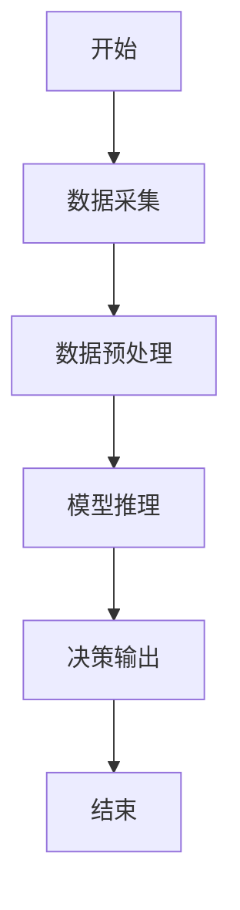
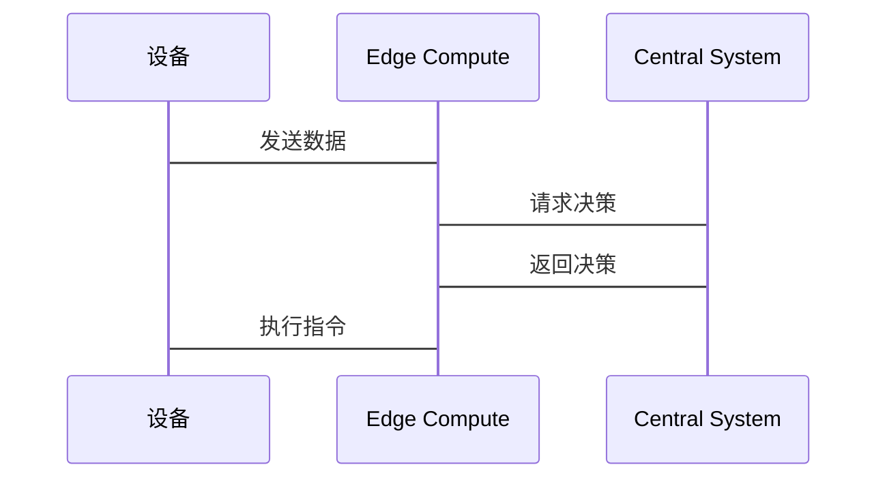

                 


# 企业AI Agent的边缘计算在物联网实时决策中的实践

> 关键词：企业AI Agent，边缘计算，物联网，实时决策，算法原理，系统架构，项目实战

> 摘要：本文将深入探讨企业AI Agent在边缘计算中的应用，特别是在物联网实时决策中的实践。通过结合背景介绍、核心概念分析、算法原理讲解、系统架构设计和项目实战，本文将为您提供全面的技术指导，帮助您理解如何在物联网场景中高效利用AI Agent进行实时决策。

---

# 第一部分: 背景介绍与核心概念

## 第1章: 背景介绍与核心概念

### 1.1 问题背景
- 1.1.1 物联网实时决策的挑战：  
  物联网（IoT）环境下，海量设备产生的实时数据需要快速处理，这对计算能力和决策效率提出了极高要求。传统的集中式计算模式难以满足实时性需求，而边缘计算的出现为实时决策提供了新的解决方案。

- 1.1.2 问题描述：  
  在物联网场景中，实时决策的核心问题在于如何快速处理和分析海量数据，同时确保决策的准确性和及时性。AI Agent（智能代理）作为能够自主感知环境、做出决策的智能体，是解决这一问题的关键。

- 1.1.3 问题解决：  
  通过将AI Agent部署在边缘设备上，可以实现数据的实时分析和决策，减少数据传输延迟，提高系统的响应速度和稳定性。

- 1.1.4 边界与外延：  
  本文主要关注AI Agent在物联网实时决策中的应用，边界包括数据采集、预处理、模型推理和决策输出，外延则涉及数据安全、系统容错机制等。

### 1.2 核心概念与定义
- 1.2.1 AI Agent：  
  AI Agent是一种能够感知环境、自主决策的智能体，具备自主性、反应性、目标导向性和社会性等特性。

- 1.2.2 边缘计算：  
  边缘计算是指在靠近数据源的地方进行数据处理和计算，减少对云端的依赖，提高计算效率和实时性。

- 1.2.3 物联网实时决策：  
  在物联网场景中，实时决策是指通过AI Agent对实时数据进行分析和处理，快速生成决策并执行。

### 1.3 核心概念的联系与对比
- 1.3.1 AI Agent与边缘计算的关系：  
  AI Agent可以运行在边缘设备上，利用边缘计算的能力进行实时数据处理和决策。

- 1.3.2 边缘计算与物联网的结合：  
  边缘计算为物联网提供了低延迟、高效率的数据处理能力，而物联网为边缘计算提供了丰富的应用场景。

- 1.3.3 实时决策在物联网中的应用场景：  
  包括智能制造、智慧城市、智能家居等领域，实时决策能够提高系统的响应速度和用户体验。

---

## 第2章: 核心概念与联系

### 2.1 核心概念原理
- 2.1.1 AI Agent的工作原理：  
  AI Agent通过感知环境、获取数据、分析数据、制定策略并执行决策，实现对环境的动态调整。

- 2.1.2 边缘计算的原理：  
  边缘计算通过在靠近数据源的地方部署计算资源，减少数据传输延迟，提高计算效率。

- 2.1.3 物联网实时决策的原理：  
  在物联网中，实时决策通过AI Agent对实时数据进行分析，快速生成决策并执行。

### 2.2 核心概念属性特征对比
| 特性       | AI Agent         | 边缘计算         | 物联网实时决策       |
|------------|------------------|------------------|----------------------|
| 自主性     | 高               | 中               | 高                   |
| 反应性     | 高               | 高               | 高                   |
| 实时性     | 高               | 高               | 高                   |
| 数据处理能力 | 强               | 强               | 强                   |

### 2.3 ER实体关系图架构
```mermaid
erDiagram
    actor 用户
    actor 系统
    actor 设备
    actor 数据
    actor 决策
    用户 --> 系统: 请求
    系统 --> 设备: 指令
    设备 --> 数据: 采集
    数据 --> 决策: 分析
```

---

## 第3章: 算法原理讲解

### 3.1 算法原理概述
- 3.1.1 AI Agent算法的基本原理：  
  AI Agent通过感知环境、获取数据、分析数据、制定策略并执行决策，实现对环境的动态调整。

- 3.1.2 边缘计算中的算法应用：  
  边缘计算中的算法主要关注数据的实时处理和分析，如流数据处理、在线学习等。

- 3.1.3 实时决策算法的特点：  
  实时决策算法注重快速响应、低延迟和高准确性。

### 3.2 算法流程图


### 3.3 算法实现代码
```python
import numpy as np

def decision_algorithm(data):
    # 数据预处理
    processed_data = data preprocessing
    # 模型推理
    prediction = model.predict(processed_data)
    # 决策输出
    return decision_output
```

### 3.4 数学模型与公式
- 3.4.1 数据预处理公式：  
  $$ y = f(x) $$

- 3.4.2 模型推理公式：  
  $$ p = model(y) $$

- 3.4.3 决策输出公式：  
  $$ d = decision(p) $$

### 3.5 举例说明
- 简单例子：  
  假设我们有一个温度传感器，实时采集温度数据。AI Agent通过分析数据，判断是否需要开启空调。如果温度超过30度，AI Agent会发出开启空调的指令。

---

## 第4章: 系统分析与架构设计

### 4.1 系统分析
- 4.1.1 问题场景介绍：  
  在智能制造场景中，工厂生产线上的传感器实时采集设备运行状态数据，需要通过AI Agent进行实时分析，判断设备是否需要维护。

- 4.1.2 项目介绍：  
  本项目旨在通过AI Agent和边缘计算技术，实现对智能制造场景中设备的实时监控和决策。

### 4.2 系统功能设计
- 4.2.1 领域模型设计：  
  ```mermaid
  classDiagram
      class 设备 {
          id: int
          status: string
          temperature: float
      }
      class 数据 {
          id: int
          value: float
          timestamp: datetime
      }
      class 决策 {
          action: string
          timestamp: datetime
      }
      设备 --> 数据: 生成
      数据 --> 决策: 分析
  ```

- 4.2.2 系统架构设计：  
  ```mermaid
  architectureDiagram
      Edge Device [设备] ---(协议)--> Edge Compute [边缘计算节点]
      Edge Compute ---(API)--> Central System [中央系统]
      Edge Compute ---(MQTT)--> IoT Platform [物联网平台]
  ```

### 4.3 系统接口设计
- 4.3.1 数据接口：  
  设备通过传感器采集数据，并通过MQTT协议传输到边缘计算节点。

- 4.3.2 API接口：  
  边缘计算节点通过REST API与中央系统进行交互，获取决策指令。

### 4.4 系统交互流程


---

## 第5章: 项目实战

### 5.1 环境安装
- 5.1.1 安装Python和相关库：  
  ```bash
  pip install numpy pandas scikit-learn
  ```

- 5.1.2 安装边缘计算框架：  
  ```bash
  pip install edge-compute-framework
  ```

### 5.2 系统核心实现
```python
# 数据采集模块
import numpy as np
from edge_compute import EdgeCompute

class EdgeNode:
    def __init__(self):
        self.edge = EdgeCompute()

    def process_data(self, data):
        processed_data = self.edge.preprocess(data)
        decision = self.edge.infer(processed_data)
        return decision

# 决策模块
class DecisionMaker:
    def __init__(self):
        self.model = self.load_model()

    def load_model(self):
        # 加载预训练模型
        return loaded_model

    def infer(self, data):
        prediction = self.model.predict(data)
        return prediction
```

### 5.3 实际案例分析
- 案例分析：  
  在智能制造场景中，设备通过传感器实时采集温度数据，AI Agent通过分析数据，判断是否需要开启冷却系统以防止设备过热。

### 5.4 代码应用解读与分析
- 代码解读：  
  以上代码实现了边缘节点的数据处理和决策模块，通过调用边缘计算框架提供的API，完成数据预处理、模型推理和决策输出。

---

## 第6章: 最佳实践、小结与注意事项

### 6.1 最佳实践
- 6.1.1 系统设计：  
  在设计AI Agent和边缘计算系统时，建议优先考虑系统的可扩展性和容错性。

- 6.1.2 数据安全：  
  在实时决策过程中，数据的安全性至关重要，需采取加密和访问控制措施。

### 6.2 小结
- 本文通过背景介绍、核心概念分析、算法原理讲解、系统架构设计和项目实战，全面介绍了企业AI Agent在边缘计算中的应用，特别是在物联网实时决策中的实践。

### 6.3 注意事项
- 6.3.1 数据实时性：  
  在实时决策中，数据的实时性是关键，需确保数据采集和处理的延迟在可接受范围内。

- 6.3.2 系统稳定性：  
  在设计和实现系统时，需考虑系统的稳定性和容错性，避免因单点故障导致系统崩溃。

---

# 结语

企业AI Agent的边缘计算在物联网实时决策中的实践是一个复杂的系统工程，需要结合AI、边缘计算和物联网等多方面的知识。通过本文的讲解，希望读者能够深入了解相关技术的核心原理和实际应用，为未来的实践提供参考和指导。

---

作者：AI天才研究院/AI Genius Institute  
禅与计算机程序设计艺术/Zen And The Art of Computer Programming

