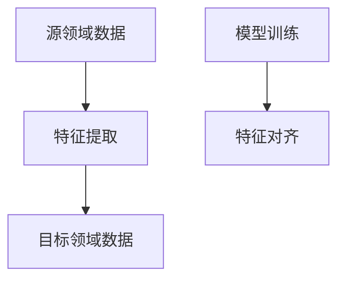
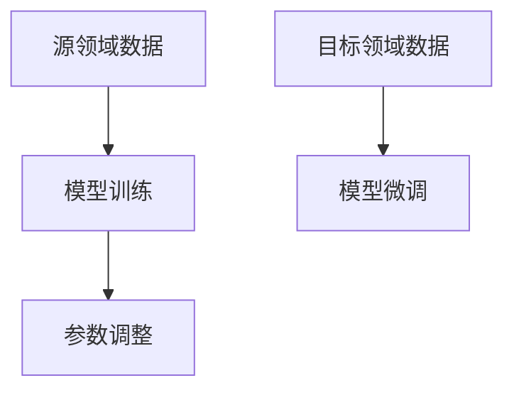
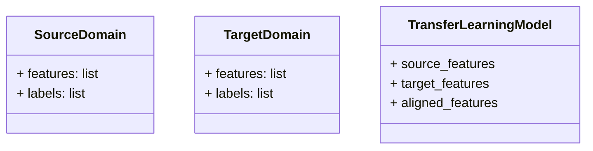
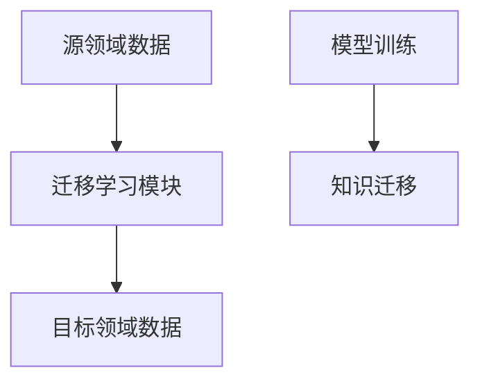

                 


# 企业AI Agent的迁移学习应用：跨领域知识迁移

**关键词**：迁移学习、企业AI Agent、跨领域知识迁移、机器学习、人工智能

**摘要**：本文详细探讨了企业AI Agent在迁移学习中的应用，特别是跨领域知识迁移的原理、方法和实际应用。文章从迁移学习的基本概念入手，分析了其在企业AI Agent中的重要作用，结合具体案例和系统设计，详细讲解了如何通过迁移学习实现跨领域知识的有效迁移，提升企业AI Agent的性能和应用范围。文章最后总结了迁移学习在企业AI Agent中的最佳实践和未来发展趋势。

---

## 第一部分: 迁移学习与企业AI Agent概述

### 第1章: 迁移学习的基本概念

#### 1.1 迁移学习的定义与核心思想
- 迁移学习的定义：迁移学习是一种机器学习技术，旨在通过将从一个任务或领域中学到的知识应用到另一个相关但不同的任务或领域中，以提高学习效率和模型性能。
- 核心思想：知识可以跨任务或领域迁移，避免数据不足或领域差异带来的性能下降。

#### 1.2 企业AI Agent的定义与特点
- 企业AI Agent的定义：企业AI Agent是一种智能代理系统，能够理解、推理和执行企业级的任务，具备自主决策和学习能力。
- 特点：跨领域性、知识整合性、实时性、可扩展性。

#### 1.3 迁移学习在企业AI Agent中的作用
- 迁移学习如何解决跨领域知识迁移问题。
- 提升企业AI Agent的泛化能力和适应性。

---

## 第二部分: 迁移学习的核心概念与联系

### 第2章: 迁移学习的原理与方法

#### 2.1 迁移学习的原理
- 数据分布的变化：源领域和目标领域的数据分布差异。
- 任务之间的关系：任务之间的相似性与差异性。

#### 2.2 迁移学习的主要方法
- 基于特征的方法：通过提取特征进行迁移。
- 基于参数的方法：调整模型参数进行迁移。
- 基于分布的方法：通过匹配数据分布进行迁移。

#### 2.3 迁移学习方法的对比分析
- 不同方法的优缺点对比：基于特征的方法适用于特征空间差异小的场景，参数方法适用于任务相似性高的场景，分布方法适用于数据分布差异大的场景。

---

## 第三部分: 迁移学习的算法原理

### 第3章: 迁移学习算法的实现

#### 3.1 基于特征的迁移学习算法
- 使用Mermaid绘制算法流程图：

- Python代码示例：
```python
def feature_alignment(source_features, target_features):
    # 特征对齐算法实现
    pass
```

#### 3.2 基于参数的迁移学习算法
- 使用Mermaid绘制算法流程图：

- Python代码示例：
```python
def parameter_adjustment(source_model, target_data):
    # 参数微调算法实现
    pass
```

#### 3.3 基于分布的迁移学习算法
- 使用Mermaid绘制算法流程图：

- Python代码示例：
```python
def distribution_alignment(source_data, target_data):
    # 分布对齐算法实现
    pass
```

---

## 第四部分: 系统分析与架构设计

### 第4章: 系统设计与实现

#### 4.1 系统功能设计
- 使用Mermaid绘制领域模型类图：


#### 4.2 系统架构设计
- 使用Mermaid绘制系统架构图：


#### 4.3 系统接口设计
- 输入接口：源领域和目标领域的数据输入。
- 输出接口：迁移后的模型和对齐的特征。

---

## 第五部分: 项目实战

### 第5章: 迁移学习在企业AI Agent中的应用

#### 5.1 项目环境安装
- Python环境：Python 3.8+
- 依赖库安装：TensorFlow, Scikit-learn, Mermaid

#### 5.2 核心代码实现
- 迁移学习模型实现：
```python
def transfer_learning_model(source_X, source_y, target_X, target_y):
    # 模型训练和知识迁移
    pass
```

#### 5.3 案例分析与解读
- 实际案例：将自然语言处理模型迁移到图像分类任务。

---

## 第六部分: 最佳实践与未来展望

### 第6章: 迁移学习的总结与展望

#### 6.1 本章小结
- 迁移学习的核心概念和应用价值。

#### 6.2 注意事项
- 数据分布差异的影响。
- 任务相关性的评估。

#### 6.3 未来趋势
- 迁移学习与深度学习的结合。
- 迁移学习在多领域应用中的潜力。

---

**作者：AI天才研究院/AI Genius Institute & 禅与计算机程序设计艺术 /Zen And The Art of Computer Programming**

