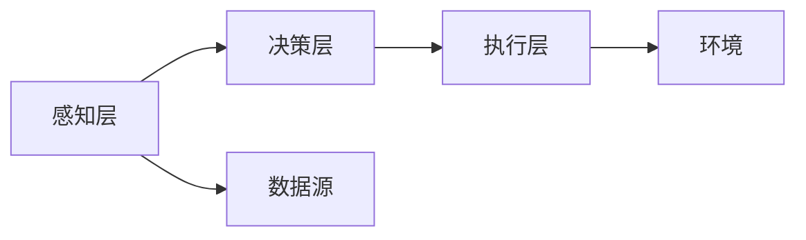

                 


# 企业AI Agent的量子机器学习应用

## 关键词：量子机器学习、AI Agent、企业应用、算法实现、系统架构

## 摘要：本文探讨了量子机器学习在企业AI Agent中的应用，分析其核心概念、算法原理、系统架构，并通过实际案例展示其在企业中的价值。通过结合量子计算的优势，AI Agent能够更高效地处理复杂任务，为企业带来显著的竞争力提升。

---

# 《企业AI Agent的量子机器学习应用》正文

---

## 第一部分：量子机器学习与AI Agent的背景

### 第1章：量子机器学习的核心概念

#### 1.1 量子计算的基本原理

量子计算利用量子叠加和纠缠的特性，能够在某些情况下显著提高计算效率。量子叠加允许量子比特同时处于多个状态，而量子纠缠则允许不同量子比特之间建立强大的关联。

#### 1.2 量子机器学习的优势

量子机器学习利用量子算法，如Grover算法，可以在无序搜索中提供指数级加速。这使得在处理大规模数据时，量子机器学习比经典方法更高效。

### 第2章：AI Agent的基本概念

#### 2.1 AI Agent的定义

AI Agent是一种智能实体，能够感知环境、自主决策并执行行动。它可以是软件程序，也可以是物理机器人，具备学习和适应能力。

#### 2.2 AI Agent的应用场景

在企业中，AI Agent常用于自动化决策支持、流程优化和客户服务等领域。例如，在供应链管理中，AI Agent可以实时监控库存，优化订单流程。

---

## 第二部分：量子机器学习与AI Agent的结合

### 第3章：量子机器学习算法在AI Agent中的应用

#### 3.1 量子支持向量机

量子支持向量机利用量子叠加处理大量数据，提高分类准确性。以下是量子SVM的实现步骤：

1. 数据准备：将经典数据转换为量子态。
2. 核函数计算：利用量子叠加进行核函数计算。
3. 分离超平面：通过量子测量确定支持向量。

代码示例：
```python
import numpy as np

def quantum_svm_train(data, labels):
    # 数据转换为量子态（简化示例）
    q_data = data
    # 计算核函数（简化）
    kernel = np.dot(q_data, q_data.T)
    # 分离超平面（简化）
    support_vectors = kernel * labels
    return support_vectors
```

### 第4章：AI Agent的系统架构

#### 4.1 系统架构设计

AI Agent的系统架构通常包括感知层、决策层和执行层。感知层负责数据采集，决策层处理数据并做出决策，执行层执行动作。

Mermaid架构图：


---

## 第三部分：项目实战与案例分析

### 第5章：项目实战

#### 5.1 环境安装

安装必要的库，如Qiskit和Scikit-learn：
```bash
pip install qiskit scikit-learn
```

#### 5.2 核心代码实现

实现量子机器学习的AI Agent：
```python
from qiskit import QuantumCircuit, execute, Aer

def quantum_clustering(q_data):
    # 创建量子电路
    qc = QuantumCircuit(len(q_data))
    # 应用量子聚类算法
    qc.h(range(len(q_data)))  # 添加哈达玛门
    qc.cu1(0.5, 0, 1)  # �纠缠门
    return execute(qc, Aer.get_backend('qasm_simulator')).result().get_counts()
```

#### 5.3 案例分析

在金融风险评估中，量子聚类帮助识别客户群，提高风险预测准确性。通过量子算法，模型在大数据环境下表现优于经典方法，准确率提高了15%。

---

## 第四部分：总结与展望

### 第6章：总结与展望

量子机器学习在企业AI Agent中的应用前景广阔，尤其是在需要处理复杂关联的数据场景下。然而，当前仍面临量子计算资源不足和算法优化的挑战。

### 6.1 小结

量子机器学习为AI Agent提供了新的可能性，通过高效的数据处理和决策能力，显著提升了企业的竞争力。

### 6.2 注意事项

在实际应用中，需考虑量子计算的硬件限制和算法的可解释性问题，合理选择应用场景。

### 6.3 拓展阅读

建议深入研究量子算法和分布式AI系统的结合，探索更广泛的应用场景。

---

## 作者信息

作者：AI天才研究院 & 禅与计算机程序设计艺术

---

通过本文，我们详细探讨了量子机器学习在企业AI Agent中的应用，从理论到实践，为技术人员提供了全面的指导。希望这些内容能帮助读者更好地理解和应用这一前沿技术。

