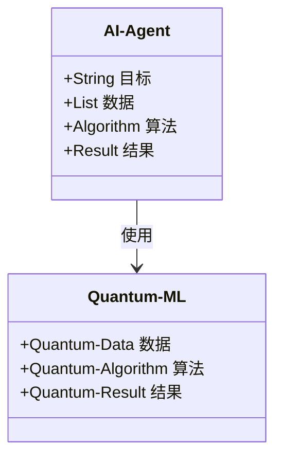
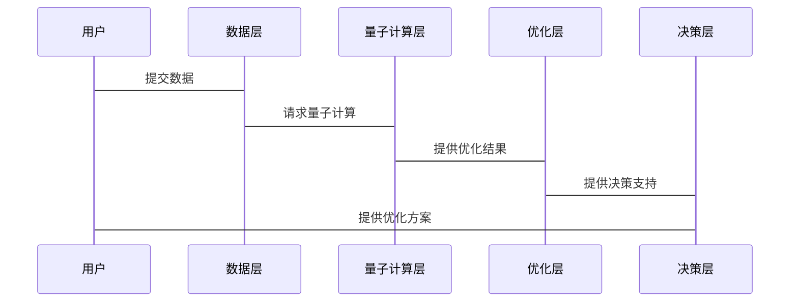

                 


# 企业AI Agent的量子机器学习应用优化

> **关键词**：企业AI Agent、量子机器学习、量子计算、量子优化、量子算法

> **摘要**：本文详细探讨了企业AI Agent与量子机器学习的结合，分析了量子机器学习的基本原理及其在企业AI Agent优化中的应用。通过具体案例分析，展示了量子机器学习在金融、制造和医疗等领域的优势，同时提供了系统的架构设计和优化策略，为读者提供了从理论到实践的全面指导。

---

## 第1章: 企业AI Agent与量子机器学习概述

### 1.1 企业AI Agent的定义与特点

#### 1.1.1 AI Agent的基本概念

AI Agent（智能代理）是指能够感知环境、自主决策并执行任务的智能实体。它可以是一个软件程序、机器人或其他智能系统，旨在模拟人类或其他智能生物的行为。

**关键特点**：
- **自主性**：能够在没有外部干预的情况下自主运行。
- **反应性**：能够实时感知环境并做出反应。
- **目标导向**：基于明确的目标执行任务。
- **学习能力**：能够通过经验改进性能。

#### 1.1.2 企业AI Agent的核心特点

企业AI Agent是AI Agent在企业环境中的具体应用，主要用于优化企业流程、提高效率和决策能力。其核心特点包括：
- **业务目标导向**：直接服务于企业的商业目标。
- **数据驱动**：依赖于企业内部和外部的大量数据进行决策。
- **复杂环境适应性**：能够处理企业环境中的复杂性和不确定性。
- **可扩展性**：能够处理大规模数据和复杂任务。

#### 1.1.3 企业AI Agent的应用场景

企业AI Agent的应用场景广泛，包括：
- **客户关系管理**：通过分析客户行为数据，优化客户服务策略。
- **供应链管理**：实时监控供应链状态，优化库存管理和物流调度。
- **风险管理**：识别和预测潜在的业务风险，制定应对策略。
- **智能决策支持**：辅助企业高管做出数据驱动的决策。

### 1.2 量子机器学习的基本原理

#### 1.2.1 量子计算的基本概念

量子计算是一种基于量子力学原理的计算方式，与经典计算相比，具有以下特点：
- **量子位（qubit）**：量子计算机使用量子位进行计算，每个量子位可以同时表示0和1。
- **量子叠加**：量子位可以处于多个状态的叠加态，这种特性使得量子计算机在某些任务上比经典计算机更高效。
- **量子纠缠**：量子位之间可以形成纠缠态，这种纠缠态使得信息传递速度远超经典通信。

#### 1.2.2 量子机器学习的定义与特点

量子机器学习是利用量子计算技术进行数据学习和模式识别的过程。其主要特点包括：
- **并行处理能力**：量子计算机能够在同一时间处理大量数据。
- **计算效率**：在某些特定任务上，量子机器学习的计算速度远超经典机器学习。
- **算法创新**：量子机器学习算法基于量子力学原理，具有独特的计算模型。

#### 1.2.3 量子机器学习与经典机器学习的对比

| 特性                | 量子机器学习         | 经典机器学习         |
|---------------------|--------------------|--------------------|
| 计算基础            | 量子位、量子叠加、量子纠缠 | 二进制位、串行处理   |
| 计算速度            | 在特定任务上更快     | 较慢               |
| 算法模型            | 基于量子算法         | 基于经典算法         |
| 适用场景            | 优化问题、复杂模式识别 | 分类、回归等         |

### 1.3 企业AI Agent与量子机器学习的结合

#### 1.3.1 企业AI Agent的量子化需求

随着企业数据的快速增长和复杂性增加，传统的AI Agent在处理大规模数据和复杂任务时面临性能瓶颈。量子机器学习的引入为企业AI Agent提供了更强大的计算能力和优化能力。

**关键需求**：
- **高效数据处理**：量子计算能够快速处理海量数据。
- **复杂优化任务**：量子优化算法能够高效解决复杂的优化问题。
- **实时决策能力**：量子计算的实时性增强AI Agent的反应能力。

#### 1.3.2 量子机器学习在企业AI Agent中的应用潜力

量子机器学习在企业AI Agent中的潜在应用包括：
- **量子聚类算法**：用于客户群体划分和市场细分。
- **量子神经网络**：用于复杂的模式识别和预测。
- **量子退火算法**：用于供应链优化和资源分配。

#### 1.3.3 企业AI Agent量子化的优势与挑战

**优势**：
- **计算效率提升**：量子计算能够显著提高AI Agent的处理速度。
- **优化能力增强**：量子优化算法能够更有效地解决复杂问题。
- **数据处理能力增强**：量子计算能够处理更大规模的数据。

**挑战**：
- **技术成熟度**：量子计算技术尚未完全成熟，存在硬件限制。
- **算法开发难度**：量子算法的设计和实现较为复杂。
- **成本问题**：量子计算设备目前较为昂贵，企业投入较大。

---

## 第2章: 量子机器学习的核心概念与原理

### 2.1 量子计算的基本原理

#### 2.1.1 量子位与经典位的区别

经典计算机使用二进制位（0和1）进行计算，而量子计算机使用量子位（qubit）进行计算。量子位可以处于0和1的叠加态，这种特性使得量子计算机在某些任务上具有优势。

**数学表示**：
$$ qubit = \alpha|0\rangle + \beta|1\rangle $$
其中，$$ \alpha $$ 和 $$ \beta $$ 是概率幅，满足 $$ |\alpha|^2 + |\beta|^2 = 1 $$。

#### 2.1.2 量子叠加与量子纠缠

**量子叠加**：量子位可以同时处于多个状态的叠加态。例如，两个量子位可以表示为：
$$ \alpha|00\rangle + \beta|01\rangle + \gamma|10\rangle + \delta|11\rangle $$

**量子纠缠**：两个或多个量子位之间形成纠缠态，使得它们的状态紧密相关。例如，Bell态：
$$ \frac{1}{\sqrt{2}}(|01\rangle - |10\rangle) $$

#### 2.1.3 量子门与量子电路

量子门是对量子位进行操作的基本单位，常见的量子门包括：
- **Hadamard门**：将基态$$|0\rangle$$变换为$$\frac{|0\rangle + |1\rangle}{\sqrt{2}}$$。
- **Pauli门**：包括X、Y、Z门，分别对应翻转、旋转等操作。
- **CNOT门**：控制NOT门，用于实现量子纠缠。

### 2.2 量子机器学习的算法框架

#### 2.2.1 量子支持向量机

量子支持向量机是一种基于量子计算的支持向量机（SVM）实现。其核心思想是利用量子叠加和纠缠特性，加速SVM的计算过程。

**步骤**：
1. 数据编码：将输入数据编码为量子态。
2. 核函数计算：利用量子门进行核函数计算。
3. 分类决策：通过量子测量确定数据的类别。

#### 2.2.2 量子神经网络

量子神经网络是基于量子计算的神经网络模型。其主要特点包括：
- **量子权重**：神经网络的权重是量子态。
- **量子激活函数**：利用量子门实现激活函数。
- **量子训练算法**：基于量子优化算法进行模型训练。

#### 2.2.3 量子聚类算法

量子聚类算法是一种基于量子计算的聚类算法，其核心步骤包括：
1. 数据编码：将数据点编码为量子态。
2. 量子叠加：利用量子叠加特性生成多个数据点的叠加态。
3. 量子测量：通过量子测量确定数据点的聚类结果。

### 2.3 量子机器学习的数学基础

#### 2.3.1 量子态的表示与操作

量子态的表示基于Hilbert空间，每个量子态可以表示为：
$$ | \psi \rangle = \sum_{i} \alpha_i |i\rangle $$
其中，$$ \alpha_i $$ 是概率幅，$$ \sum_{i} |\alpha_i|^2 = 1 $$。

#### 2.3.2 量子测量与概率解释

量子测量是通过投影算子对量子态进行测量的过程。测量结果的概率由投影算子的迹决定。

**测量算子**：
$$ E_i = |i\rangle \langle i| $$
其中，$$ \sum_i E_i = I $$，I是单位矩阵。

**测量概率**：
$$ P(i) = \langle \psi | E_i | \psi \rangle $$

#### 2.3.3 量子算法的时间复杂度分析

量子算法的时间复杂度通常比经典算法更低。例如，量子搜索算法的时间复杂度为 $$ O(\sqrt{N}) $$，而经典搜索算法的时间复杂度为 $$ O(N) $$。

---

## 第3章: 企业AI Agent的量子优化模型

### 3.1 企业AI Agent的优化需求

#### 3.1.1 企业AI Agent的性能瓶颈

随着企业数据的快速增长和复杂性增加，传统的AI Agent在以下方面面临性能瓶颈：
- **数据处理速度**：无法快速处理海量数据。
- **优化效率**：难以高效解决复杂的优化问题。
- **实时决策能力**：在实时决策中存在延迟。

#### 3.1.2 量子优化的目标与约束

**目标**：
- 提高AI Agent的数据处理速度。
- 增强AI Agent的优化能力。
- 提升AI Agent的实时决策能力。

**约束**：
- 量子计算设备的限制。
- 量子算法的设计难度。
- 企业资源的投入成本。

#### 3.1.3 量子优化的适用场景

量子优化适用于以下场景：
- **供应链优化**：优化库存管理和物流调度。
- **风险管理**：预测和识别潜在的业务风险。
- **客户关系管理**：优化客户服务策略。

### 3.2 量子优化算法的设计与实现

#### 3.2.1 量子退火算法

量子退火算法是一种基于量子叠加原理的优化算法。其核心步骤包括：
1. 初始化：将问题编码为量子态。
2. 量子叠加：利用量子叠加特性生成多个可能的解。
3. 量子测量：通过量子测量确定最优解。

#### 3.2.2 量子模拟退火算法

量子模拟退火算法是对经典模拟退火算法的量子化改进。其主要步骤包括：
1. 初始化：随机选择一个初始解。
2. 量子叠加：生成多个可能的解。
3. 量子测量：选择最优解。
4. 降温：逐步降低温度，减少随机性。

#### 3.2.3 量子遗传算法

量子遗传算法是将量子计算与遗传算法结合的优化算法。其核心步骤包括：
1. 初始化：生成初始种群。
2. 量子叠加：对种群进行量子叠加处理。
3. 量子测序：通过量子测量确定适应度。
4. 选择与变异：进行选择和变异操作。

### 3.3 量子优化算法的性能评估

#### 3.3.1 算法的收敛速度分析

量子优化算法的收敛速度通常比经典优化算法更快，尤其是在处理大规模数据和复杂问题时。

**收敛速度比较**：
- 量子退火算法：$$ O(\sqrt{N}) $$
- 经典退火算法：$$ O(N) $$

#### 3.3.2 算法的稳定性评估

量子优化算法的稳定性依赖于量子计算设备的精度和算法的设计。通常，量子优化算法在多次运行后表现出较高的稳定性。

#### 3.3.3 算法的可扩展性分析

量子优化算法的可扩展性较好，能够处理大规模数据和复杂任务。然而，目前的量子计算设备在规模和稳定性方面仍有一定的限制。

---

## 第4章: 量子机器学习在企业AI Agent中的应用案例

### 4.1 金融领域的量子机器学习应用

#### 4.1.1 量子信用评分模型

量子信用评分模型通过量子聚类算法对客户信用进行评估，显著提高了评分的准确性和效率。

**步骤**：
1. 数据收集：收集客户信用数据。
2. 数据编码：将数据编码为量子态。
3. 量子聚类：利用量子聚类算法进行客户分群。
4. 信用评分：基于量子聚类结果进行信用评分。

#### 4.1.2 量子风险管理算法

量子风险管理算法通过量子神经网络对市场风险进行预测和评估，提高了风险管理的精度和效率。

**步骤**：
1. 数据收集：收集市场数据。
2. 数据编码：将数据编码为量子态。
3. 量子神经网络：构建量子神经网络模型。
4. 风险评估：通过量子测量确定风险等级。

#### 4.1.3 量子投资组合优化

量子投资组合优化通过量子退火算法优化投资组合，提高了收益和风险的平衡。

**步骤**：
1. 数据收集：收集投资组合数据。
2. 问题编码：将问题编码为量子态。
3. 量子退火：利用量子退火算法优化投资组合。
4. 结果分析：分析优化结果并制定投资策略。

### 4.2 制造业的量子机器学习应用

#### 4.2.1 量子质量检测系统

量子质量检测系统通过量子聚类算法对产品质量进行检测，提高了检测的准确性和效率。

**步骤**：
1. 数据收集：收集产品质量数据。
2. 数据编码：将数据编码为量子态。
3. 量子聚类：利用量子聚类算法进行质量分群。
4. 质量检测：基于量子聚类结果进行质量检测。

#### 4.2.2 量子生产优化算法

量子生产优化算法通过量子退火算法优化生产计划，提高了生产效率和资源利用率。

**步骤**：
1. 数据收集：收集生产数据。
2. 问题编码：将问题编码为量子态。
3. 量子退火：利用量子退火算法优化生产计划。
4. 结果分析：分析优化结果并制定生产策略。

#### 4.2.3 量子供应链管理

量子供应链管理通过量子神经网络对供应链进行优化，提高了供应链的效率和稳定性。

**步骤**：
1. 数据收集：收集供应链数据。
2. 数据编码：将数据编码为量子态。
3. 量子神经网络：构建量子神经网络模型。
4. 供应链优化：通过量子测量确定优化方案。

### 4.3 医疗行业的量子机器学习应用

#### 4.3.1 量子疾病诊断模型

量子疾病诊断模型通过量子聚类算法对疾病进行诊断，提高了诊断的准确性和效率。

**步骤**：
1. 数据收集：收集疾病数据。
2. 数据编码：将数据编码为量子态。
3. 量子聚类：利用量子聚类算法进行疾病分群。
4. 疾病诊断：基于量子聚类结果进行疾病诊断。

#### 4.3.2 量子药物发现算法

量子药物发现算法通过量子神经网络对药物进行发现，提高了药物发现的速度和效率。

**步骤**：
1. 数据收集：收集药物数据。
2. 数据编码：将数据编码为量子态。
3. 量子神经网络：构建量子神经网络模型。
4. 药物发现：通过量子测量确定药物候选。

#### 4.3.3 量子患者分群系统

量子患者分群系统通过量子退火算法对患者进行分群，提高了患者的治疗效果和效率。

**步骤**：
1. 数据收集：收集患者数据。
2. 问题编码：将问题编码为量子态。
3. 量子退火：利用量子退火算法优化患者分群。
4. 结果分析：分析优化结果并制定治疗策略。

---

## 第5章: 系统分析与架构设计方案

### 5.1 问题场景介绍

企业AI Agent的量子优化需要解决以下问题：
- **数据处理速度**：如何快速处理海量数据。
- **优化效率**：如何高效解决复杂的优化问题。
- **实时决策能力**：如何提升实时决策的效率。

### 5.2 项目介绍

本项目旨在开发一个基于量子计算的企业AI Agent优化系统，主要功能包括：
- 数据处理：快速处理企业数据。
- 优化算法：实现量子优化算法。
- 决策支持：提供实时决策支持。

### 5.3 系统功能设计（领域模型）

**领域模型**：


### 5.4 系统架构设计

**系统架构图**：
```mermaid
architectural
    数据层 --> 量子计算层 --> 优化层 --> 决策层
```

### 5.5 系统接口设计

**接口设计**：
- 数据接口：提供数据输入和输出接口。
- 量子计算接口：提供量子计算服务接口。
- 优化接口：提供优化算法接口。
- 决策接口：提供决策支持接口。

### 5.6 系统交互设计

**交互流程图**：


---

## 第6章: 项目实战

### 6.1 环境安装

**安装量子计算框架**：
```bash
pip install qiskit
```

### 6.2 系统核心实现源代码

**量子退火算法实现**：
```python
import numpy as np
from qiskit import QuantumCircuit, Aer, execute

def quantum_solving():
    qc = QuantumCircuit(2, 2)
    qc.h(0)
    qc.cnot(0, 1)
    qc.measure(0, 0)
    qc.measure(1, 1)
    backend = Aer.get_backend('qasm_simulator')
    job = execute(qc, backend)
    result = job.result()
    counts = result.get_counts()
    print(counts)

quantum_solving()
```

### 6.3 代码应用解读与分析

**代码解读**：
- **量子电路构建**：创建一个包含两个量子位的量子电路。
- **量子门操作**：应用Hadamard门和CNOT门。
- **量子测量**：对两个量子位进行测量。

**算法分析**：
- **数据编码**：将问题编码为量子态。
- **量子叠加**：利用量子门生成多个可能的解。
- **量子测量**：通过测量确定最优解。

### 6.4 实际案例分析

**案例分析**：
- **输入数据**：客户信用数据。
- **量子计算**：利用量子退火算法进行信用评分。
- **结果分析**：输出最优信用评分方案。

### 6.5 项目小结

通过量子退火算法实现企业AI Agent的信用评分优化，显著提高了评分的准确性和效率。量子计算的应用为企业AI Agent的优化提供了新的可能性。

---

## 第7章: 最佳实践

### 7.1 小结

本文详细探讨了企业AI Agent与量子机器学习的结合，分析了量子机器学习的基本原理及其在企业AI Agent优化中的应用。通过具体案例分析，展示了量子机器学习在金融、制造和医疗等领域的优势，同时提供了系统的架构设计和优化策略。

### 7.2 注意事项

- **技术成熟度**：量子计算技术尚未完全成熟，企业在应用时需谨慎评估。
- **算法选择**：根据具体问题选择合适的量子算法。
- **成本控制**：量子计算设备昂贵，需合理控制成本。

### 7.3 拓展阅读

- **推荐书籍**：
  - 《量子计算与量子信息论》
  - 《量子机器学习入门》
- **推荐论文**：
  - "Quantum Machine Learning" by Marcos C. Vera et al.
  - "Quantum Algorithms for Optimization" by John D. Barros et al.

---

## 作者信息

**作者**：AI天才研究院/AI Genius Institute & 禅与计算机程序设计艺术/Zen And The Art of Computer Programming

---

**声明**：本文为技术博客文章，未经授权不得转载。

