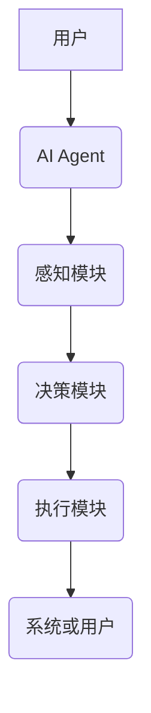

                 

# 企业AI Agent的高可用性架构设计

> **关键词**：AI Agent、高可用性、企业架构、系统设计、算法原理  
> **摘要**：企业AI Agent的高可用性架构设计是确保AI Agent在企业环境中稳定运行的关键。本文从AI Agent的基本概念出发，详细探讨了其高可用性需求、核心算法原理、系统架构设计以及实际项目中的实现方案，结合丰富的图表和案例，为读者提供全面的技术指导。

---

## 第一部分：企业AI Agent的背景与概念

### 第1章：企业AI Agent概述

#### 1.1 AI Agent的基本概念
- **1.1.1 什么是AI Agent？**  
  AI Agent（人工智能代理）是一种能够感知环境、做出决策并执行操作的智能实体。它通过与用户或系统的交互，完成特定任务，例如信息检索、任务调度、决策支持等。

- **1.1.2 AI Agent的核心特征**  
  - **自主性**：能够在没有人工干预的情况下运行。  
  - **反应性**：能够实时感知环境并做出响应。  
  - **目标导向**：以特定目标为导向，优化决策和行动。  
  - **可扩展性**：能够处理复杂任务，并根据需求进行扩展。

- **1.1.3 企业AI Agent的定义与特点**  
  企业AI Agent是指在企业环境中部署的AI代理，用于优化企业流程、提高效率并增强用户体验。其特点包括高可用性、可扩展性、安全性以及与企业系统的高度集成。

#### 1.2 高可用性架构的定义与重要性
- **1.2.1 高可用性架构的定义**  
  高可用性架构是指系统在故障发生时，能够快速恢复并保持服务的可用性。通常，高可用性架构通过冗余设计、故障隔离和自动恢复机制来实现。

- **1.2.2 高可用性在企业AI Agent中的重要性**  
  - **业务连续性**：企业AI Agent的中断可能导致业务流程受阻，甚至造成经济损失。  
  - **用户体验**：高可用性确保用户能够持续获得稳定的服务，提升满意度。  
  - **系统稳定性**：高可用性架构能够减少系统故障，延长系统使用寿命。

- **1.2.3 高可用性架构的设计目标**  
  - **故障容错**：系统在部分组件故障时仍能正常运行。  
  - **快速恢复**：在故障发生后，系统能够迅速恢复到正常状态。  
  - **负载均衡**：在高负载情况下，系统能够合理分配资源，避免单点故障。

#### 1.3 企业AI Agent的应用场景
- **1.3.1 企业智能化转型的需求**  
  随着企业智能化转型的推进，AI Agent成为企业实现自动化、智能化的关键工具。

- **1.3.2 AI Agent在企业中的典型应用场景**  
  - **智能客服**：通过自然语言处理技术，为用户提供24/7的智能支持。  
  - **自动化运维**：通过AI Agent实现系统监控、故障诊断和自动修复。  
  - **智能决策支持**：基于大数据分析，为企业提供实时决策支持。

- **1.3.3 高可用性架构在实际中的必要性**  
  在企业环境中，AI Agent需要7×24小时无间断运行，任何中断都可能导致业务损失。因此，高可用性架构是企业AI Agent设计的必备要素。

---

## 第2章：企业AI Agent的核心概念与联系

### 2.1 AI Agent的核心概念原理
- **2.1.1 感知模块**  
  感知模块负责接收输入数据，例如用户的查询、系统状态等，并将其转化为可处理的格式。

- **2.1.2 决策模块**  
  决策模块基于感知到的信息，通过算法进行分析和判断，生成决策结果。

- **2.1.3 执行模块**  
  执行模块根据决策结果，调用系统资源或服务，完成具体的操作。

### 2.2 核心概念属性特征对比表格
| 概念 | 属性 | 特征 |
|------|------|------|
| 感知模块 | 数据输入 | 文本、图像、语音等 |
| 决策模块 | 算法选择 | 机器学习、规则引擎等 |
| 执行模块 | 行为输出 | 系统调用、用户反馈等 |

### 2.3 ER实体关系图架构（Mermaid流程图）

---

## 第三部分：企业AI Agent的算法原理

### 第3章：感知算法原理

#### 3.1 自然语言处理（NLP）算法
- **3.1.1 NLP的基本原理**  
  NLP通过将自然语言文本转化为计算机可理解的结构，实现对文本的理解和分析。

- **3.1.2 基于Transformer的模型（如BERT）**  
  BERT（Bidirectional Encoder Representations from Transformers）是一种预训练语言模型，能够通过大规模数据训练，学习到语言的上下文关系。

- **3.1.3 感知算法的数学模型**  
  $$ P(\text{intent} | x) = \frac{P(x | \text{intent}) \cdot P(\text{intent})}{P(x)} $$  
  其中，$P(\text{intent} | x)$ 是在输入$x$的情况下，intent的概率。

---

通过以上内容，我们逐步展开企业AI Agent的高可用性架构设计，确保每个部分都详细且有深度，为读者提供全面的技术指导。

