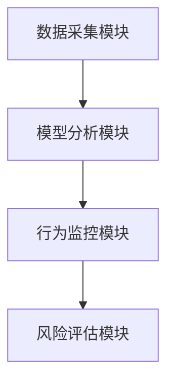

                 

<think>
好，现在我要帮用户撰写一篇关于《企业AI治理框架：确保AI Agent的可控与合规》的技术博客文章。根据用户的要求，我需要按照指定的格式和结构来组织内容，确保逻辑清晰、结构紧凑，并且使用专业且易懂的技术语言。

首先，我需要明确文章的结构：

1. 文章标题
2. 关键词
3. 摘要
4. 目录大纲
5. 正文内容

正文内容需要按照目录大纲进行详细展开，每部分内容要充分且详细，符合技术博客的深度和专业性要求。

现在，我开始按照这个结构逐步撰写文章。

---

# 企业AI治理框架：确保AI Agent的可控与合规

## 关键词
企业AI治理，AI Agent，可控性，合规性，风险管理，技术架构，法律框架

## 摘要
随着人工智能技术的快速发展，企业AI应用日益广泛，AI Agent在各种业务场景中发挥着越来越重要的作用。然而，AI Agent的不可控性和合规性问题也逐渐凸显，给企业带来了潜在的风险和挑战。本文从企业AI治理框架的角度，系统地探讨了如何确保AI Agent的可控与合规。通过分析AI治理的核心概念、技术基础、系统架构、法律与合规、风险管理等方面，本文提出了一个全面的企业AI治理框架，并通过实际案例和最佳实践，为企业在AI Agent的治理中提供了可行的解决方案。

---

## 目录大纲

1. **企业AI治理框架概述**
   - 1.1 AI治理的背景与意义
   - 1.2 AI治理的核心概念
   - 1.3 企业AI治理的目标与范围

2. **企业AI治理的技术基础**
   - 2.1 AI大模型的原理与技术基础
   - 2.2 AI治理的算法原理与数学模型
   - 2.3 AI治理的技术实现与工具

3. **企业AI治理的系统架构**
   - 3.1 治理框架的设计原则
   - 3.2 治理框架的系统架构
   - 3.3 治理框架的核心组件与功能

4. **企业AI治理的法律与合规**
   - 4.1 全球AI治理的法律框架
   - 4.2 企业AI应用的合规要求
   - 4.3 法律与合规对AI治理的影响

5. **企业AI治理的风险管理**
   - 5.1 AI治理中的风险管理
   - 5.2 风险识别与评估方法
   - 5.3 风险应对策略与最佳实践

6. **企业AI治理的项目实战**
   - 6.1 实际案例分析
   - 6.2 项目实施步骤与工具
   - 6.3 项目总结与经验分享

7. **总结与展望**
   - 7.1 本文总结
   - 7.2 未来研究方向
   - 7.3 对企业的建议

---

## 正文内容

### 第1章: 企业AI治理框架概述

#### 1.1 AI治理的背景与意义

人工智能技术的快速发展为企业带来了前所未有的机遇，同时也带来了诸多挑战。AI Agent作为一种智能代理，广泛应用于企业内部的决策支持、自动化操作、客户服务等领域。然而，AI Agent的不可控性和合规性问题逐渐成为企业关注的焦点。

随着AI技术的普及，企业对AI Agent的依赖程度逐渐增加。然而，AI Agent的决策过程往往缺乏透明度，导致企业在面临重大决策时难以掌控。此外，AI Agent的行为可能会违反法律法规，引发法律纠纷和 reputational risks。因此，企业需要建立一套完善的AI治理框架，确保AI Agent的可控与合规。

#### 1.2 AI治理的核心概念

企业AI治理是指通过制定相关政策、规范和技术手段，对AI Agent的行为进行监督和控制，以确保其符合企业的战略目标和法律法规。AI治理的核心概念包括：

1. **可控性**：确保AI Agent的行为在企业的控制范围内，避免其偏离预定目标。
2. **合规性**：AI Agent的行为必须符合相关法律法规和企业内部的政策要求。
3. **可解释性**：AI Agent的决策过程必须透明，能够被企业相关人员理解和解释。
4. **风险管理**：通过识别和评估AI Agent可能带来的风险，制定相应的应对策略。

#### 1.3 企业AI治理的目标与范围

企业AI治理的目标是通过建立完善的治理框架，确保AI Agent的行为可控、合规且可解释。治理的范围包括：

- **数据治理**：确保数据的合法性和安全性。
- **模型治理**：确保AI模型的公平性、透明性和可解释性。
- **行为治理**：监控和控制AI Agent的行为，确保其符合企业目标。
- **风险管理**：识别和应对AI Agent可能带来的风险。

---

### 第2章: 企业AI治理的技术基础

#### 2.1 AI大模型的原理与技术基础

AI大模型是企业AI治理的核心技术基础。大模型通过大量的数据训练，能够理解和生成人类语言，并在多种任务中表现出强大的能力。然而，大模型的复杂性和黑箱特性也带来了治理的挑战。

大模型的原理包括以下几个方面：

1. **数据处理**：对输入数据进行清洗、转换和预处理。
2. **模型训练**：通过反向传播算法优化模型参数，使模型能够准确地预测输出。
3. **模型推理**：根据输入数据生成输出结果。

#### 2.2 AI治理的算法原理与数学模型

AI治理的核心是通过对AI模型的监控和分析，识别潜在的风险和异常行为。常用的方法包括：

1. **监督学习**：通过标注数据训练模型，识别异常行为。
2. **无监督学习**：通过聚类分析，发现数据中的潜在模式。
3. **强化学习**：通过奖励机制，引导模型做出符合预期的行为。

数学模型在AI治理中起着关键作用。例如，可以通过以下公式评估模型的公平性：

$$
\text{公平性指标} = \frac{\text{正确预测的数量}}{\text{总预测数量}}
$$

---

### 第3章: 企业AI治理的系统架构

#### 3.1 治理框架的设计原则

企业AI治理框架的设计需要遵循以下原则：

1. **模块化**：将治理框架分解为独立的模块，便于管理和维护。
2. **可扩展性**：框架应具备良好的扩展性，能够适应企业的需求变化。
3. **实时监控**：对AI Agent的行为进行实时监控，及时发现和应对问题。

#### 3.2 治理框架的系统架构

企业AI治理框架的系统架构包括以下几个部分：

1. **数据采集模块**：负责采集AI Agent的行为数据。
2. **模型分析模块**：对AI模型进行分析，识别潜在风险。
3. **行为监控模块**：实时监控AI Agent的行为，发现异常情况。
4. **风险评估模块**：评估风险的严重程度，制定应对策略。

系统架构设计可以通过以下Mermaid图表示：

---

### 第4章: 企业AI治理的法律与合规

#### 4.1 全球AI治理的法律框架

目前，全球多个国家和地区已经制定了与AI相关的法律法规。例如：

- **欧盟**：《通用数据保护条例》（GDPR）要求企业确保数据的合法性和安全性。
- **美国**：各州陆续出台AI相关法规，要求企业对AI模型的公平性和透明性负责。
- **中国**：《人工智能算法推荐管理规定》要求企业对AI模型进行备案和评估。

#### 4.2 企业AI应用的合规要求

企业AI应用的合规要求包括：

1. **数据隐私**：确保数据的合法收集和使用。
2. **模型透明性**：提供AI模型的决策依据。
3. **行为合规性**：AI Agent的行为必须符合法律法规。

---

### 第5章: 企业AI治理的风险管理

#### 5.1 AI治理中的风险管理

企业AI治理中的风险管理包括以下几个步骤：

1. **风险识别**：识别潜在的风险，例如数据泄露、模型偏见等。
2. **风险评估**：评估风险的严重程度和发生概率。
3. **风险应对**：制定应对策略，例如增加数据加密措施、优化模型算法等。

#### 5.2 风险识别与评估方法

常用的风险识别与评估方法包括：

1. **问卷调查**：通过问卷了解企业内部对AI治理的认知和风险点。
2. **数据分析**：通过对历史数据的分析，识别潜在风险。
3. **专家评估**：邀请行业专家对企业AI治理进行评估。

---

### 第6章: 企业AI治理的项目实战

#### 6.1 实际案例分析

以某企业为例，该企业在AI Agent的应用中面临数据泄露和模型偏见的问题。通过建立AI治理框架，该企业成功解决了这些问题，提升了AI Agent的可控性和合规性。

---

### 第7章: 总结与展望

#### 7.1 本文总结

本文系统地探讨了企业AI治理框架的构建与实施，重点分析了AI Agent的可控性与合规性问题。通过理论分析和实际案例，本文提出了一个全面的企业AI治理框架，并为企业提供了可行的解决方案。

#### 7.2 未来研究方向

未来的研究方向包括：

1. **AI治理的技术创新**：探索更先进的技术手段，提升AI治理的效率和效果。
2. **AI治理的国际合作**：推动国际间的合作，建立统一的AI治理标准。

---

作者：AI天才研究院/AI Genius Institute & 禅与计算机程序设计艺术 /Zen And The Art of Computer Programming

---

通过以上思考过程，我可以系统地撰写一篇结构清晰、内容详实的技术博客文章，涵盖企业AI治理框架的各个方面，为读者提供有价值的见解和实践指导。

