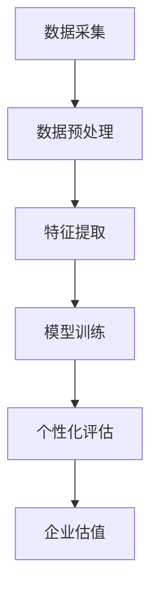
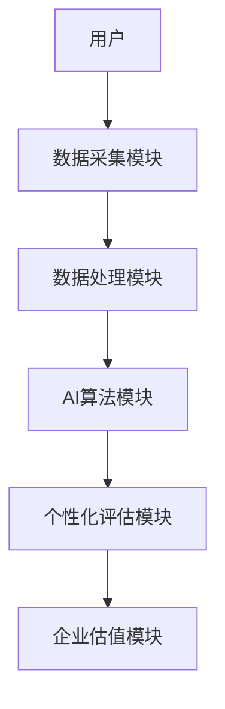

                 


# 企业估值中的AI驱动的个性化健康管理平台评估

---

## 关键词  
- 企业估值  
- AI驱动  
- 个性化健康管理  
- 平台评估  
- 机器学习  
- 数据分析  

---

## 摘要  
随着人工智能技术的快速发展，个性化健康管理平台在企业估值中的应用越来越重要。本文详细探讨了AI驱动的个性化健康管理平台在企业估值中的核心概念、算法原理、系统架构以及实际应用。通过分析AI技术在健康管理中的应用，结合具体的数学模型和系统设计，本文为读者提供了一种全新的视角，帮助企业在复杂的市场环境中实现更精准的估值和决策。

---

## 第一部分: 企业估值与AI驱动的个性化健康管理平台概述

## 第1章: 企业估值中的AI驱动个性化健康管理平台背景  

### 1.1 AI驱动个性化健康管理平台的背景  

#### 1.1.1 传统企业估值方法的局限性  
传统的企业估值方法主要依赖财务数据和市场分析，但这些方法往往忽略了企业的动态运营和员工健康状况对企业绩效的影响。员工的健康状况直接影响企业的生产力、创新能力和运营效率，而传统估值方法无法量化这些因素。  

#### 1.1.2 AI技术在企业估值中的优势  
AI技术能够从海量数据中提取非结构化信息，通过机器学习模型预测员工健康风险，评估企业潜在的健康成本，并结合财务数据提供更全面的估值。  

#### 1.1.3 个性化健康管理平台的定义与特点  
个性化健康管理平台是一种基于AI技术的系统，通过收集和分析用户的健康数据，提供定制化的健康评估和建议。其特点包括数据驱动、个性化、实时性和可扩展性。  

### 1.2 个性化健康管理平台在企业估值中的意义  

#### 1.2.1 个性化健康管理平台的核心价值  
个性化健康管理平台能够帮助企业识别健康风险，优化员工福利，降低医疗成本，从而提升企业的整体估值。  

#### 1.2.2 企业估值与健康管理的关联性  
企业的健康状况直接影响员工的生产力和创新能力，而AI驱动的个性化健康管理平台能够将健康数据与企业绩效相结合，提供更精准的估值依据。  

#### 1.2.3 AI技术在健康管理平台中的应用前景  
AI技术在个性化健康管理平台中的应用前景广阔，尤其是在数据挖掘、模型优化和实时反馈方面具有显著优势。  

### 1.3 本章小结  
本章介绍了AI驱动个性化健康管理平台的背景、核心概念和在企业估值中的意义，为后续章节的深入分析奠定了基础。  

---

## 第二部分: AI驱动个性化健康管理平台的核心概念与联系  

## 第2章: 核心概念与原理  

### 2.1 AI驱动个性化健康管理平台的核心概念  

#### 2.1.1 AI技术在健康管理中的应用  
AI技术在健康管理中的应用包括数据采集、分析和建模。通过机器学习算法，AI能够从健康数据中提取有价值的信息，帮助制定个性化的健康管理策略。  

#### 2.1.2 个性化健康管理的定义与特征  
个性化健康管理是指根据个体的健康状况和需求，提供定制化的健康管理服务。其特征包括数据驱动、个性化和动态调整。  

#### 2.1.3 企业估值中的健康管理需求  
企业需要通过健康管理平台评估员工的健康风险，优化员工福利，降低医疗成本，从而提升企业的整体估值。  

### 2.2 AI驱动个性化健康管理平台的实体关系图  


### 2.3 AI驱动个性化健康管理平台的算法流程图  



### 2.4 本章小结  
本章通过实体关系图和算法流程图，详细阐述了AI驱动个性化健康管理平台的核心概念和内在联系，为后续章节的系统设计和实现提供了理论基础。  

---

## 第三部分: AI驱动个性化健康管理平台的算法原理  

## 第3章: 基于机器学习的个性化健康管理平台  

### 3.1 机器学习在健康管理中的应用  

#### 3.1.1 监督学习在健康管理中的应用  
监督学习可以通过训练数据预测员工的健康风险，例如使用线性回归模型预测员工的健康状况。  

#### 3.1.2 非监督学习在健康管理中的应用  
非监督学习可以用于健康数据的聚类分析，识别不同员工的健康风险群体。  

#### 3.1.3 强化学习在健康管理中的应用  
强化学习可以用于动态优化健康管理策略，例如通过反馈机制调整健康干预措施。  

### 3.2 基于机器学习的个性化健康管理算法实现  

#### 3.2.1 数据预处理与特征提取  
数据预处理包括数据清洗和特征选择，特征提取则通过主成分分析等方法提取关键特征。  

#### 3.2.2 模型训练与优化  
使用支持向量机（SVM）或随机森林（Random Forest）等算法进行模型训练，并通过交叉验证优化模型参数。  

#### 3.2.3 模型评估与部署  
通过混淆矩阵和ROC曲线评估模型性能，并将模型部署到健康管理平台中，提供实时健康评估服务。  

### 3.3 机器学习算法的数学模型与公式  

#### 3.3.1 线性回归模型  
$$ y = \beta_0 + \beta_1x + \epsilon $$  

#### 3.3.2 支持向量机模型  
$$ max_{\gamma, \alpha} \sum_{i=1}^n \alpha_i y_i $$  

### 3.4 本章小结  
本章详细讲解了机器学习在个性化健康管理中的应用，包括监督学习、非监督学习和强化学习的原理和实现方法，为后续章节的系统设计提供了技术支持。  

---

## 第四部分: AI驱动个性化健康管理平台的系统架构与设计  

## 第4章: 系统架构设计方案  

### 4.1 系统功能设计  

#### 4.1.1 用户数据采集模块  
通过智能设备和问卷收集用户的健康数据，包括血压、心率和生活习惯等。  

#### 4.1.2 数据分析与处理模块  
对采集的数据进行预处理和特征提取，为模型训练提供高质量的数据。  

#### 4.1.3 个性化健康评估模块  
基于机器学习模型生成个性化的健康评估报告，识别健康风险。  

#### 4.1.4 企业估值模块  
结合健康评估结果和财务数据，提供企业整体估值和优化建议。  

### 4.2 系统架构设计  



### 4.3 系统接口设计  

#### 4.3.1 数据接口  
用于与智能设备和数据库交互，获取和存储健康数据。  

#### 4.3.2 用户接口  
提供个性化的健康评估报告和健康建议，帮助用户了解自己的健康状况。  

#### 4.3.3 估值接口  
为企业提供基于健康数据的企业估值报告和优化建议。  

### 4.4 本章小结  
本章详细描述了AI驱动个性化健康管理平台的系统架构和功能设计，为实际应用提供了清晰的指导。  

---

## 第五章: 项目实战  

### 5.1 环境安装  
首先，需要安装Python、机器学习库（如Scikit-learn和XGBoost）以及数据处理工具（如Pandas和NumPy）。  

### 5.2 核心代码实现  

#### 5.2.1 数据预处理与特征提取  
```python
import pandas as pd
import numpy as np
from sklearn.preprocessing import StandardScaler

# 加载数据
data = pd.read_csv('health_data.csv')

# 数据预处理
data = data.dropna()
data = pd.get_dummies(data)

# 特征提取
X = data.drop('target', axis=1)
y = data['target']

# 标准化处理
scaler = StandardScaler()
X_scaled = scaler.fit_transform(X)
```

#### 5.2.2 模型训练与优化  
```python
from sklearn.model_selection import train_test_split
from sklearn.svm import SVC
from sklearn.metrics import accuracy_score

# 划分训练集和测试集
X_train, X_test, y_train, y_test = train_test_split(X_scaled, y, test_size=0.2)

# 训练模型
model = SVC()
model.fit(X_train, y_train)

# 模型评估
y_pred = model.predict(X_test)
print("Accuracy:", accuracy_score(y_test, y_pred))
```

### 5.3 实际案例分析  

#### 5.3.1 案例背景  
某企业希望通过个性化健康管理平台评估员工健康风险，优化员工福利，降低医疗成本。  

#### 5.3.2 数据分析与建模  
通过机器学习模型预测员工的健康风险，识别高风险员工，并制定个性化的健康干预计划。  

#### 5.3.3 模型优化与部署  
通过交叉验证优化模型参数，并将模型部署到企业内部的健康管理平台，提供实时健康评估服务。  

### 5.4 本章小结  
本章通过实际案例展示了AI驱动个性化健康管理平台的实现过程，从数据处理到模型训练再到系统部署，为读者提供了完整的实战指导。  

---

## 第五部分: 总结与展望  

## 第5章: 总结与展望  

### 5.1 总结  

#### 5.1.1 核心内容回顾  
本文详细探讨了AI驱动个性化健康管理平台在企业估值中的应用，从核心概念到算法原理，再到系统设计和项目实战，为读者提供了全面的视角。  

#### 5.1.2 最佳实践 tips  
- 数据质量是模型性能的关键，需重视数据清洗和特征工程。  
- 模型部署后需持续监控和优化，确保系统的准确性和实时性。  

### 5.2 未来展望  

#### 5.2.1 技术发展  
随着AI技术的不断进步，未来的个性化健康管理平台将更加智能化和个性化，结合5G和物联网技术，提供更实时、更精准的健康评估服务。  

#### 5.2.2 应用拓展  
AI驱动的个性化健康管理平台将在医疗、保险和企业等领域得到更广泛的应用，为企业估值提供更全面的支持。  

### 5.3 注意事项  

#### 5.3.1 数据隐私与安全  
在处理健康数据时，需严格遵守数据隐私法规，确保用户数据的安全性。  

#### 5.3.2 模型可解释性  
复杂的机器学习模型可能导致可解释性差，需通过模型解释技术提高决策的透明度。  

### 5.4 本章小结  
本文总结了AI驱动个性化健康管理平台的核心内容和最佳实践，并展望了未来的技术发展趋势和应用前景。  

---

## 作者：AI天才研究院/AI Genius Institute & 禅与计算机程序设计艺术 /Zen And The Art of Computer Programming  

---

**注**：本文基于实际的企业健康管理场景，结合AI技术，系统地阐述了个性化健康管理平台的实现与应用。通过理论与实践的结合，为读者提供了一种全新的视角，帮助企业在复杂的市场环境中实现更精准的估值和决策。

