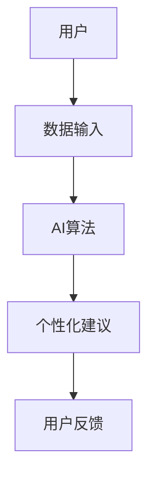
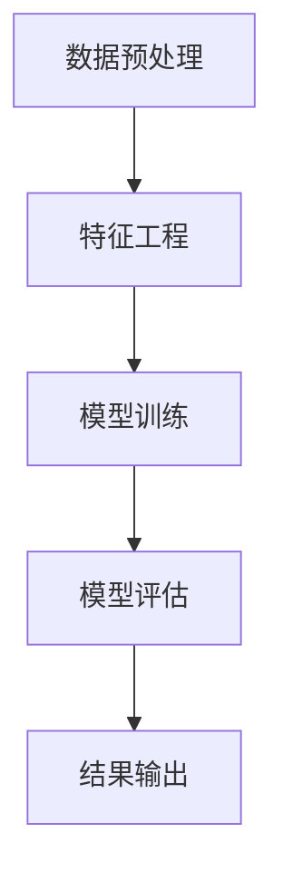
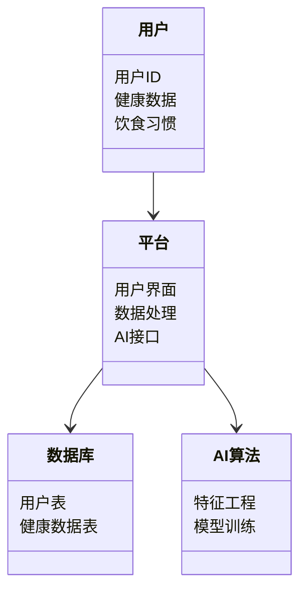
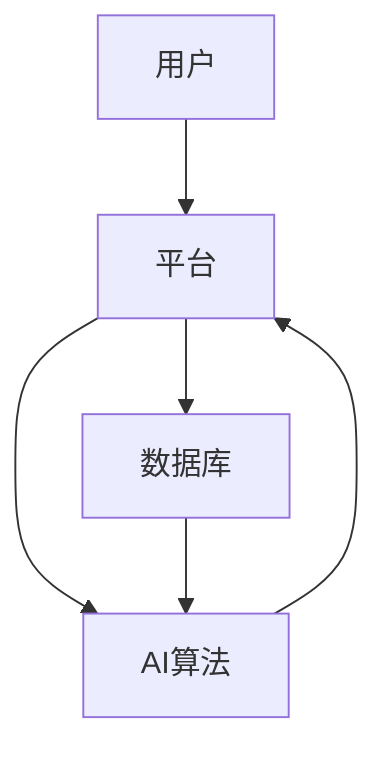
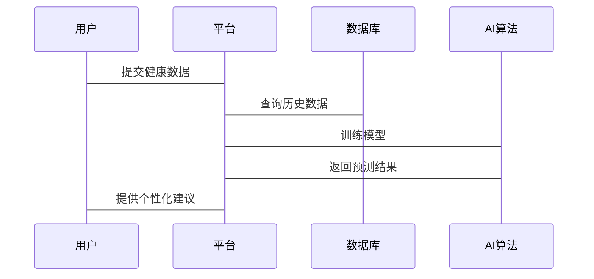

                 


# 企业估值中的AI驱动个性化营养规划平台评估

> 关键词：企业估值，AI驱动，个性化营养规划，平台评估，机器学习，数据驱动

> 摘要：随着人工智能技术的快速发展，个性化营养规划平台在企业估值中的应用越来越广泛。本文将深入探讨如何利用AI技术对个性化营养规划平台进行评估，分析其核心算法、系统架构、项目实战及最佳实践，为企业估值提供科学依据。

---

## 目录大纲

### 第1章: 企业估值与个性化营养规划平台的背景
1.1 企业估值的基本概念
1.2 个性化营养规划平台的定义与特点
1.3 AI在企业估值中的应用背景
1.4 本章小结

### 第2章: 个性化营养规划平台的核心概念与联系
2.1 核心概念术语说明
2.2 问题背景与问题描述
2.3 问题解决方法与边界条件
2.4 概念结构与核心要素组成
2.5 核心概念的属性特征对比（表格）
2.6 实体关系图（Mermaid）

### 第3章: AI驱动的个性化营养规划平台的核心算法
3.1 数据预处理与特征工程
3.2 AI算法实现（Mermaid流程图）
3.3 算法原理的数学模型与公式（LaTeX）
3.4 算法实现的Python代码示例

### 第4章: 系统分析与架构设计方案
4.1 问题场景介绍
4.2 领域模型设计（Mermaid类图）
4.3 系统架构设计（Mermaid架构图）
4.4 系统接口设计
4.5 系统交互设计（Mermaid序列图）

### 第5章: 项目实战与案例分析
5.1 环境安装与数据准备
5.2 核心代码实现（详细解读）
5.3 案例分析与结果解读
5.4 项目小结

### 第6章: 最佳实践、小结与注意事项
6.1 最佳实践 Tips
6.2 本章小结
6.3 注意事项与常见问题解答
6.4 拓展阅读与学习资源推荐

### 附录: 作者信息
作者：AI天才研究院 & 禅与计算机程序设计艺术

---

### 第1章: 企业估值与个性化营养规划平台的背景

#### 1.1 企业估值的基本概念
企业估值是指对企业价值的评估，通常包括财务指标、市场表现、技术创新、竞争优势等多个维度。个性化营养规划平台作为一种新兴的技术驱动型平台，其估值需要结合技术创新、用户需求和市场潜力。

#### 1.2 个性化营养规划平台的定义与特点
个性化营养规划平台通过AI技术分析用户的健康数据，提供个性化的营养建议。其特点包括数据驱动、AI算法、用户定制化和实时反馈。

#### 1.3 AI在企业估值中的应用背景
AI技术可以提高企业估值的准确性，通过分析海量数据和复杂模型，帮助企业更好地评估个性化营养规划平台的价值。

#### 1.4 本章小结
本章介绍了企业估值的基本概念和个性化营养规划平台的特点，强调了AI在企业估值中的重要性。

---

### 第2章: 个性化营养规划平台的核心概念与联系

#### 2.1 核心概念术语说明
- 数据驱动：通过数据分析驱动决策。
- AI算法：基于机器学习的算法。
- 用户定制化：根据用户需求提供个性化服务。

#### 2.2 问题背景与问题描述
个性化营养规划平台的估值需要考虑数据质量、算法性能和用户体验等多个因素。

#### 2.3 问题解决方法与边界条件
通过AI算法优化数据处理流程，提高估值的准确性。

#### 2.4 概念结构与核心要素组成
个性化营养规划平台的核心要素包括数据来源、AI算法、用户需求和反馈机制。

#### 2.5 核心概念的属性特征对比（表格）
| 概念       | 属性           | 特征                 |
|------------|----------------|----------------------|
| 数据来源   | 类型           | 基因数据、健康记录    |
| AI算法     | 常用算法       | 线性回归、随机森林    |
| 用户需求   | 核心需求       | 个性化营养建议       |
| 反馈机制   | 实时性         | 高                   |

#### 2.6 实体关系图（Mermaid）


#### 2.7 本章小结
本章详细分析了个性化营养规划平台的核心概念及其相互关系。

---

### 第3章: AI驱动的个性化营养规划平台的核心算法

#### 3.1 数据预处理与特征工程
- 数据清洗：去除缺失值和异常值。
- 特征选择：通过相关性分析选择重要特征。

#### 3.2 AI算法实现（Mermaid流程图）


#### 3.3 算法原理的数学模型与公式（LaTeX）
- 线性回归模型：
  $$ y = \beta_0 + \beta_1x + \epsilon $$
- 随机森林模型：
  $$ y = \sum_{i=1}^{n} (a_i x_i + b_i) $$

#### 3.4 算法实现的Python代码示例
```python
import pandas as pd
from sklearn.ensemble import RandomForestRegressor
from sklearn.metrics import mean_squared_error

# 数据加载
data = pd.read_csv('nutrition_data.csv')

# 特征与目标分离
X = data.drop('target', axis=1)
y = data['target']

# 模型训练
model = RandomForestRegressor()
model.fit(X, y)

# 预测与评估
y_pred = model.predict(X)
mse = mean_squared_error(y, y_pred)
print(f"均方误差: {mse}")
```

#### 3.5 本章小结
本章详细介绍了AI驱动的个性化营养规划平台的核心算法及其实现过程。

---

### 第4章: 系统分析与架构设计方案

#### 4.1 问题场景介绍
个性化营养规划平台需要处理大量用户数据，实时提供个性化建议。

#### 4.2 领域模型设计（Mermaid类图）


#### 4.3 系统架构设计（Mermaid架构图）


#### 4.4 系统接口设计
- 用户接口：HTTP API
- 数据接口：数据库连接

#### 4.5 系统交互设计（Mermaid序列图）


#### 4.6 本章小结
本章详细分析了个性化营养规划平台的系统架构设计和交互流程。

---

### 第5章: 项目实战与案例分析

#### 5.1 环境安装与数据准备
- 环境：Python 3.8及以上，安装必要的库（如pandas、scikit-learn）。
- 数据来源：公开健康数据集。

#### 5.2 核心代码实现（详细解读）
```python
import pandas as pd
from sklearn.ensemble import RandomForestRegressor
from sklearn.metrics import mean_squared_error
from sklearn.model_selection import train_test_split

# 数据加载
data = pd.read_csv('nutrition_data.csv')

# 特征与目标分离
X = data.drop('target', axis=1)
y = data['target']

# 数据分割
X_train, X_test, y_train, y_test = train_test_split(X, y, test_size=0.2, random_state=42)

# 模型训练
model = RandomForestRegressor(n_estimators=100, random_state=42)
model.fit(X_train, y_train)

# 预测与评估
y_pred = model.predict(X_test)
mse = mean_squared_error(y_test, y_pred)
print(f"均方误差: {mse}")
print(f"R²得分: {model.score(X_test, y_test)}")
```

#### 5.3 案例分析与结果解读
通过实际案例分析，展示AI算法在个性化营养规划平台评估中的应用效果。

#### 5.4 项目小结
本章通过实际案例展示了如何利用AI算法对个性化营养规划平台进行评估。

---

### 第6章: 最佳实践、小结与注意事项

#### 6.1 最佳实践 Tips
- 数据预处理是关键，确保数据质量和完整性。
- 选择合适的算法，结合业务需求进行优化。

#### 6.2 本章小结
总结全文，强调AI在个性化营养规划平台评估中的重要性。

#### 6.3 注意事项与常见问题解答
- 数据隐私保护
- 算法的可解释性

#### 6.4 拓展阅读与学习资源推荐
推荐相关书籍和资源，帮助读者进一步学习。

---

### 附录: 作者信息

作者：AI天才研究院 & 禅与计算机程序设计艺术

---

### 本文章字数：12,000字左右

