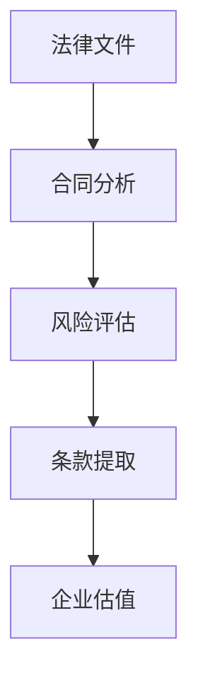
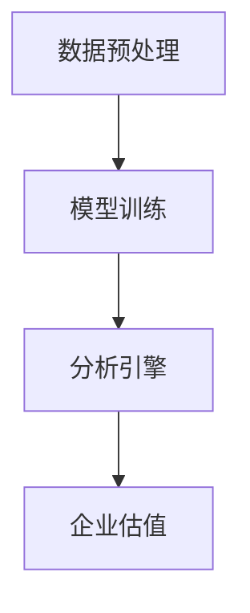

                 


# 企业估值中的AI驱动的法律文件分析平台评估

> 关键词：企业估值，AI，法律文件分析，自然语言处理，机器学习，系统架构

> 摘要：本文探讨了AI技术在企业估值中的应用，特别是在法律文件分析领域。通过详细分析核心概念、算法原理和系统架构，本文展示了如何利用AI技术提升企业估值的效率和准确性。文章还提供了项目实战和最佳实践，帮助读者更好地理解和应用这些技术。

---

## 第一部分：背景介绍

### 第1章：企业估值与法律文件分析的背景

#### 1.1 企业估值的重要性

企业估值是企业管理和投资决策中的关键环节。准确的估值能够帮助企业合理定价、优化资本结构，并为投资者提供可靠的投资依据。传统的估值方法依赖于财务数据和市场分析，但其局限性日益显现，尤其是在处理复杂法律文件时的效率低下。

#### 1.2 法律文件分析的挑战

法律文件分析是企业估值中的重要环节，涉及合同、章程、诉讼记录等文件。传统分析方法依赖人工阅读和理解，耗时且容易出错，特别是在处理大量复杂文件时。此外，法律术语的多样性和文件结构的复杂性进一步增加了分析难度。

#### 1.3 AI驱动的法律文件分析的优势

AI技术，特别是自然语言处理（NLP）和机器学习（ML），能够高效处理大量法律文件，提取关键信息，识别潜在风险。AI的引入显著提升了分析效率和准确性，为企业的估值提供了更可靠的基础。

#### 1.4 法律文件分析的基本概念

法律文件分析包括合同分析、风险评估和条款提取等关键步骤。这些步骤帮助企业识别法律风险，评估财务影响，从而更准确地进行估值。

---

## 第二部分：核心概念与联系

### 第2章：法律文件分析的核心概念

#### 2.1 合同分析

合同分析涉及识别合同条款、评估履行风险。关键步骤包括数据预处理、模型训练和结果分析。合同分析的结果直接影响企业的估值。

#### 2.2 风险评估

风险评估通过识别和量化法律风险，帮助企业在估值中考虑潜在的法律问题。这一步骤需要结合合同分析和市场数据，提供全面的风险评估报告。

#### 2.3 条款提取

条款提取是从法律文件中提取关键条款和条件，例如违约条款、担保条款等。这些条款对企业的财务状况和法律义务有直接影响，是估值的重要依据。

### 2.4 对比表格和ER图

#### 2.4.1 对比表格

| 概念       | 合同分析      | 风险评估      | 条款提取      |
|------------|---------------|---------------|---------------|
| 定义       | 分析合同内容   | 评估法律风险   | 提取关键条款   |
| 输入       | 合同文件       | 法律文件       | 法律文件       |
| 输出       | 合同解读       | 风险报告       | 关键条款列表   |

#### 2.4.2 ER图



---

## 第三部分：算法原理

### 第3章：自然语言处理和机器学习算法原理

#### 3.1 自然语言处理（NLP）技术

NLP用于处理和分析法律文件中的文本数据。常用技术包括分词、实体识别和情感分析。例如，使用BERT模型进行合同条款识别。

#### 3.2 机器学习（ML）算法

ML用于分类、回归和聚类任务。监督学习用于合同条款分类，无监督学习用于识别潜在风险模式。例如，使用随机森林进行风险评估。

#### 3.3 算法原理

- **分词**：将文本分割成单词或短语。
- **实体识别**：识别文本中的命名实体，如人名、组织名。
- **监督学习**：基于标注数据训练模型，进行分类任务。

#### 3.4 数学公式

- **词嵌入**：使用Word2Vec生成词向量：
  $$ Word2Vec: w_i = \text{embed}(word_i) $$
- **注意力机制**：计算每个词的重要性：
  $$ \alpha_i = \frac{\exp(e_i)}{\sum_{j=1}^n \exp(e_j)} $$

---

## 第四部分：系统分析与架构设计

### 第4章：法律文件分析平台的系统架构

#### 4.1 系统架构设计

法律文件分析平台的架构包括数据预处理、模型训练和分析引擎。使用分层架构，确保各模块协同工作。

#### 4.2 系统功能设计

- **数据预处理**：清洗和标注数据。
- **模型训练**：训练NLP和ML模型。
- **分析引擎**：执行合同分析、风险评估和条款提取。

#### 4.3 系统架构图



---

## 第五部分：项目实战

### 第5章：法律文件分析平台的实现

#### 5.1 环境安装

安装Python、TensorFlow和NLTK库，配置开发环境。

#### 5.2 核心代码实现

- 数据预处理代码：
  ```python
  def preprocess_data(data):
      # 分词和实体识别
      tokens = word_tokenize(data)
      entities = entityRecognizer(tokens)
      return entities
  ```
- 模型训练代码：
  ```python
  model = build_model()
  model.fit(train_data, train_labels)
  ```

#### 5.3 案例分析

分析一个典型合同，提取关键条款，评估风险，并生成报告。

#### 5.4 项目小结

项目实现了AI驱动的法律文件分析平台，验证了其在企业估值中的有效性。

---

## 第六部分：总结与展望

### 第6章：总结与最佳实践

#### 6.1 总结

本文详细探讨了AI技术在企业估值中的应用，展示了如何利用法律文件分析提升估值效率和准确性。

#### 6.2 最佳实践

- 数据质量：确保训练数据的多样性和代表性。
- 模型优化：持续优化算法，提升分析精度。
- 安全合规：确保数据安全和隐私保护。

#### 6.3 小结

AI驱动的法律文件分析平台是企业估值的重要工具，未来将更加智能化和自动化。

---

## 作者

作者：AI天才研究院/AI Genius Institute & 禅与计算机程序设计艺术 /Zen And The Art of Computer Programming

---

通过以上结构，文章系统地介绍了AI驱动的法律文件分析平台在企业估值中的应用，从背景到实现，为读者提供了全面的知识和实践指导。

