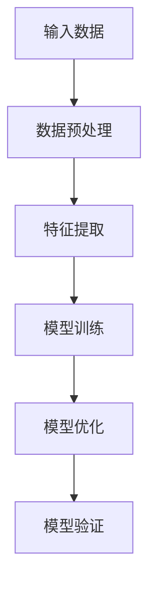

                 


# 企业估值中的AI驱动的网络安全平台评估

## 关键词：企业估值，人工智能，网络安全，平台评估，风险管理

## 摘要：  
在数字化转型的背景下，网络安全已成为企业估值的重要组成部分。本文探讨了如何利用AI技术驱动网络安全平台的评估，分析了企业估值与网络安全的关系，详细介绍了AI在网络安全评估中的应用，构建了基于AI的网络安全评估模型，并结合实际案例展示了如何将AI技术应用于企业估值中的网络安全评估。

---

## 第一部分: 企业估值与网络安全平台评估基础

### 第1章: 企业估值与网络安全平台概述

#### 1.1 企业估值的基本概念
##### 1.1.1 企业估值的定义与意义  
企业估值是指对企业的整体价值进行评估的过程，通常包括财务表现、市场地位、发展潜力等多个维度。在数字化时代，网络安全已成为影响企业价值的重要因素。  

##### 1.1.2 企业估值的核心指标  
- **财务指标**：如净利润、营业收入、资产负债率等。  
- **市场指标**：如市盈率、市净率等。  
- **创新指标**：如研发投入、专利数量等。  

##### 1.1.3 网络安全在企业估值中的重要性  
网络安全直接影响企业的运营稳定性、数据资产价值和客户信任度，进而影响企业估值。  

#### 1.2 网络安全平台的基本概念
##### 1.2.1 网络安全平台的定义与功能  
网络安全平台是一种通过技术手段保护企业网络系统免受威胁的工具集合，包括防火墙、入侵检测系统、数据加密等。  

##### 1.2.2 网络安全平台的分类  
- **按功能分类**：如防火墙、入侵检测系统、漏洞扫描系统等。  
- **按部署方式分类**：如本地部署、云部署等。  
- **按应用场景分类**：如企业网络、工业控制系统等。  

##### 1.2.3 网络安全平台在企业中的应用  
网络安全平台广泛应用于企业内部网络保护、数据传输加密、用户身份认证等领域。  

### 第2章: AI驱动的网络安全评估方法

#### 2.1 AI在网络安全中的应用
##### 2.1.1 机器学习在网络安全中的应用  
- **异常检测**：通过监督学习或无监督学习识别网络异常流量。  
- **威胁分类**：利用分类算法对威胁进行分类，如垃圾邮件分类。  

##### 2.1.2 深度学习在网络安全中的应用  
- **模式识别**：如利用卷积神经网络（CNN）识别恶意软件。  
- **序列分析**：如利用循环神经网络（RNN）分析网络流量序列。  

##### 2.1.3 自然语言处理在网络安全中的应用  
- **威胁情报分析**：通过NLP技术分析安全报告和漏洞公告。  
- **恶意代码分析**：通过NLP技术识别恶意代码的特征。  

#### 2.2 网络安全评估的核心算法
##### 2.2.1 常见的网络安全评估算法  
- **K-近邻算法（KNN）**：用于分类问题，如恶意软件分类。  
- **支持向量机（SVM）**：用于分类和回归问题，如网络流量分类。  
- **随机森林（Random Forest）**：用于分类和回归问题，如异常检测。  

##### 2.2.2 AI驱动的网络安全评估算法  
- **基于深度学习的威胁检测**：如使用CNN检测网络异常流量。  
- **基于强化学习的威胁响应**：如使用强化学习优化安全策略。  

##### 2.2.3 算法优缺点对比  
| 算法类型       | 优点                          | 缺点                          |
|----------------|-------------------------------|-------------------------------|
| 机器学习       | 简单易用，适合中小规模数据    | 对大规模数据处理能力有限      |
| 深度学习       | 处理能力强，适合复杂场景      | 计算资源消耗大                |
| 自然语言处理   | 能够处理非结构化数据          | 对数据质量要求较高            |

---

## 第二部分: AI驱动的网络安全评估模型

### 第3章: 数据预处理与特征提取

#### 3.1 数据预处理方法
##### 3.1.1 数据清洗  
- **去除重复数据**：删除重复的网络流量记录。  
- **处理缺失值**：填充或删除缺失的特征值。  

##### 3.1.2 数据标准化  
- **归一化**：将数据缩放到[0,1]区间，便于模型训练。  
- **标准化**：如将数据转换为均值为0，标准差为1的分布。  

##### 3.1.3 数据增强  
- **生成对抗网络（GAN）**：用于生成更多样化的数据样本。  

#### 3.2 特征提取技术
##### 3.2.1 基于统计的特征提取  
- **频率分析**：统计网络流量中各端点的通信频率。  
- **统计指标**：如平均值、方差等。  

##### 3.2.2 基于模型的特征提取  
- **主成分分析（PCA）**：降低数据维度，提取主要特征。  
- **自动编码器（Autoencoder）**：用于无监督特征学习。  

##### 3.2.3 网络安全特征的提取与分析  
- **网络流量特征**：如包大小、传输时间等。  
- **用户行为特征**：如登录频率、访问模式等。  

### 第4章: 网络安全评估模型构建

#### 4.1 模型训练与优化
##### 4.1.1 神经网络模型训练  
- **前向传播**：输入数据经过网络层，计算输出结果。  
- **反向传播**：计算损失函数，更新网络参数。  

##### 4.1.2 模型调优与优化  
- **超参数调整**：如学习率、批次大小等。  
- **正则化技术**：如L1/L2正则化，防止过拟合。  

##### 4.1.3 模型评估与验证  
- **训练集评估**：验证模型在训练数据上的表现。  
- **验证集评估**：评估模型的泛化能力。  
- **测试集评估**：最终验证模型的性能。  

#### 4.2 基于AI的网络安全评估模型
##### 4.2.1 模型结构设计  
- **输入层**：接收网络流量数据。  
- **隐藏层**：多个全连接层，提取特征。  
- **输出层**：分类结果，如正常流量或异常流量。  

##### 4.2.2 模型训练流程  


##### 4.2.3 模型评估指标  
| 指标名称       | 定义                          | 计算公式                          |
|----------------|-------------------------------|-----------------------------------|
| 准确率         | 正确分类的样本数占总样本数的比例 | (TP + TN) / (TP + FP + FN + TN) |
| 召回率         | 正确分类的正样本数占实际正样本数的比例 | TP / (TP + FN)                 |
| F1分数         | 准确率和召回率的调和平均数      | 2*(P*R)/(P+R)                   |

---

## 第三部分: 企业估值中的AI驱动网络安全平台评估

### 第5章: 企业网络安全风险评估

#### 5.1 企业网络安全风险的识别
##### 5.1.1 网络安全风险的分类  
- **外部威胁**：如黑客攻击、病毒传播。  
- **内部威胁**：如员工误操作、数据泄露。  

##### 5.1.2 风险识别方法  
- **威胁建模**：识别可能的威胁来源和影响。  
- **风险评估矩阵**：根据威胁发生的概率和影响程度评估风险等级。  

##### 5.1.3 风险评估指标  
| 指标名称       | 定义                          | 示例值范围                        |
|----------------|-------------------------------|-----------------------------------|
| 威胁概率       | 威胁发生的可能性              | 低、中、高                       |
| 威胁影响       | 威胁对企业的影响程度          | 低、中、高                       |

#### 5.2 基于AI的风险评估模型
##### 5.2.1 风险评估模型的设计  
- **输入层**：企业网络数据。  
- **隐藏层**：提取网络安全特征。  
- **输出层**：风险等级（低、中、高）。  

##### 5.2.2 模型实现与应用  
```python
import numpy as np
from sklearn.neural_network import MLPClassifier

# 假设X为输入特征，y为标签（0为低风险，1为高风险）
model = MLPClassifier(hidden_layer_sizes=(100, 50), max_iter=1000)
model.fit(X, y)
```

##### 5.2.3 模型结果分析  
- **风险等级分布**：统计不同风险等级的企业数量。  
- **风险因素分析**：识别影响风险等级的主要因素。  

### 第6章: 企业估值与网络安全评估的结合

#### 6.1 企业估值中的网络安全价值
##### 6.1.1 网络安全对企业估值的影响  
- **数据资产价值**：数据是企业的核心资产，网络安全直接影响数据的可用性和保密性。  
- **运营成本**：网络安全投入影响企业的运营成本和利润。  

##### 6.1.2 网络安全对企业声誉的影响  
- **客户信任度**：网络安全事件可能损害企业声誉，影响客户信任。  
- **品牌价值**：良好的网络安全管理可以提升品牌价值。  

#### 6.2 基于AI的网络安全评估对企业估值的提升
##### 6.2.1 提高评估准确性  
AI驱动的网络安全评估能够更准确地识别和量化风险，从而提高企业估值的准确性。  

##### 6.2.2 优化资源配置  
通过AI技术，企业可以更高效地分配安全资源，降低安全成本，提升整体估值。  

##### 6.2.3 支持战略决策  
AI驱动的网络安全评估为企业制定安全策略和投资决策提供数据支持，助力企业实现长期价值增长。  

---

## 第四部分: 项目实战与总结

### 第7章: 项目实战

#### 7.1 环境安装
##### 7.1.1 安装Python和相关库  
- Python 3.8及以上版本。  
- 安装库：`numpy`, `pandas`, `scikit-learn`, `tensorflow`。  

#### 7.2 系统核心实现源代码
##### 7.2.1 数据预处理代码  
```python
import pandas as pd
from sklearn.preprocessing import StandardScaler

# 加载数据
data = pd.read_csv('network_traffic.csv')

# 删除重复数据
data.drop_duplicates(inplace=True)

# 处理缺失值
data.dropna(inplace=True)

# 标准化处理
scaler = StandardScaler()
data_scaled = scaler.fit_transform(data)
```

##### 7.2.2 模型训练代码  
```python
from sklearn.neural_network import MLPClassifier

# 数据分割
X_train, X_test, y_train, y_test = train_test_split(data_scaled, labels, test_size=0.2)

# 模型训练
model = MLPClassifier(hidden_layer_sizes=(100, 50), max_iter=1000)
model.fit(X_train, y_train)

# 模型评估
print(f"准确率：{model.score(X_test, y_test)}")
```

#### 7.3 实际案例分析
##### 7.3.1 案例背景  
假设某企业面临多次网络攻击，希望通过AI驱动的网络安全平台评估优化安全策略。  

##### 7.3.2 案例分析  
- **数据收集**：收集过去一年的网络流量数据。  
- **模型训练**：训练一个基于深度学习的威胁检测模型。  
- **结果分析**：识别出高频异常流量，定位潜在的攻击源。  

##### 7.3.3 案例总结  
通过AI驱动的网络安全评估，企业成功降低了网络攻击风险，提升了数据安全性，进而提高了企业估值。  

---

## 结论

AI驱动的网络安全平台评估是企业估值中的重要组成部分。通过AI技术，企业可以更高效地识别和量化网络安全风险，优化资源配置，提升整体估值。未来，随着AI技术的不断发展，网络安全评估将更加智能化和精准化，为企业创造更大的价值。

---

## 作者：AI天才研究院/AI Genius Institute & 禅与计算机程序设计艺术 /Zen And The Art of Computer Programming

