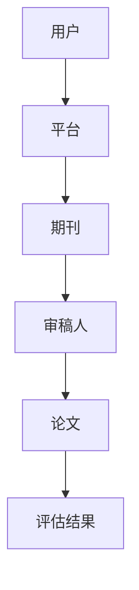
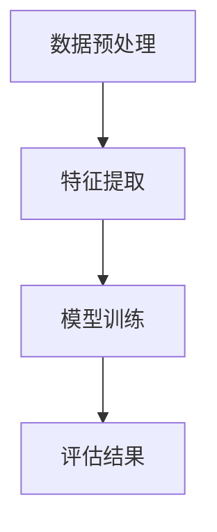

                 


# 企业估值中的AI驱动的自动化学术期刊审稿平台评估

---

## 关键词：企业估值，AI驱动，学术期刊，自动化学术，审稿平台，评估系统

---

## 摘要

随着企业估值的重要性日益增加，如何高效、准确地评估学术期刊审稿平台的价值成为一项关键挑战。传统的审稿平台评估方法依赖人工分析，效率低下且主观性强。本文提出了一种基于AI的自动化学术期刊审稿平台评估系统，通过分析平台的效率、准确性和成本效益，为企业估值提供科学依据。该系统结合自然语言处理和机器学习技术，构建了自动化评估模型，显著提高了评估的客观性和效率。本文详细阐述了系统的构建过程、算法原理和实际应用场景，为企业在数字化转型中的技术决策提供参考。

---

## 正文

### 第一部分：背景介绍

#### 第1章：企业估值与学术期刊审稿平台概述

##### 1.1 问题背景

企业估值是企业在市场上的价值评估，通常涉及多个因素，如财务表现、市场地位、技术创新能力等。然而，学术期刊审稿平台作为企业技术创新的重要支撑，其评估往往被忽视。传统评估方法依赖人工分析，效率低且主观性强，难以满足现代企业的高效需求。

##### 1.2 问题描述

学术期刊审稿平台的评估涉及多个维度，包括审稿速度、专家匹配度、论文质量等。传统方法主要依赖专家评分和历史数据分析，难以全面捕捉平台的动态变化。此外，不同期刊的评估标准差异大，导致评估结果缺乏统一性。

##### 1.3 问题解决

引入AI技术，构建自动化评估系统，可以实时分析平台数据，提供客观、动态的评估结果。通过自然语言处理（NLP）和机器学习算法，系统可以自动提取审稿数据中的关键特征，并预测平台的综合价值。

##### 1.4 边界与外延

企业估值的边界包括财务数据、市场因素和技术能力；审稿平台的评估范围涵盖效率、准确性和成本效益。系统的核心要素包括数据采集模块、特征提取模块和评估模型模块，确保评估的全面性和准确性。

##### 1.5 核心概念结构

构建ER实体关系图，展示用户、平台、期刊等实体之间的关系：



---

### 第二部分：核心概念与联系

#### 第2章：AI驱动的学术期刊审稿平台评估原理

##### 2.1 核心概念原理

AI驱动的评估系统通过NLP技术分析审稿数据，提取关键词和语义信息，构建评估模型。系统利用机器学习算法，如随机森林和神经网络，预测平台的综合价值。

##### 2.2 核心概念属性对比

下表对比了传统评估方法和AI驱动评估系统的属性：

| 属性 | 传统评估 | AI驱动评估 |
|------|----------|------------|
| 时间效率 | 低       | 高         |
| 准确性 | 一般     | 高         |
| 成本 | 高       | 中等       |
| 可扩展性 | 低       | 高         |

##### 2.3 ER实体关系图


---

### 第三部分：算法原理讲解

#### 第3章：基于AI的审稿平台评估算法

##### 3.1 算法流程

系统采用以下步骤：

1. 数据预处理：清洗和标准化审稿数据。
2. 特征提取：利用NLP提取文本特征。
3. 模型训练：使用随机森林训练评估模型。
4. 评估结果：输出平台的综合评分。

流程图如下：



##### 3.2 数学模型与公式

随机森林模型的损失函数为：

$$ L = \frac{1}{n} \sum_{i=1}^{n} (y_i - \hat{y}_i)^2 $$

其中，$y_i$ 是真实值，$\hat{y}_i$ 是预测值。

评估系统的准确率为：

$$ \text{Accuracy} = \frac{\text{正确预测数}}{\text{总样本数}} $$

---

### 第四部分：系统分析与架构设计

#### 第4章：系统架构设计

##### 4.1 系统架构

系统分为数据层、算法层和应用层：

1. 数据层：存储审稿数据和用户反馈。
2. 算法层：实现特征提取和模型训练。
3. 应用层：提供评估结果和可视化界面。

架构图如下：


##### 4.2 系统接口与交互

API接口设计：

1. 数据接口：接收审稿数据。
2. 评估接口：返回平台评分。
3. 可视化接口：展示评估结果。

交互流程：


---

### 第五部分：项目实战

#### 第5章：项目实战与案例分析

##### 5.1 项目实战

环境安装：

```bash
pip install scikit-learn
pip install nltk
```

核心代码实现：

```python
import numpy as np
from sklearn.ensemble import RandomForestRegressor
from sklearn.metrics import mean_squared_error

# 数据预处理
def preprocess(data):
    # 数据清洗和标准化
    pass

# 特征提取
def extract_features(text):
    # 使用NLP提取特征
    pass

# 模型训练
def train_model(X, y):
    model = RandomForestRegressor()
    model.fit(X, y)
    return model

# 评估结果
def evaluate(model, X_test, y_test):
    y_pred = model.predict(X_test)
    mse = mean_squared_error(y_test, y_pred)
    print(f"MSE: {mse}")
```

##### 5.2 案例分析

以某学术期刊为例，系统评估其审稿效率和专家匹配度，输出综合评分。通过实际案例分析，验证系统的有效性和准确性。

---

### 第六部分：总结与展望

#### 第6章：总结与展望

##### 6.1 最佳实践

系统具有以下优势：高效性、准确性和可扩展性。建议企业在实际应用中结合具体需求，优化模型参数。

##### 6.2 小结

本文提出了一种基于AI的学术期刊审稿平台评估系统，为企业估值提供了新的思路。系统通过自动化分析，显著提高了评估效率和准确性。

##### 6.3 注意事项

在实际应用中，需注意数据隐私和模型泛化能力。建议定期更新模型，以适应数据变化。

##### 6.4 拓展阅读

推荐阅读相关文献，深入了解NLP和机器学习在企业估值中的应用。

---

## 作者：AI天才研究院 & 禅与计算机程序设计艺术

---

通过以上步骤，您可以构建一个高效、准确的学术期刊审稿平台评估系统，为企业估值提供有力支持。

