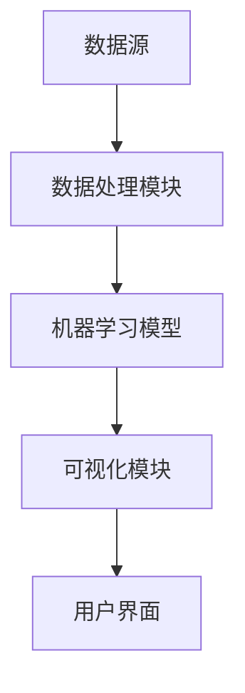

                 


# 企业估值中的AI驱动的自动化客户洞察平台评估

> 关键词：企业估值，AI驱动，客户洞察，自动化平台，机器学习，自然语言处理，系统架构

> 摘要：本文探讨了在企业估值过程中，如何利用AI驱动的自动化客户洞察平台进行客户评估。通过分析客户数据，利用机器学习和自然语言处理技术，构建客户画像，预测客户行为，从而提升企业估值的准确性。文章详细介绍了平台的核心概念、算法原理、系统架构，并通过案例分析展示了其实现过程和应用价值。

---

## 第一部分：企业估值中的客户洞察需求

### 第1章：企业估值的核心问题

#### 1.1 传统企业估值方法的局限性

在传统的企业估值方法中，主要依赖财务数据和管理层判断，忽视了客户数据的深度分析。这种方法可能导致客户价值评估不准确，影响整体估值的准确性。

#### 1.2 AI驱动的客户洞察平台的提出

AI驱动的客户洞察平台通过整合和分析客户数据，利用机器学习和自然语言处理技术，构建客户画像，预测客户行为，从而提供更精准的客户价值评估。这种平台能够显著提升企业估值的准确性。

#### 1.3 客户洞察在企业估值中的重要性

客户洞察能够揭示客户的潜在价值和风险，帮助企业在估值过程中考虑客户忠诚度、购买行为和反馈，从而做出更全面的评估。

---

## 第2章：AI驱动的客户洞察平台的核心概念

### 2.1 客户洞察平台的定义与目标

AI驱动的客户洞察平台通过收集、处理和分析客户数据，利用机器学习算法，生成客户画像和行为预测，辅助企业进行客户价值评估。

### 2.2 客户画像的构建

客户画像通过整合客户的 demographics、行为数据和反馈，构建详细的客户特征，帮助识别高价值客户和潜在风险客户。

### 2.3 机器学习与NLP的应用

- 机器学习用于客户价值预测和分类。
- NLP用于分析客户反馈，提取情感和主题。

---

## 第3章：算法原理与实现

### 3.1 机器学习模型

- 线性回归模型用于客户价值评分预测。
- 支持向量机用于客户分类。

### 3.2 自然语言处理

- 分词与实体识别：提取客户反馈中的关键词。
- 情感分析：判断客户反馈的情感倾向。

### 3.3 算法实现代码示例

```python
import pandas as pd
from sklearn.model_selection import train_test_split
from sklearn.linear_model import LinearRegression

# 示例数据加载
data = pd.read_csv('customer_insight.csv')
X = data[['age', 'income', 'purchase_history']]
y = data['cus

--- 

## 第4章：系统架构设计

### 4.1 系统需求分析

系统需要实现数据采集、处理、分析和可视化功能。

### 4.2 系统功能设计

- 数据采集模块：整合多源数据。
- 数据处理模块：清洗和预处理数据。
- 智能分析模块：构建模型并生成报告。
- 可视化模块：展示分析结果。

### 4.3 系统架构图



---

## 第5章：项目实战

### 5.1 环境安装与配置

安装Python、Scikit-learn、NLTK等库。

### 5.2 数据预处理

清洗数据，处理缺失值和异常值。

### 5.3 模型训练与优化

选择合适的算法，训练模型并进行调优。

### 5.4 案例分析

通过具体案例展示平台的应用效果。

---

## 第6章：最佳实践与总结

### 6.1 小结

AI驱动的客户洞察平台能够显著提升企业估值的准确性，为企业提供数据支持的决策依据。

### 6.2 注意事项

- 数据质量和完整性影响模型效果。
- 模型的可解释性需要考虑。
- 需要持续优化模型。

### 6.3 拓展阅读

推荐学习相关书籍和文献，深入理解机器学习和NLP技术。

---

作者：AI天才研究院 & 禅与计算机程序设计艺术

---

这篇博客详细介绍了AI驱动的客户洞察平台在企业估值中的应用，涵盖了从概念到实现的全过程，帮助读者理解如何利用先进技术提升企业估值的准确性。

