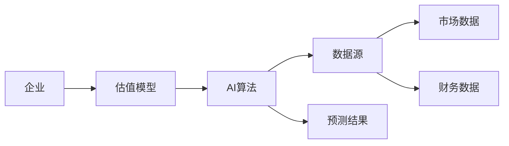
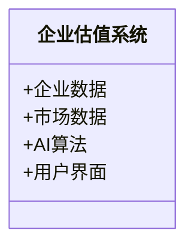
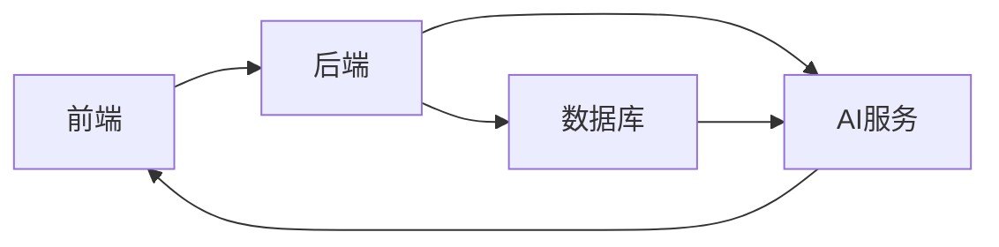

                 


# 企业估值中的AI驱动的自动化投资顾问平台评估

## 关键词：AI驱动、企业估值、投资顾问平台、自动化评估、机器学习、金融数据分析、系统架构

## 摘要：
本文探讨了AI驱动的自动化投资顾问平台在企业估值中的应用，分析了传统估值方法的局限性，并详细介绍了基于机器学习的企业估值模型。文章结合实际案例，展示了如何通过AI技术优化投资决策流程，并提出了系统架构设计和项目实现方案，为读者提供了从理论到实践的全面指导。

---

# 第一部分: 背景介绍

## 第1章: 企业估值与AI驱动投资顾问的背景

### 1.1 企业估值的基本概念
企业估值是通过对企业的财务数据、市场环境和行业趋势进行分析，确定其市场价值的过程。传统方法包括市盈率模型、现金流折现法等，但存在数据依赖性强、主观判断多、计算复杂等问题。

### 1.2 自动化投资顾问的定义与特点
自动化投资顾问通过算法和模型，自动完成投资组合优化、风险评估等任务。其特点包括高效性、可扩展性和个性化服务。

### 1.3 AI在企业估值中的应用背景
AI技术的快速发展使得企业估值更加智能化。机器学习算法能够处理海量数据，发现传统方法难以捕捉的模式，提升估值的准确性和效率。

---

# 第二部分: 核心概念与联系

## 第2章: 企业估值模型与AI的结合

### 2.1 企业估值模型的分类与比较
- **市盈率模型**：基于市盈率与行业平均值的比较。
- **现金流折现模型**：通过现金流折现计算企业价值。
- **WACC模型**：考虑资本成本的加权平均资本成本。

### 2.2 AI在企业估值模型中的应用
- **数据特征提取**：通过机器学习提取关键财务指标和市场数据特征。
- **模型优化**：利用深度学习模型改进估值模型的准确性。

### 2.3 实体关系图（ER图）


---

# 第三部分: 算法原理

## 第3章: 机器学习算法在企业估值中的应用

### 3.1 常见机器学习算法概述
- **线性回归**：用于预测连续变量。
- **随机森林**：通过集成学习提高准确性。
- **神经网络**：适用于复杂非线性关系的建模。

### 3.2 企业估值模型的构建
```python
import pandas as pd
from sklearn.ensemble import RandomForestRegressor
from sklearn.metrics import mean_squared_error

# 数据加载
data = pd.read_csv('enterprise_data.csv')

# 特征工程
features = data[['revenue', 'profit', 'market_cap']]
target = data['valuation']

# 模型训练
model = RandomForestRegressor(n_estimators=100)
model.fit(features, target)

# 模型评估
predicted = model.predict(features)
print(mean_squared_error(target, predicted))
```

### 3.3 算法的数学模型
线性回归模型：
$$ y = \beta_0 + \beta_1x + \epsilon $$

随机森林模型：
$$ y = \sum_{i=1}^{n} \text{Tree}(x) $$

---

# 第四部分: 系统架构设计

## 第4章: 自动化投资顾问平台的系统架构

### 4.1 系统功能设计


### 4.2 系统架构设计


---

# 第五部分: 项目实战

## 第5章: 基于Python的企业估值平台实现

### 5.1 环境安装
```bash
pip install pandas scikit-learn
```

### 5.2 核心代码实现
```python
import pandas as pd
from sklearn.ensemble import RandomForestRegressor

def evaluate_model(data, target):
    features = data.drop(columns=[target])
    model = RandomForestRegressor(n_estimators=100)
    model.fit(features, data[target])
    return model

# 示例数据
data = pd.DataFrame({
    'revenue': [100, 200, 300],
    'profit': [20, 30, 40],
    'valuation': [10, 20, 30]
})

model = evaluate_model(data, 'valuation')
print(model.predict([[250, 35]]))
```

---

# 第六部分: 总结与展望

## 第6章: 项目总结与未来展望

### 6.1 本章小结
本文详细介绍了AI驱动的自动化投资顾问平台在企业估值中的应用，从理论到实践，为读者提供了全面的指导。

### 6.2 未来展望
未来，随着AI技术的不断发展，企业估值将更加智能化和精准化。结合自然语言处理和强化学习，投资顾问平台将具备更强的分析能力和决策能力。

---

作者：AI天才研究院 & 禅与计算机程序设计艺术

