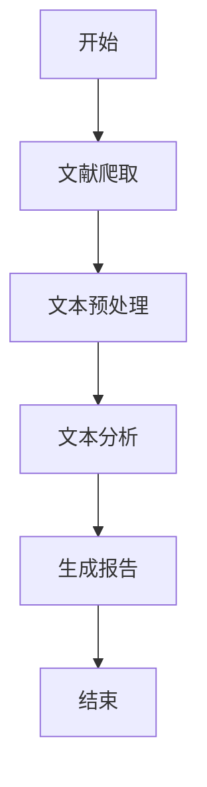

                 


# 企业估值中的AI驱动的自动化科学文献综述平台评估

## 关键词：企业估值、AI驱动、文献综述、自动化科学、文本挖掘

## 摘要：本文探讨了在企业估值过程中，如何利用AI技术构建自动化科学文献综述平台，通过自然语言处理和机器学习技术，提高文献分析效率和准确性，为企业提供更精准的估值支持。

---

## 第一部分：背景介绍

### 第1章：背景介绍

#### 1.1 问题背景
- **1.1.1 传统企业估值方法的局限性**
  - 传统估值方法主要依赖财务数据和市场分析，难以捕捉新兴技术和行业趋势。
- **1.1.2 科技创新对企业估值的影响**
  - 科技创新可以显著影响企业的市场地位和盈利能力，但文献分析需要大量时间和资源。
- **1.1.3 AI技术在企业估值中的潜力**
  - AI技术可以自动化处理文献，提取关键信息，辅助企业估值。

#### 1.2 问题描述
- **1.2.1 文献综述在企业估值中的作用**
  - 文献综述帮助企业了解行业动态和技术趋势，支持更准确的估值。
- **1.2.2 自动化科学文献综述的需求**
  - 手动文献综述效率低，成本高，难以应对大量文献。
- **1.2.3 AI驱动的文献综述平台的必要性**
  - AI技术可以自动化处理文献，提高效率和准确性。

#### 1.3 问题解决
- **1.3.1 AI驱动的文献综述方法**
  - 使用自然语言处理和机器学习技术自动提取文献信息。
- **1.3.2 自动化文献分析的技术实现**
  - 文本挖掘、信息抽取等技术实现自动化分析。
- **1.3.3 平台如何辅助企业估值**
  - 提供实时文献分析，生成报告，辅助估值决策。

#### 1.4 边界与外延
- **1.4.1 平台的功能边界**
  - 专注于文献分析，不涉及直接的财务计算。
- **1.4.2 与现有企业估值工具的区别**
  - 现有工具依赖财务数据，而平台提供技术趋势分析。
- **1.4.3 技术实现的外延范围**
  - 包括文献爬取、预处理、分析和结果展示。

#### 1.5 概念结构与核心要素
- **1.5.1 平台的整体架构**
  - 包括文献数据库、知识抽取模块、文本分析模块和估值计算模块。
- **1.5.2 核心要素的组成**
  - 文献数据库、自然语言处理技术、机器学习算法。
- **1.5.3 各要素之间的关系**
  - 文献数据库提供数据，自然语言处理技术进行分析，机器学习算法生成报告。

---

## 第二部分：核心概念与联系

### 第2章：核心概念与联系

#### 2.1 核心概念原理
- **2.1.1 自然语言处理技术**
  - 用于文本分析和信息提取。
- **2.1.2 机器学习算法**
  - 用于分类和主题建模。
- **2.1.3 文本挖掘与信息抽取**
  - 用于从文献中提取关键信息。

#### 2.2 核心概念属性对比
- 概念属性特征对比表格
| 概念       | 属性       | 特征         |
|------------|------------|--------------|
| 自然语言处理 | 数据处理能力 | 高           |
| 机器学习    | 模型复杂度   | 高           |
| 文本挖掘    | 信息提取效率 | 中           |

#### 2.3 ER实体关系图
```mermaid
erDiagram
    文献数据库 o--< 知识抽取模块
    知识抽取模块 o--< 文本分析模块
    文本分析模块 o--< 估值计算模块
```

---

## 第三部分：算法原理讲解

### 第3章：算法原理讲解

#### 3.1 算法原理
- **3.1.1 文本相似度计算**
  - 使用余弦相似度或BM25算法。
- **3.1.2 文本分类与主题建模**
  - 使用TF-IDF和LDA模型。
- **3.1.3 自动摘要与信息提取**
  - 使用基于规则的摘要和信息抽取技术。

#### 3.2 算法流程图


#### 3.3 数学模型和公式
- **余弦相似度**：$$\text{sim}(a, b) = \frac{\vec{a} \cdot \vec{b}}{|\vec{a}| |\vec{b}|}$$
- **BM25算法**：$$\text{score}(t, d) = \frac{f(t, d)}{f(t, \text{all})} \times \left(1 - \frac{\text{dl}}{\text{avgdl}}\right)$$

#### 3.4 核心代码实现
- **文献爬取**
  ```python
  import requests
  from bs4 import BeautifulSoup
  
  def fetch_papers(url):
      response = requests.get(url)
      soup = BeautifulSoup(response.text, 'html.parser')
      papers = []
      for link in soup.find_all('a', href=True):
          if 'paper' in link.text:
              papers.append(link['href'])
      return papers
  ```

---

## 第四部分：系统分析与架构设计

### 第4章：系统分析与架构设计

#### 4.1 系统分析
- **问题场景介绍**
  - 平台需要处理大量文献，生成实时报告。
- **系统功能设计**
  - 文献爬取模块、文本分析模块、报告生成模块。

#### 4.2 系统架构设计
- **系统架构图**
  ```mermaid
  graph LR
      Client --> API Gateway
      API Gateway -->文献爬取模块
      文献爬取模块 --> 文本分析模块
      文本分析模块 --> 估值计算模块
      估值计算模块 --> 报告生成模块
      报告生成模块 --> Client
  ```

#### 4.3 接口设计
- **API接口**
  - `/fetch_papers`：获取文献链接。
  - `/analyze_text`：分析文献内容。
  - `/generate_report`：生成报告。

---

## 第五部分：项目实战

### 第5章：项目实战

#### 5.1 环境安装
- **Python和相关库**
  - `pip install requests beautifulsoup4 scikit-learn`

#### 5.2 核心代码实现
- **文献分析模块**
  ```python
  from sklearn.feature_extraction.text import TfidfVectorizer
  from sklearn.decomposition import LatentDirichletAllocation
  
  def analyze_text(texts):
      vectorizer = TfidfVectorizer()
      tfidf = vectorizer.fit_transform(texts)
      lda = LatentDirichletAllocation(n_components=5, random_state=42)
      lda.fit(tfidf)
      return lda
  ```

#### 5.3 实际案例分析
- **案例分析**
  - 使用平台分析某科技公司的文献，生成报告，辅助估值。

#### 5.4 项目小结
- **小结**
  - 通过AI技术实现文献综述自动化，提高企业估值效率。

---

## 第六部分：最佳实践

### 第6章：最佳实践

#### 6.1 小结
- **总结**
  - AI驱动的文献综述平台在企业估值中的应用显著提高了效率和准确性。

#### 6.2 注意事项
- **数据隐私**
  - 注意文献数据的隐私保护。
- **模型优化**
  - 定期更新模型，保持准确性。

#### 6.3 未来研究方向
- **多语言支持**
  - 扩展支持多种语言的文献分析。
- **动态更新**
  - 实现实时文献更新和分析。

---

## 作者：AI天才研究院/AI Genius Institute & 禅与计算机程序设计艺术 /Zen And The Art of Computer Programming

---

这篇博客详细介绍了AI驱动的自动化科学文献综述平台在企业估值中的应用，从背景、核心概念、算法原理、系统架构到项目实战，全面解析了技术实现和应用场景。希望对读者在企业估值和AI技术应用方面有所启发。

