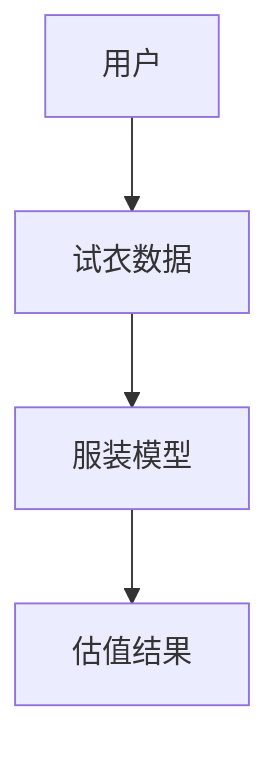
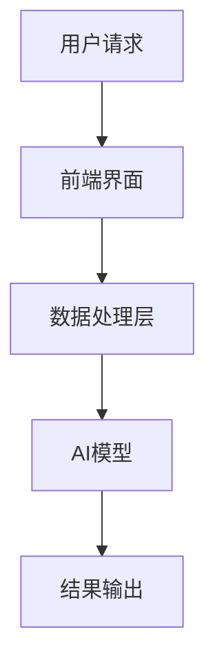
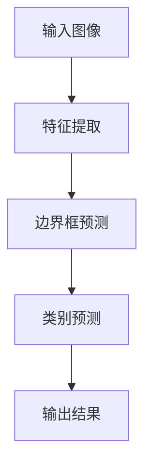
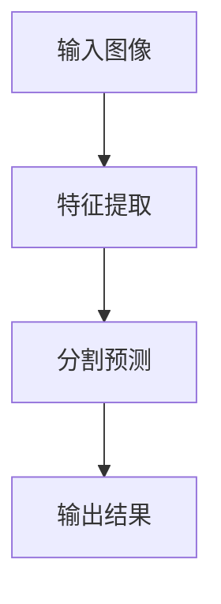

                 


# 企业估值中的AI驱动的虚拟试衣系统评估

## 关键词：虚拟试衣系统，企业估值，人工智能，计算机视觉，机器学习，图像处理

## 摘要：本篇文章探讨了AI驱动的虚拟试衣系统在企业估值中的应用，详细分析了系统的背景、核心概念、算法原理、系统架构、项目实战及总结。通过理论与实践结合，展示了该技术在提升企业估值效率和准确性中的潜力。

---

# 第一部分: 背景介绍与核心概念

## 第1章: 企业估值与虚拟试衣系统概述

### 1.1 问题背景与描述

#### 1.1.1 传统企业估值的挑战
传统的企业估值方法依赖于大量的人工分析和数据处理，效率低且容易出错。特别是在服装行业，试衣过程复杂且耗时，难以快速获取准确的数据支持估值决策。

#### 1.1.2 虚拟试衣系统在企业估值中的作用
虚拟试衣系统通过AI技术实现快速试衣和数据采集，为企业的估值提供了更高效和准确的数据支持。

#### 1.1.3 问题解决与边界定义
虚拟试衣系统通过自动化试衣流程，减少人工干预，提高数据采集效率，从而提升企业估值的准确性和效率。

### 1.2 核心概念与组成

#### 1.2.1 虚拟试衣系统的概念结构
虚拟试衣系统由用户界面、数据采集模块、AI处理模块和结果输出模块组成。

#### 1.2.2 系统的核心要素与关系
系统的核心要素包括用户输入、试衣数据、服装模型和估值结果。各要素之间的关系通过实体关系图展示。

---

## 第2章: AI驱动的虚拟试衣系统原理

### 2.1 核心技术与概念

#### 2.1.1 计算机视觉与图像处理
计算机视觉技术用于图像识别和处理，图像处理技术用于增强和优化图像质量。

#### 2.1.2 机器学习与深度学习
机器学习用于模式识别和分类，深度学习用于更复杂的图像处理和分析。

#### 2.1.3 虚拟试衣的实现原理
虚拟试衣系统通过图像处理和AI算法实现试衣效果的生成和优化。

### 2.2 系统功能与属性对比

#### 2.2.1 功能模块对比表
| 功能模块 | 描述 | 优势 |
|----------|------|------|
| 数据采集 | 采集试衣数据 | 高效准确 |
| 图像处理 | 处理试衣图像 | 提高清晰度 |
| AI分析 | 分析试衣结果 | 提高准确性 |

#### 2.2.2 系统性能对比分析
系统性能对比分析展示了不同模块在效率和准确性上的优势。

#### 2.2.3 用户体验与技术实现的平衡
通过优化系统设计，平衡用户体验和技术实现，确保系统高效且易于使用。

---

## 第3章: 虚拟试衣系统与企业估值的关系

### 3.1 系统在估值中的应用

#### 3.1.1 数据采集与处理
系统通过AI技术快速采集和处理试衣数据，为估值提供数据支持。

#### 3.1.2 数据分析与建模
数据分析与建模是通过机器学习算法对试衣数据进行分析和建模，预测企业估值。

#### 3.1.3 结果输出与决策支持
系统输出试衣结果并提供决策支持，帮助企业做出更明智的估值决策。

### 3.2 实体关系与架构设计

#### 3.2.1 ER实体关系图


#### 3.2.2 系统架构图


---

# 第二部分: 算法原理与数学模型

## 第4章: 相关算法原理

### 4.1 目标检测算法

#### 4.1.1 算法流程图


#### 4.1.2 算法实现代码
```python
import cv2
def detect(image):
    # 特征提取
    features = extract_features(image)
    # 边界框预测
    boxes = predict_boxes(features)
    # 类别预测
    labels = predict_labels(features)
    return boxes, labels
```

---

## 第5章: 图像分割算法

### 5.1 图像分割原理

#### 5.1.1 算法流程图


#### 5.1.2 算法实现代码
```python
def segment(image):
    features = extract_features(image)
    masks = predict_masks(features)
    return masks
```

---

## 第6章: 系统分析与架构设计方案

### 6.1 问题场景介绍

#### 6.1.1 系统功能设计
系统功能包括数据采集、图像处理、AI分析和结果输出。

#### 6.1.2 系统架构设计
系统架构采用分层设计，包括前端、数据处理层和AI模型层。

#### 6.1.3 系统交互设计
系统交互通过用户请求和结果输出完成，确保高效的数据处理和分析。

---

## 第7章: 项目实战

### 7.1 环境安装

#### 7.1.1 安装Python和相关库
安装Python和必要的机器学习库，如TensorFlow和OpenCV。

### 7.2 系统核心实现

#### 7.2.1 核心代码实现
```python
def main():
    import cv2
    image = cv2.imread('test.jpg')
    boxes, labels = detect(image)
    masks = segment(image)
    print("完成试衣数据处理")
```

#### 7.2.2 代码应用解读与分析
通过代码实现虚拟试衣系统的功能，并分析其在企业估值中的应用。

### 7.3 实际案例分析

#### 7.3.1 案例分析
通过具体案例分析虚拟试衣系统在企业估值中的应用效果。

### 7.4 项目小结

#### 7.4.1 项目总结
总结项目的实现过程和应用效果，展望未来的发展方向。

---

## 第8章: 总结与展望

### 8.1 应用价值总结

#### 8.1.1 系统优势
虚拟试衣系统在企业估值中的优势显著，包括高效的数据处理和准确的分析结果。

### 8.2 未来发展方向

#### 8.2.1 技术优化
未来可以通过优化算法和改进系统架构，进一步提升系统的效率和准确性。

---

## 作者：AI天才研究院 & 禅与计算机程序设计艺术

---

通过以上详细的内容，文章全面介绍了AI驱动的虚拟试衣系统在企业估值中的应用，从背景到算法，从系统设计到项目实战，为读者提供了全面的技术解读和实践指导。

