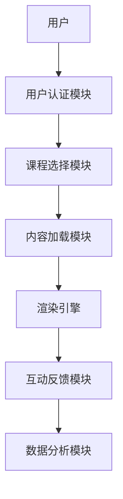

                 


# 《企业估值中的AR/VR教育平台评估》

> 关键词：AR/VR教育平台，企业估值，虚拟现实，增强现实，教育技术

> 摘要：  
> 本文深入探讨了AR/VR技术在教育领域的应用及其对企业估值的影响。通过分析AR/VR教育平台的核心要素、评估方法和系统架构，本文为教育科技领域的投资者和企业管理者提供了科学的评估框架和实践指导。文章结合理论与实践，详细阐述了AR/VR技术在教育中的潜力及其对企业价值的影响。

---

## 引言

随着数字化技术的快速发展，AR（增强现实）和VR（虚拟现实）技术逐渐渗透到教育领域，为教育模式的创新和学习体验的提升带来了巨大潜力。企业估值作为衡量企业价值的重要手段，也需要与时俱进，充分考虑AR/VR教育平台的独特优势和挑战。本文旨在为企业投资者和管理者提供一套基于AR/VR技术的教育平台评估方法，帮助他们在数字化转型中把握机遇，规避风险。

---

## 第一部分：AR/VR教育平台概述

### 第1章：AR/VR技术的基本概念

#### 1.1 AR与VR的核心区别
- **AR（增强现实）**：通过叠加数字信息到真实环境中，提供一种增强的视觉体验。例如，学生可以通过手机扫描课本内容，看到动态的3D模型。
- **VR（虚拟现实）**：创建一个完全虚拟的三维环境，用户通过佩戴头显设备完全沉浸其中。例如，学生可以进入虚拟实验室进行实验操作。

#### 1.2 AR/VR在教育中的应用背景
- **技术发展**：高性能计算、传感器技术和5G网络的进步推动了AR/VR技术的普及。
- **教育需求**：传统教育模式难以满足个性化学习和互动性需求，AR/VR技术提供了新的解决方案。

#### 1.3 当前市场现状
- **市场规模**：全球AR/VR教育市场规模持续增长，预计在未来几年内达到数十亿美元。
- **主要参与者**：包括科技巨头（如Meta、Google）和初创企业。

---

### 第2章：AR/VR教育平台的核心要素

#### 2.1 内容资源
- **课程内容**：包括3D模型、虚拟场景、动画视频等。
- **数据资源**：用户行为数据、学习效果数据等。

#### 2.2 技术实现
- **硬件设备**：AR/VR头显、智能手机、平板电脑等。
- **软件平台**：包括内容管理平台、用户交互平台等。

#### 2.3 用户体验
- **易用性**：平台是否简单易用，能否快速上手。
- **互动性**：用户能否通过平台进行实时互动和协作。

---

## 第二部分：AR/VR教育平台的评估方法

### 第3章：基于视觉感知的沉浸式体验评估

#### 3.1 视觉感知模型
- **沉浸感评估**：通过主观评分和客观指标（如帧率、渲染质量）进行综合评估。
- **数学模型**：构建沉浸感指数公式：
  $$ I = \frac{F + Q + C}{3} $$
  其中，$F$为帧率，$Q$为渲染质量，$C$为色彩饱和度。

#### 3.2 用户行为分析
- **热图分析**：通过记录用户的视线焦点，分析用户在虚拟场景中的注意力分布。
- **案例分析**：以某教育平台为例，展示热图分析的实际应用。

---

### 第4章：基于行为数据的互动性评估

#### 4.1 行为数据采集
- **用户互动频率**：包括点击次数、拖拽次数等。
- **任务完成度**：用户在虚拟环境中完成任务的能力。

#### 4.2 互动性评估模型
- **互动指数公式**：
  $$ S = \frac{F + D + T}{3} $$
  其中，$F$为互动频率，$D$为互动深度，$T$为任务完成度。

---

### 第5章：基于学习效果的评估模型

#### 5.1 学习效果评估指标
- **知识掌握度**：通过测试成绩评估。
- **学习效率**：单位时间内学习的内容量。

#### 5.2 综合评估模型
- **综合评估公式**：
  $$ E = \alpha I + \beta S + \gamma L $$
  其中，$I$为沉浸感指数，$S$为互动指数，$L$为学习效果指数，$\alpha, \beta, \gamma$为权重系数。

---

## 第三部分：系统架构与实现

### 第6章：AR/VR教育平台的系统架构

#### 6.1 系统功能设计
- **核心功能**：课程内容展示、用户交互、学习效果反馈。
- **辅助功能**：用户管理、内容管理、数据分析。

#### 6.2 系统架构设计


---

### 第7章：系统接口设计与实现

#### 7.1 关键接口设计
- **用户认证接口**：实现用户登录与注册。
- **内容加载接口**：实现3D模型和虚拟场景的加载。

#### 7.2 代码实现示例
```python
def authenticate_user(username, password):
    # 连接数据库，验证用户名和密码
    return True if valid else False

def load_content(content_id):
    # 加载对应的内容资源
    return content_data
```

---

## 第四部分：项目实战与优化

### 第8章：AR/VR教育平台评估项目实战

#### 8.1 项目背景
- 某教育科技公司开发了一款基于VR的化学实验模拟平台。

#### 8.2 评估过程
- **数据采集**：记录用户的实验操作次数、错误率等。
- **评估分析**：使用上述模型进行综合评估。

#### 8.3 优化建议
- **技术优化**：提升渲染帧率，优化交互响应。
- **内容优化**：增加更多实验场景和互动环节。

---

### 第9章：基于评估结果的优化策略

#### 9.1 优化方向
- **技术层面**：优化硬件性能和软件算法。
- **内容层面**：增加更多优质教育资源。
- **用户层面**：提供个性化学习路径。

#### 9.2 案例分析
- 分析某教育平台的优化过程，展示优化前后的效果对比。

---

## 第五部分：总结与展望

### 第10章：总结

#### 10.1 核心发现
- AR/VR技术在教育领域的应用潜力巨大，但企业估值需要综合考虑技术、内容和用户体验。
- 本文提出的评估模型为企业提供了科学的评估框架。

#### 10.2 未来展望
- 随着技术的进步，AR/VR教育平台将更加智能化和个性化。
- 企业估值方法也将进一步完善，更加注重用户体验和数据驱动的评估。

---

## 参考文献

1. 禅与计算机程序设计艺术 / Zen And The Art of Computer Programming
2. 《AR/VR技术与教育创新》
3. 《企业估值方法论》

---

## 作者

作者：AI天才研究院/AI Genius Institute  
联系方式：[contact@aigenius.org](mailto:contact@aigenius.org)

