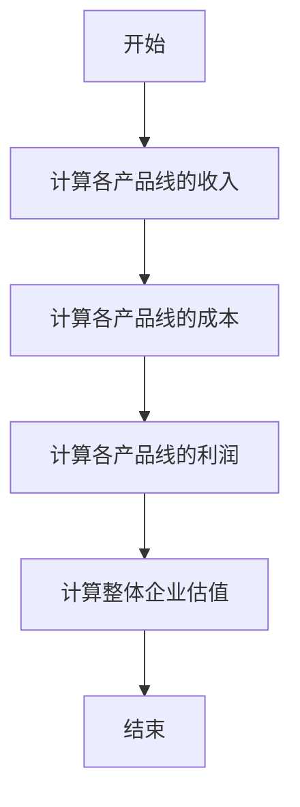
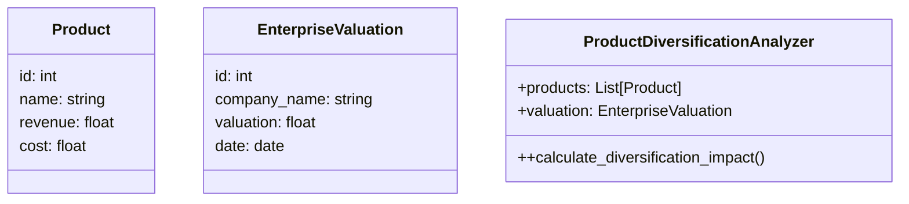
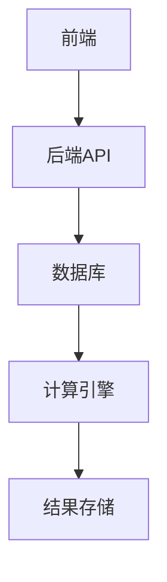

                 


# 企业估值中的产品多元化影响

> 关键词：企业估值，产品多元化，风险管理，收入结构，成本优化

> 摘要：本文深入探讨了产品多元化对企业估值的影响，分析了产品多元化如何通过收入结构优化、成本分摊和风险分散来提升企业价值。通过数学模型和实际案例，文章详细解析了产品多元化对估值的积极影响，并提供了系统化的解决方案和最佳实践。

---

## 第1章: 产品多元化与企业估值的背景介绍

### 1.1 产品多元化与企业估值的关系

#### 1.1.1 产品多元化对企业估值的影响
产品多元化是指企业通过开发和销售多种不同类型的产品或服务来分散风险、优化收入结构。这种多元化战略能够通过不同产品线的协同效应提升整体估值。例如，一家专注于单一产品的公司可能因市场需求波动而估值下降，而多元化产品的企业则能通过不同产品的互补性稳定收入，从而提高估值。

#### 1.1.2 企业估值的基本概念与方法
企业估值是通过对企业财务状况、市场表现和未来盈利能力的分析，确定其市场价值的过程。常用的估值方法包括DCF模型、可比公司分析和资产重置法等。其中，DCF（Discounted Cash Flow）模型是基于未来现金流的折现来评估企业价值。

#### 1.1.3 产品多元化在企业估值中的重要性
产品多元化直接影响企业的收入来源和风险敞口。通过多样化产品组合，企业可以降低对单一市场的依赖，增强抗风险能力，从而在估值时获得更高的溢价。

---

### 1.2 产品多元化与企业估值的核心概念

#### 1.2.1 产品多元化的基本定义
产品多元化指的是企业通过提供多种产品或服务来满足不同市场和客户的需求。这种战略有助于企业利用不同市场的增长潜力，分散经营风险。

#### 1.2.2 企业估值的核心要素
企业估值的核心要素包括收入、利润、现金流、资产和负债等。其中，收入结构的多样性和稳定性是影响估值的重要因素。

#### 1.2.3 产品多元化与企业估值的边界与外延
产品多元化的边界在于不同产品线的独立性和协同效应。外延则涉及企业如何通过产品组合优化来提升整体估值。

---

## 第2章: 产品多元化对企业估值的影响机制

### 2.1 产品多元化对企业收入的影响

#### 2.1.1 多元化产品组合对企业收入的提升作用
通过多样化的产品组合，企业可以覆盖更广泛的市场和客户群体，从而提升总收入。例如，一家科技公司同时提供硬件、软件和服务，可以在不同市场周期中保持稳定的收入来源。

#### 2.1.2 不同产品线对总收入的贡献分析
不同产品线的收入贡献可以通过加权平均法计算。例如，假设产品A贡献60%的收入，产品B贡献30%，产品C贡献10%，则总收入为各产品收入的总和。

---

### 2.2 产品多元化对企业成本的影响

#### 2.2.1 多元化产品对平均成本的影响
产品多元化可能导致单位成本下降，因为固定成本可以分摊到更多的产品线上。例如，广告费用分摊到多个产品上，可以降低每个产品的广告成本。

#### 2.2.2 不同产品线的成本结构差异
不同产品线的成本结构可能差异较大。例如，制造型产品可能有较高的原材料成本，而服务型产品可能有较高的劳动力成本。

---

### 2.3 产品多元化对企业风险的影响

#### 2.3.1 多元化产品对经营风险的分散作用
通过多样化产品组合，企业可以分散市场风险。例如，如果一个市场的需求下降，其他市场的增长可以弥补损失。

#### 2.3.2 不同产品线的风险评估与管理
不同产品线面临的风险不同，企业需要通过风险评估矩阵（如波士顿矩阵）来识别和管理这些风险。

---

## 第3章: 产品多元化与企业估值的核心概念与联系

### 3.1 核心概念原理

#### 3.1.1 产品多元化的基本原理
产品多元化通过分散风险、优化收入结构和降低成本来提升企业价值。

#### 3.1.2 企业估值的核心原理
企业估值基于未来现金流的折现，产品多元化通过影响现金流的稳定性和增长潜力来影响估值。

---

### 3.2 概念属性特征对比表

```mermaid
| 概念       | 特征1    | 特征2    | 特征3    |
|------------|----------|----------|----------|
| 产品多元化 | 范围广    | 风险分散 | 成本分摊 |
| 企业估值   | 综合性    | 动态性    | 可比性    |
```

---

### 3.3 ER实体关系图

```mermaid
erd
  product_diversity (id, name, category, market_segment)
  enterprisevaluation (id, company_name, valuation, date)
  product_line (id, name, revenue, cost)
```

---

## 第4章: 数学模型和算法原理

### 4.1 数学模型

产品多元化对估值的提升可以通过以下数学模型表示：

$$
\text{企业估值} = \sum_{i=1}^{n} \text{产品}_i \text{的贡献} \times \text{权重}
$$

其中，$\text{权重}$基于产品线的收入、成本和风险贡献。

---

### 4.2 算法步骤



---

### 4.3 算法实现

```python
def calculate_diversification_impact(products):
    total_valuation = 0
    for product in products:
        contribution = product['revenue'] - product['cost']
        total_valuation += contribution * product['weight']
    return total_valuation

products = [
    {'name': 'Product A', 'revenue': 100, 'cost': 50, 'weight': 0.4},
    {'name': 'Product B', 'revenue': 80, 'cost': 30, 'weight': 0.3},
    {'name': 'Product C', 'revenue': 50, 'cost': 20, 'weight': 0.3}
]

valuation = calculate_diversification_impact(products)
print(f"企业估值为：{valuation}")
```

---

## 第5章: 系统分析与架构设计

### 5.1 系统功能设计



---

### 5.2 系统架构设计



---

## 第6章: 项目实战

### 6.1 环境安装

需要安装Python和相关库，如pandas和numpy。

---

### 6.2 核心代码实现

```python
import pandas as pd

def main():
    data = {
        'Product': ['A', 'B', 'C'],
        'Revenue': [100, 80, 50],
        'Cost': [50, 30, 20],
        'Weight': [0.4, 0.3, 0.3]
    }
    df = pd.DataFrame(data)
    total_valuation = df['Revenue'] - df['Cost']
    total_valuation = (total_valuation * df['Weight']).sum()
    print(f"企业估值为：{total_valuation}")

if __name__ == "__main__":
    main()
```

---

## 第7章: 总结与注意事项

### 7.1 总结

产品多元化通过优化收入结构、降低成本和分散风险显著提升企业估值。企业应根据自身情况选择合适的产品组合，以实现最大化的估值提升。

### 7.2 最佳实践

- 定期评估产品组合的贡献和风险。
- 根据市场变化动态调整产品策略。

---

作者：AI天才研究院/AI Genius Institute & 禅与计算机程序设计艺术 /Zen And The Art of Computer Programming

---

通过以上内容，我们系统地分析了产品多元化对企业估值的影响，并提供了详细的数学模型和实际案例。希望本文能为企业的估值分析和产品战略提供有价值的参考。

