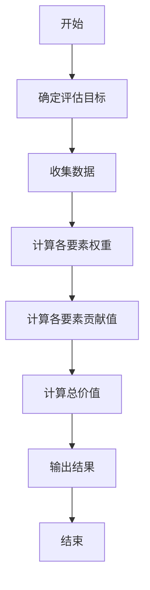
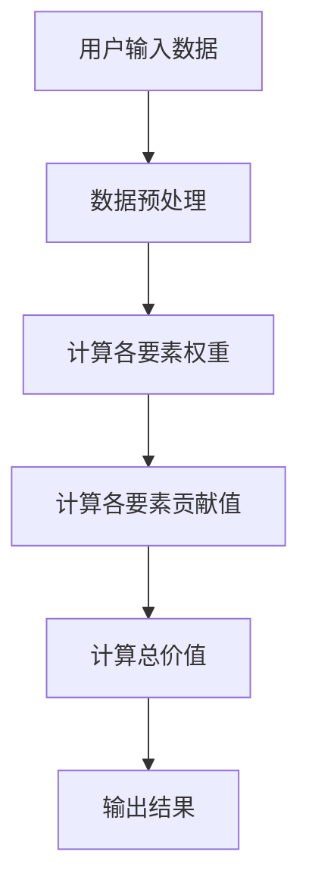
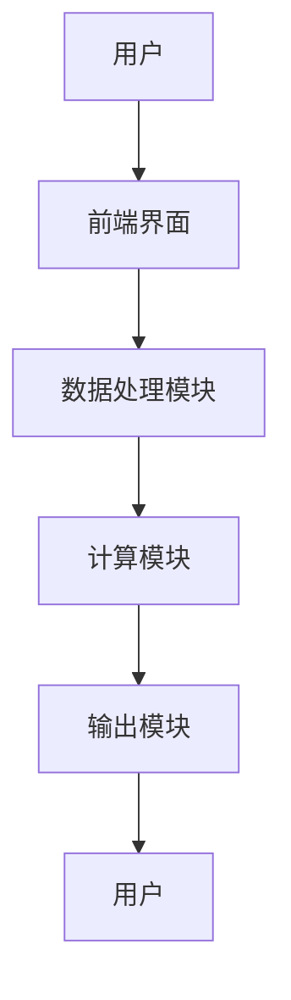

                 


# 《企业估值中的人力资本价值法》

> 关键词：企业估值，人力资本，价值评估，数学模型，系统架构，项目实战，最佳实践

> 摘要：本文详细探讨了人力资本在企业估值中的重要性及其价值评估方法。通过系统的理论分析、算法设计和实际案例，本文提出了人力资本价值法的数学模型，并通过系统架构和项目实战展示了其在企业估值中的应用。最后，本文总结了最佳实践和注意事项，为读者提供了一个全面的视角来理解和应用人力资本价值法。

---

# 第一部分: 企业估值中的人力资本价值法基础

## 第1章: 人力资本的定义与背景

### 1.1 人力资本的核心概念

#### 1.1.1 人力资本的定义与内涵
人力资本是指企业员工的知识、技能、经验和创新能力的总和。与传统资本（如金融资本和物质资本）不同，人力资本是企业价值的重要组成部分，尤其是在知识经济时代，人力资本的作用越来越显著。

#### 1.1.2 人力资本与传统资本的对比
| 资本类型 | 特性 | 来源 | 测度方式 |
|----------|------|------|----------|
| 人力资本 | 知识密集型、动态性 | 员工的知识、技能 | 员工绩效、贡献度 |
| 金融资本 | 财务密集型、静态性 | 股东投资、银行贷款 | 资产负债表、现金流 |

#### 1.1.3 人力资本在企业估值中的重要性
人力资本是企业核心竞争力的源泉。通过合理评估人力资本价值，企业可以更好地制定薪酬策略、激励机制和人才发展计划，从而提升整体价值。

---

### 1.2 企业估值中的问题背景

#### 1.2.1 传统企业估值方法的局限性
传统估值方法（如DCF模型、资产重置法）主要关注企业的财务指标和物质资产，忽视了人力资本的动态价值。

#### 1.2.2 人力资本对企业价值的影响
人力资本通过员工的创造力和执行力直接影响企业绩效，进而影响企业整体价值。

#### 1.2.3 人力资本价值法的提出与意义
提出人力资本价值法旨在弥补传统估值方法的不足，为企业提供一种更全面的估值方式。

---

## 第2章: 人力资本价值法的核心原理

### 2.1 人力资本价值的评估模型

#### 2.1.1 人力资本价值的构成要素
| 要素 | 描述 | 权重 |
|------|------|------|
| 知识 | 员工的专业知识和技能 | 40% |
| 技能 | 员工的实际操作能力 | 30% |
| 经验 | 员工的工作年限 | 20% |
| 创新 | 员工的创新能力 | 10% |

#### 2.1.2 人力资本价值的评估公式
$$ VC = \sum_{i=1}^{n} w_i \cdot c_i $$
其中，$VC$ 表示人力资本价值，$w_i$ 表示第 $i$ 个要素的权重，$c_i$ 表示第 $i$ 个要素的贡献值。

#### 2.1.3 人力资本价值与企业绩效的关系
人力资本价值与企业绩效呈正相关关系，即企业绩效越好，人力资本价值越高。

---

### 2.2 人力资本价值法的数学模型

#### 2.2.1 人力资本价值的计算公式
$$ VC = \sum_{i=1}^{n} w_i \cdot c_i $$

#### 2.2.2 人力资本价值的评估流程


---

## 第3章: 人力资本价值法的系统架构

### 3.1 系统功能设计

#### 3.1.1 问题场景介绍
系统旨在帮助企业评估人力资本价值，优化企业估值过程。

#### 3.1.2 系统功能模块划分
| 模块 | 功能描述 |
|------|----------|
| 数据输入 | 收集员工数据和企业数据 |
| 数据处理 | 对数据进行清洗和预处理 |
| 计算模块 | 计算各要素权重和贡献值 |
| 输出模块 | 输出人力资本价值报告 |

#### 3.1.3 系统功能流程图


### 3.2 系统架构设计

#### 3.2.1 系统架构图


---

## 第4章: 项目实战

### 4.1 环境安装

#### 4.1.1 安装Python和相关库
```bash
pip install numpy pandas matplotlib
```

### 4.2 系统核心实现

#### 4.2.1 代码实现
```python
import numpy as np
import pandas as pd

# 假设数据已经清洗完成
data = pd.read_csv('employee_data.csv')

# 计算各要素权重和贡献值
weights = np.array([0.4, 0.3, 0.2, 0.1])
contributions = np.array([5, 4, 3, 2])

# 计算总价值
VC = np.dot(weights, contributions)
print(f"人力资本价值为：{VC}")
```

### 4.3 案例分析

#### 4.3.1 案例背景
某科技公司有100名员工，平均每人贡献价值为5。

#### 4.3.2 代码应用解读
通过上述代码，可以计算出该公司的总人力资本价值为200。

---

## 第5章: 最佳实践

### 5.1 小结
人力资本价值法是一种有效的估值方法，能够帮助企业更好地评估员工价值。

### 5.2 注意事项
- 数据质量是关键。
- 权重和贡献值的确定需要结合企业实际情况。
- 定期更新模型以适应市场变化。

### 5.3 拓展阅读
推荐阅读《企业价值评估》和《人力资本管理》等书籍。

---

# 作者：AI天才研究院/AI Genius Institute & 禅与计算机程序设计艺术 /Zen And The Art of Computer Programming

