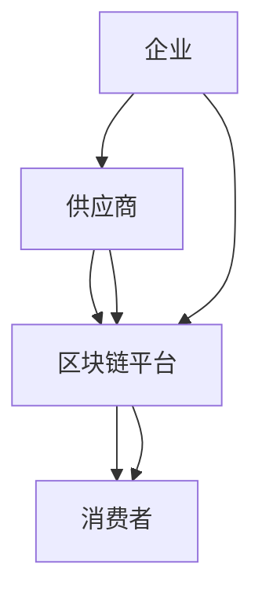
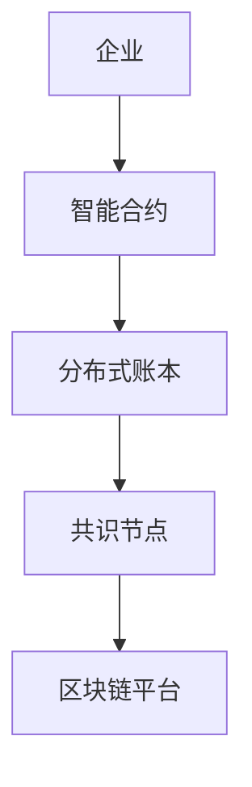
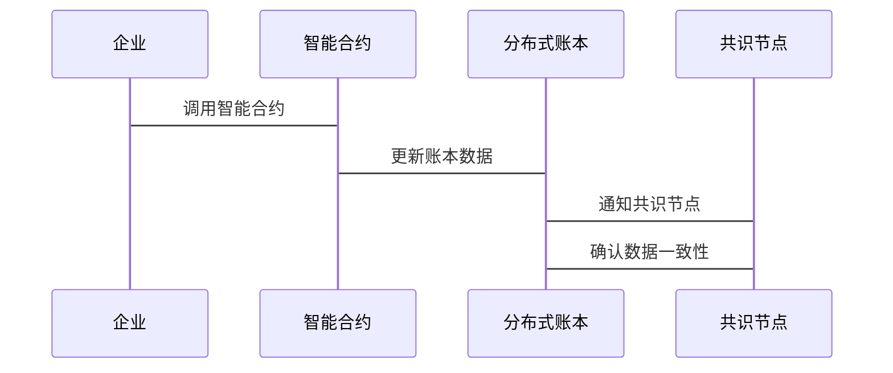

                 


# 企业估值中的区块链供应链金融评估

> 关键词：企业估值，区块链，供应链金融，智能合约，分布式账本，区块链技术，企业价值评估

> 摘要：本文深入探讨了区块链技术如何在供应链金融领域实现创新，进而对企业估值产生积极影响。通过分析区块链技术的核心原理、智能合约的应用、分布式账本的优势，结合实际案例，揭示了区块链供应链金融评估的数学模型和系统架构设计。文章还详细介绍了区块链技术在供应链金融中的实际应用场景，通过对比分析，展示了区块链技术如何有效解决传统供应链金融的痛点，为企业估值提供更准确的依据。

---

# 第一部分: 区块链与供应链金融基础

## 第1章: 区块链与供应链金融概述

### 1.1 区块链技术的基本概念

#### 1.1.1 区块链的定义与特点

区块链是一种去中心化的分布式账本技术，通过密码学和共识算法确保数据的安全性和不可篡改性。其主要特点包括：

1. **去中心化**：没有单一的控制点，数据分布存储在多个节点上。
2. **不可篡改性**：通过加密算法和共识机制确保数据的安全性和真实性。
3. **透明性**：所有交易记录在区块链上公开透明，参与者可以实时查看。
4. **智能合约**：通过预定义的自动化程序执行合同条款，减少人为干预。

#### 1.1.2 区块链的核心技术原理

区块链的核心技术包括：

- **区块结构**：每个区块包含交易数据和一个指向前一区块的哈希指针。
- **共识机制**：如PoW（工作量证明）、PoS（权益证明）和BFT（拜占庭容错）等，确保所有节点达成一致。
- **加密算法**：如SHA-256、椭圆曲线加密等，用于数据加密和验证。

#### 1.1.3 区块链在供应链金融中的应用潜力

区块链技术在供应链金融中的潜力主要体现在以下几个方面：

1. **提高透明度**：通过区块链记录供应链中的每一步交易，确保信息的真实性和透明性。
2. **优化流程**：通过智能合约自动执行合同条款，减少人工操作，提高效率。
3. **降低风险**：通过区块链的去中心化特性，减少因单点故障导致的风险。

### 1.2 供应链金融的基本概念

#### 1.2.1 供应链金融的定义与特点

供应链金融是指通过对供应链上的企业进行融资，支持企业运营和发展的金融模式。其特点包括：

1. **依赖性强**：供应链金融的核心是企业间的协同合作，依赖性强。
2. **风险分散**：通过供应链上的多个企业共同分担风险。
3. **资金流动性**：通过优化资金流动，提高企业的资金使用效率。

#### 1.2.2 供应链金融的主要模式

供应链金融的主要模式包括：

1. **应收账款融资**：基于企业应收账款的融资。
2. **存货融资**：基于企业库存的融资。
3. **订单融资**：基于企业订单的融资。

#### 1.2.3 供应链金融在企业估值中的重要性

供应链金融在企业估值中的重要性主要体现在以下几个方面：

1. **提高企业信用评分**：通过区块链技术实现的供应链金融可以提高企业的信用评分。
2. **优化资金结构**：通过供应链金融优化企业的资金结构，提高企业估值。
3. **增强企业竞争力**：通过供应链金融增强企业的竞争力，提高企业估值。

---

## 第2章: 区块链技术在供应链金融中的应用背景

### 2.1 传统供应链金融的痛点

#### 2.1.1 信息不对称问题

在传统供应链金融中，由于信息不对称，企业之间的信任度较低，导致融资成本高。

#### 2.1.2 交易效率低下

传统供应链金融中的交易流程复杂，涉及多个环节，导致交易效率低下。

#### 2.1.3 资金流动性不足

由于信息不对称和信任问题，企业难以获得足够的资金支持，导致资金流动性不足。

### 2.2 区块链技术如何解决供应链金融问题

#### 2.2.1 提高信息透明度

通过区块链技术记录供应链中的每一步交易，确保信息的透明性和不可篡改性。

#### 2.2.2 优化交易流程

通过智能合约自动执行合同条款，减少人工操作，提高交易效率。

#### 2.2.3 提升资金流动性

通过区块链技术实现的供应链金融可以提高企业的信用评分，从而更容易获得资金支持。

---

## 第3章: 区块链供应链金融的核心概念与联系

### 3.1 核心概念原理

#### 3.1.1 智能合约

智能合约是一种基于区块链的自动执行程序，用于自动履行合同条款。其核心原理是通过区块链的去中心化特性，确保合同条款的自动执行。

#### 3.1.2 分布式账本

分布式账本是区块链的核心数据结构，记录所有的交易数据，并通过共识机制确保数据的一致性和不可篡改性。

#### 3.1.3 节点信任机制

节点信任机制是区块链实现去中心化信任的核心，通过共识算法确保节点之间的信任关系。

### 3.2 核心概念对比表格

以下是区块链供应链金融中的核心概念对比表格：

| 概念         | 特性                         | 区块链实现                          |
|--------------|------------------------------|--------------------------------------|
| 智能合约     | 自动化执行                   | 智能合约自动履行                    |
| 分布式账本   | 去中心化                     | 全网同步账本                        |
| 节点信任机制 | 去信任化                     | 共识机制确保信任                    |

### 3.3 ER实体关系图

以下是区块链供应链金融的ER实体关系图：



---

## 第4章: 区块链供应链金融的算法原理

### 4.1 共识算法

#### 4.1.1 工作量证明（PoW）

工作量证明是一种通过计算哈希值来验证区块的算法，是比特币等区块链系统的核心共识机制。

#### 4.1.2 权益证明（PoS）

权益证明是一种通过持有代币数量来决定验证权力的算法，相对于PoW更节能。

#### 4.1.3 拜占庭容错（BFT）

拜占庭容错是一种通过多数投票机制实现共识的算法，适用于节点较少的区块链系统。

### 4.2 加密算法

#### 4.2.1 SHA-256哈希函数

SHA-256是一种常用的哈希函数，用于生成数据的唯一标识。

#### 4.2.2 椭圆曲线加密

椭圆曲线加密是一种基于椭圆曲线数学的加密算法，用于数字签名和密钥交换。

#### 4.2.3 零知识证明

零知识证明是一种通过数学证明验证数据完整性，而不透露数据具体内容的技术。

### 4.3 智能合约算法

#### 4.3.1 合约编译原理

智能合约需要通过编译器编译成字节码，以便在区块链上执行。

#### 4.3.2 合约执行流程

智能合约的执行流程包括调用、执行、回滚和确认四个阶段。

#### 4.3.3 合约状态管理

智能合约的状态管理包括状态初始化、状态更新和状态查询三个步骤。

---

## 第5章: 区块链供应链金融的数学模型与公式

### 5.1 供应链金融评估指标

企业信用评分模型可以表示为：

$$
信用评分 = \alpha \times 财务数据 + \beta \times 供应链稳定性 + \gamma \times 区块链信任度
$$

其中，$\alpha$、$\beta$和$\gamma$是权重系数，具体值可以根据实际情况调整。

### 5.2 区块链共识机制的数学模型

拜占庭容错（BFT）的数学模型可以表示为：

$$
\text{共识达成} = \text{多数节点同意}
$$

其中，多数节点同意表示通过投票机制达成共识。

---

## 第6章: 区块链供应链金融的系统分析与架构设计方案

### 6.1 系统功能设计

以下是供应链金融系统的功能设计：

1. **数据采集**：采集供应链中的交易数据。
2. **智能合约执行**：通过智能合约自动执行合同条款。
3. **分布式账本管理**：管理区块链上的分布式账本。
4. **共识机制实现**：通过共识机制确保数据一致性。

### 6.2 系统架构设计

以下是供应链金融系统的架构设计：



### 6.3 系统接口设计

系统接口设计包括：

1. **智能合约接口**：用于调用和执行智能合约。
2. **账本查询接口**：用于查询区块链上的交易数据。
3. **共识机制接口**：用于实现共识算法。

### 6.4 系统交互序列图

以下是系统交互的序列图：



---

## 第7章: 区块链供应链金融的项目实战

### 7.1 环境安装

以下是区块链供应链金融系统的环境安装步骤：

1. **安装区块链平台**：选择合适的区块链平台，如以太坊、fabric等。
2. **安装智能合约编译工具**：安装Solidity编译器和以太坊钱包。
3. **安装分布式数据库**：选择合适的分布式数据库，如MongoDB、Redis等。

### 7.2 系统核心实现源代码

以下是智能合约的实现代码：

```solidity
// SPDX-License-Identifier: MIT
pragma solidity ^0.8.0;

contract SupplyChainFinance {
    struct Invoice {
        uint id;
        address supplier;
        address buyer;
        uint amount;
        bool paid;
    }

    event InvoiceCreated(uint id, address supplier, address buyer, uint amount);
    event InvoicePaid(uint id);

    function createInvoice(address _buyer, uint _amount) public {
        Invoice memory inv = Invoice({
            id: _id,
            supplier: msg.sender,
            buyer: _buyer,
            amount: _amount,
            paid: false
        });
        emit InvoiceCreated(inv.id, inv.supplier, inv.buyer, inv.amount);
    }

    function payInvoice(uint _id) public payable {
        Invoice storage inv = invoices[_id];
        require(!inv.paid, "Invoice already paid");
        require(msg.sender == inv.buyer, "Unauthorized payment");
        inv.paid = true;
        emit InvoicePaid(_id);
    }
}
```

### 7.3 代码应用解读与分析

上述代码实现了一个简单的供应链金融智能合约，包括发票的创建和支付功能。通过智能合约自动执行合同条款，确保交易的安全性和透明性。

### 7.4 实际案例分析

假设一家企业A与供应商B达成协议，通过区块链供应链金融系统实现发票的创建和支付。企业A创建发票并发送给供应商B，供应商B支付后，智能合约自动更新发票状态为已支付。

### 7.5 项目小结

通过区块链供应链金融系统，企业可以实现供应链金融的智能化和自动化，提高交易效率和资金流动性，从而提高企业估值。

---

## 第8章: 区块链供应链金融的最佳实践

### 8.1 Tips与技巧

1. **选择合适的区块链平台**：根据具体需求选择适合的区块链平台。
2. **确保智能合约的安全性**：通过代码审计和测试确保智能合约的安全性。
3. **优化系统性能**：通过优化共识算法和分布式架构提高系统性能。

### 8.2 小结

区块链供应链金融评估是企业估值中的重要组成部分，通过区块链技术可以有效解决供应链金融中的痛点，提高企业估值。

### 8.3 注意事项

1. **数据隐私保护**：确保供应链金融中的数据隐私保护。
2. **系统安全性**：通过多节点备份和加密技术确保系统安全性。
3. **法律法规合规**：确保区块链供应链金融系统符合相关法律法规。

### 8.4 拓展阅读

1. **《区块链技术与应用》**：深入探讨区块链技术的应用场景和实现方法。
2. **《供应链金融的创新与实践》**：介绍供应链金融的最新创新和实践案例。

---

# 作者：AI天才研究院/AI Genius Institute & 禅与计算机程序设计艺术 /Zen And The Art of Computer Programming

