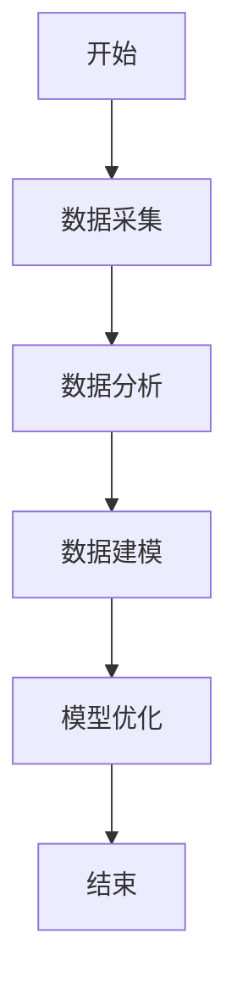
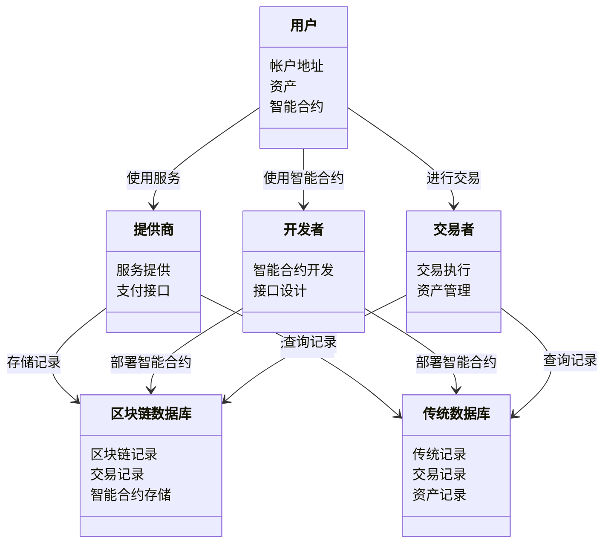
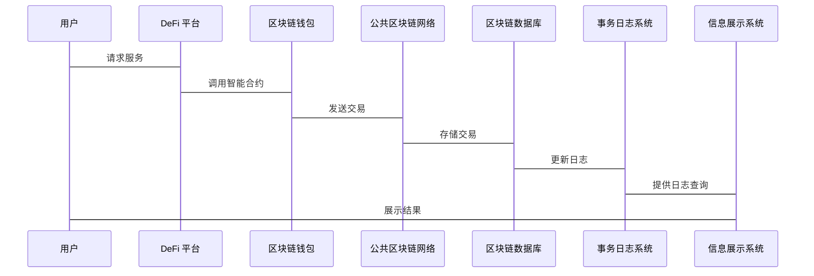

                 


# 企业估值中的区块链去中心化金融平台评估

> **关键词**：企业估值、区块链、DeFi、去中心化金融、金融平台评估  
> **摘要**：本文深入探讨了区块链技术在企业估值中的应用，特别是去中心化金融（DeFi）平台的评估方法。通过分析DeFi平台的核心算法、系统架构和实际案例，本文为企业估值提供了新的视角和实践指导。

---

## 第一部分: 区块链与去中心化金融平台概述

### 第1章: 区块链与DeFi的基本概念

#### 1.1 区块链技术概述
- **1.1.1 区块链的定义与特点**
  - 区块链是一种分布式账本技术，通过去中心化、不可篡改和透明性等特点，实现数据的安全性和可靠性。
  - 区块链的核心特征包括：去中心化、共识机制、数据不可篡改、可追溯性。

- **1.1.2 区块链的核心技术原理**
  - 分布式账本：数据分布在多个节点上，通过共识机制达成一致。
  - 共识机制：如比特币的PoW（工作量证明）和以太坊的PoS（权益证明）。
  - 加密技术：通过哈希函数和数字签名确保数据安全。

- **1.1.3 区块链的分类与应用场景**
  - 公链、联盟链和私链。
  - 应用场景：金融支付、智能合约、供应链管理等。

#### 1.2 去中心化金融（DeFi）概述
- **1.2.1 DeFi的定义与特点**
  - DeFi是基于区块链技术的去中心化金融服务，包括借贷、交易、投资等。
  - DeFi的核心特点：去中心化、透明性、可编程性。

- **1.2.2 DeFi的主要组成部分**
  - 智能合约：自动执行金融协议的脚本。
  - 去中心化交易所：如Uniswap，基于智能合约实现交易。
  - 借贷平台：如Aave和Compound，提供去中心化的借贷服务。

- **1.2.3 DeFi与传统金融的区别**
  - 去中心化：无中间机构，用户直接参与。
  - 透明性：所有交易记录在区块链上，可追溯。
  - 可编程性：通过智能合约实现复杂的金融逻辑。

#### 1.3 区块链与DeFi在企业估值中的应用背景
- **1.3.1 企业估值的传统方法与挑战**
  - 传统估值方法依赖于财务数据和市场分析，存在数据不透明、估值模型简化等问题。
  - 企业估值中的挑战：数据不完整、模型假设的局限性、市场波动的影响。

- **1.3.2 区块链技术对企业估值的影响**
  - 提供实时、透明的交易数据，增强估值数据的准确性。
  - 通过区块链技术实现数据的可追溯性和安全性，降低估值风险。

- **1.3.3 DeFi平台在企业估值中的潜在价值**
  - DeFi平台提供去中心化的金融服务，为企业提供新的融资渠道。
  - DeFi平台的透明性和可编程性为企业的估值模型提供了新的数据源。

---

### 第2章: 企业估值中的区块链去中心化金融平台评估背景

#### 2.1 问题背景
- **2.1.1 企业估值的传统方法及其局限性**
  - 传统估值方法：DCF（现金流折现法）、市盈率、市净率等。
  - 局限性：依赖历史数据，难以捕捉未来变化。

- **2.1.2 区块链技术如何解决传统估值问题**
  - 提供实时、透明的交易数据，增强估值的准确性。
  - 通过区块链技术实现数据的可追溯性和安全性。

- **2.1.3 DeFi平台在企业估值中的独特优势**
  - DeFi平台提供去中心化的金融服务，为企业提供新的融资渠道。
  - DeFi平台的透明性和可编程性为企业的估值模型提供了新的数据源。

#### 2.2 问题描述
- **2.2.1 DeFi平台评估的核心问题**
  - 如何评估DeFi平台的流动性和稳定性。
  - 如何量化DeFi平台的风险和收益。

- **2.2.2 区块链技术在DeFi平台评估中的应用**
  - 通过智能合约实现透明的交易数据。
  - 利用区块链的可追溯性分析DeFi平台的交易历史。

- **2.2.3 企业估值中的DeFi平台评估的边界与外延**
  - 评估的边界：DeFi平台的透明性和安全性。
  - 评估的外延：DeFi平台对企业融资、投资决策的影响。

#### 2.3 问题解决
- **2.3.1 区块链技术如何提升企业估值的准确性**
  - 提供实时、透明的交易数据，增强估值数据的准确性。
  - 通过区块链技术实现数据的可追溯性和安全性，降低估值风险。

- **2.3.2 DeFi平台评估对企业估值的具体贡献**
  - 提供去中心化的金融服务，为企业提供新的融资渠道。
  - 通过DeFi平台的透明性和可编程性，优化企业的估值模型。

- **2.3.3 区块链去中心化金融平台评估的实现路径**
  - 数据采集：收集DeFi平台的交易数据。
  - 数据分析：利用区块链技术分析交易数据。
  - 估值模型：结合传统估值方法和区块链技术，构建新的估值模型。

#### 2.4 核心概念与联系
- **2.4.1 核心概念原理**
  - 区块链技术通过去中心化和不可篡改性，确保数据的透明性和安全性。
  - DeFi平台通过智能合约实现去中心化的金融服务。

- **2.4.2 核心概念属性特征对比表格**
  | 概念    | 属性        | 特征对比       |
  |---------|-------------|---------------|
  | 区块链  | 去中心化     | 分布式账本     |
  |         | 共识机制     | 智能合约       |
  | DeFi    | 去中心化     | 透明性         |
  |         | 可编程性     | 智能合约       |

- **2.4.3 ER实体关系图架构的 Mermaid 流程图**

```mermaid
erDiagram
    actor 用户
    actor 提供商
    actor 开发者
    actor 交易者
    database 区块链数据库
    database 传统数据库
    boundary 区块链钱包
    boundary 传统银行系统
    boundary 企业估值系统
    boundary DeFi 平台
    boundary 公共区块链网络
    boundary 财务报告系统
    boundary 交易记录系统
    boundary 信息展示系统
    boundary 金融监管系统
    boundary 支付系统
    boundary 数据分析系统
    boundary 云计算平台
    boundary 数据可视化系统
    boundary 智能合约系统
    boundary API 接口
    boundary 用户界面
    boundary 智能合约编译器
    boundary 交易确认系统
    boundary 事务日志系统
```



---

## 第3章: 区块链去中心化金融平台评估的核心算法原理

### 3.1 算法原理概述
- **3.1.1 算法的核心思想**
  - 利用区块链技术实现数据的透明性和不可篡改性。
  - 通过智能合约实现去中心化的金融服务。

- **3.1.2 算法的主要步骤**
  1. 数据采集：从DeFi平台收集交易数据。
  2. 数据分析：利用区块链技术分析交易数据。
  3. 数据建模：构建企业估值模型。
  4. 模型优化：通过多次迭代优化模型。

- **3.1.3 算法的数学模型与公式**
  - 企业估值模型：$$ V = \sum_{t=1}^{n} \frac{CF_t}{(1 + r)^t} $$
  - 其中，$CF_t$ 是第 $t$ 年的现金流，$r$ 是折现率。

### 3.2 算法实现
- **3.2.1 算法流程图（Mermaid）**



- **3.2.2 算法的Python源代码实现**

```python
def blockchain_valuation_model(data):
    # 数据预处理
    processed_data = preprocess(data)
    # 数据建模
    model = create_model(processed_data)
    # 模型优化
    optimized_model = optimize_model(model)
    return optimized_model

def preprocess(data):
    # 数据清洗和转换
    return processed_data

def create_model(processed_data):
    # 构建模型
    return model

def optimize_model(model):
    # 优化模型
    return optimized_model
```

- **3.2.3 算法的具体实现细节与优化**
  - 数据预处理：清洗和转换数据，确保数据的准确性和一致性。
  - 数据建模：构建企业估值模型，结合区块链技术和传统估值方法。
  - 模型优化：通过多次迭代优化模型，提高估值的准确性。

### 3.3 算法的数学模型与公式
- **3.3.1 数学模型的建立**
  - 企业估值模型：$$ V = \sum_{t=1}^{n} \frac{CF_t}{(1 + r)^t} $$
  - 其中，$CF_t$ 是第 $t$ 年的现金流，$r$ 是折现率。

- **3.3.2 公式的详细推导**
  - 通过区块链技术实现数据的透明性和不可篡改性，确保现金流数据的准确性。
  - 通过智能合约实现去中心化的金融服务，优化企业的融资渠道。

- **3.3.3 公式的实际应用案例**
  - 某企业通过区块链技术实现数据的透明性，提高了估值的准确性。

---

## 第4章: 区块链去中心化金融平台的系统分析与架构设计

### 4.1 问题场景介绍
- **4.1.1 企业估值的场景**
  - 企业需要通过DeFi平台进行融资和投资。
  - 企业需要通过区块链技术实现数据的透明性和安全性。

### 4.2 系统功能设计
- **4.2.1 领域模型（Mermaid 类图）**



### 4.3 系统架构设计
- **4.3.1 系统架构图（Mermaid 架构图）**


### 4.4 系统接口设计
- **4.4.1 系统接口**
  - 用户与DeFi平台的接口：API接口。
  - DeFi平台与区块链数据库的接口：智能合约接口。
  - 企业估值系统与传统数据库的接口：数据接口。

### 4.5 系统交互设计
- **4.5.1 系统交互流程（Mermaid 序列图）**



---

## 第5章: 区块链去中心化金融平台的项目实战

### 5.1 项目背景与目标
- **5.1.1 项目背景**
  - 某企业需要通过DeFi平台进行融资和投资。
  - 企业需要通过区块链技术实现数据的透明性和安全性。

- **5.1.2 项目目标**
  - 实现DeFi平台的智能合约开发。
  - 构建企业估值模型，评估DeFi平台的流动性和稳定性。

### 5.2 项目实现
- **5.2.1 环境安装**
  - 安装以太坊钱包（如MetaMask）。
  - 安装Solidity编译器。
  - 安装Python开发环境。

- **5.2.2 系统核心实现源代码**
  - 智能合约开发：

```solidity
// SPDX-License-Identifier: MIT
pragma solidity ^0.8.0;

contract DeFiPlatform {
    mapping(address => uint256) public balances;
    function deposit() public payable {
        balances[msg.sender] += msg.value;
    }
    function withdraw(uint256 amount) public {
        require(balances[msg.sender] >= amount, "Insufficient balance");
        balances[msg.sender] -= amount;
        payable(msg.sender).transfer(amount);
    }
}
```

- **5.2.3 代码应用解读与分析**
  - 智能合约实现存款和取款功能。
  - 通过以太坊钱包实现交易的透明性和安全性。

### 5.3 实际案例分析
- **5.3.1 案例背景**
  - 某企业通过DeFi平台进行融资，利用智能合约实现资金的透明分配。

- **5.3.2 案例分析**
  - 通过智能合约实现企业的融资需求。
  - 通过区块链技术实现资金的透明分配。

### 5.4 项目小结
- **5.4.1 项目总结**
  - 成功实现了DeFi平台的智能合约开发。
  - 构建了企业估值模型，评估了DeFi平台的流动性和稳定性。

- **5.4.2 经验与教训**
  - 智能合约开发需要严格测试，避免漏洞。
  - 区块链技术的应用需要考虑性能和安全性。

---

## 第6章: 区块链去中心化金融平台评估的数学模型与公式

### 6.1 数学模型的建立
- **6.1.1 企业估值模型**
  - $$ V = \sum_{t=1}^{n} \frac{CF_t}{(1 + r)^t} $$
  - 其中，$CF_t$ 是第 $t$ 年的现金流，$r$ 是折现率。

### 6.2 数学模型的优化
- **6.2.1 模型优化方法**
  - 通过区块链技术实现数据的透明性和不可篡改性，提高模型的准确性。
  - 通过智能合约实现去中心化的金融服务，优化企业的融资渠道。

### 6.3 数学模型的实际应用
- **6.3.1 案例分析**
  - 某企业通过区块链技术实现数据的透明性，提高了估值的准确性。
  - 通过智能合约实现去中心化的金融服务，优化了企业的融资渠道。

---

## 第7章: 区块链去中心化金融平台的系统分析与架构设计

### 7.1 系统分析
- **7.1.1 系统分析的步骤**
  - 数据预处理：清洗和转换数据，确保数据的准确性和一致性。
  - 数据建模：构建企业估值模型。
  - 模型优化：通过多次迭代优化模型，提高估值的准确性。

### 7.2 系统架构设计
- **7.2.1 系统架构图（Mermaid 架构图）**


### 7.3 系统接口设计
- **7.3.1 系统接口**
  - 用户与DeFi平台的接口：API接口。
  - DeFi平台与区块链数据库的接口：智能合约接口。
  - 企业估值系统与传统数据库的接口：数据接口。

### 7.4 系统交互设计
- **7.4.1 系统交互流程（Mermaid 序列图）**


---

## 第8章: 区块链去中心化金融平台的项目实战

### 8.1 项目背景与目标
- **8.1.1 项目背景**
  - 某企业需要通过DeFi平台进行融资和投资。
  - 企业需要通过区块链技术实现数据的透明性和安全性。

- **8.1.2 项目目标**
  - 实现DeFi平台的智能合约开发。
  - 构建企业估值模型，评估DeFi平台的流动性和稳定性。

### 8.2 项目实现
- **8.2.1 环境安装**
  - 安装以太坊钱包（如MetaMask）。
  - 安装Solidity编译器。
  - 安装Python开发环境。

- **8.2.2 系统核心实现源代码**
  - 智能合约开发：

```solidity
// SPDX-License-Identifier: MIT
pragma solidity ^0.8.0;

contract DeFiPlatform {
    mapping(address => uint256) public balances;
    function deposit() public payable {
        balances[msg.sender] += msg.value;
    }
    function withdraw(uint256 amount) public {
        require(balances[msg.sender] >= amount, "Insufficient balance");
        balances[msg.sender] -= amount;
        payable(msg.sender).transfer(amount);
    }
}
```

- **8.2.3 代码应用解读与分析**
  - 智能合约实现存款和取款功能。
  - 通过以太坊钱包实现交易的透明性和安全性。

### 8.3 实际案例分析
- **8.3.1 案例背景**
  - 某企业通过DeFi平台进行融资，利用智能合约实现资金的透明分配。

- **8.3.2 案例分析**
  - 通过智能合约实现企业的融资需求。
  - 通过区块链技术实现资金的透明分配。

### 8.4 项目小结
- **8.4.1 项目总结**
  - 成功实现了DeFi平台的智能合约开发。
  - 构建了企业估值模型，评估了DeFi平台的流动性和稳定性。

- **8.4.2 经验与教训**
  - 智能合约开发需要严格测试，避免漏洞。
  - 区块链技术的应用需要考虑性能和安全性。

---

## 第9章: 结论与展望

### 9.1 结论
- 区块链技术为企业估值提供了新的视角和实践指导。
- DeFi平台的评估为企业提供了去中心化的金融服务，优化了企业的融资渠道。

### 9.2 展望
- 未来的区块链技术将在企业估值中发挥更大的作用。
- DeFi平台的评估方法将更加智能化和自动化。

---

## 作者：AI天才研究院/AI Genius Institute & 禅与计算机程序设计艺术 /Zen And The Art of Computer Programming

