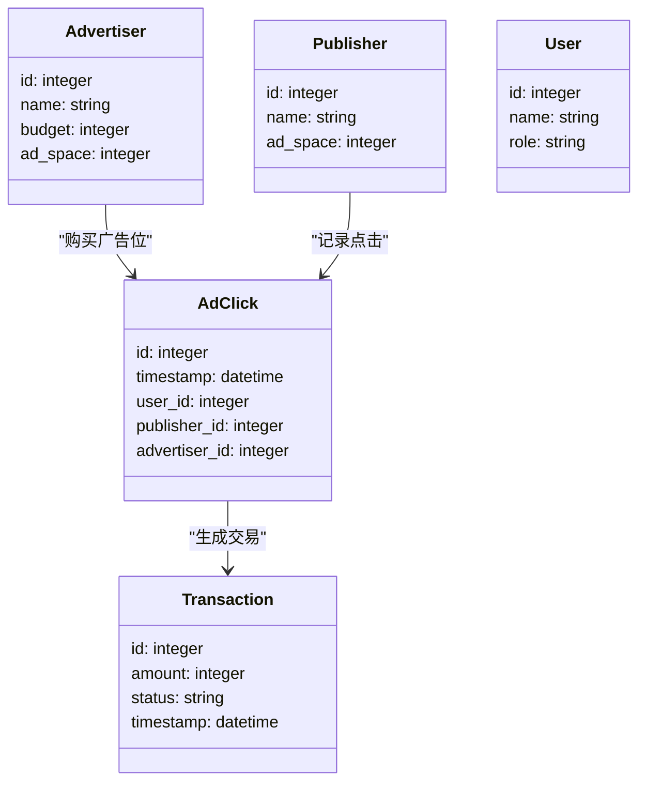
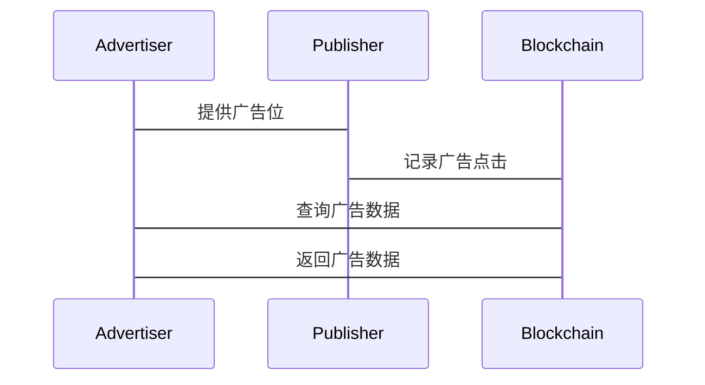

                 


# 《企业估值中的区块链数字广告反欺诈平台评估》

## 关键词：区块链，数字广告，反欺诈，企业估值，智能合约，分布式账本

## 摘要：  
本文深入探讨了在企业估值过程中，如何利用区块链技术构建数字广告反欺诈平台。通过分析区块链的去中心化特性、智能合约的执行机制以及分布式账本的透明性，本文提出了基于区块链的数字广告反欺诈解决方案，并详细阐述了该方案的算法原理、系统架构及实际应用案例。文章还结合实际案例，展示了如何通过区块链技术提升企业估值的准确性和效率。

---

# 第1章: 背景介绍与核心概念

## 1.1 问题背景

### 1.1.1 数字广告行业的现状与挑战  
数字广告行业近年来呈现爆发式增长，但同时也面临诸多挑战，包括广告流量造假、点击劫持、虚假流量等。这些行为不仅浪费企业的广告预算，还严重影响了广告投放的效率和效果，导致企业估值的不确定性增加。  

### 1.1.2 广告反欺诈的必要性  
广告欺诈已成为数字广告行业的公敌，企业需要通过技术手段来识别和防止广告欺诈行为。传统的中心化反欺诈方法存在数据孤岛、信任缺失等问题，难以满足企业对高效、透明的反欺诈解决方案的需求。  

### 1.1.3 区块链技术在广告反欺诈中的应用潜力  
区块链技术的去中心化特性、数据不可篡改性和透明性为广告反欺诈提供了新的解决方案。通过区块链技术，可以实现广告数据的实时记录、验证和追踪，从而有效识别和防止广告欺诈行为。  

## 1.2 核心概念与问题描述

### 1.2.1 数字广告反欺诈的核心问题  
数字广告反欺诈的核心问题是如何准确识别虚假流量、点击劫持、刷单等欺诈行为，并确保广告数据的真实性和完整性。  

### 1.2.2 区块链技术的核心属性  
区块链技术的核心属性包括去中心化、数据不可篡改性、透明性、智能合约执行能力等。这些属性为数字广告反欺诈提供了技术保障。  

### 1.2.3 平台评估的边界与外延  
数字广告反欺诈平台的评估需要涵盖广告数据的真实性、广告投放的效率、广告效果的可验证性等方面。同时，还需要考虑区块链技术的可扩展性、性能优化等问题。  

## 1.3 核心概念与联系

### 1.3.1 区块链在广告反欺诈中的应用原理  
区块链通过分布式账本记录广告数据，确保数据的真实性和完整性。智能合约可以自动执行广告投放和验证逻辑，实现广告反欺诈的自动化。  

### 1.3.2 智能合约与广告数据验证  
智能合约可以用于验证广告数据的真实性，例如验证广告点击是否来自真实的用户。通过区块链的智能合约，可以实现广告数据的实时验证和记录。  

### 1.3.3 分布式账本与数据透明性  
分布式账本的透明性使得广告数据可以被多个参与者实时查看和验证，从而降低广告欺诈的风险。  

## 1.4 本章小结  
本章通过分析数字广告行业的现状与挑战，阐述了区块链技术在广告反欺诈中的应用潜力，并明确了数字广告反欺诈平台的核心概念和边界。  

---

# 第2章: 区块链数字广告反欺诈平台的核心原理

## 2.1 区块链技术原理

### 2.1.1 区块链的基本概念与工作原理  
区块链是一种去中心化的分布式账本技术，通过加密算法和共识机制保证数据的安全性和一致性。  

### 2.1.2 分布式账本与数据存储  
区块链的分布式账本可以记录广告数据，包括广告点击、展示、转化等信息。每个广告行为都会被记录在区块链上，并通过共识机制确保数据的一致性。  

### 2.1.3 智能合约的执行机制  
智能合约是一种基于区块链的自动执行程序，可以用于验证广告数据的真实性和合法性。例如，智能合约可以自动验证广告点击是否来自真实的用户。  

## 2.2 数字广告反欺诈的核心算法

### 2.2.1 基于区块链的广告数据验证算法  
该算法通过区块链的分布式账本和智能合约，实现广告数据的实时验证。例如，通过验证广告点击的时间戳和IP地址是否符合真实用户的特征。  

### 2.2.2 智能合约实现广告欺诈检测  
智能合约可以自动检测广告欺诈行为，例如检测广告点击是否来自同一IP地址或同一设备。  

### 2.2.3 分布式网络中的数据一致性验证  
通过区块链的共识机制，确保广告数据在分布式网络中的数据一致性，从而降低数据篡改的风险。  

## 2.3 核心概念对比与ER实体关系图

### 2.3.1 核心概念对比表  
| **核心概念** | **传统反欺诈方法** | **区块链反欺诈方法** |
|--------------|----------------------|------------------------|
| 数据存储     | 中心化数据库          | 分布式账本             |
| 数据验证     | 依赖第三方机构        | 通过智能合约自动验证   |
| 透明性       | 低                   | 高                     |

### 2.3.2 ER实体关系图（Mermaid）  

```mermaid
erDiagram
    user {
        id : integer
        name : string
        role : string
    }
    advertiser {
        id : integer
        name : string
        budget : integer
    }
    publisher {
        id : integer
        name : string
        ad_space : integer
    }
    ad_click {
        id : integer
        timestamp : datetime
        user_id : integer
        publisher_id : integer
        advertiser_id : integer
    }
    transaction {
        id : integer
        amount : integer
        status : string
        timestamp : datetime
    }
    user -> ad_click : "点击广告"
    advertiser -> publisher : "购买广告位"
    publisher -> ad_click : "记录点击"
    ad_click -> transaction : "生成交易"
    transaction -> advertiser : "结算"
```

## 2.4 本章小结  
本章详细介绍了区块链技术的基本原理及其在数字广告反欺诈中的应用，提出了基于区块链的广告数据验证算法，并通过ER实体关系图展示了平台的核心数据模型。  

---

# 第3章: 区块链数字广告反欺诈平台的算法原理

## 3.1 区块链技术原理

### 3.1.1 区块链的基本概念与工作流程  
区块链由分布式账本、共识机制、智能合约等核心组件组成。其工作流程包括交易生成、区块生成、区块验证、区块链扩展等步骤。  

### 3.1.2 分布式账本的实现原理  
分布式账本通过多个节点记录数据，每个节点都有完整的账本副本。数据通过共识机制达成一致，确保账本的准确性和一致性。  

### 3.1.3 智能合约的执行机制  
智能合约是基于区块链的自动执行程序，可以在区块链网络上自动验证和执行广告数据的验证逻辑。  

## 3.2 数字广告反欺诈的核心算法

### 3.2.1 基于区块链的广告数据验证算法  
该算法通过区块链的分布式账本和智能合约，实现广告数据的实时验证。例如，通过验证广告点击是否来自真实的用户。  

### 3.2.2 智能合约实现广告欺诈检测  
智能合约可以自动检测广告欺诈行为，例如检测广告点击是否来自同一IP地址或同一设备。  

### 3.2.3 分布式网络中的数据一致性验证  
通过区块链的共识机制，确保广告数据在分布式网络中的数据一致性，从而降低数据篡改的风险。  

## 3.3 算法实现与优化

### 3.3.1 算法实现  
以下是基于区块链的广告反欺诈算法的Python实现示例：

```python
def verify_ad_click(user_id, advertiser_id, publisher_id):
    # 从区块链中获取广告点击记录
    block = get_block_by_user_id(user_id)
    if block is None:
        return False
    # 验证广告点击是否来自真实的用户
    if block.user_id != user_id or block.publisher_id != publisher_id:
        return False
    return True

def process_advertiser_budget(advertiser_id):
    # 从区块链中获取广告预算
    budget = get_budget_from_chain(advertiser_id)
    if budget <= 0:
        return False
    # 扣减广告预算
    update_budget(advertiser_id, budget - 1)
    return True
```

### 3.3.2 算法优化  
为了提高算法的性能，可以采用以下优化措施：  
1. 通过并行计算优化智能合约的执行效率。  
2. 使用更高效的共识机制（如RAFT或PBFT）提高区块链的处理速度。  
3. 通过数据压缩和分片技术优化区块链的存储和传输效率。  

## 3.4 本章小结  
本章详细介绍了区块链技术的算法原理，并提出了基于区块链的广告反欺诈算法。通过Python代码示例和算法优化措施，展示了如何通过技术手段实现广告反欺诈的高效性和准确性。  

---

# 第4章: 区块链数字广告反欺诈平台的系统分析与架构设计

## 4.1 问题场景介绍

### 4.1.1 广告数据采集与存储  
广告数据包括广告点击、展示、转化等信息，需要实时采集并存储在区块链上。  

### 4.1.2 广告欺诈检测与验证  
通过区块链的智能合约和分布式账本，实现广告数据的实时验证和欺诈检测。  

### 4.1.3 广告评估与报告生成  
基于区块链上的广告数据，生成广告效果评估报告，为企业提供准确的广告估值依据。  

## 4.2 系统功能设计

### 4.2.1 数据采集模块  
数据采集模块负责采集广告数据，包括广告点击、展示、转化等信息，并将数据传输到区块链网络。  

### 4.2.2 智能合约模块  
智能合约模块用于验证广告数据的真实性和合法性，例如验证广告点击是否来自真实的用户。  

### 4.2.3 广告评估模块  
广告评估模块基于区块链上的广告数据，生成广告效果评估报告，为企业提供准确的广告估值依据。  

## 4.3 系统架构设计

### 4.3.1 领域模型类图（Mermaid）



### 4.3.2 系统架构图（Mermaid）

```mermaid
docker
    service advertiser {
        image: advertiser-service
        ports: "8080:8080"
    }
    service publisher {
        image: publisher-service
        ports: "8081:8081"
    }
    service blockchain {
        image: blockchain-service
        ports: "8082:8082"
    }
    advertiser -> blockchain : "提交广告数据"
    publisher -> blockchain : "记录广告点击"
    blockchain -> advertiser : "返回广告数据"
```

## 4.4 系统接口设计

### 4.4.1 接口定义  
以下是系统的主要接口定义：  
1. `verify_ad_click(user_id, advertiser_id, publisher_id)`：验证广告点击是否来自真实的用户。  
2. `process_advertiser_budget(advertiser_id)`：处理广告预算的扣减。  
3. `generate_report(advertiser_id)`：生成广告效果评估报告。  

### 4.4.2 接口实现  
以下是接口的Python实现示例：  

```python
def verify_ad_click(user_id, advertiser_id, publisher_id):
    # 调用区块链智能合约进行广告点击验证
    contract = get_contract("ad_click")
    result = contract.functions.verify(user_id, advertiser_id, publisher_id).call()
    return result

def process_advertiser_budget(advertiser_id):
    # 调用区块链智能合约处理广告预算
    contract = get_contract("advertiser_budget")
    result = contract.functions.process(advertiser_id).call()
    return result

def generate_report(advertiser_id):
    # 调用区块链智能合约生成广告报告
    contract = get_contract("ad_report")
    result = contract.functions.generate(advertiser_id).call()
    return result
```

## 4.5 系统交互设计

### 4.5.1 系统交互流程（Mermaid）



## 4.6 本章小结  
本章详细设计了区块链数字广告反欺诈平台的系统架构，并通过类图和序列图展示了系统的交互流程。通过接口设计和实现，展示了如何通过区块链技术实现广告数据的实时验证和欺诈检测。  

---

# 第5章: 区块链数字广告反欺诈平台的项目实战

## 5.1 环境安装

### 5.1.1 安装区块链框架  
选择适合的区块链框架，例如以太坊、Hyperledger Fabric等，并按照官方文档完成安装和配置。  

### 5.1.2 安装Python开发环境  
安装Python编程环境，包括Python解释器、Jupyter Notebook等工具。  

### 5.1.3 安装智能合约开发工具  
安装Solidity编译器、Truffle框架等智能合约开发工具。  

## 5.2 核心代码实现

### 5.2.1 智能合约实现  
以下是基于Solidity的智能合约实现示例：  

```solidity
// SPDX-License-Identifier: MIT
pragma solidity ^0.8.0;

contract AdClick {
    struct AdClickEvent {
        uint256 id;
        uint256 timestamp;
        address user;
        address publisher;
        address advertiser;
    }

    event AdClickEvent(
        uint256 id,
        uint256 timestamp,
        address user,
        address publisher,
        address advertiser
    );

    function verify(uint256 id, address user, address publisher, address advertiser) external {
        emit AdClickEvent(id, block.timestamp, user, publisher, advertiser);
    }
}
```

### 5.2.2 广告数据验证  
以下是广告数据验证的Python代码实现：  

```python
def verify_ad_click(user_id, advertiser_id, publisher_id):
    # 调用智能合约进行广告点击验证
    contract = get_contract("ad_click")
    result = contract.functions.verify(user_id, advertiser_id, publisher_id).call()
    return result
```

## 5.3 案例分析与详细解读

### 5.3.1 案例背景  
某企业希望通过区块链技术实现数字广告反欺诈，提升广告估值的准确性。  

### 5.3.2 平台搭建与数据录入  
搭建区块链平台，部署智能合约，录入广告数据，包括广告点击、展示、转化等信息。  

### 5.3.3 广告欺诈检测  
通过智能合约自动检测广告欺诈行为，例如检测广告点击是否来自真实的用户。  

### 5.3.4 广告效果评估  
基于区块链上的广告数据，生成广告效果评估报告，为企业提供准确的广告估值依据。  

## 5.4 本章小结  
本章通过实际案例展示了如何通过区块链技术搭建数字广告反欺诈平台，并详细解读了平台的搭建过程和广告欺诈检测的具体实现。  

---

# 第6章: 区块链数字广告反欺诈平台的最佳实践与注意事项

## 6.1 最佳实践

### 6.1.1 平台设计注意事项  
1. 确保区块链网络的高可用性和可扩展性。  
2. 采用高效的共识机制和数据压缩技术，优化平台性能。  
3. 定期进行安全审计，确保平台的安全性和稳定性。  

### 6.1.2 实际应用中的注意事项  
1. 确保广告数据的完整性和真实性。  
2. 加强用户隐私保护，确保数据的安全性。  
3. 定期更新智能合约，修复潜在的安全漏洞。  

## 6.2 小结与展望

### 6.2.1 小结  
本文通过分析区块链技术在数字广告反欺诈中的应用，提出了基于区块链的数字广告反欺诈解决方案，并详细阐述了平台的设计与实现。通过实际案例分析，展示了如何通过区块链技术提升企业估值的准确性和效率。  

### 6.2.2 展望  
未来，随着区块链技术的不断发展，数字广告反欺诈平台将更加智能化和高效化。企业可以通过区块链技术实现广告数据的实时验证和欺诈检测，进一步提升广告估值的准确性和效率。  

---

# 作者：AI天才研究院/AI Genius Institute & 禅与计算机程序设计艺术/Zen And The Art of Computer Programming

---

感谢您的阅读！希望本文对您在企业估值中的区块链数字广告反欺诈平台评估有所帮助。如需进一步探讨或合作，请随时与我们联系。

