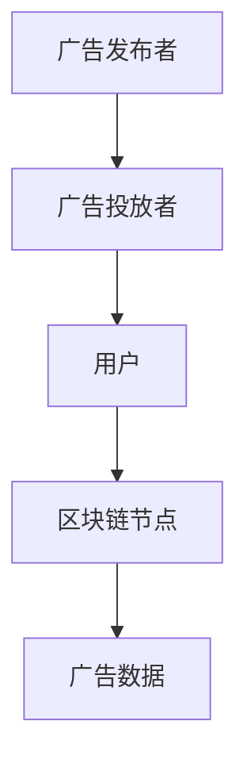
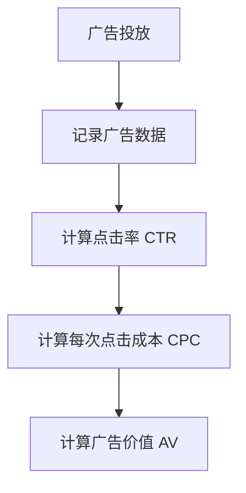
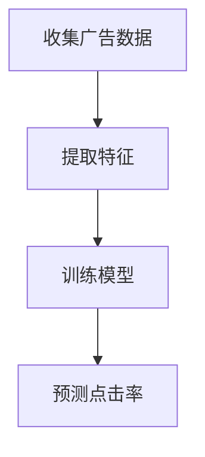
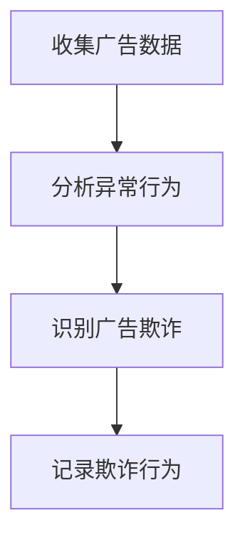
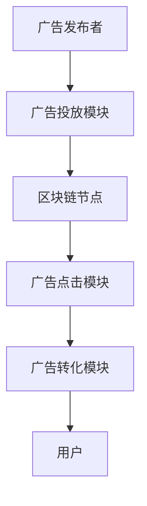

                 


# 《企业估值中的区块链数字广告平台评估》

> 关键词：区块链，数字广告，企业估值，智能合约，数据透明度

> 摘要：本文深入探讨了区块链技术在数字广告平台评估中的应用，结合区块链的去中心化和不可篡改特性，分析了如何通过区块链技术提升数字广告的价值评估和企业估值。文章从背景介绍、核心概念、算法原理、数学模型、系统架构、项目实战等多个维度展开，详细解析了区块链数字广告平台的实现方法及其对企业估值的深远影响。

---

# 第一部分: 区块链与数字广告平台的背景介绍

## 第1章: 区块链与数字广告平台的背景介绍

### 1.1 区块链技术概述

#### 1.1.1 区块链的基本概念
区块链是一种去中心化的分布式账本技术，通过密码学保证数据的安全性和不可篡改性。每个区块包含交易数据和时间戳，通过链式结构相互连接，形成一个不可篡改的记录系统。

#### 1.1.2 区块链的核心特性
- **去中心化**：数据不由单一机构控制，而是分布在网络中的多个节点上。
- **不可篡改性**：数据一旦写入区块链，无法被修改或删除。
- **透明性**：所有交易记录对参与者公开，但保护隐私。
- **智能合约**：通过预定义的代码自动执行交易或操作，无需中介。

#### 1.1.3 区块链在企业估值中的潜力
区块链技术可以提供更高的数据透明度和信任度，帮助企业更准确地评估广告平台的价值，从而提高企业估值的准确性。

### 1.2 数字广告行业的现状

#### 1.2.1 数字广告的基本概念
数字广告是指通过互联网平台展示的广告，包括搜索广告、展示广告、视频广告等多种形式。数字广告行业的市场规模庞大，但存在许多痛点。

#### 1.2.2 数字广告行业的痛点与挑战
- **广告欺诈**：虚假流量、点击率造假等问题严重。
- **数据不透明**：广告投放效果难以被独立验证。
- **信任缺失**：广告商和发布者之间的信任问题导致合作成本高。

#### 1.2.3 区块链技术如何解决数字广告行业的痛点
区块链技术可以通过去中心化和不可篡改性，解决广告欺诈和数据不透明的问题。例如，通过区块链记录广告的投放、点击和转化数据，确保数据的真实性和可追溯性。

### 1.3 区块链与数字广告的结合意义

#### 1.3.1 区块链在数字广告中的应用场景
- **广告投放记录**：通过区块链记录广告的投放时间和位置。
- **点击率验证**：通过区块链验证广告点击的真实性和唯一性。
- **转化数据追踪**：通过区块链追踪广告的转化效果，如用户注册或购买行为。

#### 1.3.2 区块链如何提升数字广告的价值
区块链技术可以提高广告数据的可信度，降低广告欺诈风险，从而提升广告的价值和广告商的信任度。

#### 1.3.3 区块链与数字广告结合的前景展望
随着区块链技术的不断发展，数字广告行业将更加依赖区块链技术来实现数据透明化和价值提升。

### 1.4 本章小结
本章从区块链技术和数字广告行业的现状出发，分析了区块链在数字广告中的应用场景和潜力，为后续的详细分析奠定了基础。

---

# 第2章: 区块链数字广告平台的核心概念与联系

## 2.1 区块链数字广告平台的核心概念

### 2.1.1 平台的基本架构
区块链数字广告平台通常包括以下几个部分：
- **广告发布者**：发布广告内容。
- **广告投放者**：购买广告位并投放广告。
- **用户**：浏览广告并可能与广告互动。
- **区块链节点**：记录广告的投放、点击和转化数据。

### 2.1.2 平台的核心功能
- **广告投放记录**：记录广告的投放时间和位置。
- **点击率验证**：验证广告点击的真实性和唯一性。
- **转化数据追踪**：追踪广告的转化效果，如用户注册或购买行为。
- **智能合约**：通过智能合约自动执行广告投放和结算。

### 2.1.3 平台的参与者角色
- **广告发布者**：发布广告内容。
- **广告投放者**：购买广告位并投放广告。
- **用户**：浏览广告并可能与广告互动。
- **区块链节点**：记录广告的投放、点击和转化数据。

## 2.2 区块链数字广告平台的实体关系分析

### 2.2.1 平台的实体关系图
以下是一个简单的实体关系图（使用Mermaid）：



## 2.3 平台核心概念的对比分析

### 2.3.1 平台功能对比表格
以下是区块链数字广告平台与传统数字广告平台的功能对比：

| 功能 | 传统数字广告平台 | 区块链数字广告平台 |
|------|------------------|--------------------|
| 数据记录 | 中心化记录，可能存在篡改风险 | 去中心化记录，不可篡改 |
| 数据验证 | 依赖第三方机构验证 | 区块链本身保证数据真实性 |
| 广告欺诈检测 | 依赖人工审核 | 通过区块链和智能合约自动检测 |
| 信任度 | 信任度较低 | 信任度高，数据透明 |

## 2.4 本章小结
本章详细介绍了区块链数字广告平台的核心概念和实体关系，分析了其与传统数字广告平台的对比，为后续的算法设计和系统实现奠定了基础。

---

# 第3章: 区块链数字广告平台的算法原理

## 3.1 广告价值评估算法

### 3.1.1 广告价值评估的基本原理
广告价值评估的核心在于如何准确衡量广告的实际效果。通过区块链记录广告的投放、点击和转化数据，可以更准确地评估广告的价值。

### 3.1.2 广告价值评估的数学模型
广告价值（AV）可以通过以下公式计算：

$$ AV = CTR \times CPC \times 1000 $$

其中：
- CTR 表示点击率（Click-Through Rate）。
- CPC 表示每次点击的成本（Cost Per Click）。
- 1000 是一个常数，用于将 CPC 转换为千次展示成本（CPM）。

### 3.1.3 广告价值评估的 mermaid 流程图
以下是一个广告价值评估算法的 mermaid 流程图：



## 3.2 广告点击率预测算法

### 3.2.1 点击率预测的基本原理
点击率预测是通过分析广告的相关特征（如关键词、用户行为等）来预测广告被点击的概率。

### 3.2.2 点击率预测的数学模型
点击率（CTR）的预测可以通过以下公式进行：

$$ CTR = \frac{点击次数}{展示次数} $$

### 3.2.3 点击率预测的 mermaid 流程图
以下是一个点击率预测算法的 mermaid 流程图：



## 3.3 广告欺诈检测算法

### 3.3.1 广告欺诈检测的基本原理
广告欺诈检测是通过分析广告数据中的异常行为（如虚假点击、假用户等）来识别广告欺诈行为。

### 3.3.2 广告欺诈检测的数学模型
广告欺诈检测可以通过异常检测算法（如聚类分析、孤立森林等）来进行。

### 3.3.3 广告欺诈检测的 mermaid 流程图
以下是一个广告欺诈检测算法的 mermaid 流程图：



## 3.4 本章小结
本章详细介绍了区块链数字广告平台中的广告价值评估、点击率预测和欺诈检测算法，为后续的系统实现提供了算法基础。

---

# 第4章: 区块链数字广告平台的数学模型与公式

## 4.1 广告价值评估的数学模型

### 4.1.1 广告价值评估的公式推导
广告价值（AV）的计算公式如下：

$$ AV = CTR \times CPC \times 1000 $$

其中，CTR 是点击率，CPC 是每次点击的成本。

### 4.1.2 广告价值评估的公式应用
假设某广告的点击率为 2%（CTR=0.02），每次点击成本为 $1（CPC=1），则广告价值为：

$$ AV = 0.02 \times 1 \times 1000 = 20 $$

这意味着每千次展示的广告价值为 $20。

## 4.2 广告点击率预测的数学模型

### 4.2.1 点击率预测的公式推导
点击率（CTR）的计算公式如下：

$$ CTR = \frac{点击次数}{展示次数} $$

### 4.2.2 点击率预测的公式应用
假设某广告展示了 1000 次，点击了 20 次，则点击率为：

$$ CTR = \frac{20}{1000} = 0.02 $$

即 2%。

## 4.3 广告欺诈检测的数学模型

### 4.3.1 广告欺诈检测的公式推导
广告欺诈检测可以通过分析数据中的异常值来识别欺诈行为。例如，使用孤立森林算法进行异常检测。

### 4.3.2 广告欺诈检测的公式应用
假设某广告的点击次数远高于正常范围，则可以通过孤立森林算法识别为异常值，标记为广告欺诈。

---

# 第5章: 区块链数字广告平台的系统分析与架构设计

## 5.1 系统功能设计

### 5.1.1 广告投放模块
广告投放模块负责接收广告发布者的广告信息，并将其发布到区块链网络中。

### 5.1.2 广告点击模块
广告点击模块负责记录用户的点击行为，并将数据上传到区块链中。

### 5.1.3 广告转化模块
广告转化模块负责记录用户的转化行为（如注册、购买等），并将其上传到区块链中。

## 5.2 系统架构设计

### 5.2.1 系统架构图
以下是一个区块链数字广告平台的系统架构图（使用Mermaid）：



## 5.3 系统接口设计

### 5.3.1 广告投放接口
广告投放接口负责接收广告发布者的广告信息，并将其发布到区块链网络中。

### 5.3.2 广告点击接口
广告点击接口负责记录用户的点击行为，并将数据上传到区块链中。

### 5.3.3 广告转化接口
广告转化接口负责记录用户的转化行为，并将其上传到区块链中。

## 5.4 系统交互设计

### 5.4.1 系统交互图
以下是一个区块链数字广告平台的系统交互图（使用Mermaid）：


---

# 第6章: 区块链数字广告平台的项目实战

## 6.1 环境安装

### 6.1.1 安装区块链开发环境
需要安装以太坊开发环境（如 Ganache、Solidity 编译器等）。

### 6.1.2 安装数字广告平台
需要安装广告投放、点击和转化模块。

## 6.2 系统核心实现

### 6.2.1 智能合约实现
以下是广告平台的智能合约实现示例（Solidity）：

```solidity
// SPDX-License-Identifier: MIT
pragma solidity ^0.8.0;

contract AdPlatform {
    struct Ad {
        address advertiser;
        uint256 timestamp;
        uint256 impressions;
        uint256 clicks;
        uint256 conversions;
    }

    mapping(uint256 => Ad) ads;

    function publishAd(uint256 adId, address advertiser) public {
        ads[adId] = Ad(advertiser, block.timestamp, 0, 0, 0);
    }

    function recordClick(uint256 adId) public {
        ads[adId].clicks++;
    }

    function recordConversion(uint256 adId) public {
        ads[adId].conversions++;
    }
}
```

### 6.2.2 广告价值评估实现
以下是广告价值评估的实现示例（Python）：

```python
def calculate_ad_value(ad_id):
    ad = ads[ad_id]
    ctr = ad.clicks / ad.impressions
    cpc = ad.clicks * 0.1  # 假设每次点击成本为 $0.1
    av = ctr * cpc * 1000
    return av
```

## 6.3 实际案例分析

### 6.3.1 案例背景
某广告发布者在区块链数字广告平台上投放了一则广告，展示了 10000 次，点击了 200 次，转化了 50 次。

### 6.3.2 案例分析
- 点击率（CTR）= 200 / 10000 = 0.02
- 每次点击成本（CPC）= 0.1
- 广告价值（AV）= 0.02 * 0.1 * 1000 = $20

---

# 第7章: 总结与展望

## 7.1 本章总结
本文详细探讨了区块链技术在数字广告平台评估中的应用，从背景介绍、核心概念、算法原理、数学模型、系统架构到项目实战，全面解析了区块链数字广告平台的实现方法及其对企业估值的深远影响。

## 7.2 未来展望
随着区块链技术的不断发展，数字广告行业将更加依赖区块链技术来实现数据透明化和价值提升。未来的研究方向可以包括更复杂的智能合约设计、更高效的广告数据处理算法以及更全面的广告欺诈检测机制。

---

# 作者：AI天才研究院/AI Genius Institute & 禅与计算机程序设计艺术 /Zen And The Art of Computer Programming

---

以上是一个详细的目录大纲和文章结构示例，涵盖了区块链数字广告平台评估的核心内容，每个部分都按照逻辑顺序展开，确保内容详实、结构清晰。

