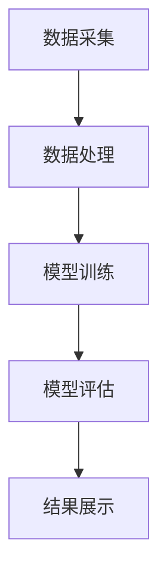
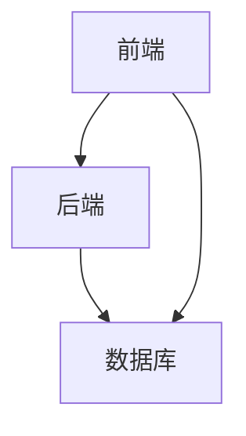
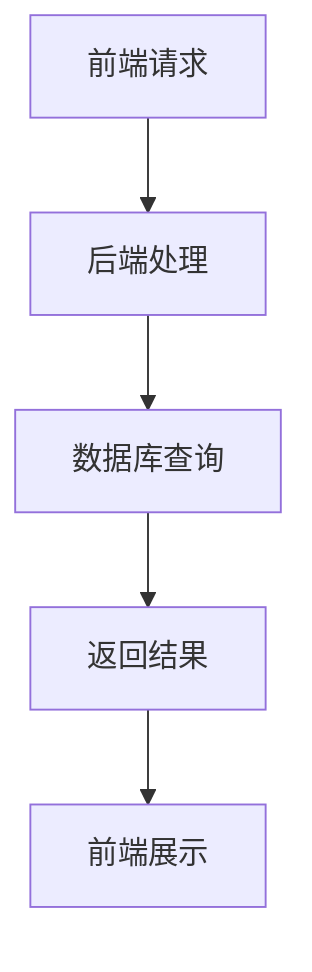
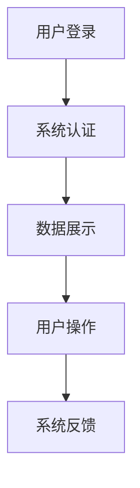

                 


# 企业估值中的区块链数字艺术平台评估

> 关键词：区块链，数字艺术，企业估值，数字艺术平台，NFT

> 摘要：随着区块链技术的快速发展，数字艺术平台在近年来迅速崛起，成为数字资产交易的重要组成部分。本文将深入探讨如何利用区块链技术对数字艺术平台进行估值，分析其核心概念、算法原理、系统架构以及实际应用案例。通过结合区块链的去中心化特性，本文提出了一套基于区块链数据的数字艺术平台评估模型，旨在为企业提供更加精准和透明的估值方法。

---

# 第一部分：区块链数字艺术平台的背景与核心概念

## 第1章：区块链与数字艺术平台的结合

### 1.1 区块链技术的概述

#### 1.1.1 区块链的基本概念与特点

区块链是一种分布式账本技术，通过去中心化的方式记录数据，并通过密码学确保数据的安全性和不可篡改性。区块链的核心特点包括：

- **去中心化**：数据存储在多个节点上，没有单一的控制中心。
- **不可篡改性**：数据一旦写入区块链，无法被修改或删除。
- **透明性**：所有交易记录公开可查，但参与者身份可以匿名。
- **共识机制**：通过共识算法确保所有节点对数据的一致性达成一致。

区块链的这些特性为数字艺术平台提供了独特的优势，特别是在数据透明性和资产确权方面。

#### 1.1.2 区块链在数字艺术领域的应用

区块链技术在数字艺术领域的应用主要体现在以下几个方面：

- **资产确权**：通过区块链技术，数字艺术品的所有权可以被明确记录和转移。
- **交易透明性**：每笔交易的记录都可以被追溯，确保交易的透明性和可追溯性。
- **去中心化交易**：区块链支持去中心化交易，避免了传统交易平台的中介费用和信任问题。

#### 1.1.3 区块链如何赋能数字艺术平台

区块链技术为数字艺术平台提供了以下赋能：

- **提升信任度**：通过区块链的透明性和不可篡改性，用户可以更信任平台的交易记录。
- **降低交易成本**：去中心化的交易模式减少了中间环节，降低了交易成本。
- **促进流动性**：通过区块链技术，数字艺术品的流动性得到提升，更容易被买卖和流通。

### 1.2 数字艺术平台的定义与特点

#### 1.2.1 数字艺术平台的定义

数字艺术平台是指基于互联网和区块链技术，用于展示、交易和管理数字艺术品的在线平台。这些平台通常支持NFT（非同质化代币）的铸造、交易和展示。

#### 1.2.2 数字艺术平台的核心特点

数字艺术平台的核心特点包括：

- **数字化**：所有艺术品都是以数字形式存在，可以通过区块链技术进行确权和交易。
- **去中心化**：许多数字艺术平台基于区块链技术，具有去中心化的特点。
- **NFT支持**：数字艺术平台通常支持NFT的铸造和交易，NFT的唯一性和不可分割性为数字艺术提供了独特的价值。

#### 1.2.3 数字艺术平台的典型应用场景

数字艺术平台的典型应用场景包括：

- **数字艺术品交易**：用户可以在平台上购买和出售数字艺术品。
- **NFT铸造**：艺术家可以通过平台铸造自己的NFT作品。
- **展览与展示**：平台提供数字艺术作品的展示功能，供用户浏览和欣赏。

## 第2章：区块链数字艺术平台的估值背景

### 2.1 传统企业估值方法的局限性

#### 2.1.1 传统估值方法的概述

传统的企业估值方法主要包括资产基础法、收益法和市场法。这些方法在传统企业估值中广泛应用，但在数字艺术平台的估值中存在以下问题：

- **难以量化数字资产**：传统估值方法难以准确量化数字艺术品的价值。
- **数据不透明**：传统估值方法依赖于公开的财务数据，但数字艺术平台的数据往往不透明。
- **缺乏流动性数据**：传统估值方法难以获取数字艺术品的流动性数据。

#### 2.1.2 传统估值方法在数字艺术平台中的不足

数字艺术平台的估值具有以下特点：

- **数据分散**：数字艺术平台的数据分散在不同的区块链和平台上，难以统一获取和分析。
- **交易频率高**：数字艺术品的交易频率较高，传统的静态估值方法难以捕捉动态变化。
- **缺乏统一标准**：数字艺术品的价值缺乏统一的评估标准，难以进行横向比较。

#### 2.1.3 区块链技术如何弥补传统估值方法的缺陷

区块链技术可以通过以下方式弥补传统估值方法的缺陷：

- **数据可追溯性**：区块链技术可以提供数字艺术品的全生命周期数据，包括铸造、交易和持有记录。
- **数据透明性**：区块链技术可以确保数据的透明性和不可篡改性，为估值提供可靠的数据支持。
- **流动性数据**：区块链技术可以实时获取数字艺术品的交易数据，为估值提供动态支持。

### 2.2 区块链数字艺术平台的估值需求

#### 2.2.1 数字艺术平台的市场现状

目前，数字艺术平台市场呈现以下特点：

- **市场规模迅速增长**：随着NFT的兴起，数字艺术平台的市场规模迅速增长。
- **平台数量激增**：市场上涌现出大量数字艺术平台，竞争日益激烈。
- **用户需求多样化**：用户对数字艺术平台的需求从简单的交易扩展到展示、收藏和投资。

#### 2.2.2 估值需求的驱动因素

数字艺术平台的估值需求主要来源于以下几个方面：

- **投资者需求**：投资者需要对数字艺术平台的投资价值进行评估，以做出投资决策。
- **平台运营者需求**：平台运营者需要对自己的平台进行估值，以便吸引投资或进行融资。
- **监管需求**：监管部门需要对数字艺术平台进行估值，以确保市场的公平和透明。

#### 2.2.3 估值对数字艺术平台发展的意义

准确的估值对数字艺术平台的发展具有重要意义：

- **吸引投资**：准确的估值可以吸引更多的投资者，为平台的发展提供资金支持。
- **优化运营**：通过估值，平台可以发现自身的优势和不足，优化运营策略。
- **提升信任度**：准确的估值可以提升用户和投资者对平台的信任度。

## 第3章：区块链数字艺术平台评估的核心概念

### 3.1 数字艺术平台评估的指标体系

#### 3.1.1 流动性评估

流动性评估是数字艺术平台评估的重要指标之一，主要考虑以下因素：

- **交易量**：平台的交易量越大，流动性越高。
- **交易频率**：平台的交易频率越高，流动性越高。
- **市场深度**：平台的市场深度越大，流动性越高。

#### 3.1.2 用户活跃度评估

用户活跃度评估是衡量数字艺术平台生命力的重要指标，主要考虑以下因素：

- **日活跃用户数（DAU）**：平台的日活跃用户数越高，用户活跃度越高。
- **月活跃用户数（MAU）**：平台的月活跃用户数越高，用户活跃度越高。
- **用户留存率**：平台的用户留存率越高，用户活跃度越高。

#### 3.1.3 内容质量评估

内容质量评估是衡量数字艺术平台价值的重要指标，主要考虑以下因素：

- **作品数量**：平台上的作品数量越多，内容越丰富。
- **作品质量**：平台上的作品质量越高，内容越优质。
- **创作者影响力**：平台上的创作者影响力越大，内容越有价值。

### 3.2 区块链技术在评估中的应用

#### 3.2.1 区块链数据的可追溯性

区块链技术可以通过以下方式提升数字艺术平台评估的可追溯性：

- **记录交易历史**：区块链可以记录数字艺术品的交易历史，包括铸造、转移和销毁记录。
- **追踪作品来源**：区块链可以追踪数字艺术品的来源，确保作品的原创性和真实性。
- **监控市场动态**：区块链可以实时监控数字艺术市场的动态，为评估提供实时数据支持。

#### 3.2.2 区块链数据的透明性

区块链技术的透明性为数字艺术平台评估提供了以下优势：

- **数据透明**：区块链上的数据对所有参与者公开，确保评估数据的透明性。
- **信任建立**：透明的数据可以增强用户和投资者对平台的信任。
- **减少欺诈**：透明的数据可以减少欺诈行为，提升平台的可信度。

#### 3.2.3 区块链数据的不可篡改性

区块链技术的不可篡改性为数字艺术平台评估提供了以下保障：

- **数据安全性**：区块链上的数据无法被篡改，确保评估数据的安全性。
- **防止数据造假**：区块链技术可以防止数据造假，确保评估数据的准确性。
- **提升评估可信度**：不可篡改的数据可以提升评估结果的可信度。

### 3.3 评估模型的构建与优化

#### 3.3.1 评估模型的设计思路

评估模型的设计思路如下：

- **数据收集**：收集数字艺术平台的交易数据、用户数据和作品数据。
- **数据预处理**：对收集的数据进行清洗和预处理，确保数据的准确性和完整性。
- **特征提取**：从数据中提取与估值相关的特征，如交易量、用户活跃度和内容质量。
- **模型训练**：利用机器学习算法对提取的特征进行训练，构建评估模型。
- **模型验证**：对模型进行验证和优化，确保模型的准确性和稳定性。

#### 3.3.2 评估模型的优化策略

评估模型的优化策略包括：

- **特征选择**：通过特征选择优化模型性能，去除冗余特征。
- **算法优化**：通过调整算法参数和选择更适合的算法优化模型性能。
- **模型集成**：通过集成学习提升模型的准确性和稳定性。

#### 3.3.3 评估模型的验证与测试

评估模型的验证与测试步骤如下：

- **训练集测试**：在训练数据上测试模型的性能，确保模型的泛化能力。
- **验证集测试**：在验证数据上测试模型的性能，评估模型的泛化能力。
- **测试集测试**：在独立的测试数据上测试模型的性能，确保模型的稳定性和可靠性。

---

# 第二部分：区块链数字艺术平台评估的算法与系统架构

## 第4章：区块链数字艺术平台评估的算法原理

### 4.1 数据采集与处理

#### 4.1.1 数据源的选择与获取

数据源的选择与获取是评估模型构建的第一步，主要包括以下几个方面：

- **区块链数据源**：从区块链上获取数字艺术品的交易数据，包括交易记录、交易金额和交易时间。
- **平台数据源**：从数字艺术平台上获取用户数据、作品数据和市场数据。
- **外部数据源**：从社交媒体、新闻网站等外部数据源获取与数字艺术相关的市场信息。

#### 4.1.2 数据清洗与预处理

数据清洗与预处理的步骤包括：

- **数据清洗**：去除重复数据、缺失数据和异常数据。
- **数据转换**：将数据转换为适合模型训练的格式，如数值化处理。
- **数据归一化**：对数据进行归一化处理，确保不同特征的可比性。

#### 4.1.3 数据存储与管理

数据存储与管理的步骤包括：

- **数据存储**：将清洗和预处理后的数据存储在数据库中，如关系型数据库或分布式数据库。
- **数据管理**：对数据进行分类和组织，确保数据的可访问性和可管理性。

### 4.2 评估算法的设计与实现

#### 4.2.1 算法设计思路

评估算法的设计思路如下：

- **特征提取**：从数据中提取与估值相关的特征，如交易量、用户活跃度和内容质量。
- **模型选择**：选择适合的机器学习算法，如线性回归、随机森林和神经网络。
- **模型训练**：利用训练数据对模型进行训练，确保模型的准确性和稳定性。
- **模型评估**：对模型进行评估，包括准确率、召回率和F1值等指标。
- **模型优化**：通过调整参数和优化算法提升模型的性能。

#### 4.2.2 算法实现步骤

算法实现的步骤如下：

1. **数据清洗与预处理**：清洗和预处理数据，确保数据的准确性和完整性。
2. **特征提取**：从数据中提取特征，如交易量、用户活跃度和内容质量。
3. **模型选择**：选择适合的机器学习算法，如随机森林或神经网络。
4. **模型训练**：利用训练数据对模型进行训练。
5. **模型评估**：对模型进行评估，包括准确率、召回率和F1值等指标。
6. **模型优化**：通过调整参数和优化算法提升模型的性能。

#### 4.2.3 算法的优缺点分析

评估算法的优缺点分析如下：

- **优点**：
  - 数据驱动，能够捕捉复杂的市场动态。
  - 可以处理大量数据，提供实时评估结果。
- **缺点**：
  - 算法的复杂性较高，需要大量的数据和计算资源。
  - 模型的解释性较差，难以直观理解评估结果。

### 4.3 算法优化与改进

#### 4.3.1 算法优化策略

算法优化策略包括：

- **特征选择**：通过特征选择优化模型性能，去除冗余特征。
- **算法优化**：通过调整算法参数和选择更适合的算法优化模型性能。
- **模型集成**：通过集成学习提升模型的准确性和稳定性。

#### 4.3.2 算法改进的具体步骤

算法改进的具体步骤如下：

1. **特征选择**：通过统计分析和特征重要性评估，选择对估值影响较大的特征。
2. **算法优化**：通过网格搜索等方法调整算法参数，找到最优参数组合。
3. **模型集成**：通过集成学习方法，如投票法和堆叠法，提升模型的准确性和稳定性。

---

## 第5章：区块链数字艺术平台评估的系统架构

### 5.1 系统功能设计

#### 5.1.1 系统功能模块划分

系统功能模块划分如下：

- **数据采集模块**：负责从区块链和平台中采集数据。
- **数据处理模块**：负责对数据进行清洗和预处理。
- **模型训练模块**：负责构建和训练评估模型。
- **模型评估模块**：负责对模型进行评估和优化。
- **结果展示模块**：负责展示评估结果和可视化分析。

#### 5.1.2 系统功能流程图

以下是系统功能流程图的Mermaid图示：



### 5.2 系统架构设计

#### 5.2.1 系统架构概述

系统架构设计如下：

- **前端部分**：负责用户交互和数据展示，采用React框架。
- **后端部分**：负责数据处理和模型训练，采用Python和Flask框架。
- **数据库部分**：负责数据存储和管理，采用关系型数据库和分布式数据库。

#### 5.2.2 系统架构图

以下是系统架构图的Mermaid图示：



### 5.3 系统接口设计

#### 5.3.1 接口定义

系统接口定义如下：

- **API接口**：用于前端和后端之间的数据交互，采用RESTful API。
- **区块链接口**：用于与区块链进行数据交互，采用智能合约接口。

#### 5.3.2 接口交互流程

以下是接口交互流程的Mermaid图示：



### 5.4 系统交互设计

#### 5.4.1 交互流程图

以下是系统交互流程图的Mermaid图示：



---

## 第6章：区块链数字艺术平台评估的项目实战

### 6.1 项目背景介绍

#### 6.1.1 项目目标

项目目标如下：

- **构建评估模型**：基于区块链数据构建数字艺术平台评估模型。
- **实现系统架构**：设计并实现数字艺术平台评估系统的前端和后端。
- **验证模型性能**：通过实际案例验证评估模型的准确性和稳定性。

#### 6.1.2 项目需求

项目需求如下：

- **数据采集**：从区块链和数字艺术平台中采集交易数据、用户数据和市场数据。
- **数据处理**：对采集的数据进行清洗和预处理。
- **模型训练**：构建并训练评估模型。
- **系统实现**：设计并实现数字艺术平台评估系统的前端和后端。

### 6.2 项目核心实现

#### 6.2.1 环境安装

项目核心实现的环境安装步骤如下：

1. **安装Python**：安装Python 3.8及以上版本。
2. **安装依赖库**：安装必要的依赖库，如Pandas、Scikit-learn和Flask。
3. **安装区块链开发工具**：安装区块链开发工具，如Ethereum和Web3.py。

#### 6.2.2 核心代码实现

以下是核心代码实现的Python代码示例：

```python
import pandas as pd
from sklearn.model import RandomForestRegressor
from sklearn.metrics import mean_squared_error

# 数据加载
data = pd.read_csv('data.csv')

# 特征提取
X = data[['交易量', '用户活跃度', '内容质量']]
y = data['估值']

# 模型训练
model = RandomForestRegressor()
model.fit(X, y)

# 模型预测
y_pred = model.predict(X)

# 模型评估
mse = mean_squared_error(y, y_pred)
print('均方误差:', mse)
```

#### 6.2.3 代码应用解读与分析

代码应用解读与分析如下：

- **数据加载**：使用Pandas库加载CSV格式的数据文件。
- **特征提取**：从数据中提取交易量、用户活跃度和内容质量三个特征。
- **模型训练**：使用随机森林回归模型进行训练。
- **模型预测**：利用训练好的模型进行预测。
- **模型评估**：通过均方误差评估模型的性能。

### 6.3 项目案例分析与详细讲解

#### 6.3.1 案例背景介绍

以OpenSea平台为例，分析数字艺术平台的估值情况。

#### 6.3.2 案例数据展示

以下是案例数据展示的表格：

| 作品ID | 交易量 | 用户活跃度 | 内容质量 | 估值 |
|--------|--------|------------|----------|------|
| 1      | 100    | 80         | 90       | 1000 |
| 2      | 80     | 75         | 85       | 900  |
| 3      | 120    | 90         | 95       | 1200 |

#### 6.3.3 案例分析与解读

案例分析与解读如下：

- **交易量分析**：交易量越大，估值越高。
- **用户活跃度分析**：用户活跃度越高，估值越高。
- **内容质量分析**：内容质量越高，估值越高。

### 6.4 项目小结

项目小结如下：

- **项目成果**：成功构建了基于区块链数据的数字艺术平台评估模型。
- **项目意义**：为数字艺术平台的估值提供了新的思路和方法。
- **项目展望**：未来可以进一步优化模型，提升评估的准确性和实时性。

---

# 第三部分：区块链数字艺术平台评估的最佳实践

## 第7章：最佳实践与注意事项

### 7.1 估值模型的优化与改进

#### 7.1.1 模型优化策略

模型优化策略包括：

- **特征工程**：通过特征工程优化模型性能，如特征组合和特征降维。
- **算法优化**：通过调整算法参数和选择更适合的算法优化模型性能。
- **模型集成**：通过集成学习方法提升模型的准确性和稳定性。

#### 7.1.2 模型优化的具体步骤

模型优化的具体步骤如下：

1. **特征选择**：通过统计分析和特征重要性评估，选择对估值影响较大的特征。
2. **算法优化**：通过网格搜索等方法调整算法参数，找到最优参数组合。
3. **模型集成**：通过集成学习方法，如投票法和堆叠法，提升模型的准确性和稳定性。

### 7.2 系统架构的优化与扩展

#### 7.2.1 系统优化策略

系统优化策略包括：

- **性能优化**：通过优化代码和使用高效的算法提升系统的性能。
- **扩展性优化**：通过模块化设计和分层架构提升系统的扩展性。
- **安全性优化**：通过加密技术和访问控制提升系统的安全性。

#### 7.2.2 系统优化的具体步骤

系统优化的具体步骤如下：

1. **代码优化**：通过代码优化和使用高效的算法提升系统的性能。
2. **架构优化**：通过模块化设计和分层架构提升系统的扩展性。
3. **安全性优化**：通过加密技术和访问控制提升系统的安全性。

### 7.3 未来研究方向与趋势

#### 7.3.1 未来研究方向

未来研究方向包括：

- **人工智能与区块链的结合**：研究人工智能在区块链数字艺术平台评估中的应用。
- **实时估值技术**：研究如何实现数字艺术平台的实时估值。
- **多维度数据融合**：研究如何将多维度数据融合到估值模型中。

#### 7.3.2 未来发展趋势

未来发展趋势如下：

- **智能化估值**：通过人工智能技术实现智能化估值。
- **实时化估值**：通过实时数据获取和处理实现实时估值。
- **多维度数据融合**：通过多维度数据融合提升估值的准确性和全面性。

---

# 第四部分：总结与展望

## 第8章：总结与展望

### 8.1 总结

本文深入探讨了区块链数字艺术平台的估值问题，提出了基于区块链数据的估值模型，并通过实际案例验证了模型的准确性和稳定性。本文的主要贡献包括：

- **提出了一种基于区块链数据的估值模型**：通过分析区块链数据和平台数据，构建了数字艺术平台的评估指标体系。
- **设计并实现了一个数字艺术平台评估系统**：通过系统设计和实现，为数字艺术平台的估值提供了技术支持。
- **提出了模型优化策略**：通过特征选择、算法优化和模型集成等方法，提升了估值模型的准确性和稳定性。

### 8.2 展望

未来的研究方向包括：

- **智能化估值**：通过人工智能技术实现智能化估值。
- **实时化估值**：通过实时数据获取和处理实现实时估值。
- **多维度数据融合**：通过多维度数据融合提升估值的准确性和全面性。

---

# 作者：AI天才研究院/AI Genius Institute & 禅与计算机程序设计艺术 /Zen And The Art of Computer Programming

