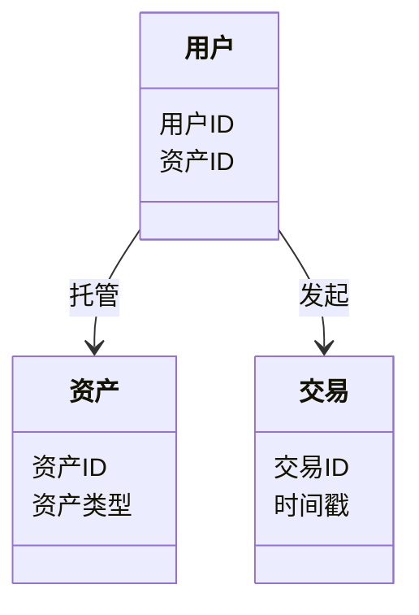
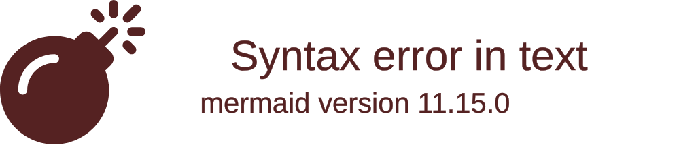
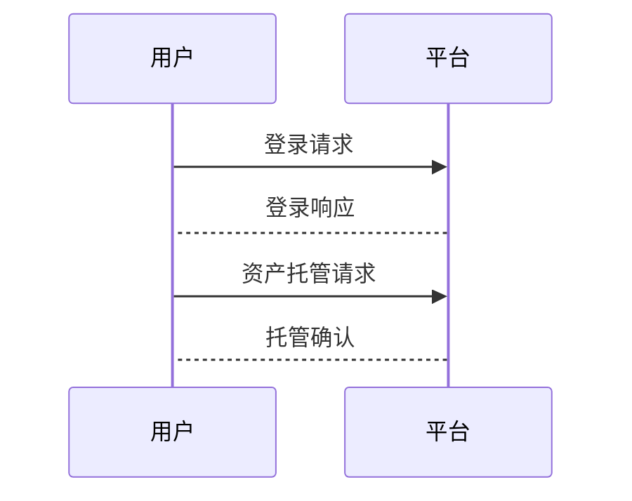

                 


# 企业估值中的区块链数字资产托管平台评估

---

## 关键词
区块链，数字资产托管，企业估值，智能合约，去中心化，资产评估

---

## 摘要
本文深入探讨了区块链数字资产托管平台在企业估值中的评估方法和应用。通过分析区块链技术的核心原理、数字资产托管平台的结构与功能，结合实际案例和数学模型，详细阐述了如何利用区块链技术提升企业估值。文章从背景介绍、核心概念、算法原理、系统架构到项目实战，层层递进，为企业估值提供了新的视角和实践指导。

---

## 第一部分：背景介绍

### 第1章：区块链技术概述
#### 1.1 区块链的基本概念
区块链是一种分布式账本技术，通过去中心化、不可篡改和透明性等特性，实现数据的安全存储和价值传递。区块链的核心要素包括区块、链式结构、共识机制、哈希函数和数字签名。

#### 1.2 数字资产托管平台
数字资产托管平台是基于区块链技术的数字资产管理工具，提供资产存储、交易、清算和结算等服务。其特点包括安全性高、透明度强、去中心化和高效性。

#### 1.3 区块链与企业估值的联系
区块链技术通过提升资产透明度、降低交易成本和增强信任机制，优化企业估值流程。数字资产托管平台在企业估值中的应用，能够提高估值的准确性和效率。

---

## 第二部分：核心概念与联系

### 第2章：区块链的核心原理
#### 2.1 去中心化与共识机制
去中心化通过分布式节点实现数据的共同维护，共识机制（如PoW、PoS）确保数据的一致性。

#### 2.2 智能合约
智能合约是基于区块链的自动执行程序，用于自动化资产托管和交易流程，减少人为干预。

#### 2.3 区块链的可扩展性和安全性
可扩展性通过侧链、分片技术提升处理能力，安全性通过加密算法和访问控制保障。

### 第3章：数字资产托管平台的功能与结构
#### 3.1 托管功能
资产存储、身份验证、交易记录和资产转移。

#### 3.2 平台结构
节点层、数据层、网络层和应用层，各层协同工作实现托管功能。

#### 3.3 ER实体关系图
展示用户、资产、交易和合约之间的关系，如下：

```mermaid
erDiagram
    actor 用户 {
        +string 用户ID
        +string 资产ID
    }
    actor 资产 {
        +string 资产ID
        +string 资产类型
    }
    actor 交易 {
        +string 交易ID
        +datetime 时间戳
    }
    actor 合约 {
        +string 合约ID
        +string 合约状态
    }
    用户 --> 资产 : 托管
    用户 --> 交易 : 发起
    资产 --> 合约 : 绑定
```

---

## 第三部分：算法原理讲解

### 第4章：区块链共识机制
#### 4.1 共识机制的作用
确保区块链网络中各节点数据一致，防止双重支付和恶意攻击。

#### 4.2 常见共识算法
工作量证明（PoW）、权益证明（PoS）、拜占庭容错（BFT）等。

#### 4.3 共识机制的实现
以下为PoW算法的Python代码示例：

```python
def compute_hash(difficulty):
    import hashlib
    nonce = 0
    while True:
        hash = hashlib.sha256(str(nonce).encode()).hexdigest()
        if hash.startswith('0' * difficulty):
            return nonce, hash
        nonce += 1

# 示例计算
nonce, hash = compute_hash(4)
print(f"Nonce: {nonce}, Hash: {hash}")
```

---

## 第四部分：数学模型与公式

### 第5章：数字资产托管平台的评估模型
#### 5.1 模型建立
综合考虑安全性、效率和可扩展性，建立评估公式：

$$
评估值 = \frac{安全性得分 + 效率得分 + 可扩展性得分}{3}
$$

#### 5.2 变量解释
- 安全性得分：基于加密算法强度和漏洞数量。
- 效率得分：基于交易处理时间和网络延迟。
- 可扩展性得分：基于节点数和交易吞吐量。

---

## 第五部分：系统分析与架构设计

### 第6章：系统功能设计
#### 6.1 领域模型
展示用户、资产和交易的关系：



#### 6.2 系统架构
展示整体架构：



#### 6.3 接口设计
展示用户与平台的交互流程：



---

## 第六部分：项目实战

### 第7章：环境安装与核心实现
#### 7.1 环境搭建
安装Python、区块链框架（如Solidity、Web3.js）和数据库。

#### 7.2 核心功能实现
编写智能合约和后端接口，实现资产托管功能。

```python
from web3 import Web3, HTTPProvider

w3 = Web3(HTTPProvider('http://localhost:8545'))
contract_address = '0x...'
abi = '[...]'

contract = w3.eth.contract(contract_address, abi=abi)
tx_hash = contract.functions.deposit().transact()
receipt = w3.eth.waitForTransactionReceipt(tx_hash)
print(receipt)
```

---

## 第七部分：总结与展望

### 第8章：最佳实践与注意事项
- 定期更新密钥和访问权限。
- 监测网络性能和交易延迟。
- 定期审计智能合约和系统漏洞。

### 第9章：拓展阅读与未来方向
探索零知识证明、Layer 2解决方案和跨链技术，提升平台的安全性和可扩展性。

---

## 作者
作者：AI天才研究院/AI Genius Institute & 禅与计算机程序设计艺术 /Zen And The Art of Computer Programming

---

通过以上结构，文章系统地介绍了区块链数字资产托管平台在企业估值中的评估方法，从理论到实践，为读者提供了全面的指导和深度分析。

