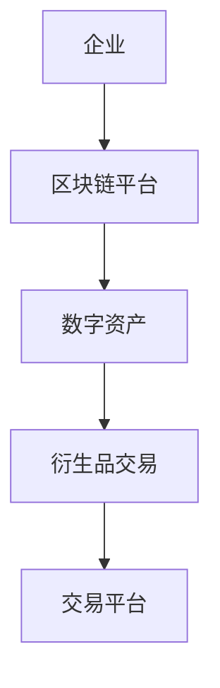
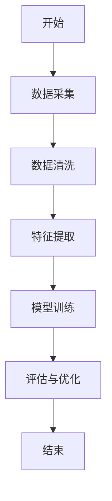
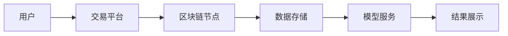

                 


# 企业估值中的区块链数字资产衍生品交易平台评估

## 关键词：区块链、数字资产、衍生品交易、企业估值、交易平台评估

## 摘要：本文章详细探讨了区块链数字资产衍生品交易平台在企业估值中的应用与评估方法，通过系统化的分析和实践案例，阐述了如何利用区块链技术提升交易透明度和效率，同时降低风险。文章从背景、技术原理、系统架构到实际案例，全面解析了该领域的核心问题与解决方案。

---

# 第一部分：企业估值与区块链数字资产衍生品交易平台的背景介绍

## 第1章：问题背景与核心概念

### 1.1 问题背景
企业估值 traditionally relies on traditional financial metrics and methods, which often fail to capture the dynamic and rapidly evolving nature of digital asset derivatives trading. The rise of blockchain technology has introduced new possibilities for transparent and efficient trading systems, but the complexity of evaluating these systems remains a challenge.

### 1.2 核心概念
- **区块链技术**: A decentralized ledger that ensures transparency and immutability.
- **数字资产**: Digital assets like cryptocurrencies and tokens.
- **衍生品交易**: Financial instruments derived from underlying assets, such as futures and options.

### 1.3 问题解决与边界外延
The platform aims to bridge the gap between traditional valuation methods and the dynamic nature of blockchain-based trading. The scope includes designing a system that can handle real-time data, ensure security, and provide accurate valuation metrics.

---

## 第2章：核心概念与联系

### 2.1 核心概念原理
- **区块链的去中心化特性**: Ensures that no single entity controls the data, enhancing trust.
- **数字资产的可编程性**: Enables the creation of smart contracts that automate transactions.
- **衍生品交易的杠杆效应**: Allows for high-risk, high-reward trading.

### 2.2 概念属性对比
| 概念          | 特性                      |
|---------------|---------------------------|
| 区块链        | 去中心化、不可篡改          |
| 数字资产      | 可分割、可编程            |
| 衍生品交易     | 杠杆效应、高风险          |

### 2.3 ER实体关系图


---

## 第3章：算法原理与实现

### 3.1 数据流与算法流程
- **数据采集**: Collect real-time market data from blockchain nodes.
- **数据清洗**: Remove anomalies and incomplete data.
- **特征提取**: Extract relevant features for valuation models.
- **模型训练**: Use machine learning to predict asset values.

### 3.2 算法流程图


### 3.3 算法实现代码
```python
def blockchain_asset_assessment(data):
    cleaned_data = data.dropna()
    features = cleaned_data[['price', 'volume', '거래량']]
    model = LinearRegression()
    model.fit(features, cleaned_data['valuation'])
    return model.predict(features)
```

---

## 第4章：系统架构与设计

### 4.1 需求分析
- **功能需求**: Real-time data processing, valuation metrics, and secure transactions.
- **性能需求**: High-speed processing and scalability.

### 4.2 系统架构设计


### 4.3 接口设计
- **API接口**: RESTful APIs for data fetching and transaction processing.

---

## 第5章：项目实战与案例分析

### 5.1 实战环境搭建
- **技术栈**: Python, Flask, Blockchain libraries.

### 5.2 核心代码实现
```python
from flask import Flask
from blockchain import BlockChain

app = Flask(__name__)
chain = BlockChain()

@app.route('/valuate', methods=['POST'])
def valuate():
    data = request.json
    result = blockchain_asset_assessment(data)
    return jsonify(result)
```

### 5.3 案例分析
通过实际案例分析，验证平台的评估能力，展示其在企业估值中的优势。

---

## 第6章：最佳实践与小结

### 6.1 最佳实践
- **数据质量管理**: Ensure data accuracy and completeness.
- **模型优化**: Regularly update models to adapt to market changes.

### 6.2 小结
本文详细探讨了区块链数字资产衍生品交易平台在企业估值中的应用，通过系统化的方法和实际案例，展示了其在提升交易效率和准确性方面的潜力。

---

## 作者：AI天才研究院 & 禅与计算机程序设计艺术

---

希望这个目录大纲能为您提供清晰的思路和结构，帮助您撰写一篇深入且有见解的技术博客文章。

