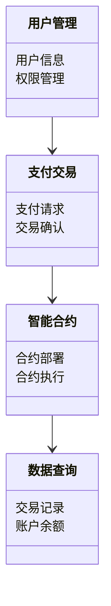
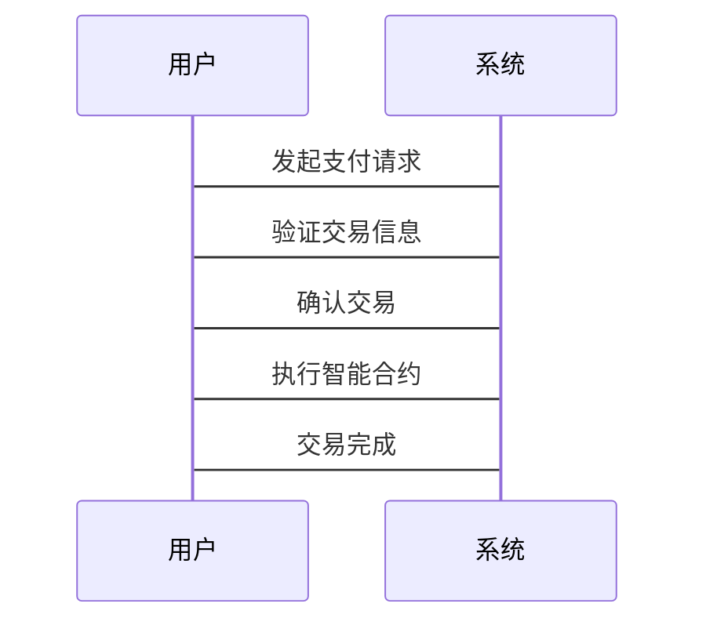

                 


# 企业估值中的区块链跨境支付结算平台评估

> 关键词：企业估值，区块链，跨境支付，结算平台，评估模型

> 摘要：本文深入探讨了区块链技术在跨境支付结算中的应用，并结合企业估值的方法，提出了基于区块链的跨境支付结算平台的评估模型。通过分析平台的技术架构、安全性、可扩展性等关键指标，结合企业财务数据和市场表现，构建了一个综合评估框架，为投资者和企业管理者提供了科学的决策依据。

---

## 第一章 区块链与跨境支付结算平台概述

### 1.1 区块链技术的基本概念

区块链是一种分布式账本技术，通过去中心化、不可篡改和透明性等特点，实现了数据的安全存储和信任建立。区块链的核心技术包括分布式共识机制、加密算法和智能合约，这些技术使得区块链在金融领域的应用前景广阔。

### 1.2 跨境支付结算的基本流程

传统的跨境支付结算流程复杂且耗时，涉及多个中间银行和支付系统，导致交易成本高、效率低。区块链通过去中心化的技术，简化了支付流程，减少了中间环节，提高了交易速度和透明度。

### 1.3 区块链跨境支付结算平台的定义与特点

区块链跨境支付结算平台是一种基于区块链技术的支付系统，支持多种货币的跨境交易。其特点包括高安全性、低交易成本、高透明度和快速结算。通过智能合约和区块链的不可篡改性，确保了交易的安全性和可靠性。

---

## 第二章 区块链技术在跨境支付中的应用

### 2.1 区块链支付的基本流程

区块链支付流程包括支付请求发起、交易确认与验证、交易记账与结算。通过智能合约自动执行交易，确保支付的准确性和及时性。

### 2.2 区块链的共识机制

共识机制是区块链技术的核心，确保网络中所有节点达成一致。常见的共识机制包括PoW、PoS和DPOS，每种机制都有其优缺点，对跨境支付的效率和安全性产生重要影响。

### 2.3 智能合约在跨境支付中的应用

智能合约是一种自动执行的协议，通过区块链技术实现自动化的支付和结算。智能合约的应用简化了支付流程，提高了交易的透明度和安全性。

---

## 第三章 跨境支付结算平台的评估指标与模型

### 3.1 评估指标的分类

评估指标分为技术指标、安全指标和可扩展性指标。技术指标包括区块链的性能和可扩展性，安全指标包括系统的抗攻击能力和数据隐私保护，可扩展性指标包括平台的处理能力和用户容量。

### 3.2 评估模型的设计

评估模型基于加权评分系统，结合各个指标的重要性进行加权。模型的计算公式为：

$$
\text{总评分} = \sum (\text{指标评分} \times \text{权重})
$$

### 3.3 评估模型的实现

通过数据采集与处理、模型训练与优化，确保评估模型的准确性和实用性。模型的应用与验证需要通过实际案例进行测试，验证其有效性和可靠性。

---

## 第四章 企业估值与区块链跨境支付结算平台的结合

### 4.1 企业估值的基本方法

企业估值包括财务指标分析、市场分析和行业趋势分析。通过DCF模型、市盈率等方法评估企业的价值。

### 4.2 区块链平台对企业估值的影响

区块链技术的应用提高了支付结算的效率和透明度，降低了企业的运营成本，提升了企业的市场竞争力和品牌价值。

### 4.3 综合评估模型的应用

结合区块链平台的评估模型和企业估值方法，构建一个综合评估框架，为投资者和企业管理者提供科学的决策依据。

---

## 第五章 系统分析与架构设计方案

### 5.1 系统功能设计

系统功能包括用户管理、支付交易、智能合约和数据查询。通过领域模型类图（Mermaid图）展示系统的功能模块。



### 5.2 系统架构设计

系统架构采用分层设计，包括数据层、业务逻辑层和应用层。通过架构图（Mermaid图）展示系统的模块划分和交互关系。


### 5.3 系统接口设计

系统接口包括支付请求接口、交易确认接口和数据查询接口。通过接口文档明确接口的功能和数据格式。

### 5.4 系统交互设计

系统交互流程包括用户发起支付请求、系统验证交易、智能合约执行和交易完成。通过序列图（Mermaid图）展示系统的交互过程。



---

## 第六章 项目实战

### 6.1 环境安装

安装必要的开发工具和区块链框架，如Node.js、Solidity和Ethereum。

### 6.2 核心实现源代码

以下是支付交易的核心代码：

```python
def initiate_transaction(sender, receiver, amount):
    # 初始化交易请求
    transaction = {
        'from': sender,
        'to': receiver,
        'value': amount,
        'gas': 200000,
        'gasPrice': 2000000000000,
        'nonce': web3.eth.getTransactionCount(sender_address)
    }
    # 发送交易
    tx_hash = web3.eth.sendTransaction(transaction)
    return tx_hash.hex()
```

### 6.3 代码应用解读与分析

代码通过Web3库与区块链节点交互，初始化交易请求并发送交易。通过智能合约自动执行交易，确保支付的准确性和安全性。

### 6.4 实际案例分析

以实际案例分析评估模型的应用，验证其在企业估值中的有效性和可靠性。

---

## 第七章 最佳实践与小结

### 7.1 最佳实践 tips

- 定期更新和优化评估模型
- 加强数据隐私保护
- 提高系统的可扩展性和安全性

### 7.2 小结

本文通过详细分析区块链技术在跨境支付结算中的应用，构建了综合评估模型，并结合企业估值方法，为投资者和企业管理者提供了科学的决策依据。

---

作者：AI天才研究院 & 禅与计算机程序设计艺术

