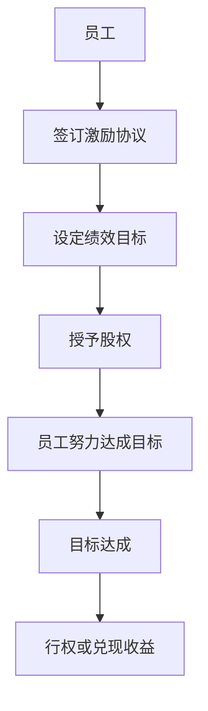
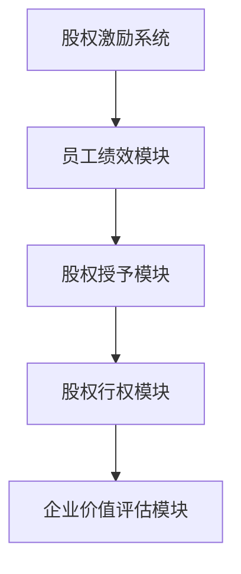
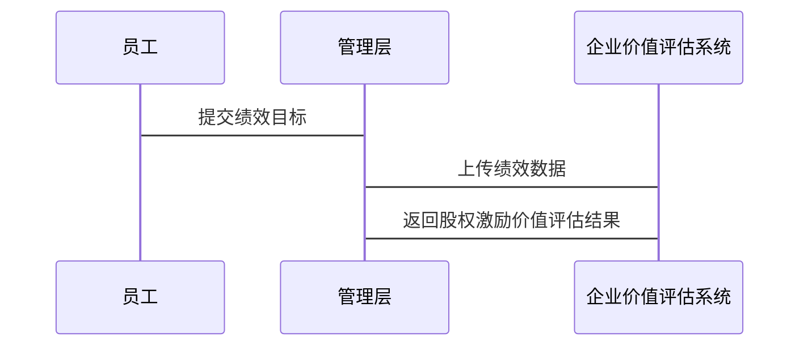

                 


# 企业估值中的员工股权激励影响

> **关键词**: 企业估值, 股权激励, 员工激励, 股权价值, 绩效评估

> **摘要**: 本文深入探讨了员工股权激励对企业估值的影响，从理论分析到实际应用，结合数学模型和系统设计，详细阐述了股权激励如何通过影响员工行为和企业绩效进而影响企业估值。文章通过案例分析和系统架构设计，展示了股权激励在企业治理中的关键作用，并提出了实际操作中的注意事项和最佳实践。

---

## 第一部分: 企业估值中的员工股权激励背景与理论基础

### 第1章: 股权激励的基本概念与历史发展

#### 1.1 股权激励的定义与核心要素

##### 1.1.1 股权激励的定义

股权激励是指企业通过给予员工一定形式的股权或股权收益，以激励员工为企业创造更大价值的一种激励机制。其核心在于将员工的个人利益与企业的长期发展绑定，激发员工的主人翁意识。

##### 1.1.2 股权激励的核心要素

- **激励对象**: 通常是企业的核心员工、高层管理者和技术骨干。
- **激励方式**: 包括股票期权、限制性股票、股票增值权等多种形式。
- **激励条件**: 通常与员工的绩效目标挂钩，如销售额增长、利润提升等。
- **激励期限**: 通常设置锁定期和行权期，以确保员工的长期承诺。

##### 1.1.3 股权激励的分类与特点

股权激励主要分为以下几类：

1. **股票期权**: 员工以固定价格购买公司股票的权利，行权后可获得收益。
2. **限制性股票**: 员工在满足特定条件后，可获得公司股票。
3. **股票增值权**: 员工获得股票增值部分的收益权，无需实际购买股票。

**特点**:
- 长期性: 激励员工关注企业的长期发展。
- 双重性: 同时影响员工行为和企业价值。
- 多样性: 根据企业需求选择不同的激励方式。

**Mermaid流程图: 股权激励的基本流程**



#### 1.2 股权激励的历史发展与现状

##### 1.2.1 股权激励的发展历程

股权激励起源于20世纪60年代的美国，随着公司治理理论的发展逐步完善。早期的股权激励主要以股票期权为主，后来发展出更多灵活的形式。

##### 1.2.2 当前股权激励的全球实践

全球范围内，股权激励已成为企业吸引和留住优秀人才的重要工具。特别是在科技企业中，股权激励被广泛应用于激励创新团队。

##### 1.2.3 中国股权激励的政策环境

在中国，股权激励政策逐步完善，2016年发布的《上市公司股权激励管理办法》为股权激励提供了法律依据。国有企业和民营企业在股权激励的实践中各有特点。

---

### 第2章: 企业估值的基本理论与方法

#### 2.1 企业估值的核心概念

##### 2.1.1 企业估值的定义

企业估值是指对企业整体价值的评估，通常包括资产价值、未来现金流折现值等。

##### 2.1.2 企业估值的主要方法

1. **资产基础法**: 基于企业资产的账面价值进行评估。
2. **市场法**: 通过比较类似企业的市场交易价格进行评估。
3. **收益法**: 通过预测企业未来现金流，使用贴现率计算企业价值。

##### 2.1.3 企业估值的关键影响因素

- **财务状况**: 资产负债情况、盈利能力。
- **行业地位**: 市场份额、竞争环境。
- **管理团队**: 核心管理人员的能力和稳定性。
- **发展前景**: 未来增长潜力。

#### 2.2 股权激励对估值的影响机制

##### 2.2.1 股权激励与企业价值的关系

股权激励通过提升员工绩效和企业利润间接影响企业价值。

##### 2.2.2 股权激励对股东权益的影响

股权激励可能导致每股收益稀释，但长期来看可能提升企业整体价值。

##### 2.2.3 股权激励对企业市值的影响

通过提升企业业绩和市场信心，股权激励可能推高企业市值。

---

## 第二部分: 股权激励对员工行为与企业绩效的影响

### 第3章: 股权激励对员工行为的影响

#### 3.1 股权激励与员工激励理论

##### 3.1.1 马斯洛需求层次理论

股权激励满足员工的自我实现需求，属于高层次需求。

##### 3.1.2 赫兹伯格的双因素理论

股权激励属于激励因素，能够提升员工的工作积极性。

##### 3.1.3 目标设置理论

股权激励通过设定明确的目标激励员工努力工作。

#### 3.2 股权激励对员工行为的具体影响

##### 3.2.1 员工积极性的提升

员工感受到自身利益与企业利益绑定，工作积极性显著提高。

##### 3.2.2 员工忠诚度的增强

股权激励增强员工对企业的归属感，降低流动率。

##### 3.2.3 员工创新行为的促进

员工更愿意提出创新想法，推动企业技术进步。

### 第4章: 股权激励对企业绩效的影响

#### 4.1 股权激励与企业绩效的关系

##### 4.1.1 股权激励对企业利润的影响

通过提升效率和创新，股权激励可能增加企业利润。

##### 4.1.2 股权激励对企业发展战略的影响

股权激励促使管理层制定长期发展战略，避免短期行为。

##### 4.1.3 股权激励对企业竞争优势的影响

通过吸引和留住优秀人才，股权激励增强企业的竞争优势。

#### 4.2 股权激励对管理层决策的影响

##### 4.2.1 管理层风险偏好变化

股权激励使管理层更倾向于风险合理可控的投资。

##### 4.2.2 管理层决策的长期性增强

股权激励促使管理层关注企业长期发展。

##### 4.2.3 管理层与股东利益的趋同

股权激励减少管理层与股东的利益冲突。

---

## 第三部分: 股权激励对估值的数学模型与实证分析

### 第5章: 股权激励影响的数学模型

#### 5.1 股权激励影响的理论模型

##### 5.1.1 股权激励的数学模型

股权激励的影响可以用以下公式表示：

$$ V = V_0 + \Delta V $$

其中，$V_0$是未实施股权激励的企业价值，$\Delta V$是股权激励带来的增量价值。

##### 5.1.2 模型假设

1. 假设股权激励能够提高员工绩效，进而提升企业收益。
2. 假设股权激励的实施不会显著增加企业风险。

##### 5.1.3 模型验证

通过回归分析验证股权激励与企业价值之间的关系：

$$ \ln(V) = \beta \ln(S) + \gamma \ln(E) + \epsilon $$

其中，$S$是股权激励规模，$E$是企业绩效，$\beta$和$\gamma$是回归系数。

---

### 第6章: 股权激励的系统分析与架构设计

#### 6.1 问题场景介绍

企业希望通过股权激励提升员工绩效和企业价值，但如何量化其影响是关键。

#### 6.2 系统功能设计

##### 6.2.1 系统架构



##### 6.2.2 系统接口设计

- 输入: 员工绩效数据、股权授予信息。
- 输出: 企业价值评估结果。

##### 6.2.3 系统交互



---

## 第四部分: 项目实战与最佳实践

### 第7章: 股权激励项目实战

#### 7.1 环境安装

安装必要的数据分析工具，如Python、Pandas、Matplotlib。

#### 7.2 核心代码实现

```python
import pandas as pd
import numpy as np
from sklearn import linear_model

# 数据加载
df = pd.read_csv('equity_incentive.csv')

# 定义模型
model = linear_model.LinearRegression()

# 训练模型
model.fit(df[['S', 'E']], df['V'])

# 输出系数
print('回归系数:', model.coef_)
print('截距:', model.intercept_)
```

#### 7.3 代码应用解读与分析

通过回归分析，我们可以量化股权激励对企业价值的具体影响。

#### 7.4 实际案例分析

以某科技公司为例，分析股权激励如何提升企业估值。

---

## 第五部分: 结论与展望

### 第8章: 结论与展望

#### 8.1 研究总结

股权激励通过提升员工绩效和企业利润，显著影响企业估值。

#### 8.2 未来研究方向

进一步研究股权激励对不同类型企业和行业的具体影响。

#### 8.3 实践中的注意事项

- 合理设计股权激励计划，避免过度稀释股权。
- 定期评估激励效果，及时调整激励方案。

---

## 作者

作者：AI天才研究院/AI Genius Institute & 禅与计算机程序设计艺术 /Zen And The Art of Computer Programming

