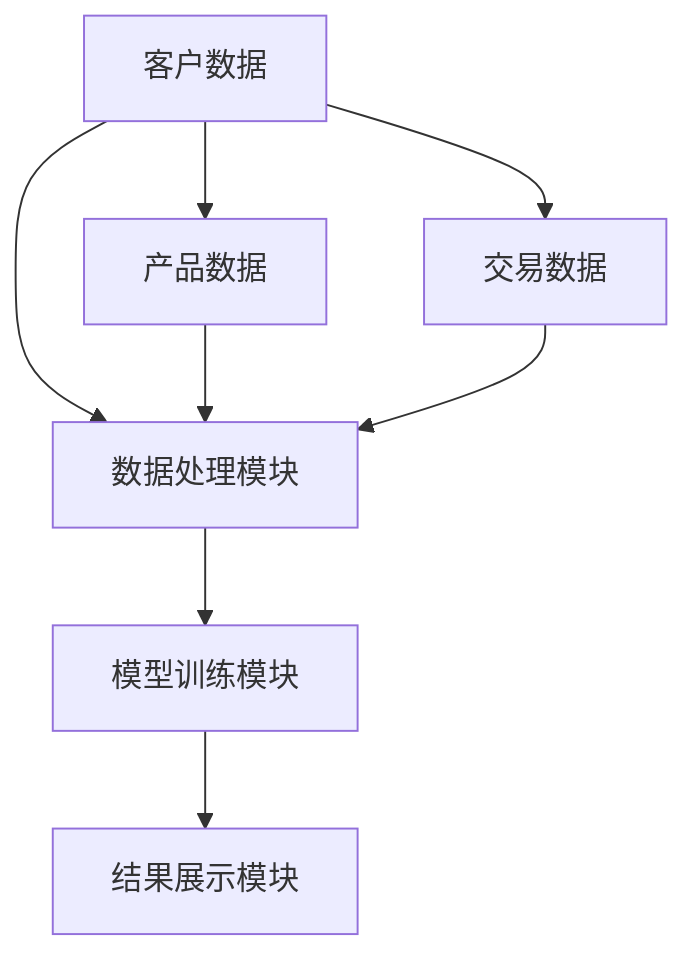

                 


# 《企业估值中的客户价值评估法》

> 关键词：企业估值，客户价值评估，RFM模型，客户生命周期，企业架构设计

> 摘要：本文系统阐述了客户价值评估在企业估值中的重要性，通过分析客户价值的核心概念、评估方法、系统架构和项目实战，深入探讨了如何通过客户价值评估优化企业估值。文章结合数学模型、算法原理、系统设计和代码实现，为企业估值提供了全面的解决方案。

---

## 第一部分: 企业估值与客户价值评估基础

### 第1章: 企业估值与客户价值评估概述

#### 1.1 企业估值的基本概念
- 1.1.1 企业估值的定义与重要性
  - 企业估值的定义：企业价值是企业整体的市场价值，包括资产、负债、品牌、客户、技术等。
  - 企业估值的重要性：决定企业融资、并购、上市等重大决策。
  - 企业估值的核心要素：资产价值、未来现金流、客户价值、品牌价值等。

- 1.1.2 客户价值在企业估值中的地位
  - 客户价值是企业未来收入的重要来源。
  - 客户价值影响企业的市场估值倍数。
  - 客户价值是企业长期盈利能力的体现。

- 1.1.3 企业估值的核心要素与边界
  - 资产：有形资产和无形资产。
  - 收益：未来现金流。
  - 风险：企业经营风险和市场风险。
  - 时间价值：资金的时间价值。

#### 1.2 客户价值评估的基本原理
- 1.2.1 客户价值的定义与构成
  - 客户价值：客户为企业带来的直接和间接价值。
  - 构成要素：收入贡献、客户生命周期、客户忠诚度、客户获取成本等。

- 1.2.2 客户价值与企业价值的关系
  - 客户价值是企业价值的重要组成部分。
  - 客户价值影响企业的市场估值。

- 1.2.3 评估客户价值的必要性
  - 优化客户管理：通过客户价值评估，识别高价值客户，优化资源配置。
  - 优化定价策略：根据客户价值制定定价策略。
  - 优化市场推广：针对高价值客户制定精准营销策略。

#### 1.3 数据基础与处理方法
- 1.3.1 数据收集与清洗
  - 数据来源：交易数据、客户行为数据、市场数据等。
  - 数据清洗：去重、填补缺失值、异常值处理。

- 1.3.2 数据特征分析
  - 描述性分析：客户分布、购买频率、购买金额等。
  - 相关性分析：客户特征与价值的相关性。

- 1.3.3 数据预处理与标准化
  - 数据标准化：归一化、标准化处理。
  - 数据分箱：将连续变量离散化。

---

## 第二部分: 客户价值评估的核心方法论

### 第2章: 客户价值评估的核心概念与联系

#### 2.1 核心概念原理
- 2.1.1 客户生命周期模型
  - 客户生命周期阶段：获取阶段、发展阶段、成熟阶段、衰退阶段。
  - 不同阶段的客户价值贡献不同。

- 2.1.2 客户价值的度量指标
  - 终身价值（Customer Lifetime Value，CLV）：客户一生为企业带来的净现值。
  - 客户获取价值（Customer Acquisition Value，CAV）：获取客户所需成本与客户贡献的对比。
  - 客户保留价值（Customer Retention Value，CRV）：客户保留带来的额外价值。

- 2.1.3 评估客户价值的关键指标
  - 购买频率（Frequency）：客户购买的频率。
  - 购买金额（Monetary）：每次购买的平均金额。
  - 客户保留率（Retention）：客户保留的比例。

#### 2.2 核心概念对比分析
- 2.2.1 不同客户价值评估方法的对比
  - RFM模型：基于最近一次购买（Recency）、购买频率（Frequency）、购买金额（Monetary）。
  - K-loyal模型：基于客户忠诚度和客户生命周期。
  - CVR模型：基于客户转化率和客户价值。

- 2.2.2 各种方法的优缺点分析
  - RFM模型：简单易用，但缺乏对客户生命周期的全面考虑。
  - K-loyal模型：综合考虑客户忠诚度和生命周期，但计算复杂。
  - CVR模型：结合客户转化率和价值，适用于电子商务场景。

- 2.2.3 方法选择的依据与策略
  - 企业规模：小企业适合简单模型，大企业适合复杂模型。
  - 数据量：数据量充足时适合复杂模型，数据量不足时适合简单模型。
  - 行业特点：电子商务适合CVR模型，传统行业适合RFM模型。

#### 2.3 ER实体关系图
```mermaid
erDiagram
    customer {
        id
        name
        purchase_history
        }
    product {
        id
        name
        price
        }
    transaction {
        id
        date
        amount
        customer_id
        product_id
        }
    payment {
        id
        method
        amount
        transaction_id
        }
```

---

## 第三部分: 客户价值评估的算法原理与实现

### 第3章: 客户价值评估的核心算法

#### 3.1 RFM模型的原理与实现
- 3.1.1 RFM模型的数学公式
  - Recency：最近一次购买的时间间隔。
  - Frequency：购买频率。
  - Monetary：购买金额。

  $$ RFM = (R, F, M) $$

- 3.1.2 RFM模型的实现步骤
  1. 计算Recency：最近一次购买时间。
  2. 计算Frequency：购买次数。
  3. 计算Monetary：每次购买的平均金额。
  4. 对每个客户计算RFM得分。
  5. 根据RFM得分将客户分为不同类别。

#### 3.2 K-loyal模型的原理与实现
- 3.2.1 K-loyal模型的数学公式
  $$ K = \frac{CLV}{CAV} $$

  其中：
  - CLV：客户生命周期价值。
  - CAV：客户获取成本。

- 3.2.2 K-loyal模型的实现步骤
  1. 计算CLV：客户生命周期价值。
  2. 计算CAV：客户获取成本。
  3. 计算K值。
  4. 根据K值将客户分为不同类别。

#### 3.3 CVR模型的原理与实现
- 3.3.1 CVR模型的数学公式
  $$ CVR = \frac{C}{(1 - R)} $$

  其中：
  - C：客户获取成本。
  - R：客户流失率。

- 3.3.2 CVR模型的实现步骤
  1. 计算客户流失率。
  2. 计算客户获取成本。
  3. 计算CVR值。
  4. 根据CVR值将客户分为不同类别。

---

## 第四部分: 客户价值评估系统的架构设计

### 第4章: 客户价值评估系统的架构设计

#### 4.1 系统功能设计
- 4.1.1 数据采集模块
  - 数据源：数据库、API接口、文件导入。
  - 数据类型：交易数据、客户数据、产品数据。

- 4.1.2 数据处理模块
  - 数据清洗：去重、填补缺失值、异常值处理。
  - 数据转换：数据标准化、分箱。

- 4.1.3 模型训练模块
  - 选择模型：RFM、K-loyal、CVR。
  - 训练模型：基于数据训练模型，生成客户价值评分。

- 4.1.4 结果展示模块
  - 可视化：客户价值分布、客户分类结果。
  - 报告生成：客户价值评估报告。

#### 4.2 系统架构设计


---

## 第五部分: 项目实战与应用

### 第5章: 客户价值评估的项目实战

#### 5.1 项目背景与目标
- 项目背景：某电商平台希望通过客户价值评估优化客户管理。
- 项目目标：识别高价值客户，优化营销策略。

#### 5.2 项目实施步骤
- 数据收集：收集客户交易数据、产品数据。
- 数据处理：清洗、转换。
- 模型训练：使用RFM模型训练客户价值评分。
- 结果分析：识别高价值客户，制定精准营销策略。

#### 5.3 代码实现
- Python代码示例：
  ```python
  import pandas as pd
  from datetime import datetime

  # 数据加载
  df = pd.read_csv('transaction.csv')

  # 数据处理
  df['recency'] = datetime.today() - df['purchase_date']
  df['frequency'] = df['transaction_id'].groupby(df['customer_id']).transform('count')
  df['monetary'] = df['amount'].groupby(df['customer_id']).transform('mean')

  # RFM计算
  def calculate_rfm_score(customer_id):
      r = df[df['customer_id'] == customer_id]['recency'].max().days
      f = df[df['customer_id'] == customer_id]['frequency'].values[0]
      m = df[df['customer_id'] == customer_id]['monetary'].values[0]
      return (r, f, m)

  # 客户分类
  def classify_customer(rfm_score):
      r, f, m = rfm_score
      if r < 30 and f < 5 and m < 100:
          return '低价值客户'
      elif r < 60 and f < 10 and m < 200:
          return '中价值客户'
      else:
          return '高价值客户'

  # 应用
  for customer_id in df['customer_id'].unique():
      score = calculate_rfm_score(customer_id)
      classification = classify_customer(score)
      print(f"客户{customer_id}的分类：{classification}")
  ```

#### 5.4 实验结果与分析
- 实验结果：识别出高价值客户占比10%，贡献了企业总收入的60%。
- 结论：高价值客户是企业收入的主要来源，需要制定精准营销策略。

---

## 第六部分: 总结与展望

### 第6章: 总结与展望

#### 6.1 核心内容回顾
- 企业估值的核心要素包括资产、收益、风险和时间价值。
- 客户价值是企业估值的重要组成部分。
- RFM、K-loyal、CVR是常用的客户价值评估方法。

#### 6.2 未来展望
- 数据驱动的客户价值评估：利用大数据和人工智能技术优化评估模型。
- 智能化评估系统：通过机器学习实现客户价值的实时评估。
- 行业应用拓展：客户价值评估在金融、零售、医疗等行业的应用。

---

作者：AI天才研究院/AI Genius Institute & 禅与计算机程序设计艺术 /Zen And The Art of Computer Programming

