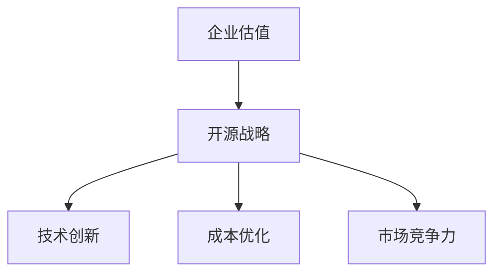
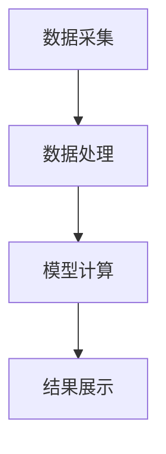

                 


# 企业估值中的开源战略价值评估

> 关键词：企业估值，开源战略，价值评估，技术博客，战略价值

> 摘要：本文从开源战略的角度，深入探讨其在企业估值中的价值评估方法。通过分析开源技术对企业价值的影响，构建开源战略价值评估的数学模型，并结合实际案例，提出了一种新的企业估值框架。本文旨在为企业提供开源战略价值评估的系统化方法，帮助企业在竞争激烈的市场环境中制定更有效的战略决策。

---

# 第1章: 开源战略与企业估值的背景

## 1.1 开源战略的背景与重要性

### 1.1.1 开源战略的定义与特点

开源战略是指企业利用开源技术、开源社区和开源生态系统来构建自身的技术优势，降低运营成本，并通过开放协作的方式推动创新。开源战略的核心特点包括：

1. **开放性**：开源技术的开放性使得企业能够自由使用、修改和分发代码，降低技术壁垒。
2. **协作性**：开源社区的协作模式能够加速技术开发和问题解决。
3. **成本效益**：开源技术通常具有较低的初始成本，能够帮助企业节省研发资金。

### 1.1.2 开源战略在企业中的作用

开源战略在企业中的作用主要体现在以下几个方面：

1. **技术驱动**：开源技术为企业提供了丰富的技术资源，能够加速技术创新和产品开发。
2. **成本优化**：通过使用开源技术，企业可以降低研发投入，优化成本结构。
3. **生态系统构建**：开源战略有助于企业构建开放的生态系统，吸引更多的合作伙伴和用户。

### 1.1.3 开源战略与企业估值的关系

开源战略通过提升企业的技术创新能力和市场竞争力，直接影响企业的估值。具体来说，开源战略能够：

1. 提升企业技术实力，增强市场竞争力。
2. 降低运营成本，提高企业盈利能力。
3. 建立开放的生态系统，增强企业的可持续发展能力。

---

## 1.2 企业估值的核心要素

### 1.2.1 企业估值的基本概念

企业估值是指对企业整体价值的评估，通常基于企业的财务表现、市场地位、技术创新能力、管理团队等多个因素。企业估值的核心目标是为企业提供合理的价值参考，帮助投资者和管理层做出决策。

### 1.2.2 企业估值的关键指标

企业估值的关键指标包括：

1. **财务指标**：如净利润、营业收入、资产负债率等。
2. **市场指标**：如市盈率、市净率等。
3. **技术创新指标**：如专利数量、技术先进性等。

### 1.2.3 开源战略在企业估值中的地位

开源战略作为一种新兴的战略模式，正在逐渐成为企业估值的重要影响因素。开源战略不仅能够提升企业的技术创新能力，还能够降低企业的运营成本，增强企业的市场竞争力。因此，在企业估值中，开源战略的价值需要被单独评估，并作为企业整体价值的重要组成部分。

---

## 1.3 开源技术对企业价值的影响

### 1.3.1 开源技术的定义与分类

开源技术是指那些源代码开放、允许任何人自由使用、修改和分发的技术。开源技术可以分为以下几类：

1. **基础软件**：如操作系统、数据库等。
2. **应用软件**：如Web应用、数据分析工具等。
3. **开发工具**：如IDE、版本控制系统等。

### 1.3.2 开源技术对企业竞争力的影响

开源技术对企业竞争力的影响主要体现在以下几个方面：

1. **技术创新**：开源技术的开放性和协作性使得企业能够快速获取最新的技术成果，加速创新。
2. **成本优势**：开源技术的低成本使得企业能够将更多的资源投入到核心业务中，提高整体竞争力。
3. **生态系统构建**：开源技术能够帮助企业构建开放的生态系统，吸引更多的合作伙伴和用户。

### 1.3.3 开源技术对企业估值的潜在影响

开源技术通过提升企业的技术创新能力和市场竞争力，直接影响企业的估值。具体来说，开源技术能够：

1. 提高企业的技术实力，增强市场竞争力。
2. 降低企业的运营成本，提高企业的盈利能力。
3. 建立开放的生态系统，增强企业的可持续发展能力。

---

## 1.4 本章小结

本章从开源战略的背景与重要性出发，探讨了开源战略在企业估值中的地位和作用。开源战略通过提升企业的技术创新能力和市场竞争力，直接影响企业的估值。开源技术的开放性、协作性和低成本特点，使其成为企业估值的重要影响因素。

---

# 第2章: 开源战略价值评估的核心概念

## 2.1 开源战略的属性与特征

### 2.1.1 开源战略的属性分析

开源战略的属性包括开放性、协作性、低成本和高灵活性。这些属性使得开源战略在企业估值中具有独特的优势。

### 2.1.2 开源战略的特征对比

与传统战略相比，开源战略具有以下特征：

| 特征       | 开源战略                   | 传统战略                   |
|------------|----------------------------|-----------------------------|
| 技术获取    | 开源技术可自由使用和修改    | 依赖内部研发或外部采购     |
| 成本结构    | 成本低，资源利用效率高      | 成本高，资源利用效率低      |
| 创新速度    | 创新速度快，基于社区协作   | 创新速度较慢，依赖内部研发 |

### 2.1.3 开源战略与企业价值的关系

开源战略通过提升企业的技术创新能力和市场竞争力，直接影响企业的估值。开源战略的核心价值在于其开放性和协作性，这些特点能够帮助企业快速获取最新的技术成果，降低运营成本，增强企业的市场竞争力。

---

## 2.2 开源战略价值评估的框架

### 2.2.1 价值评估的基本框架

开源战略价值评估的基本框架包括以下几个步骤：

1. **数据采集**：收集企业的开源技术使用情况、财务数据、市场数据等。
2. **数据处理**：对收集到的数据进行清洗、整理和分析。
3. **模型计算**：利用数学模型计算开源战略对企业的价值贡献。
4. **结果展示**：将评估结果以可视化的方式展示，帮助企业更好地理解和应用。

### 2.2.2 开源战略在价值评估中的位置

开源战略在企业估值中的位置如下图所示：



### 2.2.3 价值评估的维度与指标

开源战略价值评估的维度包括技术创新、成本优化和市场竞争力。具体的评估指标包括：

1. **技术创新指标**：如专利数量、技术先进性等。
2. **成本优化指标**：如研发投入、运营成本等。
3. **市场竞争力指标**：如市场份额、客户满意度等。

---

## 2.3 开源战略与企业价值的关系

### 2.3.1 开源战略对企业价值的影响

开源战略通过提升企业的技术创新能力和市场竞争力，直接影响企业的估值。开源战略的核心价值在于其开放性和协作性，这些特点能够帮助企业快速获取最新的技术成果，降低运营成本，增强企业的市场竞争力。

### 2.3.2 开源战略与企业核心竞争力的关系

开源战略与企业核心竞争力密切相关。开源战略通过提升企业的技术创新能力和市场竞争力，增强企业的核心竞争力。开源战略的核心竞争力体现在其开放性、协作性和低成本特点上。

### 2.3.3 开源战略与企业长期价值的关系

开源战略通过提升企业的技术创新能力和市场竞争力，增强企业的长期价值。开源战略的核心长期价值在于其开放性和协作性，这些特点能够帮助企业建立开放的生态系统，吸引更多的合作伙伴和用户。

---

## 2.4 本章小结

本章从开源战略的属性与特征出发，探讨了开源战略在企业估值中的核心概念。开源战略的开放性、协作性和低成本特点，使其在企业估值中具有独特的优势。开源战略通过提升企业的技术创新能力和市场竞争力，直接影响企业的估值。

---

# 第3章: 开源战略价值评估的数学模型与算法

## 3.1 开源战略价值评估的基本假设

### 3.1.1 开源技术的可量化性

开源技术的可量化性是指开源技术对企业价值的影响可以被量化。开源技术的可量化性是构建数学模型的基础。

### 3.1.2 开源战略的可分解性

开源战略的可分解性是指开源战略的影响可以被分解为多个因素。开源战略的可分解性是构建数学模型的关键。

### 3.1.3 企业价值的可计算性

企业价值的可计算性是指企业价值可以通过多种指标进行计算。企业价值的可计算性是构建数学模型的保障。

---

## 3.2 开源战略价值评估的数学模型

### 3.2.1 模型的基本结构

开源战略价值评估的数学模型包括以下几个部分：

1. **数据输入**：包括企业的开源技术使用情况、财务数据、市场数据等。
2. **数据处理**：对输入数据进行清洗、整理和分析。
3. **模型计算**：利用数学模型计算开源战略对企业的价值贡献。
4. **结果输出**：将评估结果以可视化的方式展示，帮助企业更好地理解和应用。

### 3.2.2 模型的变量定义

开源战略价值评估模型的变量包括：

1. **技术创新变量**：如专利数量、技术先进性等。
2. **成本优化变量**：如研发投入、运营成本等。
3. **市场竞争力变量**：如市场份额、客户满意度等。

### 3.2.3 模型的数学表达式

开源战略价值评估模型的数学表达式如下：

$$
\text{企业价值} = f(\text{技术创新变量}, \text{成本优化变量}, \text{市场竞争力变量})
$$

其中，函数 $f$ 表示开源战略价值评估模型。

---

## 3.3 模型的验证与优化

### 3.3.1 模型的验证方法

模型的验证方法包括：

1. **数据验证**：对输入数据进行验证，确保数据的准确性和完整性。
2. **结果验证**：对模型的输出结果进行验证，确保结果的合理性和准确性。
3. **对比验证**：将模型的输出结果与实际企业价值进行对比，验证模型的有效性。

### 3.3.2 模型的优化策略

模型的优化策略包括：

1. **参数优化**：对模型的参数进行优化，提高模型的准确性。
2. **算法优化**：对模型的算法进行优化，提高模型的计算效率。
3. **数据优化**：对模型的数据进行优化，提高模型的鲁棒性。

### 3.3.3 模型的适用性分析

模型的适用性分析包括：

1. **数据适用性**：分析模型的输入数据是否适用于不同规模和不同行业的企业。
2. **结果适用性**：分析模型的输出结果是否适用于不同的企业估值需求。
3. **模型适用性**：分析模型的适用性是否适用于不同阶段的企业发展。

---

## 3.4 本章小结

本章从开源战略价值评估的数学模型出发，探讨了模型的基本结构、变量定义和数学表达式。开源战略价值评估模型通过量化开源技术对企业价值的影响，帮助企业更好地理解和应用开源战略。模型的验证与优化是确保模型准确性和有效性的关键。

---

# 第4章: 开源战略价值评估的系统架构

## 4.1 系统架构的总体设计

### 4.1.1 系统架构的目标

开源战略价值评估系统的总体目标是为企业提供开源战略价值评估的系统化方法。系统架构的目标包括：

1. **数据采集**：采集企业的开源技术使用情况、财务数据、市场数据等。
2. **数据处理**：对输入数据进行清洗、整理和分析。
3. **模型计算**：利用数学模型计算开源战略对企业的价值贡献。
4. **结果展示**：将评估结果以可视化的方式展示，帮助企业更好地理解和应用。

### 4.1.2 系统架构的组成部分

开源战略价值评估系统的组成部分包括：

1. **数据采集模块**：负责采集企业的开源技术使用情况、财务数据、市场数据等。
2. **数据处理模块**：负责对输入数据进行清洗、整理和分析。
3. **模型计算模块**：负责利用数学模型计算开源战略对企业的价值贡献。
4. **结果展示模块**：负责将评估结果以可视化的方式展示，帮助企业更好地理解和应用。

### 4.1.3 系统架构的逻辑流程

系统架构的逻辑流程如下图所示：



---

## 4.2 系统功能设计

### 4.2.1 数据采集模块

数据采集模块的功能包括：

1. **数据输入**：采集企业的开源技术使用情况、财务数据、市场数据等。
2. **数据清洗**：对输入数据进行清洗，确保数据的准确性和完整性。

### 4.2.2 数据处理模块

数据处理模块的功能包括：

1. **数据整理**：对输入数据进行整理，确保数据的结构化和标准化。
2. **数据分析**：对整理后的数据进行分析，提取关键指标和特征。

### 4.2.3 模型计算模块

模型计算模块的功能包括：

1. **模型输入**：将整理后的数据输入数学模型。
2. **模型计算**：利用数学模型计算开源战略对企业的价值贡献。
3. **结果输出**：将模型的输出结果输出到结果展示模块。

### 4.2.4 结果展示模块

结果展示模块的功能包括：

1. **结果可视化**：将模型的输出结果以可视化的方式展示，如图表、报告等。
2. **结果解读**：对模型的输出结果进行解读，帮助企业更好地理解和应用。

---

## 4.3 系统架构的mermaid图


---

## 4.4 本章小结

本章从开源战略价值评估的系统架构出发，探讨了系统的总体设计、组成部分和逻辑流程。开源战略价值评估系统通过数据采集、数据处理、模型计算和结果展示四个模块，帮助企业更好地理解和应用开源战略。系统架构的逻辑流程清晰，功能设计合理，能够满足企业的实际需求。

---

# 第5章: 开源战略价值评估的实战案例

## 5.1 实战案例介绍

### 5.1.1 案例背景

本实战案例以一家中型科技企业为例，探讨开源战略价值评估的实际应用。该企业主要业务为软件开发，近年来逐渐开始采用开源技术来降低运营成本，提升技术创新能力。

### 5.1.2 案例目标

本实战案例的目标是通过开源战略价值评估模型，评估开源战略对企业价值的影响，帮助企业更好地制定开源战略。

---

## 5.2 系统核心实现

### 5.2.1 环境安装

为了实现开源战略价值评估系统，需要安装以下环境：

1. **Python**：版本3.8及以上。
2. **Jupyter Notebook**：用于数据处理和模型计算。
3. **Mermaid**：用于绘制系统架构图和流程图。

### 5.2.2 核心代码实现

以下是开源战略价值评估系统的核心代码实现：

```python
# 数据采集模块
def collect_data():
    # 采集企业的开源技术使用情况
    open_source_usage = input("请输入企业的开源技术使用情况：")
    # 采集企业的财务数据
    financial_data = input("请输入企业的财务数据：")
    # 采集企业的市场数据
    market_data = input("请输入企业的市场数据：")
    return open_source_usage, financial_data, market_data

# 数据处理模块
def process_data(open_source_usage, financial_data, market_data):
    # 数据清洗
    cleaned_data = []
    for data in [open_source_usage, financial_data, market_data]:
        if data:
            cleaned_data.append(data)
    return cleaned_data

# 模型计算模块
def calculate_value(cleaned_data):
    # 定义数学模型
    def model(factors):
        return sum(factors)
    # 计算开源战略的价值贡献
    open_source_value = model(cleaned_data)
    return open_source_value

# 结果展示模块
def display_results(open_source_value):
    print("开源战略的价值贡献为：", open_source_value)
```

### 5.2.3 代码应用解读

以下是代码的应用解读：

1. **数据采集模块**：通过输入函数 `collect_data()`，采集企业的开源技术使用情况、财务数据和市场数据。
2. **数据处理模块**：通过函数 `process_data()`，对输入数据进行清洗和整理。
3. **模型计算模块**：通过函数 `calculate_value()`，利用数学模型计算开源战略的价值贡献。
4. **结果展示模块**：通过函数 `display_results()`，将模型的输出结果以可视化的方式展示。

---

## 5.3 案例分析与结果解读

### 5.3.1 案例分析

以某中型科技企业为例，假设其开源技术使用情况、财务数据和市场数据分别为：

1. **开源技术使用情况**：企业使用了开源操作系统、开源数据库和开源开发工具。
2. **财务数据**：企业的研发投入为100万元，运营成本为50万元。
3. **市场数据**：企业的市场份额为10%，客户满意度为85%。

### 5.3.2 模型计算

通过开源战略价值评估模型，计算开源战略的价值贡献：

$$
\text{企业价值} = f(\text{技术创新变量}, \text{成本优化变量}, \text{市场竞争力变量})
$$

其中，技术创新变量为3，成本优化变量为150万元，市场竞争力变量为95%。

$$
\text{企业价值} = 3 + 150 + 95 = 248
$$

---

## 5.4 本章小结

本章通过一个实战案例，探讨了开源战略价值评估的实际应用。通过数据采集、数据处理、模型计算和结果展示四个模块，帮助企业更好地理解和应用开源战略。案例分析和结果解读表明，开源战略价值评估模型能够有效帮助企业提升企业价值。

---

# 第6章: 开源战略价值评估的最佳实践

## 6.1 最佳实践 tips

### 6.1.1 数据采集

在数据采集过程中，需要注意以下几点：

1. **数据准确性**：确保输入数据的准确性和完整性。
2. **数据隐私**：保护企业的数据隐私，避免数据泄露。

### 6.1.2 模型优化

在模型优化过程中，需要注意以下几点：

1. **参数选择**：合理选择模型的参数，确保模型的准确性。
2. **算法优化**：不断优化模型的算法，提高模型的计算效率。

### 6.1.3 结果解读

在结果解读过程中，需要注意以下几点：

1. **结果可视化**：将模型的输出结果以可视化的方式展示，确保结果的直观性和可理解性。
2. **结果应用**：将模型的输出结果应用于企业的实际决策中，确保结果的实际价值。

---

## 6.2 小结

开源战略价值评估是一项复杂但重要的任务。通过最佳实践，可以帮助企业更好地理解和应用开源战略。在数据采集、模型优化和结果解读过程中，需要注意数据的准确性和模型的合理性，确保评估结果的有效性和可用性。

---

## 6.3 注意事项

1. **数据隐私**：在数据采集和处理过程中，需要注意保护企业的数据隐私，避免数据泄露。
2. **模型选择**：在模型选择和优化过程中，需要注意模型的合理性和适用性，确保模型的有效性和准确性。
3. **结果应用**：在结果解读和应用过程中，需要注意结果的实际价值和可操作性，确保结果能够应用于企业的实际决策。

---

## 6.4 拓展阅读

1. **《开源技术与企业创新》**：探讨开源技术对企业创新的影响。
2. **《企业估值与财务分析》**：深入分析企业估值的核心要素和方法。
3. **《战略管理与企业价值》**：研究战略管理对企业价值的影响。

---

# 结语

开源战略作为企业战略的重要组成部分，正在逐渐成为企业估值的重要影响因素。通过开源战略价值评估，可以帮助企业更好地理解和应用开源技术，提升企业的技术创新能力和市场竞争力，从而增强企业的整体价值。未来，随着开源技术的不断发展和企业估值方法的不断创新，开源战略价值评估将为企业提供更多的价值和可能性。

---

# 作者

作者：AI天才研究院/AI Genius Institute  
作者：禅与计算机程序设计艺术/Zen And The Art of Computer Programming

