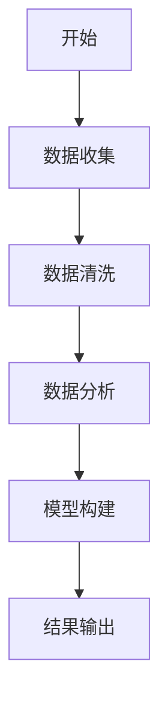
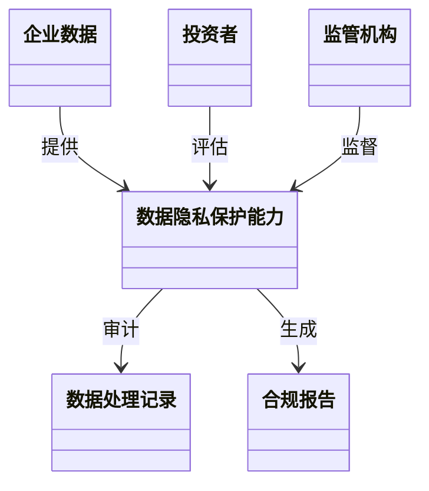
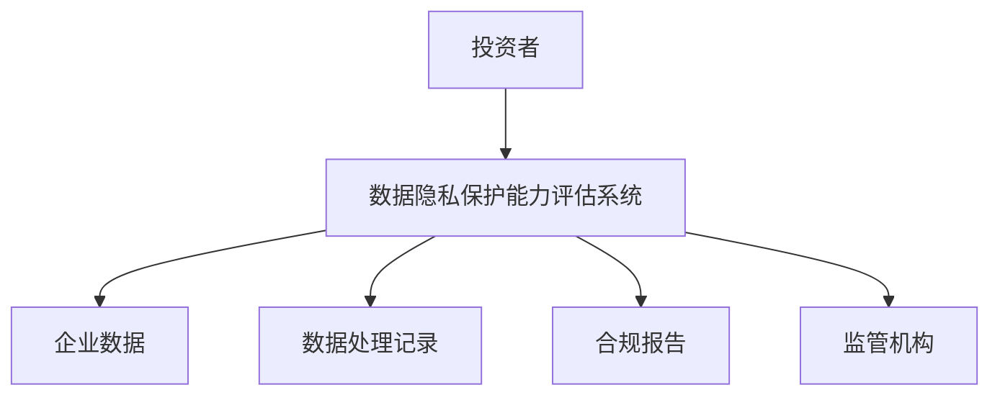
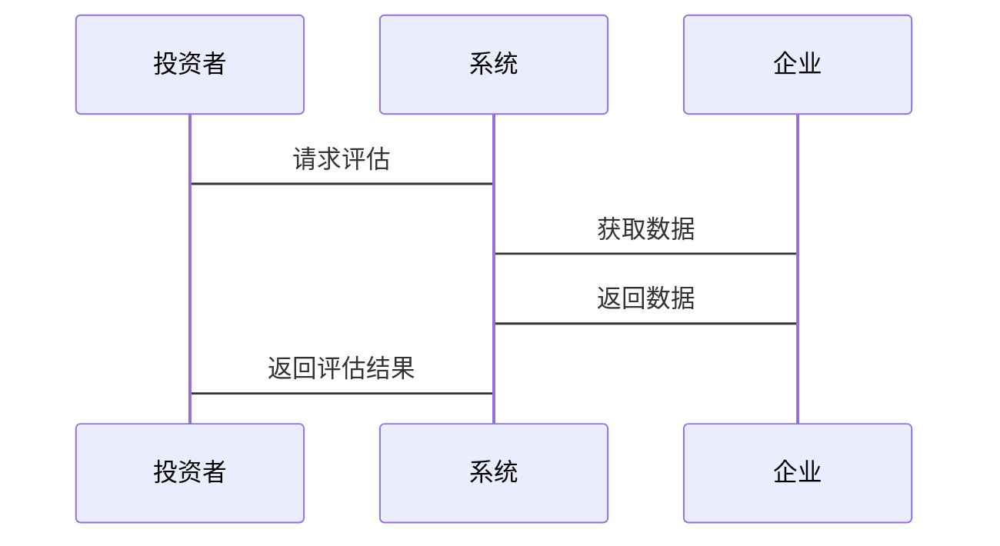

                 


# 《企业估值中的数据隐私保护能力评估》

## 关键词：企业估值，数据隐私，隐私保护，数据安全，评估方法

## 摘要：数据隐私保护能力评估是企业估值中的关键环节，通过分析企业的数据管理能力，评估其对隐私保护的投入和效果，从而为企业价值评估提供重要依据。本文详细探讨了数据隐私保护能力评估的核心概念、算法原理、系统架构设计和项目实战，为读者提供全面的指导。

---

## 第一部分：背景与核心概念

### 第1章：数据隐私保护能力评估的背景与问题背景

#### 1.1 数据隐私保护的重要性

- 1.1.1 数据隐私保护的现状与挑战
  - 当今社会，数据被视为企业的核心资产，保护数据隐私成为企业的重要任务。然而，数据泄露、滥用等问题频发，给企业带来巨大的损失和声誉损害。数据隐私保护不仅是技术问题，更是法律和道德责任。

- 1.1.2 数据隐私保护对企业估值的影响
  - 数据隐私保护能力直接影响企业的信用和合规性，是投资者评估企业价值的重要因素。良好的数据隐私保护能力可以提升企业形象，增强投资者信心，从而提高企业估值。

#### 1.2 数据隐私保护能力评估的必要性

- 1.2.1 企业估值中的数据隐私问题
  - 数据隐私问题是企业在运营中面临的主要风险之一。企业如何处理数据隐私问题，直接影响其市场价值。评估数据隐私保护能力，能够帮助企业识别和 mitigate 风险，提升市场竞争力。

- 1.2.2 数据隐私保护能力对投资决策的影响
  - 投资者在评估企业时，越来越关注数据隐私保护能力。良好的数据隐私保护能力可以降低投资风险，提升企业的长期价值。反之，数据隐私问题可能导致企业估值下降，甚至影响投资决策。

#### 1.3 数据隐私保护能力评估的核心概念

- 1.3.1 数据隐私保护能力的定义
  - 数据隐私保护能力是指企业在收集、存储、处理和传输数据过程中，保护数据隐私的能力。这包括技术措施、管理策略和法律法规遵守等方面。

- 1.3.2 数据隐私保护能力的评估维度
  - 数据隐私保护能力评估可以从技术能力、管理能力、合规能力三个维度进行。技术能力包括数据加密、访问控制等；管理能力包括数据生命周期管理、员工培训等；合规能力包括遵守数据隐私相关法律法规。

- 1.3.3 数据隐私保护能力与企业估值的关系
  - 数据隐私保护能力是企业估值的重要组成部分。良好的数据隐私保护能力可以提升企业的市场价值，增强投资者的信心。同时，数据隐私问题可能导致法律风险和声誉损失，从而降低企业估值。

---

## 第二部分：数据隐私保护能力评估的核心概念与联系

### 第2章：数据隐私保护能力评估的核心要素

#### 2.1 数据隐私保护能力的属性特征对比

| 属性 | 特征 |
|------|------|
| 数据分类 | 敏感数据、一般数据 |
| 访问控制 | 基于角色的访问控制（RBAC）、基于属性的访问控制（ABAC） |
| 加密技术 | 对称加密、非对称加密、哈希函数 |
| 数据生命周期管理 | 数据生成、存储、处理、共享、销毁 |
| 合规性 | GDPR、CCPA、ISO 27701 等 |

- 2.1.2 数据隐私保护能力的对比分析
  - 对比分析可以帮助企业识别自身的数据隐私保护能力的优缺点，找到改进的方向。例如，某企业可能在技术能力上较强，但在管理能力上较弱，需要加强员工培训和数据生命周期管理。

#### 2.2 数据隐私保护能力的ER实体关系图

```mermaid
erDiagram
    actor 投资者
    actor 企业
    actor 监管机构
    database 数据隐私保护能力
    database 企业数据
    database 数据处理记录
    database 合规报告
    investor --> 数据隐私保护能力: 评估
    企业 --> 数据隐私保护能力: 提供
    监管机构 --> 数据隐私保护能力: 监督
    数据隐私保护能力 --> 企业数据: 保护
    数据隐私保护能力 --> 数据处理记录: 审计
    数据隐私保护能力 --> 合规报告: 生成
```

- 2.2.2 实体关系图的解释
  - 投资者、企业和监管机构是主要的参与者。投资者评估企业的数据隐私保护能力，企业提供相关数据，监管机构监督数据保护过程。数据隐私保护能力是核心数据库，与企业数据、数据处理记录和合规报告相关联。

#### 2.3 数据隐私保护能力的数学模型

- 2.3.1 数据隐私保护能力的评估公式
  $$数据隐私保护能力 = \sum_{i=1}^{n} (权重_i \times 评估指标_i)$$
  其中，权重_i 是各评估指标的权重，评估指标_i 是各指标的评估结果。

- 2.3.2 数据隐私保护能力的评估流程
  ```mermaid
  graph TD
      A[开始] --> B[数据收集]
      B --> C[数据分类]
      C --> D[访问控制]
      D --> E[加密技术]
      E --> F[数据生命周期管理]
      F --> G[合规性检查]
      G --> H[评估结果]
  ```

---

## 第三部分：数据隐私保护能力评估的算法原理

### 第3章：数据隐私保护能力评估的算法原理

#### 3.1 数据隐私保护能力评估的算法流程

- 3.1.1 数据隐私保护能力评估的步骤
  - 数据收集：收集企业的数据隐私保护相关数据。
  - 数据清洗：去除噪声数据，确保数据质量。
  - 数据分析：使用统计方法和机器学习算法分析数据，识别潜在风险。
  - 模型构建：构建数据隐私保护能力评估模型。
  - 结果输出：输出评估结果，并提供改进建议。

- 3.1.2 数据隐私保护能力评估的算法流程图（mermaid）



#### 3.2 数据隐私保护能力评估的数学模型

- 3.2.1 数据隐私保护能力的评估公式
  $$评估结果 = f(权重_1 \times 指标_1 + 权重_2 \times 指标_2 + ... + 权重_n \times 指标_n)$$
  其中，f 是综合函数，权重_i 是各指标的权重，指标_i 是各指标的评估值。

- 3.2.2 数据隐私保护能力的数学模型解释
  - 通过加权平均的方法，综合考虑各评估指标的影响，得出最终的评估结果。权重的分配可以根据行业的特点和企业的实际情况进行调整。

#### 3.3 数据隐私保护能力评估的代码实现

- 3.3.1 环境安装与配置
  - 需要安装 Python、Pandas、Scikit-learn 等库。

- 3.3.2 核心代码实现

```python
import pandas as pd
from sklearn import metrics

# 数据加载
data = pd.read_csv('data.csv')

# 特征选择
features = ['技术能力', '管理能力', '合规能力']
X = data[features]
y = data['标签']  # 标签可以是0（低风险）或1（高风险）

# 模型训练
from sklearn.tree import DecisionTreeClassifier
model = DecisionTreeClassifier()
model.fit(X, y)

# 模型预测
预测 = model.predict(X)

# 模型评估
准确率 = metrics.accuracy_score(y, 预测)
精确率 = metrics.precision_score(y, 预测)
召回率 = metrics.recall_score(y, 预测)
print(f'准确率: {准确率}, 精确率: {精确率}, 召回率: {召回率}')
```

- 3.3.3 代码解读与分析
  - 使用决策树模型对数据进行分类，评估企业的数据隐私保护能力。根据准确率、精确率和召回率评估模型的性能，从而得出企业的数据隐私保护能力等级。

---

## 第四部分：数据隐私保护能力评估的系统架构设计

### 第4章：数据隐私保护能力评估的系统架构

#### 4.1 系统功能设计

- 4.1.1 数据隐私保护能力评估的领域模型（mermaid类图）



- 4.1.2 系统功能模块划分
  - 数据收集模块：负责收集企业的数据隐私保护相关数据。
  - 数据处理模块：对数据进行清洗、转换和存储。
  - 数据分析模块：对数据进行分析，识别潜在风险。
  - 模型构建模块：构建数据隐私保护能力评估模型。
  - 结果输出模块：输出评估结果，并提供改进建议。

#### 4.2 系统架构设计

- 4.2.1 数据隐私保护能力评估的系统架构图（mermaid）



- 4.2.2 系统架构设计的解释
  - 系统由投资者、企业数据、数据处理记录、合规报告和监管机构组成。投资者通过系统评估企业的数据隐私保护能力，企业提供相关数据，监管机构监督数据保护过程。

#### 4.3 系统接口设计

- 4.3.1 数据隐私保护能力评估的接口定义
  - 数据接口：企业数据接口、数据处理记录接口、合规报告接口。
  - 用户接口：投资者接口、监管机构接口。

- 4.3.2 系统接口设计的实现
  - 使用 RESTful API 设计接口，实现数据的交互和系统的集成。

#### 4.4 系统交互设计

- 4.4.1 数据隐私保护能力评估的交互流程图（mermaid序列图）



---

## 第五部分：数据隐私保护能力评估的项目实战

### 第5章：数据隐私保护能力评估的实战案例

#### 5.1 项目环境安装与配置

- 需要安装 Python、Pandas、Scikit-learn 等库。

#### 5.2 系统核心实现源代码

```python
import pandas as pd
from sklearn import metrics
from sklearn.tree import DecisionTreeClassifier

# 数据加载
data = pd.read_csv('data.csv')

# 特征选择
features = ['技术能力', '管理能力', '合规能力']
X = data[features]
y = data['标签']  # 标签可以是0（低风险）或1（高风险）

# 模型训练
model = DecisionTreeClassifier()
model.fit(X, y)

# 模型预测
预测 = model.predict(X)

# 模型评估
准确率 = metrics.accuracy_score(y, 预测)
精确率 = metrics.precision_score(y, 预测)
召回率 = metrics.recall_score(y, 预测)
print(f'准确率: {准确率}, 精确率: {精确率}, 召回率: {召回率}')
```

#### 5.3 代码解读与分析

- 使用决策树模型对数据进行分类，评估企业的数据隐私保护能力。根据准确率、精确率和召回率评估模型的性能，从而得出企业的数据隐私保护能力等级。

#### 5.4 实际案例分析

- 以某科技公司为例，展示如何通过数据隐私保护能力评估模型，评估其数据隐私保护能力，并根据结果提出改进建议。

---

## 第六部分：总结与展望

### 6.1 总结

- 数据隐私保护能力评估是企业估值中的关键环节。通过评估企业的数据隐私保护能力，可以帮助投资者识别潜在风险，提升企业的市场价值。本文详细探讨了数据隐私保护能力评估的核心概念、算法原理、系统架构设计和项目实战，为读者提供了全面的指导。

### 6.2 最佳实践 tips

- 在进行数据隐私保护能力评估时，建议企业结合自身特点和行业特点，选择合适的评估方法和模型。
- 数据隐私保护能力评估是一个动态过程，需要根据数据的变化和法律法规的更新，及时调整评估策略。

### 6.3 小结

- 数据隐私保护能力评估不仅是技术问题，更是企业管理和合规的重要组成部分。通过科学的评估方法和有效的管理措施，企业可以提升数据隐私保护能力，增强市场竞争力。

### 6.4 注意事项

- 数据隐私保护能力评估需要遵守相关法律法规，确保数据的安全和合规性。
- 在实施过程中，企业应加强员工培训，提升数据隐私保护意识。

### 6.5 拓展阅读

- 推荐阅读《数据隐私保护：法律与实践》、《企业估值：数据隐私的影响》等书籍，深入了解数据隐私保护和企业估值的相关知识。

---

## 作者：AI天才研究院/AI Genius Institute & 禅与计算机程序设计艺术 /Zen And The Art of Computer Programming

---

通过以上目录和内容的撰写，我们可以看到数据隐私保护能力评估在企业估值中的重要性，以及如何通过科学的方法和技术手段，评估和提升企业的数据隐私保护能力，从而为企业价值的准确评估提供有力支持。

