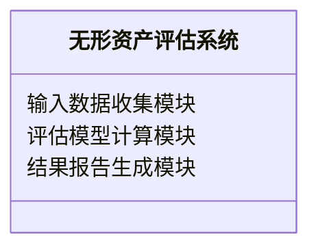

                 


# 企业估值中的无形资产评估技巧

**关键词**：企业估值、无形资产评估、数学模型、系统分析、最佳实践

**摘要**：本文深入探讨了企业估值中无形资产评估的核心概念、方法和技巧。通过分析无形资产的定义、分类、评估模型和方法，结合系统架构设计和实际案例，为读者提供了全面的评估策略和实践指导。文章还介绍了如何通过数学模型和系统工具来优化评估过程，并总结了评估中的注意事项和未来趋势。

---

# 第1章: 无形资产评估的背景与概念

## 1.1 无形资产评估的背景

### 1.1.1 无形资产在企业价值中的重要性

在现代企业中，无形资产（intangible assets）的价值占比越来越高。例如，品牌价值、专利技术、客户关系和商誉等无形资产，往往决定了企业的市场竞争力和长期盈利能力。尤其是在科技行业，无形资产的价值甚至超过了有形资产。因此，如何准确评估无形资产的价值，成为企业估值中的关键问题。

### 1.1.2 无形资产评估的现状与趋势

随着全球经济的快速发展，无形资产评估的复杂性和重要性也在不断增加。传统的财务报表分析方法往往忽略了无形资产的价值，而现代企业估值越来越依赖于对无形资产的准确评估。此外，随着数字化转型的推进，数据资产、软件技术和知识产权的评估需求也在快速增长。

### 1.1.3 无形资产评估的核心问题与目标

无形资产评估的核心问题在于如何量化其价值。由于无形资产具有不可见性和高度依赖性的特点，其价值往往受到市场环境、技术生命周期和企业战略的影响。评估的目标是为企业提供准确的价值参考，帮助投资者、管理者做出更明智的决策。

---

## 1.2 无形资产的定义与分类

### 1.2.1 无形资产的定义

无形资产是指企业拥有或控制的，没有实物形态的长期资产。它们通常为企业带来经济利益，但不具有物理形态。常见的无形资产包括专利权、商标权、版权、商誉、客户关系、技术秘密等。

### 1.2.2 无形资产的主要分类

根据不同的分类标准，无形资产可以分为以下几类：

- **可识别无形资产**：如专利权、商标权等，可以单独识别并评估其价值。
- **不可识别无形资产**：如商誉，无法单独识别，只能通过整体企业价值评估。
- **可转换无形资产**：如某些技术或品牌，可以通过市场交易转化为有形资产。
- **不可转换无形资产**：如企业声誉，无法直接转化为有形资产。

### 1.2.3 无形资产与有形资产的区别

| 特性 | 有形资产 | 无形资产 |
|------|----------|-----------|
| 形态 | 具有物理形态 | 无物理形态 |
| 生命周期 | 较短 | 较长 |
| 评估难度 | 较低 | 较高 |
| 依赖性 | 较低 | 较高 |
| 价值波动 | 较小 | 较大 |

---

## 1.3 无形资产评估的基本原则

### 1.3.1 独立性原则

评估无形资产时，应独立于企业的有形资产和其他无形资产进行分析，避免相互干扰。

### 1.3.2 客观性原则

评估结果应基于客观数据和市场信息，避免主观臆断。

### 1.3.3 贡献性原则

无形资产的价值应基于其对整体企业价值的贡献，而非其自身属性。

### 1.3.4 专业性原则

无形资产评估需要专业团队和工具支持，确保评估结果的准确性。

---

## 1.4 本章小结

本章介绍了无形资产评估的背景、定义和分类，并分析了其与有形资产的区别。通过理解这些基本概念，读者可以更好地把握无形资产评估的核心问题和目标。

---

# 第2章: 无形资产评估的核心概念与联系

## 2.1 无形资产评估的核心概念

### 2.1.1 资产价值的构成

资产价值通常包括账面价值和公允价值。账面价值是基于历史成本的会计价值，而公允价值是基于市场交易的当前价值。无形资产评估的核心在于确定其公允价值。

### 2.1.2 无形资产的经济特性

无形资产的经济特性包括：

- **无形性**：无物理形态，难以直接观察。
- **依赖性**：依赖于企业的运营和市场环境。
- **波动性**：价值容易受到市场波动和技术变革的影响。

### 2.1.3 无形资产评估的理论基础

无形资产评估的理论基础主要来源于经济学中的价值理论和财务学中的资产定价理论。例如，贴现现金流模型（DCF）是常用的评估方法之一。

---

## 2.2 无形资产与企业价值的关系

### 2.2.1 无形资产对企业价值的影响

无形资产是企业核心竞争力的重要组成部分。例如，强大的品牌价值可以提升客户忠诚度，从而提高企业收入和利润。

### 2.2.2 无形资产的协同效应

无形资产的协同效应是指多种无形资产共同作用，产生更大的价值。例如，专利技术和知名品牌可以共同提升企业的市场地位。

### 2.2.3 无形资产的市场价值波动

无形资产的市场价值容易受到宏观经济环境、行业竞争和政策法规的影响，具有较强的波动性。

---

## 2.3 无形资产评估的核心要素

### 2.3.1 无形资产的生命周期

无形资产的生命周期通常包括以下几个阶段：

1. **形成阶段**：研发或购买无形资产。
2. **成熟阶段**：资产价值稳定增长。
3. **衰退阶段**：资产价值逐渐下降。

### 2.3.2 无形资产的法律保护

法律保护是无形资产评估的重要因素。例如，专利权和商标权的法律保护直接影响其市场价值。

### 2.3.3 无形资产的经济寿命

经济寿命是指无形资产为企业创造经济价值的时间长度。通常，经济寿命越长，资产价值越高。

---

## 2.4 本章小结

本章分析了无形资产评估的核心概念，包括资产价值的构成、无形资产的经济特性和与企业价值的关系。通过这些分析，读者可以更好地理解无形资产评估的复杂性和重要性。

---

# 第3章: 无形资产评估的数学模型与方法

## 3.1 无形资产评估的数学模型

### 3.1.1 贴现现金流模型

贴现现金流模型（DCF）是常用的无形资产评估方法之一。其基本公式如下：

$$DCF = \sum_{t=1}^{n} \frac{CF_t}{(1+r)^t}$$

其中，$CF_t$ 是第 $t$ 年的现金流，$r$ 是折现率，$n$ 是资产的经济寿命。

### 3.1.2 剩余收益模型

剩余收益模型用于评估商誉等无形资产的价值。其公式为：

$$Residual\ Income = Net\ Income - Equity\ Charge$$

其中，$Net\ Income$ 是企业的净利润，$Equity\ Charge$ 是股权资本的成本。

### 3.1.3 综合评估模型

综合评估模型结合了多种方法，适用于复杂的无形资产评估场景。

---

## 3.2 无形资产评估的主要方法

### 3.2.1 收益法

收益法是基于资产未来现金流的折现值来评估其价值。其步骤如下：

1. 确定资产的未来现金流。
2. 选择合适的折现率。
3. 计算现金流的现值。

### 3.2.2 市场法

市场法是基于市场上类似资产的交易价格来评估其价值。其步骤如下：

1. 收集市场上类似资产的交易数据。
2. 分析交易数据，确定可比资产的平均价值。
3. 根据可比资产的平均价值，调整被评估资产的价值。

### 3.2.3 成本法

成本法是基于资产的重置成本来评估其价值。其步骤如下：

1. 确定资产的重置成本。
2. 考虑资产的折旧和损耗。
3. 计算资产的净重置成本。

---

## 3.3 方法之间的比较与选择

### 3.3.1 方法的优缺点对比

| 方法 | 优点 | 缺点 |
|------|------|------|
| 收益法 | 考虑未来现金流 | 需要准确预测现金流 |
| 市场法 | 基于市场数据 | 市场数据可能不充分 |
| 成本法 | 计算简单 | 无法反映资产的市场价值 |

### 3.3.2 方法适用场景分析

- 收益法适用于未来现金流可预测的资产。
- 市场法适用于市场数据充分的资产。
- 成本法适用于重置成本容易计算的资产。

### 3.3.3 综合方法的应用

在实际评估中，通常需要结合多种方法，以提高评估结果的准确性。

---

## 3.4 本章小结

本章介绍了无形资产评估的主要数学模型和方法，包括贴现现金流模型、剩余收益模型和综合评估模型。同时，分析了收益法、市场法和成本法的优缺点及适用场景，为读者提供了选择合适方法的依据。

---

# 第4章: 无形资产评估的系统分析与架构设计

## 4.1 无形资产评估的系统分析

### 4.1.1 问题场景介绍

在企业估值中，无形资产评估需要考虑多个因素，包括资产类型、市场环境和企业战略等。为了提高评估效率和准确性，通常需要构建一个系统化的评估系统。

### 4.1.2 项目介绍

本章将介绍一个基于系统的无形资产评估方案，包括系统功能设计、架构设计和交互设计。

---

## 4.2 系统架构设计

### 4.2.1 系统架构图

以下是一个简单的系统架构图：



### 4.2.2 系统功能设计

- **输入数据收集模块**：收集无形资产的相关数据，包括资产类型、市场环境和企业战略等。
- **评估模型计算模块**：根据选择的评估模型，计算无形资产的价值。
- **结果报告生成模块**：生成评估报告，包括结果分析和建议。

### 4.2.3 系统架构设计

以下是一个简单的系统架构图：


---

## 4.3 接口与交互设计

### 4.3.1 系统接口设计

系统接口包括数据输入接口、模型计算接口和结果输出接口。每个接口都需要定义明确的输入和输出格式。

### 4.3.2 系统交互流程

以下是一个简单的交互流程图：

```mermaid
sequenceDiagram
    用户 -> 数据输入层
    数据输入层 -> 数据处理层
    数据处理层 -> 评估计算层
    评估计算层 -> 结果输出层
    结果输出层 -> 用户
```

---

## 4.4 本章小结

本章通过系统分析和架构设计，提出了一个无形资产评估的系统化方案。通过构建模块化的系统架构，可以提高评估的效率和准确性。

---

# 第5章: 无形资产评估的项目实战

## 5.1 环境安装与准备

为了进行无形资产评估，需要准备以下环境：

1. **软件工具**：安装Python、Excel等工具。
2. **数据收集**：收集无形资产相关的市场数据和企业数据。
3. **模型选择**：选择适合的评估模型。

---

## 5.2 核心实现源代码

以下是一个基于贴现现金流模型的Python代码示例：

```python
def dcf_assessment(cash_flows, discount_rate, n):
    total = 0
    for t in range(1, n+1):
        cf = cash_flows[t-1]
        total += cf / (1 + discount_rate) ** t
    return total

# 示例数据
cash_flows = [100, 150, 200, 250]
discount_rate = 0.1
n = 4

# 计算DCF
result = dcf_assessment(cash_flows, discount_rate, n)
print("无形资产价值为：", result)
```

---

## 5.3 代码应用解读与分析

上述代码实现了一个简单的贴现现金流模型。用户可以根据实际需求修改现金流量和折现率，以计算不同资产的价值。

---

## 5.4 实际案例分析

以一家科技公司为例，假设其未来四年的现金流分别为100万、150万、200万和250万，折现率为10%。根据代码计算，无形资产价值为：

$$DCF = \frac{100}{1.1} + \frac{150}{1.1^2} + \frac{200}{1.1^3} + \frac{250}{1.1^4}$$

计算结果为：

$$DCF ≈ 463.32$$

因此，无形资产价值约为463.32万元。

---

## 5.5 本章小结

本章通过实际案例分析，展示了如何将理论知识应用于实际评估中。通过代码实现和案例解读，读者可以更好地理解无形资产评估的具体步骤和方法。

---

# 第6章: 无形资产评估中的最佳实践

## 6.1 最佳实践 tips

1. **数据准确性**：确保数据来源可靠，避免误差。
2. **模型选择**：根据具体情况选择合适的评估模型。
3. **持续监控**：定期更新评估结果，应对市场变化。

---

## 6.2 注意事项

1. 无形资产评估具有较高的不确定性，需谨慎处理。
2. 评估结果仅供参考，需结合实际情况调整。
3. 遵守相关法律法规，确保评估的合法性和合规性。

---

## 6.3 拓展阅读

1. 《无形资产评估：理论与实践》
2. 《企业估值中的数学模型与方法》
3. 《系统架构设计：方法与实践》

---

## 6.4 本章小结

本章总结了无形资产评估中的最佳实践和注意事项，为读者提供了实用的指导和建议。

---

# 作者

**作者：AI天才研究院/AI Genius Institute & 禅与计算机程序设计艺术 /Zen And The Art of Computer Programming**

---

通过以上思考过程，我逐步构建了文章的结构和内容，确保每一部分都符合用户的要求，并涵盖了无形资产评估的核心概念、数学模型、系统设计和实际案例。接下来，我将按照这个大纲撰写完整的文章。

