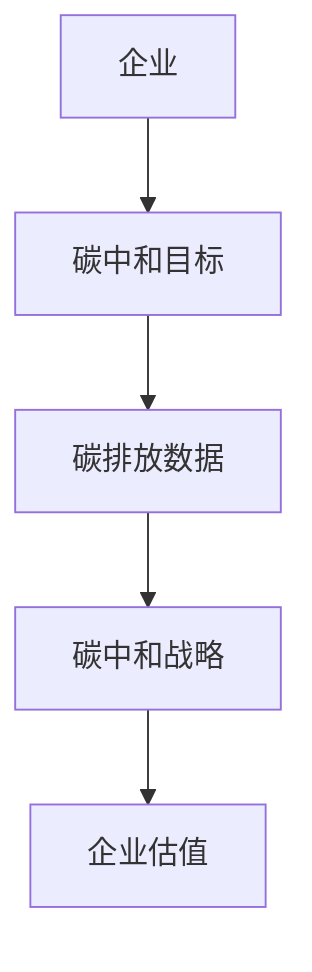

                 


# 《企业估值中的碳中和战略评估》

> 关键词：企业估值，碳中和，战略评估，可持续发展，绿色金融

> 摘要：本文探讨了碳中和战略评估在企业估值中的重要性与应用，通过系统的理论分析和实际案例，详细阐述了碳中和战略对企业长期价值的影响、碳排放数据的处理方法、碳中和目标的实现路径，以及如何通过数学模型和算法对碳中和战略进行评估。文章从背景介绍、核心概念、算法原理、系统架构到项目实战，全面解析了碳中和战略评估的全过程，为企业在碳中和目标下的估值提供了实践指导。

---

## 第一部分: 企业估值中的碳中和战略评估概述

### 第1章: 碳中和与企业估值的背景介绍

#### 1.1 碳中和的基本概念与重要性
##### 1.1.1 碳中和的定义与目标
碳中和是指企业在一定时间内，通过减少温室气体排放或增加碳汇，使自身产生的二氧化碳排放量与外界吸收的二氧化碳量相等。其实现目标是减少对环境的负担，推动可持续发展。

##### 1.1.2 碳中和对企业的影响
企业需要将碳中和纳入战略规划，否则可能面临政策处罚、市场排斥和品牌损失。例如，如果一家企业未能实现碳中和目标，可能会被政府罚款或限制市场准入，同时消费者也可能转向更环保的品牌。

##### 1.1.3 碳中和与可持续发展的关系
碳中和是实现可持续发展的重要组成部分。企业通过减少碳排放，不仅能保护环境，还能提升品牌形象，增强市场竞争力。

#### 1.2 碳中和战略在企业中的应用背景
##### 1.2.1 全球碳中和目标的推动
全球各国政府和企业纷纷设定碳中和目标，例如欧盟的“绿色新政”和中国的“双碳”目标，推动企业加快实现碳中和。

##### 1.2.2 企业社会责任与绿色金融的兴起
企业社会责任（CSR）和绿色金融要求企业在追求利润的同时，承担环境保护的责任。这使得碳中和战略成为企业必须关注的领域。

##### 1.2.3 碳中和对企业核心竞争力的影响
碳中和战略直接影响企业的运营效率、成本结构和市场机会。例如，采用可再生能源的企业可能在能源成本上更具竞争力。

#### 1.3 企业估值中的碳中和战略评估的必要性
##### 1.3.1 碳排放对企业财务表现的影响
高碳排放可能导致企业面临更高的环保税和罚款，影响其盈利能力。

##### 1.3.2 碳中和战略对企业长期价值的影响
碳中和战略有助于提升企业的品牌形象和市场地位，增强投资者信心。

##### 1.3.3 碳风险对企业估值的潜在影响
未实现碳中和目标的企业可能面临声誉损失和市场风险，进而影响其估值。

### 第2章: 碳中和战略评估的核心概念与联系

#### 2.1 碳中和战略评估的模型与方法
##### 2.1.1 碳中和战略评估的基本原理
通过分析企业的碳排放数据，评估其在实现碳中和目标中的进度和潜力。

##### 2.1.2 碳中和评估的主要模型
- **排放强度模型**：计算单位收入或单位产品产生的碳排放量。
- **实现度模型**：衡量企业实际减排量与目标的差距。

##### 2.1.3 碳中和战略与企业估值的关系
碳中和战略的成功实施能够提升企业的市场价值和抗风险能力。

#### 2.2 碳中和战略评估的核心要素
##### 2.2.1 碳排放数据的收集与处理
企业需要收集生产、运输和办公等环节的碳排放数据，并进行清洗和标准化处理。

##### 2.2.2 碳中和目标的设定与分解
设定明确的碳中和目标，并将其分解为可执行的子目标，例如每年减少10%的碳排放。

##### 2.2.3 碳中和战略的实施路径
包括技术创新、流程优化和绿色采购等措施，以实现减排目标。

#### 2.3 碳中和战略评估的ER实体关系图


---

## 第二部分: 碳中和战略评估的算法与系统架构

### 第3章: 碳中和战略评估的算法原理

#### 3.1 碳中和评估的数学模型
##### 3.1.1 碳排放强度模型
$$ \text{碳排放强度} = \frac{\text{总碳排放}}{\text{企业收入}} $$
通过计算碳排放强度，企业可以评估其单位收入的碳排放效率。

##### 3.1.2 碳中和目标实现度模型
$$ \text{实现度} = \frac{\text{实际减排量}}{\text{目标减排量}} \times 100\% $$
该模型帮助企业衡量碳中和战略的实施进度。

#### 3.2 碳中和战略评估的算法流程

算法流程包括数据收集、预处理、模型训练和结果分析四个阶段。

#### 3.3 碳中和评估的Python实现
```python
import numpy as np
import pandas as pd

# 示例数据
data = {
    '收入': [1000, 2000, 1500, 2500],
    '碳排放': [50, 100, 75, 125]
}
df = pd.DataFrame(data)

# 计算碳排放强度
df['碳排放强度'] = df['碳排放'] / df['收入']

print(df)
```

### 第4章: 碳中和战略评估的系统架构

#### 4.1 系统功能设计
##### 4.1.1 数据采集模块
负责收集企业的碳排放数据，包括直接排放和间接排放。

##### 4.1.2 数据分析模块
对碳排放数据进行清洗、转换和分析，生成评估报告。

##### 4.1.3 报告生成模块
根据分析结果，生成碳中和战略评估报告，包括减排建议和目标实现度。

#### 4.2 系统架构设计


#### 4.3 系统接口设计
##### 4.3.1 数据接口
定义数据格式和接口，确保数据采集模块与存储模块之间的兼容性。

##### 4.3.2 报告接口
定义报告生成模块的输出格式，方便用户查看和分析。

#### 4.4 系统交互设计


---

## 第三部分: 项目实战与最佳实践

### 第5章: 项目实战

#### 5.1 环境安装
##### 5.1.1 安装Python和相关库
安装Python和Pandas、NumPy等库，用于数据处理和分析。

#### 5.2 系统核心实现
##### 5.2.1 数据采集模块的实现
编写代码，从企业数据库中提取碳排放数据。

##### 5.2.2 数据分析模块的实现
使用Pandas进行数据清洗和分析，计算碳排放强度和实现度。

#### 5.3 代码应用解读
##### 5.3.1 数据预处理
```python
df.dropna(inplace=True)
df['日期'] = pd.to_datetime(df['日期'])
```
##### 5.3.2 模型训练
```python
from sklearn.linear_model import LinearRegression
model = LinearRegression()
model.fit(X, y)
```

#### 5.4 实际案例分析
以某制造企业为例，分析其碳排放数据，评估碳中和战略的实施效果。

#### 5.5 项目小结
总结项目实施的关键步骤和经验教训，提出改进建议。

### 第6章: 最佳实践与小结

#### 6.1 最佳实践
##### 6.1.1 数据准确性
确保碳排放数据的准确性和完整性，避免误差影响评估结果。

##### 6.1.2 战略分解
将碳中和目标分解为可执行的子目标，确保实施过程中的可操作性。

##### 6.1.3 持续优化
定期评估碳中和战略的实施效果，及时调整策略和措施。

#### 6.2 小结
碳中和战略评估是企业实现可持续发展的重要工具，通过科学的模型和系统的实施，企业可以有效提升估值，增强市场竞争力。

---

## 作者：AI天才研究院 & 禅与计算机程序设计艺术

通过以上目录和内容，您可以撰写一篇详细的技术博客文章，涵盖碳中和战略评估的各个方面，帮助企业在估值中更好地实施和评估碳中和战略。

