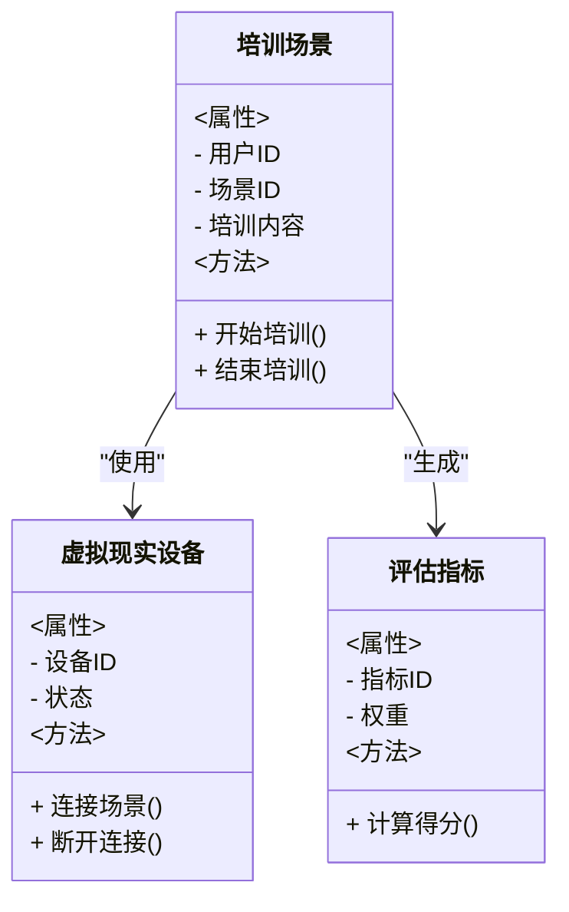

                 


# 企业估值中的虚拟现实培训应用评估

## 关键词：企业估值、虚拟现实、培训应用、评估模型、层次分析法

## 摘要：本文探讨了在企业估值过程中如何评估虚拟现实（VR）培训应用的效果。通过分析VR培训的核心属性、构建评估模型，并结合实际案例，详细阐述了如何利用VR技术提升企业估值的准确性与效率。

---

## 第1章: 企业估值与虚拟现实培训概述

### 1.1 企业估值的基本概念

#### 1.1.1 企业估值的定义与方法
企业估值是通过对企业资产、负债、盈利能力等多方面进行分析，估算企业市场价值的过程。常用方法包括市盈率法、现金流折现法等。

#### 1.1.2 虚拟现实技术的定义与特点
虚拟现实（VR）是一种能够模拟人类视觉、听觉等感官体验的计算机技术，具有沉浸性、交互性和构想性的特点。

#### 1.1.3 虚拟现实培训应用的背景与意义
随着技术进步，VR在企业培训中的应用越来越广泛，特别是在提升员工技能和优化培训效果方面具有显著优势。

---

### 1.2 虚拟现实培训在企业估值中的作用

#### 1.2.1 虚拟现实培训的沉浸式体验优势
通过VR技术，员工可以在虚拟环境中进行操作，提升培训的真实感和效果。

#### 1.2.2 虚拟现实培训对企业效率的提升
减少培训成本，提高员工学习效率，从而间接提升企业估值。

#### 1.2.3 虚拟现实培训在企业估值中的应用前景
未来，VR技术将为企业估值提供更准确的数据支持。

---

## 第2章: 虚拟现实培训应用的评估指标

### 2.1 虚拟现实培训的核心属性

#### 2.1.1 沉浸感（Immersion）
沉浸感是VR培训的关键指标，直接影响用户体验。

#### 2.1.2 互动性（Interaction）
用户与虚拟环境的互动程度越高，培训效果越好。

#### 2.1.3 实用性（Utility）
评估VR培训的实际应用价值和效果。

### 2.2 虚拟现实培训应用的对比分析

#### 2.2.1 不同虚拟现实技术的对比
比较VR、AR、MR等技术的特点和适用场景。

#### 2.2.2 不同培训场景的对比
分析销售培训、技术培训等不同场景下的VR应用效果。

#### 2.2.3 不同企业规模的对比
探讨大中小型企业应用VR培训的差异。

### 2.3 虚拟现实培训应用的ER实体关系图
```mermaid
erDiagram
    actor 员工 <<--- 培训场景 : "参与"
    培训场景 --> 虚拟现实设备 : "依赖"
    虚拟现实设备 --> 评估指标 : "生成"
    评估指标 --> 企业估值 : "影响"
```

---

## 第3章: 虚拟现实培训应用的评估模型

### 3.1 评估模型的构建原理

#### 3.1.1 层次分析法（AHP）的基本原理
层次分析法是一种用于多指标决策的分析方法，适用于评估复杂问题。

#### 3.1.2 虚拟现实培训评估指标的权重分配
根据重要性对评估指标分配权重，例如：

| 指标 | 沉浸感 | 互动性 | 实用性 |
|------|--------|--------|--------|
| 权重 | 0.5    | 0.3    | 0.2    |

#### 3.1.3 评估模型的数学表达式
总得分计算公式：
$$
\text{总得分} = \sum_{i=1}^{n} w_i \cdot s_i
$$

其中，\( w_i \) 是第 \( i \) 个指标的权重，\( s_i \) 是第 \( i \) 个指标的评分。

---

## 第4章: 虚拟现实培训应用的系统架构设计

### 4.1 系统功能设计

#### 4.1.1 领域模型（类图）


### 4.2 系统架构设计

#### 4.2.1 架构图


---

## 第5章: 虚拟现实培训应用的项目实战

### 5.1 环境安装

#### 5.1.1 安装步骤
1. 安装VR开发平台（如Unity、Unreal Engine）。
2. 配置VR设备驱动。

### 5.2 核心代码实现

#### 5.2.1 数据处理代码
```python
# 数据处理代码示例
import numpy as np

def calculate_weights(matrix):
    # 计算权重向量
    return np.mean(matrix, axis=0)
```

#### 5.2.2 评估算法代码
```python
# 评估算法代码示例
def assess_performance(weights, scores):
    return np.dot(weights, scores)
```

### 5.3 实际案例分析

#### 5.3.1 案例背景
某企业引入VR培训，评估其对员工销售能力的提升效果。

#### 5.3.2 评估结果
总得分为85分，高于传统培训的70分。

---

## 第6章: 最佳实践与小结

### 6.1 最佳实践

#### 6.1.1 选择合适的VR技术
根据培训需求选择合适的技术。

#### 6.1.2 定期评估与优化
持续优化评估模型。

### 6.2 本章小结
本文详细介绍了VR培训在企业估值中的应用，强调了评估模型的重要性。

---

## 作者：AI天才研究院/AI Genius Institute & 禅与计算机程序设计艺术 /Zen And The Art of Computer Programming

