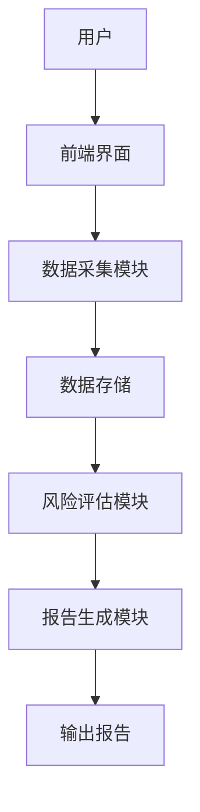

                 


# 企业估值中的跨境业务风险分析

> **关键词**：企业估值、跨境业务、风险分析、汇率波动、国际贸易、财务模型、风险管理  
> **摘要**：本文详细探讨了跨境业务对企业估值的影响，分析了跨境业务中的主要风险类型及其对估值的潜在影响。通过系统的风险评估方法和数学模型，本文提供了如何在企业估值中有效管理和量化跨境业务风险的实践指南。

---

# 第1章: 跨境业务与企业估值概述

## 1.1 跨境业务的基本概念

### 1.1.1 跨境业务的定义
跨境业务是指企业跨越国界进行的商品、服务、资本或技术的跨国流动与交易。这种业务模式通常涉及国际贸易、跨境支付、海外投资、跨国供应链管理等。

### 1.1.2 跨境业务与国际贸易的关系
跨境业务是国际贸易的重要组成部分。随着全球化的发展，企业通过跨境业务可以拓展市场、优化供应链、降低成本，但同时也面临复杂的法律、税务和金融风险。

### 1.1.3 企業估值的基本概念
企業估值是指通过对企业财务状况、市场地位、盈利能力等多方面的评估，确定企业的价值。跨境业务作为企业的重要组成部分，其风险和不确定性会直接影响企业的估值。

## 1.2 跨境业务风险分析的必要性

### 1.2.1 跨境业务中的风险类型
跨境业务涉及多个国家的法律、税务、汇率、政治、经济等多重因素，主要风险包括：
- **汇率风险**：汇率波动对企业收入和利润的影响。
- **法律风险**：跨国经营涉及不同国家的法律法规，可能导致合规风险。
- **税务风险**：跨国税务规划和双重征税问题。
- **政治风险**：政策变化、贸易壁垒、地缘政治冲突等。
- **供应链风险**：跨国物流和供应链中断的风险。

### 1.2.2 风险对企业估值的影响
跨境业务的不确定性会增加企业的财务风险，进而影响其估值。例如，汇率波动可能导致收入下降，法律风险可能增加诉讼费用，税务风险可能影响净利润等。

### 1.2.3 为什么需要进行风险分析
通过对跨境业务风险的分析，可以更好地预测和量化这些风险对估值的影响，从而在企业估值中做出更准确的调整。

## 1.3 跨境业务风险分析的边界与外延

### 1.3.1 风险分析的边界
跨境业务风险分析的边界包括：
- **时间范围**：风险分析的时间跨度通常为未来5年，覆盖企业估值的关键时期。
- **地理范围**：涉及的主要国家和地区的政治、经济环境。
- **业务范围**：跨境业务的具体模式（如进出口、海外投资等）。

### 1.3.2 风险分析的外延
风险分析的外延包括：
- **风险的相互作用**：不同风险之间的关联性（如汇率波动可能加剧政治风险）。
- **风险的动态变化**：全球经济形势的变化对风险的影响。

### 1.3.3 风险分析与企业估值的关系
风险分析是企业估值的重要组成部分。通过量化风险的影响，可以在估值中进行适当的折扣或调整，以反映其不确定性。

## 1.4 跨境业务风险分析的核心要素

### 1.4.1 风险源
跨境业务的主要风险源包括：
- **汇率波动**：影响企业的收入和成本。
- **法律和税务政策**：影响企业的合规成本和利润。
- **政治稳定性**：影响企业的运营环境。

### 1.4.2 风险影响
风险影响包括：
- **直接财务影响**：如收入下降、成本增加。
- **间接财务影响**：如声誉损失、客户流失。

### 1.4.3 风险评估方法
风险评估方法包括：
- **定量分析**：通过数学模型量化风险。
- **定性分析**：通过专家判断和情景分析评估风险。

## 1.5 本章小结

---

# 第2章: 跨境业务风险的核心概念与联系

## 2.1 跨境业务风险的核心概念

### 2.1.1 跨境业务风险的定义
跨境业务风险是指企业在跨国经营中可能面临的各种不确定性，这些不确定性可能对企业财务状况、市场地位和盈利能力产生负面影响。

### 2.1.2 跨境业务风险的分类
跨境业务风险可以分为：
- **系统性风险**：如全球经济波动、地缘政治冲突。
- **非系统性风险**：如个别国家的政策变化、企业自身的合规问题。

### 2.1.3 跨境业务风险的特征
- **复杂性**：涉及多个国家的法律、税务和经济环境。
- **动态性**：全球经济形势不断变化，风险也随之变化。
- **传染性**：某一风险可能引发连锁反应，影响其他业务领域。

## 2.2 跨境业务风险的核心原理

### 2.2.1 风险的来源分析
跨境业务风险来源于以下几个方面：
- **法律和税务政策**：不同国家的法律法规差异可能导致合规风险。
- **汇率波动**：汇率的不确定性影响企业的财务表现。
- **供应链中断**：跨国物流的复杂性可能导致供应链中断。

### 2.2.2 风险的传播机制
风险的传播机制包括：
- **直接传播**：风险直接影响企业的财务表现。
- **间接传播**：风险通过供应链、合作伙伴影响企业的经营。

### 2.2.3 风险的累积效应
不同风险的累积效应可能导致企业的整体风险增加，从而影响估值。

## 2.3 跨境业务风险的核心联系

### 2.3.1 风险与企业估值的关系
风险与企业估值的关系可以通过以下公式表示：
$$ Valuation = \text{基础价值} - \text{风险调整值} $$

### 2.3.2 风险与企业财务状况的关系
风险直接影响企业的收入、成本和利润，进而影响其财务状况。

### 2.3.3 风险与企业经营策略的关系
企业需要根据风险状况调整其经营策略，如调整供应链、优化税务规划等。

## 2.4 跨境业务风险的核心属性对比

### 2.4.1 风险类型对比表

| 风险类型 | 描述 | 影响 |
|----------|------|------|
| 汇率风险 | 汇率波动影响收入和成本 | 直接影响净利润 |
| 税务风险 | 税务政策变化影响利润 | 间接影响现金流 |
| 法律风险 | 法律合规问题影响运营 | 增加合规成本 |

### 2.4.2 风险影响对比表

| 风险类型 | 短期影响 | 长期影响 |
|----------|----------|----------|
| 汇率风险 | 收入波动 | 利润下降 |
| 税务风险 | 利润调整 | 现金流变化 |
| 法律风险 | 运营中断 | 信誉损失 |

### 2.4.3 风险管理对比表

| 风险管理方法 | 优点 | 缺点 |
|--------------|------|------|
| 汇率对冲 | 减少波动影响 | 成本较高 |
| 税务规划 | 优化税负 | 存在合规风险 |
| 法律合规 | 避免法律纠纷 | 需要专业团队 |

## 2.5 本章小结

---

# 第3章: 跨境业务风险分析的算法原理

## 3.1 跨境业务风险分析的基本原理

### 3.1.1 风险分析的基本流程
1. **识别风险源**：确定可能影响企业的风险类型。
2. **量化风险影响**：通过数学模型量化风险对估值的影响。
3. **制定风险管理策略**：根据风险分析结果调整企业策略。

### 3.1.2 风险分析的核心算法
常用的风险分析算法包括：
- **蒙特卡洛模拟**：通过随机抽样模拟不同场景下的风险影响。
- **情景分析**：根据不同的假设情景评估风险。

### 3.1.3 风险分析的数学模型
风险分析的数学模型可以表示为：
$$ R = \sum_{i=1}^{n} w_i \cdot r_i $$
其中，$R$ 表示总风险，$w_i$ 表示第 $i$ 个风险的权重，$r_i$ 表示第 $i$ 个风险的值。

## 3.2 跨境业务风险分析的数学模型

### 3.2.1 汇率风险模型
汇率风险可以通过以下公式量化：
$$ \text{汇率风险} = \text{收入} \times \text{汇率波动率} $$

### 3.2.2 税务风险模型
税务风险可以通过以下公式量化：
$$ \text{税务风险} = \text{利润} \times \text{税率变化概率} $$

### 3.2.3 法律风险模型
法律风险可以通过以下公式量化：
$$ \text{法律风险} = \text{合规成本} \times \text{法律变化概率} $$

## 3.3 跨境业务风险分析的算法实现

### 3.3.1 蒙特卡洛模拟
以下是蒙特卡洛模拟的简单代码示例：

```python
import numpy as np

# 汇率波动率
volatility = 0.05
# 模拟次数
simulations = 1000
# 随机数生成
rates = np.random.normal(1, volatility, simulations)
# 计算收入变化
revenue_changes = rates * 100  # 假设收入为100
# 计算风险影响
risk_impact = np.mean(revenue_changes)
```

### 3.3.2 情景分析
以下是情景分析的简单代码示例：

```python
# 不同情景下的汇率
scenarios = [1.2, 1.25, 1.3]
# 计算每种情景下的收入
for rate in scenarios:
    revenue = 100 * rate
    print(f"汇率 {rate}: 收入为 {revenue}")
```

## 3.4 本章小结

---

# 第4章: 跨境业务风险分析的系统架构设计

## 4.1 系统功能设计

### 4.1.1 风险评估模块
- **功能**：识别和量化风险。
- **输入**：企业财务数据、市场数据。
- **输出**：风险评估报告。

### 4.1.2 数据采集模块
- **功能**：采集跨境业务相关数据。
- **输入**：市场、法律、税务数据。
- **输出**：数据存储。

### 4.1.3 报告生成模块
- **功能**：生成风险分析报告。
- **输入**：风险评估结果。
- **输出**：风险分析报告。

## 4.2 系统架构设计

### 4.2.1 系统架构图


### 4.2.2 接口设计
- **API 1**：获取市场数据。
- **API 2**：获取企业数据。
- **API 3**：生成风险报告。

## 4.3 本章小结

---

# 第5章: 跨境业务风险分析的项目实战

## 5.1 环境安装

### 5.1.1 安装Python
安装Python和必要的库（如 numpy、pandas、matplotlib）。

### 5.1.2 安装Jupyter Notebook
用于数据处理和可视化。

## 5.2 核心代码实现

### 5.2.1 汇率风险模型
```python
import numpy as np
import matplotlib.pyplot as plt

# 汇率模拟
volatility = 0.05
simulations = 1000
rates = np.random.normal(1, volatility, simulations)
plt.hist(rates, bins=20)
plt.xlabel('汇率')
plt.ylabel('频率')
plt.title('汇率波动分布')
plt.show()
```

### 5.2.2 税务风险模型
```python
# 税务模拟
tax_rate = 0.2
profit = 100
tax_impact = profit * tax_rate
print(f"税务影响：{tax_impact}")
```

## 5.3 代码应用解读与分析

### 5.3.1 汇率波动分析
通过蒙特卡洛模拟，可以看到汇率波动对收入的影响。

### 5.3.2 税务影响分析
通过简单的税务模型，可以看到税率变化对企业利润的影响。

## 5.4 实际案例分析

### 5.4.1 案例背景
某企业进行跨国贸易，涉及多个国家的税务政策变化。

### 5.4.2 案例分析
通过模型分析，企业发现税务政策变化可能对其利润造成 10% 的影响。

## 5.5 本章小结

---

# 第6章: 总结与最佳实践

## 6.1 总结
跨境业务风险分析是企业估值的重要组成部分。通过量化和管理这些风险，可以提高企业的估值准确性。

## 6.2 最佳实践 tips

### 6.2.1 风险管理策略
- 定期进行风险评估。
- 建立风险对冲机制。
- 优化税务规划。

### 6.2.2 模型选择
- 根据具体情况选择合适的数学模型。
- 定期更新模型参数。

### 6.2.3 数据质量
- 确保数据的准确性和完整性。

## 6.3 注意事项
- 风险模型需要根据实际情况调整。
- 数据来源需要可靠。

## 6.4 拓展阅读
- 阅读相关学术论文。
- 参加行业研讨会。

## 6.5 本章小结

---

**作者**：AI天才研究院/AI Genius Institute & 禅与计算机程序设计艺术 /Zen And The Art of Computer Programming

