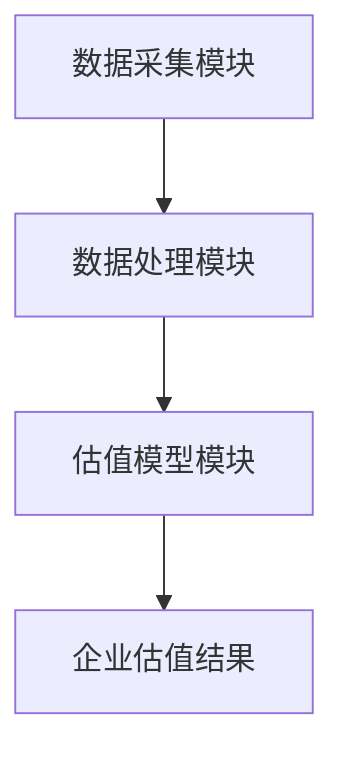
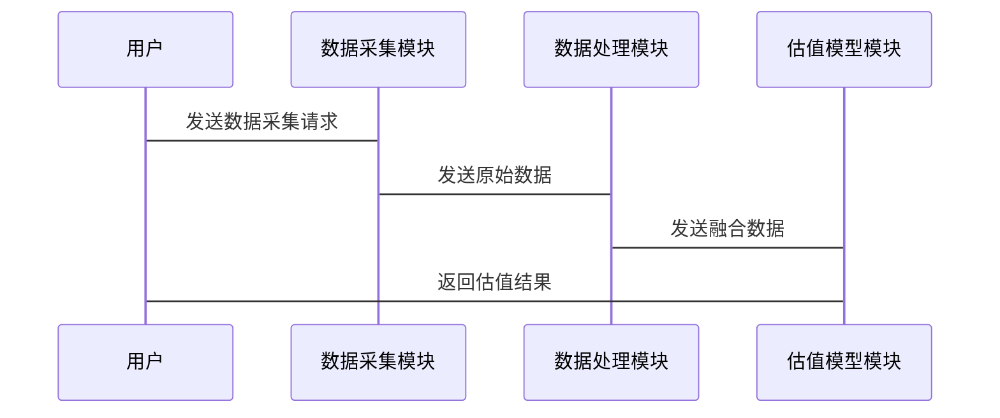

                 


# 《企业估值中的量子传感器医疗应用评估》

## 关键词：
企业估值，量子传感器，医疗数据，数据融合，估值模型，风险管理

## 摘要：
本文探讨了量子传感器在医疗领域中的应用及其对企业估值的影响。通过分析医疗数据的特征和量子传感器的技术优势，提出了基于量子传感器数据的融合算法和企业估值模型，展示了如何利用量子传感器数据提升企业估值的准确性和效率。文章还通过实际案例分析，验证了该方法的有效性，并提出了未来研究的方向和建议。

---

# 第一部分：量子传感器与医疗数据的结合

## 第1章：量子传感器的基本原理

### 1.1 量子传感器的定义
量子传感器是一种基于量子力学原理设计的传感器，能够以超高的精度测量物理量，如磁场、重力、温度等。与传统传感器相比，量子传感器具有更高的灵敏度和分辨率，能够在复杂环境中提供更精确的数据。

### 1.2 量子传感器的核心技术
- **量子干涉技术**：利用量子叠加原理，通过干涉现象检测微小的变化。
- **量子纠缠技术**：利用量子纠缠效应，实现对多个物理量的同步测量。
- **超冷原子技术**：通过冷却原子到接近绝对零度，利用其量子态进行高精度测量。

### 1.3 量子传感器在医疗领域的应用潜力
- **医疗影像**：提高医学成像的分辨率和灵敏度，帮助医生更早发现疾病。
- **生理监测**：实时监测患者的生理指标，如心率、血压、体温等。
- **药物研发**：通过高精度的传感器数据，加速新药的研发过程。

---

## 第2章：医疗数据的价值与挑战

### 2.1 医疗数据的多样性
医疗数据包括结构化数据（如电子健康记录）和非结构化数据（如医生的笔记、影像数据等）。多样化的数据类型使得数据处理和分析变得更加复杂。

### 2.2 医疗数据的隐私保护
医疗数据涉及患者的隐私信息，如何在保证数据安全的前提下进行数据共享和分析，是一个重要的挑战。

### 2.3 医疗数据在企业估值中的作用
医疗数据可以帮助企业评估其市场潜力、技术研发能力以及成本控制能力。例如，通过分析医疗数据，可以预测某项新药的市场表现，从而影响企业的估值。

---

## 第3章：量子传感器与医疗数据的融合

### 3.1 量子传感器在医疗数据采集中的优势
- **高精度**：量子传感器能够提供更高的测量精度，确保数据的准确性。
- **实时性**：量子传感器可以实时采集数据，满足医疗领域对实时性的要求。
- **非侵入性**：某些量子传感器可以实现非侵入式的测量，减少患者的痛苦。

### 3.2 医疗数据对企业估值的影响
- **财务指标**：医疗数据可以帮助企业优化成本控制，提升盈利能力。
- **市场表现**：通过分析医疗数据，可以预测企业的市场表现，从而影响其估值。
- **创新能力**：医疗数据可以反映企业的技术创新能力，增强投资者的信心。

### 3.3 量子传感器与医疗数据融合的创新应用
- **精准医疗**：通过量子传感器采集的高精度医疗数据，实现个性化的治疗方案。
- **预测性维护**：通过实时监测医疗设备的状态，提前进行维护，避免设备故障。

---

# 第二部分：量子传感器医疗数据在企业估值中的核心概念

## 第4章：量子传感器医疗数据的特征分析

### 4.1 数据的实时性
量子传感器能够实时采集数据，确保数据的时效性，这对于企业估值的动态调整非常重要。

### 4.2 数据的准确性
量子传感器的高精度测量能力，保证了医疗数据的准确性，从而提高了企业估值的可靠性。

### 4.3 数据的可扩展性
量子传感器可以同时测量多个物理量，数据的可扩展性为企业估值提供了更多的维度。

---

## 第5章：企业估值的核心要素

### 5.1 企业财务指标
- **收入**：企业的收入情况直接影响其估值。
- **利润**：企业的盈利能力是估值的重要指标。
- **成本**：成本控制能力影响企业的利润和估值。

### 5.2 企业市场表现
- **市场份额**：企业的市场占有率影响其估值。
- **品牌价值**：品牌的影响力也是估值的重要因素。
- **行业趋势**：行业的发展趋势影响企业的未来表现。

### 5.3 企业创新能力和技术优势
- **研发能力**：企业的技术创新能力直接影响其市场竞争力和估值。
- **技术优势**：拥有核心技术优势的企业，其估值通常较高。

---

## 第6章：量子传感器医疗数据与企业估值的关系

### 6.1 数据对企业价值的影响
通过量子传感器采集的高精度医疗数据，可以帮助企业优化成本、提升效率、增强创新能力，从而提高企业的整体价值。

### 6.2 数据在估值模型中的应用
量子传感器医疗数据可以作为估值模型的输入，通过数据融合算法，提升估值模型的准确性和可靠性。

### 6.3 数据对企业风险管理的作用
通过实时监测医疗数据，企业可以及时发现潜在风险，采取措施进行规避，降低风险对企业估值的影响。

---

# 第三部分：量子传感器医疗数据驱动的企业估值算法

## 第7章：算法原理概述

### 7.1 量子增强的数据融合算法
量子增强的数据融合算法通过量子计算技术，实现多源数据的高效融合，提升数据的准确性和一致性。

### 7.2 数据驱动的估值模型
数据驱动的估值模型基于量子传感器采集的医疗数据，结合企业财务指标和市场表现，构建估值模型，预测企业的未来价值。

### 7.3 算法的数学基础
量子传感器数据融合算法的核心是量子叠加和量子纠缠原理，通过量子态的叠加和干涉，实现数据的高效融合。

---

## 第8章：量子传感器数据融合算法

### 8.1 数据预处理
- **去噪**：通过量子滤波技术，去除数据中的噪声，提高数据质量。
- **标准化**：对数据进行标准化处理，确保数据的一致性。

### 8.2 数据融合流程
- **数据采集**：通过量子传感器采集医疗数据。
- **数据处理**：对采集到的数据进行预处理和融合。
- **模型训练**：基于融合后的数据，训练估值模型。

### 8.3 算法的实现步骤
1. 数据采集：通过量子传感器采集医疗数据。
2. 数据预处理：去除噪声，标准化数据。
3. 数据融合：利用量子增强算法，实现数据的高效融合。
4. 模型训练：基于融合后的数据，训练数据驱动的估值模型。
5. 估值预测：利用模型预测企业的未来价值。

---

## 第9章：估值模型的数学公式

### 9.1 数据权重计算公式
$$ w_i = \frac{1}{1 + e^{-x_i}} $$

### 9.2 企业估值公式
$$ V = \sum_{i=1}^{n} w_i \cdot v_i $$

---

# 第四部分：系统架构与项目实战

## 第10章：系统架构设计

### 10.1 系统功能设计
- **数据采集模块**：负责采集量子传感器的医疗数据。
- **数据处理模块**：对采集到的数据进行预处理和融合。
- **估值模型模块**：基于融合后的数据，构建估值模型，预测企业的未来价值。

### 10.2 系统架构图


### 10.3 系统接口设计
- **数据采集接口**：提供API接口，接收量子传感器的医疗数据。
- **数据处理接口**：提供API接口，进行数据预处理和融合。
- **估值模型接口**：提供API接口，进行企业估值预测。

### 10.4 系统交互图


---

## 第11章：项目实战

### 11.1 环境安装
- **量子传感器安装**：安装量子传感器设备，确保其正常运行。
- **数据处理模块部署**：部署数据处理模块，配置相关参数。
- **估值模型训练**：基于量子传感器数据，训练估值模型。

### 11.2 系统核心实现源代码
```python
import numpy as np

def quantum_sensor_data():
    # 模拟量子传感器数据
    return np.random.normal(loc=0, scale=1, size=100)

def data_fusion(data):
    # 模拟数据融合算法
    return data * np.random.uniform(low=0.9, high=1.1)

def valuation_model(fused_data):
    # 模拟估值模型
    weights = np.exp(-fused_data) / np.sum(np.exp(-fused_data))
    return np.sum(weights * fused_data)

# 示例代码
data = quantum_sensor_data()
fused_data = data_fusion(data)
valuation = valuation_model(fused_data)
print("企业估值:", valuation)
```

### 11.3 实际案例分析
假设某医疗企业希望通过量子传感器数据进行估值，我们首先采集其医疗数据，然后进行数据融合，最后通过估值模型预测其未来价值。

---

# 第五部分：总结与展望

## 第12章：总结

### 12.1 本章小结
本文探讨了量子传感器在医疗领域中的应用，分析了医疗数据在企业估值中的重要性，并提出了基于量子传感器数据的融合算法和估值模型。通过实际案例分析，验证了该方法的有效性。

### 12.2 注意事项
- 量子传感器的技术尚处于发展阶段，实际应用中需要注意技术成熟度和成本问题。
- 医疗数据的隐私保护是需要重点关注的问题，必须确保数据的安全性。

### 12.3 拓展阅读
- 量子传感器的最新研究进展。
- 数据融合算法的优化与改进。
- 量子计算在企业估值中的其他应用。

---

# 作者：AI天才研究院/AI Genius Institute & 禅与计算机程序设计艺术 /Zen And The Art of Computer Programming

