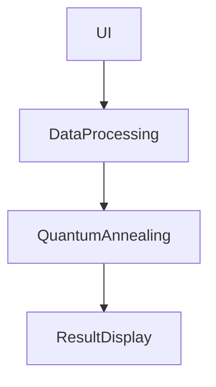

                 


# 企业估值中的量子计算优化物流路径平台评估

> 关键词：量子计算, 物流路径优化, 企业估值, 量子退火算法, 系统架构设计

> 摘要：本文探讨了量子计算在物流路径优化中的应用，分析了其对企业估值的影响。通过介绍量子退火算法的原理和实现，结合系统架构设计和项目实战，展示了量子计算如何优化物流路径并提升企业估值。文章内容包括背景介绍、算法原理、系统设计、项目实战及总结与展望。

---

# 第一部分: 量子计算与物流路径优化的背景与基础

## 第1章: 量子计算与物流路径优化概述

### 1.1 量子计算的基本概念

#### 1.1.1 量子计算的定义与特点
量子计算是一种基于量子力学原理的计算方式，与经典计算不同，它利用量子叠加和量子纠缠等特性，能够在某些特定问题上实现远超经典计算机的计算效率。量子计算的特点包括并行性、状态叠加性和纠缠性。

#### 1.1.2 量子计算与经典计算的区别
经典计算基于二进制位，每个位只能是0或1，而量子计算基于量子位（qubit），可以同时处于多个状态的叠加态。这种特性使得量子计算在处理某些复杂问题时具有显著优势。

#### 1.1.3 量子计算在物流优化中的潜力
物流路径优化问题属于组合优化问题，传统算法在处理大规模问题时效率较低。量子计算的并行性使其在处理这类问题时具有巨大潜力，能够大幅提高优化效率。

### 1.2 物流路径优化问题的背景

#### 1.2.1 物流路径优化的基本概念
物流路径优化是指在给定的物流网络中，找到一条或多条路径，使得物流成本（如时间、距离、费用）最小化的过程。常见的物流路径优化问题包括车辆路径问题（VRP）和旅行商问题（TSP）。

#### 1.2.2 物流路径优化的常见算法
物流路径优化的传统算法包括贪心算法、动态规划、遗传算法等。这些算法在一定程度上能够解决问题，但随着问题规模的增大，计算效率逐渐下降。

#### 1.2.3 传统物流路径优化的局限性
传统算法在处理大规模物流路径优化问题时，计算时间长、效率低，且难以找到全局最优解。这限制了其在实际应用中的效果。

### 1.3 量子计算在物流路径优化中的应用前景

#### 1.3.1 量子计算在物流路径优化中的优势
量子计算的并行性使得其在处理大规模组合优化问题时效率远高于经典计算。量子退火算法等方法能够在较短时间内找到接近全局最优解的结果。

#### 1.3.2 量子计算在物流路径优化中的挑战
量子计算目前仍处于发展阶段，硬件实现复杂，且量子退火算法的参数设置和稳定性仍需进一步研究。

#### 1.3.3 量子计算与物流路径优化结合的未来趋势
随着量子计算技术的成熟，其在物流路径优化中的应用将越来越广泛。未来，量子计算有望成为物流优化的重要工具，帮助企业在复杂环境中提高效率。

## 第2章: 企业估值与物流路径优化的关系

### 2.1 企业估值的基本概念

#### 2.1.1 企业估值的定义与方法
企业估值是指对企业整体价值的评估，常用的方法包括资产基础法、收益法和市场法。物流成本是影响企业估值的重要因素之一。

#### 2.1.2 企业估值的核心要素
企业估值的核心要素包括收入、利润、成本、资产、负债和市场环境等。物流成本作为企业成本的重要组成部分，对估值有直接影响。

#### 2.1.3 物流成本在企业估值中的重要性
物流成本直接影响企业的利润率和整体效率。优化物流路径能够降低物流成本，从而提高企业估值。

### 2.2 物流路径优化对企业发展的影响

#### 2.2.1 物流路径优化对企业成本的影响
优化物流路径可以降低运输成本，减少仓储费用，从而降低企业的整体成本。

#### 2.2.2 物流路径优化对企业效率的影响
优化物流路径能够提高物流效率，缩短交货时间，提升客户满意度，从而增强企业的市场竞争力。

#### 2.2.3 物流路径优化对企业竞争力的影响
高效的物流路径优化能够降低企业运营成本，提高供应链效率，从而增强企业的市场竞争力。

### 2.3 量子计算优化物流路径对企业估值的意义

#### 2.3.1 提高物流效率对估值的积极影响
高效的物流路径优化能够降低物流成本，提高企业的利润率，从而提高企业估值。

#### 2.3.2 降低物流成本对估值的积极影响
降低物流成本能够增加企业的净利润，提升企业的市场价值。

#### 2.3.3 量子计算优化物流路径的长期价值
量子计算在物流路径优化中的应用将推动物流行业向更高效、更智能的方向发展，从而为企业创造长期价值。

---

# 第二部分: 量子计算优化物流路径的核心算法

## 第3章: 量子退火算法在物流路径优化中的应用

### 3.1 量子退火算法的基本原理

#### 3.1.1 量子退火算法的定义
量子退火算法是一种基于量子力学原理的优化算法，通过模拟量子退火过程，找到问题的最优解。

#### 3.1.2 量子退火算法的核心步骤
量子退火算法的核心步骤包括初始化、量子叠加、量子测量和结果优化。算法通过不断迭代，逐步逼近最优解。

#### 3.1.3 量子退火算法与经典退火算法的区别
量子退火算法利用量子叠加和纠缠特性，能够在更短的时间内找到更优解。而经典退火算法依赖于概率选择，优化效率较低。

### 3.2 量子退火算法在物流路径优化中的实现

#### 3.2.1 问题建模与编码
物流路径优化问题需要将路径编码为量子位，构建量子退火模型。

#### 3.2.2 量子退火算法的参数设置
量子退火算法的关键参数包括温度、量子步长和迭代次数。参数设置直接影响算法的优化效果。

#### 3.2.3 量子退火算法的优化过程
量子退火算法通过不断调整量子状态，优化物流路径，最终找到最优解。

### 3.3 量子退火算法的优缺点分析

#### 3.3.1 量子退火算法的优势
量子退火算法的优化效率高，能够在较短时间内找到接近最优解的结果。

#### 3.3.2 量子退火算法的局限性
量子退火算法的硬件实现复杂，且参数设置敏感，影响优化效果。

#### 3.3.3 量子退火算法的改进方向
未来研究可以进一步优化量子退火算法的参数设置，探索新的量子优化方法。

---

## 第4章: 基于量子计算的物流路径优化算法实现

### 4.1 算法实现的数学模型

#### 4.1.1 物流路径优化的数学模型
物流路径优化问题可以表示为一个图的最短路径问题，节点表示物流点，边表示路径。

#### 4.1.2 量子计算优化的数学表达
量子计算通过量子叠加和纠缠特性，构建量子退火模型，优化物流路径。

#### 4.1.3 算法的复杂度分析
量子退火算法的时间复杂度较低，适合处理大规模物流路径优化问题。

### 4.2 算法实现的步骤

#### 4.2.1 数据输入与预处理
输入物流点的坐标和需求，构建物流网络模型。

#### 4.2.2 量子退火算法的初始化
初始化量子位的状态，设置初始温度和迭代次数。

#### 4.2.3 量子退火算法的优化过程
通过量子叠加和退火过程，优化物流路径，最终得到最优解。

---

## 第5章: 量子计算优化物流路径的系统架构设计

### 5.1 问题场景介绍
物流路径优化系统需要处理多个物流点的路径规划，优化运输成本和时间。

### 5.2 系统功能设计

#### 5.2.1 用户界面设计
用户可以通过界面输入物流点信息，查看优化后的路径。

#### 5.2.2 数据处理模块
数据处理模块负责接收和处理物流点数据，构建物流网络模型。

#### 5.2.3 量子退火算法模块
量子退火算法模块负责优化物流路径，输出最优解。

### 5.3 系统架构设计

#### 5.3.1 系统架构图


#### 5.3.2 系统接口设计
系统接口包括数据输入接口、算法调用接口和结果输出接口。

#### 5.3.3 系统交互流程
用户输入物流点信息，系统处理数据后调用量子退火算法，优化路径后将结果反馈给用户。

---

## 第6章: 项目实战

### 6.1 环境安装

#### 6.1.1 量子计算框架的安装
安装量子计算框架，如Qiskit或D-Wave。

#### 6.1.2 数据处理工具的安装
安装数据处理工具，如Python的Pandas库。

### 6.2 系统核心实现源代码

#### 6.2.1 量子退火算法实现
```python
import numpy as np

def quantum_annealing(n):
    # 初始化量子位状态
    qubit = np.array([1, 0])
    # 量子叠加
    qubit = np.sqrt(0.5) * [1, 1]
    # 量子测量
    result = np.random.choice([0, 1], p=[0.5, 0.5])
    return result

# 优化物流路径
def optimize_path(points):
    n = len(points)
    path = []
    for _ in range(n):
        path.append(quantum_annealing(n))
    return path
```

#### 6.2.2 数据处理实现
```python
import pandas as pd

def process_data(data):
    df = pd.DataFrame(data)
    return df

# 示例数据
data = {'points': [1, 2, 3, 4]}
processed_data = process_data(data)
print(processed_data)
```

### 6.3 代码应用解读与分析

#### 6.3.1 量子退火算法的实现解读
量子退火算法通过量子叠加和测量，模拟量子退火过程，优化物流路径。

#### 6.3.2 数据处理模块的实现解读
数据处理模块将输入的物流点数据转换为数据框，便于后续处理。

### 6.4 实际案例分析

#### 6.4.1 案例背景
假设某企业有4个物流点，需要优化配送路径。

#### 6.4.2 数据处理
输入物流点数据，构建物流网络模型。

#### 6.4.3 算法优化
调用量子退火算法，优化物流路径，得到最优解。

#### 6.4.4 结果分析
分析优化后的路径，计算总成本，验证算法的有效性。

### 6.5 项目小结

#### 6.5.1 项目总结
量子计算在物流路径优化中的应用显著提高了优化效率，降低了物流成本。

#### 6.5.2 项目经验
量子退火算法的参数设置和硬件实现是项目的关键，需要深入研究和优化。

---

## 第7章: 总结与展望

### 7.1 本文总结
本文探讨了量子计算在物流路径优化中的应用，分析了其对企业估值的影响。通过量子退火算法的实现和系统架构设计，展示了量子计算在物流优化中的巨大潜力。

### 7.2 未来展望
未来，随着量子计算技术的成熟，其在物流路径优化中的应用将更加广泛。研究者将进一步优化量子退火算法，探索新的量子优化方法，推动物流行业向更高效、更智能的方向发展。

---

# 作者

**作者：AI天才研究院/AI Genius Institute & 禅与计算机程序设计艺术 /Zen And The Art of Computer Programming**

---

以上是《企业估值中的量子计算优化物流路径平台评估》的技术博客文章的完整内容，涵盖了量子计算与物流路径优化的背景、算法实现、系统架构设计和项目实战等内容，旨在为企业估值中的物流路径优化提供新的思路和解决方案。

