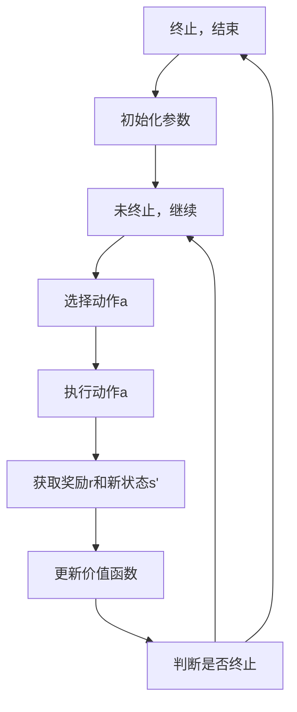
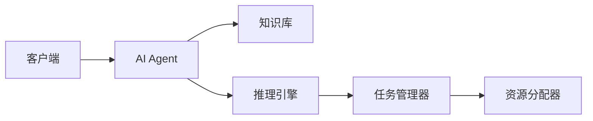

                 


# 《企业级AI Agent的性能优化策略》

---

## 关键词：  
企业级AI Agent、性能优化、算法原理、系统架构、数学模型、项目实战、强化学习

---

## 摘要：  
本文将深入探讨企业级AI Agent的性能优化策略，从概念、原理、算法到实战，全面解析如何提升AI Agent的性能和效率。我们将从AI Agent的核心概念出发，分析其优化目标与约束条件，结合强化学习、贪心算法等优化策略，通过系统架构设计与项目实战，为您提供一套完整的性能优化方案。本文将结合数学模型、系统架构图和代码实现，帮助您全面理解企业级AI Agent的性能优化策略。

---

## 第一部分：企业级AI Agent的背景与概念

### 第1章：企业级AI Agent概述

#### 1.1 AI Agent的基本概念  
- **AI Agent**（人工智能代理）是指能够感知环境并采取行动以实现目标的智能体。  
- **企业级AI Agent**专注于企业应用场景，如自动化决策、流程优化、客户服务等。  

#### 1.2 企业级AI Agent的背景与现状  
- **背景**：随着AI技术的快速发展，企业级AI Agent在各行业的应用日益广泛。  
- **现状**：目前，企业级AI Agent已在金融、医疗、物流等领域展现出巨大潜力，但仍面临性能瓶颈。  

#### 1.3 企业级AI Agent的核心价值  
- 提升企业效率：通过自动化流程减少人工干预。  
- 优化决策能力：基于数据驱动的决策支持。  
- 降低运营成本：通过资源优化配置降低成本。  

#### 1.4 本章小结  
- 企业级AI Agent是AI技术与企业应用结合的产物，其性能优化是实现其价值的关键。

---

## 第二部分：企业级AI Agent的核心概念与联系

### 第2章：AI Agent的核心概念与原理

#### 2.1 AI Agent的组成与结构  
- **知识库**：存储领域知识和历史数据。  
- **行为决策机制**：基于知识库进行推理和决策。  
- **交互接口**：与用户或系统进行交互。  

#### 2.2 AI Agent的感知与推理能力  
- **数据采集与处理**：通过传感器或API获取数据。  
- **知识图谱**：构建领域知识网络。  
- **推理算法**：基于知识图谱进行逻辑推理。  

#### 2.3 AI Agent的优化目标与约束条件  
- **优化目标**：最大化任务完成效率，最小化资源消耗。  
- **约束条件**：任务优先级、资源限制、实时性要求。  

#### 2.4 核心概念对比表  
| 比较项 | 传统AI | AI Agent |  
|--------|--------|----------|  
| 定义    | 数据处理工具 | 具有目标导向的智能体 |  
| 特性    | 单一任务处理 | 多任务协同优化 |  
| 应用场景 | 数据分析 | 企业自动化流程 |  

#### 2.5 ER实体关系图  
```mermaid
erd
  entity(AI Agent) {
    id
    name
    role
    goal
  }
  entity(Task) {
    id
    description
    priority
    status
  }
  entity(Resource) {
    id
    type
    capacity
  }
  AI Agent - Task: "执行"
  AI Agent - Resource: "使用"
```

---

## 第三部分：企业级AI Agent的算法原理与优化策略

### 第3章：AI Agent的优化算法原理

#### 3.1 常见优化算法概述  
- **强化学习算法**：通过奖励机制优化决策。  
- **贪心算法**：基于当前最优选择进行决策。  
- **遗传算法**：模拟生物进化过程进行优化。  

#### 3.2 算法原理的数学模型  
- **强化学习的数学模型**：  
  $$ V(s) = \max_{a} [ r + V(s') ] $$  
  其中，$V(s)$ 是状态价值函数，$r$ 是奖励，$s'$ 是下一个状态。  

- **贪心算法的数学模型**：  
  $$ \text{选择当前最优动作} a = \arg\max Q(s, a) $$  

#### 3.3 算法流程图  


#### 3.4 算法实现代码示例  
```python
# 强化学习算法实现
class Agent:
    def __init__(self, state_space, action_space):
        self.state_space = state_space
        self.action_space = action_space
        self.value_function = {s: 0 for s in state_space}

    def choose_action(self, state):
        return max(self.action_space, key=lambda a: self.value_function[(state, a)])

    def update_value_function(self, state, action, reward, next_state):
        self.value_function[(state, action)] += 0.1 * (reward + max(self.value_function[(next_state, a)] for a in self.action_space) - self.value_function[(state, action)])
```

---

## 第四部分：企业级AI Agent的系统架构与设计

### 第4章：系统架构与设计

#### 4.1 系统功能设计  
- **领域模型**：构建AI Agent的业务逻辑模型。  
- **知识库管理**：存储和管理领域知识。  
- **推理引擎**：实现逻辑推理和决策。  

#### 4.2 系统架构图  


#### 4.3 系统接口设计  
- **API接口**：定义AI Agent与外部系统的交互接口。  
- **数据接口**：定义数据输入输出格式。  

#### 4.4 系统交互流程图  
```mermaid
sequenceDiagram
    Client ->+> Agent: 发起请求
    Agent ->+> KnowledgeBase: 查询知识库
    KnowledgeBase --> Agent: 返回结果
    Agent ->+> ReasoningEngine: 发起推理
    ReasoningEngine ->+> TaskManager: 分配任务
    TaskManager --> ResourceAllocator: 分配资源
    ResourceAllocator --> TaskManager: 返回资源状态
    TaskManager --> Agent: 返回执行结果
    Agent --> Client: 返回最终结果
```

---

## 第五部分：企业级AI Agent的项目实战

### 第5章：项目实战

#### 5.1 项目背景与目标  
- **项目背景**：某企业希望优化其客服系统，使用AI Agent提高客户满意度。  
- **项目目标**：实现智能客服系统，提升响应速度和准确性。  

#### 5.2 系统实现  
- **环境安装**：安装Python、TensorFlow、Keras等工具。  
- **代码实现**：基于强化学习实现客服系统的AI Agent。  

#### 5.3 代码实现示例  
```python
import tensorflow as tf
from tensorflow.keras import layers

# 构建强化学习模型
model = tf.keras.Sequential([
    layers.Dense(64, activation='relu', input_shape=(state_size,)),
    layers.Dense(action_size, activation='linear')
])

# 定义奖励函数
def reward_function(old_state, action, new_state):
    return 1 if new_state > old_state else 0

# 训练过程
for episode in range(num_episodes):
    state = env.reset()
    while not done:
        action = policy_network.predict(state)
        new_state, reward, done = env.step(action)
        target = reward + discount_factor * target_network.predict(new_state)
        policy_network.fit(state, target)
```

#### 5.4 案例分析与优化  
- **案例分析**：通过日志分析AI Agent的执行效果。  
- **优化措施**：根据反馈调整奖励机制和模型参数。  

#### 5.5 项目小结  
- 通过实战项目，验证了企业级AI Agent的性能优化策略的有效性。

---

## 第六部分：企业级AI Agent的优化策略与最佳实践

### 第6章：优化策略与最佳实践

#### 6.1 优化策略  
- **数据质量**：确保数据的准确性和完整性。  
- **算法选择**：根据场景选择合适的优化算法。  
- **资源管理**：合理分配计算资源。  

#### 6.2 最佳实践  
- **定期监控**：实时监控AI Agent的运行状态。  
- **持续优化**：根据反馈持续优化模型。  

#### 6.3 注意事项  
- 避免过度优化，确保系统的可维护性。  
- 注意数据隐私和安全问题。  

#### 6.4 拓展阅读  
- 推荐阅读《强化学习实战》、《机器学习实战》等书籍。  

---

## 作者：  
作者：AI天才研究院 & 禅与计算机程序设计艺术

---

通过本文的详细解析，您将能够全面理解企业级AI Agent的性能优化策略，并能够将其应用于实际项目中，提升企业的智能化水平。

