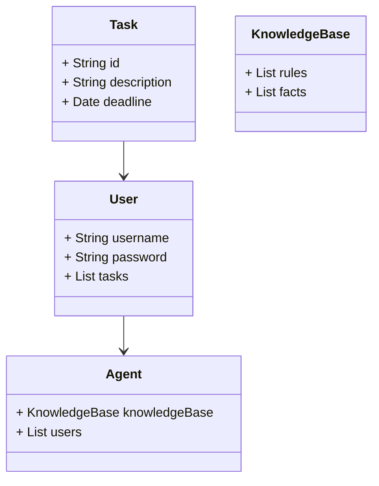

                 

# 企业级AI Agent的用户体验设计原则

## 关键词：企业级AI Agent、用户体验设计原则、人机交互、智能系统设计、用户体验优化

## 摘要：  
企业级AI Agent是人工智能技术在企业应用场景中的重要实现形式，其用户体验设计直接关系到系统的可用性和用户满意度。本文从企业级AI Agent的核心概念、算法原理、系统架构、项目实战和最佳实践等多个维度，详细阐述了用户体验设计的原则和方法。通过对比分析、流程图和代码示例，本文深入探讨了如何设计出高效、智能且易于使用的AI Agent系统，为读者提供了从理论到实践的全面指导。

---

# 第一部分: 企业级AI Agent的用户体验设计背景

## 第1章: 企业级AI Agent与用户体验概述

### 1.1 企业级AI Agent的定义与背景
企业级AI Agent是一种基于人工智能技术的智能体，能够根据用户的输入（如自然语言或命令）执行任务、提供反馈或优化决策。与传统AI系统相比，AI Agent具有更强的自主性和适应性，能够主动理解用户需求并提供个性化服务。

#### 1.1.1 AI Agent的基本概念
- **智能体（Agent）**：智能体是指能够感知环境并采取行动以实现目标的实体。
- **企业级AI Agent**：在企业场景中，AI Agent通常用于自动化任务、优化流程、辅助决策或提供用户服务。

#### 1.1.2 企业级AI Agent的特征
- **智能性**：能够理解用户需求并执行复杂任务。
- **交互性**：支持多种交互方式（如自然语言、图形界面）。
- **自主性**：能够在没有人工干预的情况下运行。
- **适应性**：能够根据环境变化动态调整行为。

#### 1.1.3 用户体验设计的重要性
用户体验（UX）是用户与AI Agent交互过程中感受到的直观体验。优秀的用户体验设计能够提升用户满意度、降低使用门槛并提高系统可用性。

---

### 1.2 企业级AI Agent的应用场景
企业级AI Agent的应用场景广泛，以下是常见的几种：
1. **企业内部自动化**：用于任务调度、流程优化和资源管理。
2. **用户服务**：通过客服系统为用户提供智能咨询和问题解决。
3. **决策支持**：基于数据分析为管理层提供决策支持。
4. **外部服务**：通过API为企业客户提供智能化服务。

---

### 1.3 企业级AI Agent的核心要素
企业级AI Agent的设计需要重点关注以下要素：
1. **知识表示**：如何将企业的知识和规则转化为AI Agent可以理解的形式。
2. **逻辑推理**：AI Agent如何根据输入信息进行推理和决策。
3. **自然语言处理**：支持用户通过自然语言与AI Agent交互。
4. **用户反馈机制**：用户对AI Agent的反馈如何被收集和优化。

---

## 第2章: 企业级AI Agent的核心概念与联系

### 2.1 AI Agent的核心概念原理
企业级AI Agent的设计依赖于多个核心技术，包括知识表示、逻辑推理和自然语言处理。

#### 2.1.1 知识表示
知识表示是将企业中的知识、规则和数据转化为AI Agent可以理解的形式。常见的知识表示方法包括：
- **符号表示法**：使用符号和规则表示知识。
- **语义网络**：通过节点和边表示概念及其关系。
- **本体论（Ontology）**：定义领域内的概念、属性和关系。

#### 2.1.2 逻辑推理
逻辑推理是AI Agent根据已知信息进行推理和决策的过程。常见的推理方法包括：
- **演绎推理**：从一般到特殊的推理。
- **归纳推理**：从特殊到一般的推理。
- **案例推理**：基于类似案例进行推理。

#### 2.1.3 自然语言处理
自然语言处理（NLP）是AI Agent理解用户输入的关键技术。常用的NLP技术包括：
- **分词**：将文本分割成词或短语。
- **句法分析**：分析句子的语法结构。
- **情感分析**：识别文本中的情感倾向。

---

### 2.2 核心概念属性对比
为了更好地理解企业级AI Agent的核心概念，我们需要将其与其他相关技术进行对比。

#### 2.2.1 AI Agent与传统AI的对比
| 属性         | AI Agent                     | 传统AI                   |
|--------------|------------------------------|--------------------------|
| 自主性       | 高                           | 低                       |
| 交互性       | 支持用户交互                 | 不支持或有限               |
| 应用场景     | 企业级应用                   | 科学计算、数据处理等       |

#### 2.2.2 AI Agent与规则引擎的对比
| 属性         | AI Agent                     | 规则引擎                 |
|--------------|------------------------------|--------------------------|
| 智能性       | 高                           | 低                       |
| 适应性       | 高                           | 低                       |
| 可扩展性     | 高                           | 中                       |

#### 2.2.3 AI Agent与机器学习模型的对比
| 属性         | AI Agent                     | 机器学习模型             |
|--------------|------------------------------|--------------------------|
| 数据依赖性   | 低                           | 高                       |
| 解释性       | 高                           | 低                       |

---

## 第3章: 企业级AI Agent的系统架构与设计

### 3.1 系统架构设计
企业级AI Agent的系统架构通常包括以下几个部分：
1. **用户交互层**：负责与用户的交互，支持多种输入方式。
2. **知识库层**：存储企业的知识、规则和数据。
3. **推理引擎**：根据用户输入和知识库内容进行推理和决策。
4. **执行层**：将推理结果转化为具体行动。

#### 3.1.1 领域模型类图
以下是领域模型的类图：

---

### 3.2 接口和交互设计
为了确保用户体验的良好，企业级AI Agent需要设计合理的接口和交互流程。

#### 3.2.1 接口设计
- **RESTful API**：提供标准的HTTP接口，方便其他系统调用。
- **WebSocket**：支持实时通信，适用于需要实时反馈的场景。

#### 3.2.2 交互设计
- **自然语言交互**：用户可以通过自然语言与AI Agent对话。
- **图形界面交互**：提供直观的图形界面，方便用户操作。

---

## 第4章: 企业级AI Agent的用户体验优化

### 4.1 用户体验的核心原则
1. **简洁性**：设计简单直观的交互界面。
2. **反馈及时性**：用户操作后应立即得到反馈。
3. **个性化**：根据用户需求提供个性化服务。
4. **容错性**：系统应能够处理用户的错误操作。

### 4.2 用户体验优化实践
1. **用户反馈机制**：收集用户对AI Agent的反馈，并不断优化系统。
2. **上下文感知**：AI Agent应能够理解当前的上下文，提供更精准的服务。
3. **多模态交互**：支持多种交互方式，如语音、图像和文本。

---

## 第5章: 企业级AI Agent的未来发展趋势

### 5.1 AI Agent的未来发展方向
1. **增强的自主性**：AI Agent将更加自主，能够独立完成更多任务。
2. **更强的可解释性**：用户希望了解AI Agent的决策过程。
3. **跨平台支持**：AI Agent将支持更多平台和设备。

### 5.2 用户体验设计的未来挑战
1. **复杂场景下的用户体验优化**：在复杂场景中设计出良好的用户体验是未来的一大挑战。
2. **隐私与安全**：如何保护用户的隐私和数据安全是设计者需要重点关注的问题。

---

## 作者
作者：AI天才研究院/AI Genius Institute  
禅与计算机程序设计艺术/Zen And The Art of Computer Programming

