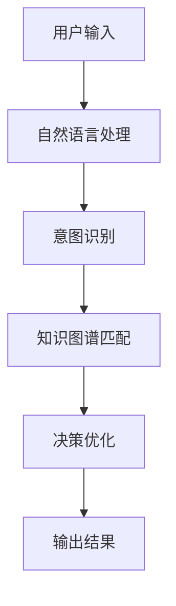
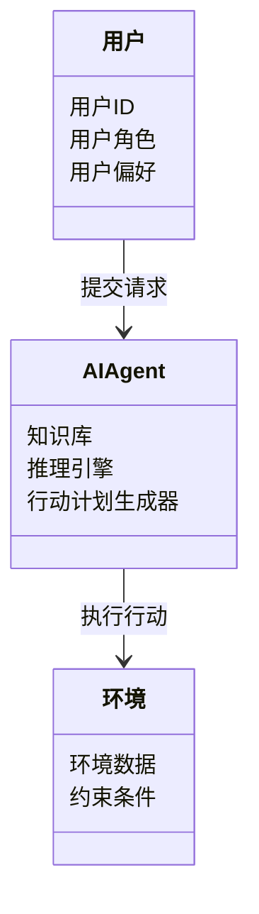

                 


# 企业级AI Agent需求分析方法

> 关键词：企业级AI Agent，需求分析，算法原理，系统架构，项目实战

> 摘要：本文系统地探讨了企业级AI Agent的需求分析方法，从背景介绍、核心概念、算法原理、系统架构到项目实战，结合实际案例，详细阐述了企业级AI Agent需求分析的关键步骤和方法论，为企业AI Agent的设计与实现提供了理论和实践指导。

---

# 第一章: 企业级AI Agent概述

## 1.1 AI Agent的基本概念

### 1.1.1 AI Agent的定义与特点

AI Agent（人工智能代理）是一种智能实体，能够感知环境并自主决策，执行任务以满足特定目标。企业级AI Agent具有以下几个特点：

1. **自主性**：能够在没有外部干预的情况下独立运作。
2. **反应性**：能够根据环境变化实时调整行为。
3. **目标导向**：所有行动都围绕实现特定目标展开。
4. **知识驱动**：依赖于知识库进行决策和推理。

### 1.1.2 企业级AI Agent的内涵

企业级AI Agent是应用于企业环境中的智能代理，用于解决复杂业务问题，优化流程，提升效率。其内涵包括：

1. **企业目标一致性**：AI Agent的目标与企业战略目标一致。
2. **高度定制化**：根据企业需求进行定制开发。
3. **可扩展性**：能够适应企业规模和业务的扩展。

### 1.1.3 企业级AI Agent的应用场景

企业级AI Agent的应用场景广泛，包括：

- **客户支持**：通过自然语言处理（NLP）提供智能客服。
- **流程自动化**：自动处理业务流程，提高效率。
- **决策支持**：基于数据分析提供决策建议。
- **风险管理**：实时监控风险，预防潜在问题。

## 1.2 企业级AI Agent的发展现状

### 1.2.1 AI Agent技术的发展历程

AI Agent技术经历了从简单规则引擎到复杂多智能体系统的演变。早期的AI Agent主要基于规则，随着技术进步，逐渐融入了机器学习、深度学习等技术。

### 1.2.2 企业级AI Agent的应用现状

当前，企业级AI Agent已在多个领域得到应用，如金融、医疗、制造等。例如，在金融领域，AI Agent用于实时交易监控和风险预警。

### 1.2.3 当前存在的主要问题与挑战

尽管企业级AI Agent技术发展迅速，但仍面临以下挑战：

1. **复杂性**：企业环境复杂，需求多样化。
2. **数据依赖**：高度依赖数据质量和完整性。
3. **可解释性**：AI决策过程需透明可解释。
4. **安全性**：防止数据泄露和系统攻击。

## 1.3 企业级AI Agent的需求分析重要性

### 1.3.1 需求分析在AI Agent开发中的作用

需求分析是AI Agent开发的基础，确保系统设计符合企业目标和用户需求。它直接影响系统的功能、性能和用户体验。

### 1.3.2 企业级需求的特点与复杂性

企业级需求通常具有以下特点：

1. **多样性**：涉及多个业务部门和系统。
2. **复杂性**：需求之间可能存在冲突和优先级问题。
3. **动态性**：企业需求随市场变化而调整。

### 1.3.3 需求分析对企业价值的影响

有效的需求分析能够：

1. **降低开发风险**：确保开发方向正确。
2. **提高开发效率**：明确需求减少返工。
3. **提升系统质量**：确保系统功能满足用户需求。

## 1.4 本章小结

本章介绍了企业级AI Agent的基本概念、发展现状及需求分析的重要性。企业级AI Agent在企业中的应用日益广泛，但其复杂性和多样性要求我们必须重视需求分析，确保系统设计和实现符合企业目标。

---

# 第二章: 企业级AI Agent的核心概念与联系

## 2.1 核心概念原理

### 2.1.1 AI Agent的基本原理

AI Agent通过感知环境、分析信息、制定计划、执行行动和评估结果来实现目标。其基本流程如下：

1. **感知环境**：通过传感器或数据接口获取环境信息。
2. **分析信息**：利用算法处理信息，识别模式。
3. **制定计划**：基于知识库和推理引擎生成行动计划。
4. **执行行动**：通过执行机构或API调用实现目标。
5. **评估结果**：根据反馈调整策略。

### 2.1.2 企业级AI Agent的核心要素

企业级AI Agent的核心要素包括：

1. **知识库**：存储企业相关的知识和数据。
2. **推理引擎**：用于逻辑推理和决策。
3. **行动计划生成器**：制定具体行动方案。
4. **执行接口**：与企业系统和其他系统交互。

### 2.1.3 需求分析的关键环节

需求分析的关键环节包括：

1. **需求收集**：通过访谈、问卷等方式收集需求。
2. **需求分析**：对收集的需求进行分类、优先级排序。
3. **需求验证**：确保需求的可行性和一致性。
4. **需求文档**：编写详细的需求规格说明书。

## 2.2 核心概念属性特征对比

### 2.2.1 不同AI Agent类型对比

| 类型          | 特点                | 适用场景               |
|---------------|--------------------|------------------------|
| 简单规则型    | 基于简单规则       | 适用于规则明确的场景     |
| 复杂规则型    | 基于复杂规则       | 适用于规则复杂的场景     |
| 基于学习型    | 通过机器学习训练    | 适用于数据丰富的场景     |
| 多智能体型     | 多个智能体协作      | 适用于复杂分布式系统     |

### 2.2.2 企业级与个人级AI Agent的差异

| 属性          | 企业级AI Agent       | 个人级AI Agent         |
|---------------|----------------------|------------------------|
| 目标           | 企业目标             | 用户个人需求           |
| 复杂度         | 高                   | 低                     |
| 数据依赖       | 强                   | 弱                     |
| 安全性         | 高                   | 中                     |

### 2.2.3 需求分析中的关键属性

| 属性          | 描述                  |
|---------------|-----------------------|
| 可用性         | 系统在需要时可用       |
| 可靠性         | 系统在故障时可恢复     |
| 性能           | 系统处理任务的能力     |
| 可扩展性       | 系统适应变化的能力     |

## 2.3 ER实体关系图架构

```mermaid
er
actor: 用户
agent: AI Agent
goal: 目标
action: 行动
constraint: 约束条件
```

## 2.4 本章小结

本章详细介绍了企业级AI Agent的核心概念和相关属性，通过对比分析和ER图展示了各要素之间的关系。理解这些核心概念是进行需求分析的基础，有助于后续系统设计和实现。

---

# 第三章: 企业级AI Agent需求分析的算法原理

## 3.1 算法原理概述

### 3.1.1 基于自然语言处理的意图识别

自然语言处理（NLP）是实现意图识别的关键技术。常用算法包括：

1. **词袋模型（Bag-of-Words）**：基于词频统计。
2. **TF-IDF（Term Frequency-Inverse Document Frequency）**：计算词的重要性。
3. **深度学习模型（如BERT）**：通过上下文理解意图。

### 3.1.2 基于知识图谱的语义理解

知识图谱通过构建语义网络，帮助AI Agent理解上下文。常用技术包括：

1. **实体识别（NER）**：识别文本中的实体。
2. **关系抽取**：识别实体之间的关系。
3. **知识推理**：基于知识图谱进行推理。

### 3.1.3 基于强化学习的决策优化

强化学习通过奖励机制优化决策。常用算法包括：

1. **Q-Learning**：基于状态-动作-奖励模型。
2. **Deep Q-Network（DQN）**：结合深度学习的强化学习。
3. **策略梯度方法（Policy Gradient）**：直接优化策略。

## 3.2 算法流程图



## 3.3 数学模型与公式

### 3.3.1 概率模型

$$ P(A|B) = \frac{P(B|A)P(A)}{P(B)} $$

### 3.3.2 决策树模型

$$ entropy = -\sum p_i \log p_i $$

### 3.3.3 强化学习的Q值更新公式

$$ Q(s, a) = Q(s, a) + \alpha [r + \max Q(s', a') - Q(s, a)] $$

---

# 第四章: 企业级AI Agent系统架构设计

## 4.1 系统功能设计

### 4.1.1 领域模型



### 4.1.2 功能模块划分

| 模块          | 功能描述                |
|---------------|-------------------------|
| 用户交互层    | 提供用户与系统交互界面    |
| 业务逻辑层    | 处理业务逻辑            |
| 数据访问层    | 访问数据库和其他数据源    |
| 应用服务层    | 提供API接口和公共服务      |

## 4.2 系统架构设计

### 4.2.1 分层架构


### 4.2.2 微服务架构

```mermaid
service
    AI Agent服务
    知识库服务
    推理引擎服务
    用户服务
```

## 4.3 接口设计

### 4.3.1 RESTful API

| 接口名称        | 请求方法 | URL                  | 描述                     |
|-----------------|----------|----------------------|--------------------------|
| 提交请求        | POST     | /api/agent/request   | 提交用户请求             |
| 获取结果        | GET      | /api/agent/result    | 获取处理结果             |

---

# 第五章: 企业级AI Agent项目实战

## 5.1 环境搭建

### 5.1.1 技术选型

- **编程语言**：Python
- **深度学习框架**：TensorFlow
- **NLP库**：spaCy
- **知识图谱工具**：Neo4j

### 5.1.2 环境配置

```bash
pip install python3 python3-pip
pip install tensorflow spacy neo4j
```

## 5.2 核心实现

### 5.2.1 意图识别代码

```python
import spacy

nlp = spacy.load("en_core_web_sm")

def identify_intent(text):
    doc = nlp(text)
    # 使用 spaCy 进行意图识别
    return "intent"
```

### 5.2.2 知识图谱构建代码

```python
from neo4j import GraphDatabase

def create_graph(tx, entity, relation, target):
    tx.run("MATCH (a {name: $entity}), (b {name: $target}) "
            "CREATE (a)-[r:$relation]->(b)", 
            entity=entity, relation=relation, target=target)
```

## 5.3 代码解读与分析

### 5.3.1 意图识别代码解读

- **导入库**：使用spaCy加载预训练模型。
- **文本处理**：将输入文本转换为文档对象。
- **意图识别**：通过模型识别意图并返回结果。

### 5.3.2 知识图谱构建代码解读

- **连接数据库**：使用Neo4j连接到图数据库。
- **创建关系**：根据实体和关系创建边。

## 5.4 案例分析

### 5.4.1 案例场景

假设企业需要构建一个智能客服系统，用于处理客户咨询。

### 5.4.2 实施步骤

1. **需求收集**：与客户部门沟通，明确需求。
2. **数据准备**：收集常见问题和答案。
3. **模型训练**：使用NLP模型训练意图识别。
4. **系统集成**：将AI Agent集成到客服系统中。

## 5.5 项目总结

通过实际案例分析，展示了企业级AI Agent的需求分析和系统实现过程。案例的成功实施证明了需求分析方法的有效性。

---

# 第六章: 企业级AI Agent的最佳实践

## 6.1 小结

企业级AI Agent的需求分析是系统开发的关键环节。通过明确需求、设计合理的系统架构和选择合适的技术，可以确保系统高效、可靠地运行。

## 6.2 注意事项

1. **需求验证**：确保需求的可行性和一致性。
2. **数据安全**：保护企业数据不被泄露。
3. **系统可扩展性**：设计灵活的架构以适应未来发展。
4. **用户体验**：注重用户体验，提升系统易用性。

## 6.3 未来趋势

随着AI技术的不断进步，企业级AI Agent将更加智能化、个性化。未来的趋势包括：

1. **强化学习的应用**：通过强化学习优化决策。
2. **多模态交互**：支持语音、视觉等多种交互方式。
3. **边缘计算**：AI Agent向边缘计算方向发展，提升实时性。

---

# 作者

作者：AI天才研究院（AI Genius Institute） & 禅与计算机程序设计艺术（Zen And The Art of Computer Programming）

---

通过以上详细的内容，您可以根据实际需求对各个部分进行扩展和补充，确保文章内容的完整性和深度。

