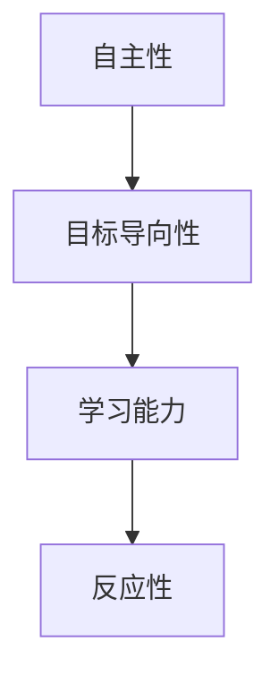
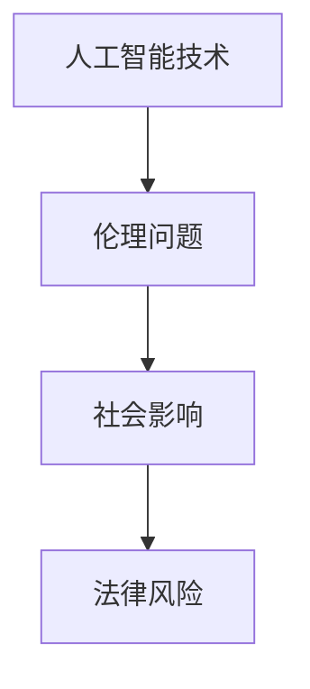
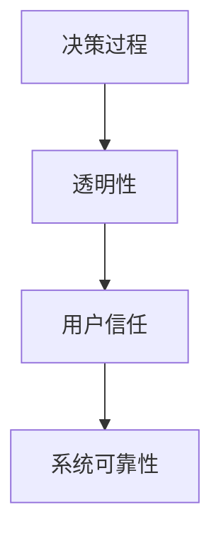
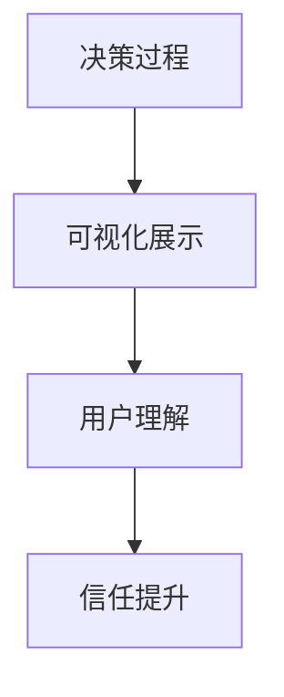
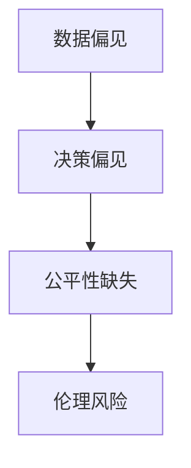
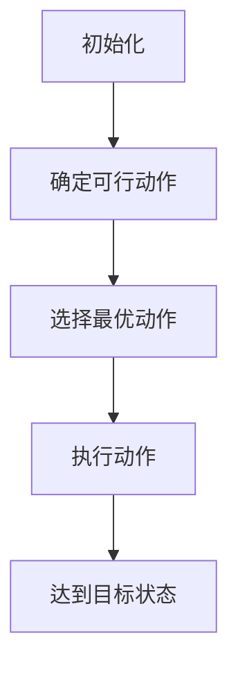
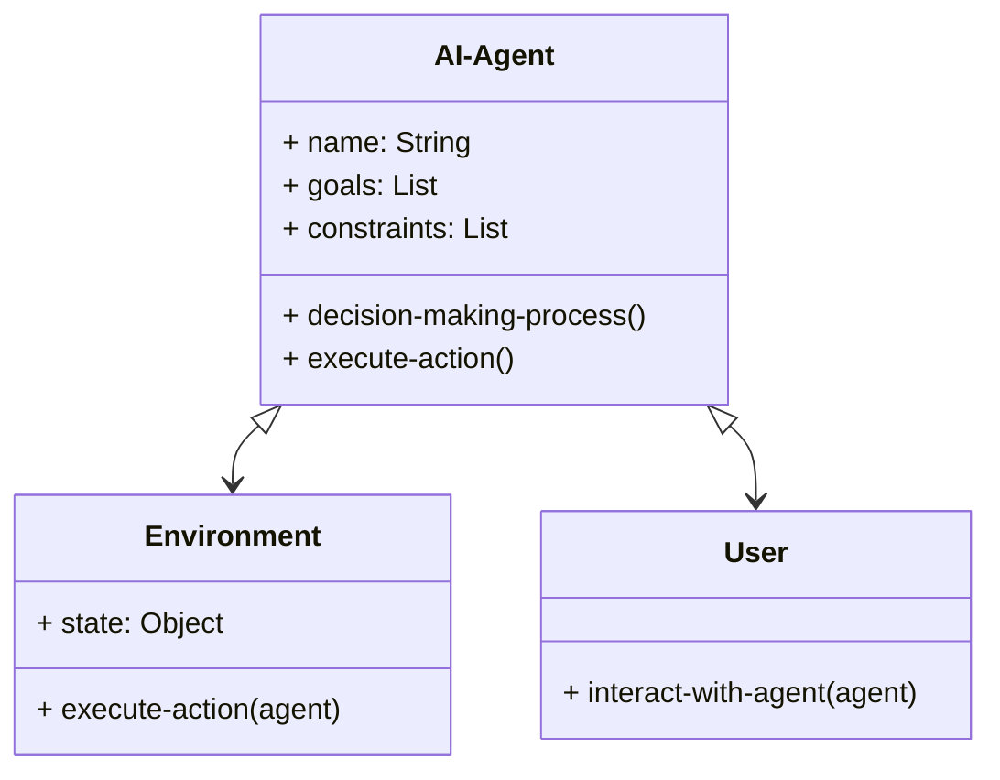
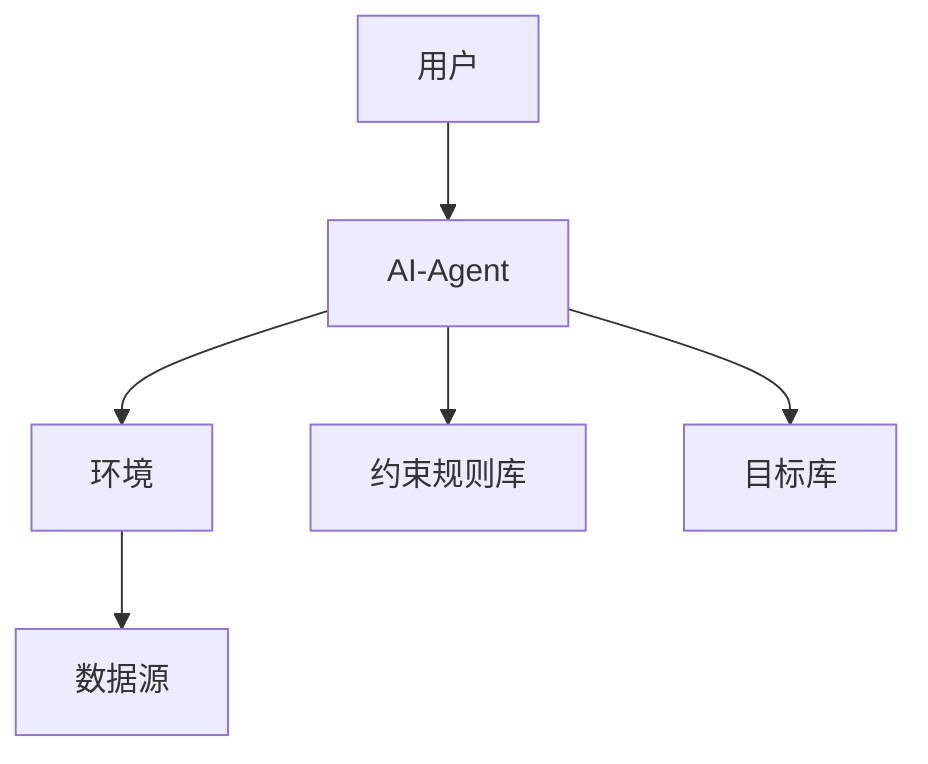

                 


# 伦理AI：设计符合道德标准的AI Agent

> 关键词：伦理AI, AI Agent, 人工智能, 伦理设计, 道德标准

> 摘要：随着人工智能技术的快速发展，AI Agent在各个领域的应用日益广泛，然而其决策和行为的伦理问题也日益凸显。本文从伦理AI的背景、核心问题、设计原则、技术实现、系统架构、项目实战、法律与社会影响等方面，全面探讨如何设计符合道德标准的AI Agent。通过详细的技术分析、案例研究和方法论探讨，本文为AI开发者和研究人员提供了实用的伦理设计指南。

---

## 第1章: 伦理AI的背景与核心概念

### 1.1 AI Agent的基本概念

#### 1.1.1 AI Agent的定义与核心特征

AI Agent（人工智能代理）是指能够感知环境、做出决策并采取行动以实现目标的智能实体。AI Agent的核心特征包括：

1. **自主性**：能够独立决策和行动。
2. **反应性**：能够根据环境变化实时调整行为。
3. **目标导向性**：所有行为都以实现特定目标为导向。
4. **学习能力**：通过数据和经验不断优化自身行为。

**图1.1：AI Agent的核心特征**



#### 1.1.2 人工智能技术的快速发展与挑战

近年来，AI技术的飞速发展推动了AI Agent在医疗、金融、交通等领域的广泛应用。然而，这种技术的进步也带来了新的挑战，尤其是在伦理和道德方面。

**图1.2：AI技术的发展与伦理挑战**



#### 1.1.3 伦理AI的必要性与重要性

AI Agent的设计必须符合伦理标准，以避免潜在的负面影响。伦理AI的重要性体现在以下几个方面：

1. **避免伦理风险**：确保AI Agent的行为不会对人类或社会造成伤害。
2. **提升社会接受度**：伦理设计能够增强公众对AI技术的信任。
3. **合规性**：符合相关法律法规，避免法律纠纷。

---

### 1.2 伦理AI的核心问题背景

#### 1.2.1 AI Agent的决策透明性

AI Agent的决策过程需要具备透明性，以便用户和开发者能够理解其行为的依据。透明性缺失可能导致用户对AI系统的信任缺失。

**图1.3：透明性在AI Agent设计中的重要性**



#### 1.2.2 伦理AI的目标与边界

伦理AI的目标是确保AI Agent的行为符合人类社会的道德规范。其边界包括：

1. **技术边界**：AI Agent的能力受到技术限制。
2. **社会边界**：AI Agent的行为必须符合社会价值观。
3. **法律边界**：AI Agent的行为必须符合相关法律法规。

#### 1.2.3 伦理AI与社会价值观的关联

AI Agent的设计必须考虑社会价值观的多样性。例如，在某些文化中，隐私保护可能比其他文化更为重要。

---

## 第2章: AI Agent的核心伦理问题

### 2.1 AI Agent的决策透明性

#### 2.1.1 透明性在AI Agent设计中的重要性

AI Agent的决策过程需要透明，以便用户能够理解其行为的依据。例如，在医疗领域，医生需要理解AI诊断系统的决策逻辑，以确保诊断的准确性。

**图2.1：AI Agent决策透明性的实现方法**



#### 2.1.2 透明性缺失带来的伦理风险

透明性缺失可能导致用户对AI系统的信任缺失，甚至引发法律纠纷。例如，如果AI系统在招聘过程中存在偏见，而用户无法理解其决策依据，可能会引发公平性争议。

### 2.2 AI Agent的隐私保护

#### 2.2.1 隐私泄露的伦理风险

AI Agent在处理数据时，必须保护用户隐私。数据泄露可能导致严重的伦理问题，例如身份盗窃或歧视。

#### 2.2.2 数据隐私保护的实现方法

数据隐私保护可以通过以下方法实现：

1. **数据加密**：对敏感数据进行加密处理，防止未经授权的访问。
2. **数据匿名化**：对数据进行匿名化处理，去除个人信息。
3. **访问控制**：通过访问控制策略，限制数据的访问权限。

### 2.3 AI Agent的公平性与偏见问题

#### 2.3.1 数据偏见的来源与影响

数据偏见是AI系统中常见的问题，它可能导致AI Agent在决策过程中产生偏见。例如，如果训练数据中女性的比例较低，AI系统可能在招聘过程中对女性候选人产生偏见。

**图2.2：数据偏见的来源与影响**



#### 2.3.2 算法公平性的实现方法

算法公平性可以通过以下方法实现：

1. **数据预处理**：对训练数据进行清洗，去除偏见。
2. **算法后处理**：在算法输出后进行调整，确保公平性。
3. **模型再训练**：通过重新训练模型，减少偏见。

---

## 第3章: 伦理AI的设计原则与方法论

### 3.1 伦理AI的设计原则

#### 3.1.1 以用户为中心的设计原则

AI Agent的设计必须以用户的需求和利益为核心，确保其行为符合用户的期望。

#### 3.1.2 透明性与可解释性原则

AI Agent的决策过程必须透明且可解释，以便用户能够理解其行为的依据。

#### 3.1.3 隐私与数据安全原则

AI Agent必须严格遵守数据隐私保护原则，确保用户数据的安全。

---

## 第4章: 伦理AI的技术实现

### 4.1 伦理AI的算法实现

#### 4.1.1 基于约束的规划算法

**算法4.1：基于约束的规划算法**

```python
def constrained_planning_algorithm(goals, constraints):
    # 初始化
    current_state = initial_state
    # 循环直到达到目标状态
    while current_state != goal_state:
        # 确定可行动作
        possible_actions = get_possible_actions(current_state, constraints)
        # 选择最优动作
        selected_action = select_optimal_action(possible_actions)
        # 执行动作
        current_state = execute_action(current_state, selected_action)
    return current_state
```

**图4.1：基于约束的规划算法流程图**



#### 4.1.2 伦理AI的数学模型

**公式4.1：基于约束的规划模型**

$$ \text{最大化 } U(x) \quad \text{在约束 } C(x) \text{ 下} $$

其中，\( U(x) \) 是效用函数，\( C(x) \) 是约束条件。

---

## 第5章: 伦理AI的系统架构

### 5.1 伦理AI的系统架构设计

#### 5.1.1 系统功能设计

**图5.1：伦理AI系统功能设计类图**



#### 5.1.2 系统架构设计

**图5.2：伦理AI系统架构图**



---

## 第6章: 伦理AI的项目实战

### 6.1 项目背景与目标

#### 6.1.1 项目背景

本项目旨在设计一个符合伦理标准的AI Agent，用于医疗诊断辅助系统。

#### 6.1.2 项目目标

1. **实现AI Agent的决策透明性**：确保医生能够理解AI的诊断建议。
2. **保护患者隐私**：确保患者数据的安全性和隐私性。
3. **消除数据偏见**：确保诊断结果的公平性。

### 6.2 项目实现

#### 6.2.1 环境安装

```bash
pip install numpy scikit-learn
```

#### 6.2.2 核心代码实现

```python
import numpy as np
from sklearn.model_selection import train_test_split

# 数据预处理
data = np.array([[70, 70, 70, 70], [80, 80, 80, 80], [90, 90, 90, 90]])
labels = ['良性', '恶性', '良性']

# 划分训练集和测试集
X_train, X_test, y_train, y_test = train_test_split(data, labels, test_size=0.2)

# 数据平衡化
from collections import Counter
from imblearn.over_sampling import SMOTE

smote = SMOTE(random_state=42)
X_res, y_res = smote.fit_resample(X_train, y_train)

# 训练模型
from sklearn.tree import DecisionTreeClassifier

model = DecisionTreeClassifier()
model.fit(X_res, y_res)

# 预测结果
model.predict(X_test)
```

#### 6.2.3 案例分析

通过上述代码实现的AI Agent，可以在医疗诊断中提供透明、公平且符合伦理标准的诊断建议。例如，在诊断乳腺癌时，AI Agent可以根据患者的年龄、症状和检查结果，结合约束规则和目标导向性，提供最佳诊断建议。

---

## 第7章: 法律与社会影响

### 7.1 伦理AI的法律框架

#### 7.1.1 当前法律框架

各国和地区正在逐步建立AI技术的法律框架，例如欧盟的《通用数据保护条例》（GDPR）。

#### 7.1.2 伦理AI对法律的影响

伦理AI的设计能够帮助AI Agent更好地遵守相关法律法规，减少法律风险。

### 7.2 社会接受度与伦理AI

#### 7.2.1 社会接受度的提升

透明性和公平性的实现能够提升公众对AI技术的信任，从而增强社会接受度。

#### 7.2.2 伦理AI的社会影响

伦理AI的设计能够促进社会公平，减少歧视和偏见。

---

## 第8章: 总结与展望

### 8.1 本章总结

通过本文的探讨，我们可以看到，设计符合道德标准的AI Agent是一个复杂但必要的任务。从伦理AI的背景到技术实现，每一个环节都需要仔细考虑和精心设计。

### 8.2 未来展望

随着AI技术的不断发展，伦理AI的设计将变得更加重要。未来的挑战包括如何在复杂的环境中实现AI Agent的决策透明性和公平性，以及如何应对法律法规的变化。

---

## 作者

作者：AI天才研究院/AI Genius Institute & 禅与计算机程序设计艺术 /Zen And The Art of Computer Programming

---

以上是《伦理AI：设计符合道德标准的AI Agent》的技术博客文章的大纲和部分具体内容。通过一步步的分析和讲解，我们可以看到，设计符合道德标准的AI Agent需要从背景、核心问题、设计原则、技术实现、系统架构、项目实战等多个方面进行全面考虑。希望本文能够为AI开发者和研究人员提供有价值的参考和指导。

