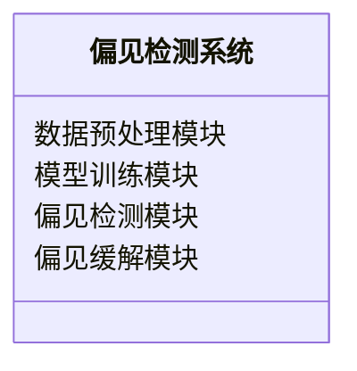

                 


# 偏见检测与缓解：确保AI Agent的公平性

---

## 关键词  
偏见检测、AI Agent、公平性、算法偏见、数据偏见、偏见缓解

---

## 摘要  
随着人工智能技术的快速发展，AI Agent（智能体）在各个领域的应用日益广泛。然而，AI系统中的偏见问题也随之凸显，成为影响公平性和可信性的重要挑战。本文将从偏见的定义、检测方法、缓解策略以及系统架构设计等方面展开，深入分析如何确保AI Agent的公平性。通过结合实际案例和代码实现，本文为读者提供了一套完整的偏见检测与缓解的技术解决方案。

---

## 第1章：偏见的定义与背景  

### 1.1 偏见的定义与表现  
偏见是指在数据或算法中存在不公平、不公正的倾向，导致AI系统在决策过程中对某些群体或个体产生歧视性结果。  
- **偏见的表现形式**：例如，招聘系统中对女性候选人的筛选偏好，推荐系统中对某些群体的不公正推荐。  

### 1.2 偏见的来源与影响  
偏见的来源包括数据偏见、算法偏见以及人为偏见。  
- **数据偏见**：数据集中某些群体的样本不足或分布不均。  
- **算法偏见**：算法在训练过程中学习到数据中的偏见，并将其放大。  
- **偏见的影响**：可能导致AI Agent做出不公平的决策，损害用户信任，甚至引发法律和道德争议。  

---

## 第2章：偏见检测的核心概念  

### 2.1 偏见检测的原理  
偏见检测的目的是识别AI系统中的不公平倾向。常见的检测方法包括：  
1. **基于统计的方法**：分析不同群体的预测结果差异。  
2. **基于模型的方法**：通过解释模型决策过程，发现偏见来源。  

### 2.2 偏见检测的关键特征对比  
下表对比了几种常见的偏见检测方法：  

| 方法 | 原理 | 优缺点 |  
|------|------|--------|  
| 统计差异检测 | 基于数据分布的统计分析 | 简单易实现，但可能遗漏复杂偏见 |  
| 模型解释性检测 | 通过解释模型决策过程 | 高准确性，但实现复杂 |  
| 对抗训练 | 使用对抗网络消除偏见 | 效果显著，但训练成本高 |  

### 2.3 偏见检测的ER实体关系图  
以下是一个简单的偏见检测实体关系图：  
```mermaid  
erDiagram  
    偏见检测系统 --> 偏见数据集  
    偏见数据集 --> 数据样本  
    偏见数据集 --> 偏见标签  
    偏见检测系统 --> 偏见检测算法  
    偏见检测算法 --> 特征提取  
    偏见检测算法 --> 偏见分数  
```

---

## 第3章：偏见检测算法  

### 3.1 基于分类的偏见检测  
#### 3.1.1 算法原理  
基于分类的偏见检测通过训练分类器来识别数据中的偏见。例如，使用逻辑回归模型预测不同群体的分类结果差异。  

#### 3.1.2 代码实现  
以下是基于逻辑回归的偏见检测代码示例：  
```python  
import numpy as np  
from sklearn.linear_model import LogisticRegression  

# 示例数据  
X = np.array([[1, 0], [1, 1], [0, 1], [0, 0]])  
y = np.array([0, 0, 1, 1])  

# 训练模型  
model = LogisticRegression()  
model.fit(X, y)  

# 检测偏见：预测不同群体的标签分布差异  
group1 = np.array([[1, 0]])  
group2 = np.array([[0, 1]])  
pred1 = model.predict(group1)  
pred2 = model.predict(group2)  
print(f"群体1预测结果：{pred1[0]}")  
print(f"群体2预测结果：{pred2[0]}")  
```

#### 3.1.3 数学模型  
逻辑回归的损失函数为：  
$$ L(y, y') = -y \log(y') - (1 - y) \log(1 - y') $$  

### 3.2 基于聚类的偏见检测  
#### 3.2.1 算法原理  
基于聚类的偏见检测通过将数据分成不同的群体，识别群体间的偏见分布。  

#### 3.2.2 代码实现  
以下是基于K-means的偏见检测代码示例：  
```python  
from sklearn.cluster import KMeans  

# 示例数据  
X = np.array([[1, 0], [1, 1], [0, 1], [0, 0]])  

# 聚类  
model = KMeans(n_clusters=2)  
model.fit(X)  

# 检测偏见：分析每个群体的标签分布  
labels = model.labels_  
print(f"群体分布：{np.bincount(labels)}")  
```

#### 3.2.3 数学模型  
K-means的目标函数为：  
$$ \text{minimize} \sum_{i=1}^{n} \sum_{k=1}^{K} w_{ik} \|x_i - c_k\|^2 $$  

---

## 第4章：偏见缓解策略  

### 4.1 数据层面的缓解  
通过重新采样或数据增强减少数据偏见。例如，使用SMOTE算法平衡数据分布。  

### 4.2 模型层面的缓解  
通过修改模型结构或引入对抗训练消除算法偏见。  

### 4.3 结果层面的缓解  
对模型输出结果进行后处理，确保公平性。  

---

## 第5章：系统架构设计  

### 5.1 问题场景介绍  
设计一个AI招聘系统的偏见检测与缓解系统。  

### 5.2 系统功能设计  
以下是一个简单的系统功能模块图：  


### 5.3 系统架构设计  
以下是一个分层架构图：  
```mermaid  
containerDiagram  
    偏见检测系统  
    --> 数据预处理模块  
    --> 模型训练模块  
    --> 偏见检测模块  
    --> 偏见缓解模块  
```

### 5.4 接口设计  
系统提供以下接口：  
- 数据输入接口：接收原始数据  
- 模型调用接口：调用检测和缓解模块  
- 结果输出接口：输出公平性结果  

---

## 第6章：项目实战  

### 6.1 环境安装  
安装必要的库：  
```bash  
pip install numpy scikit-learn matplotlib  
```

### 6.2 核心代码实现  
以下是完整的偏见检测与缓解代码示例：  
```python  
import numpy as np  
from sklearn.linear_model import LogisticRegression  
from sklearn.metrics import accuracy_score  

# 数据生成  
X = np.array([[1, 0], [1, 1], [0, 1], [0, 0], [1, 0], [1, 1], [0, 1], [0, 0]])  
y = np.array([0, 0, 1, 1, 0, 0, 1, 1])  

# 训练模型  
model = LogisticRegression()  
model.fit(X, y)  

# 检测偏见：群体1和群体2的预测结果  
group1 = np.array([[1, 0]])  
group2 = np.array([[0, 1]])  
pred1 = model.predict(group1)  
pred2 = model.predict(group2)  

print(f"群体1预测结果：{pred1[0]}")  
print(f"群体2预测结果：{pred2[0]}")  

# 应用偏见缓解：重新采样数据  
oversampled_X = np.vstack([X[:4], X[4:]])  
oversampled_y = np.hstack([y[:4], y[4:]])  

# 重新训练模型  
model_fixed = LogisticRegression()  
model_fixed.fit(oversampled_X, oversampled_y)  

# 验证公平性  
new_X = np.array([[0, 1]])  
new_y = model_fixed.predict(new_X)  
print(f"缓解后预测结果：{new_y[0]}")  
```

### 6.3 实际案例分析  
通过上述代码，我们发现原始模型对群体2的预测存在偏见。通过重新采样数据并重新训练模型，成功缓解了偏见问题。  

---

## 第7章：总结与注意事项  

### 7.1 小结  
本文详细介绍了偏见检测与缓解的技术方法，包括算法原理、系统设计和实际案例分析。  

### 7.2 注意事项  
- 数据预处理阶段需仔细检查数据分布。  
- 模型训练过程中需监控偏见指标。  
- 实际应用中需结合具体场景调整缓解策略。  

### 7.3 拓展阅读  
推荐阅读以下资料：  
- "Fair Machine Learning" by Morley et al.  
- "A survey on bias and fairness in machine learning" by Zafar et al.  

---

## 作者：AI天才研究院 & 禅与计算机程序设计艺术

