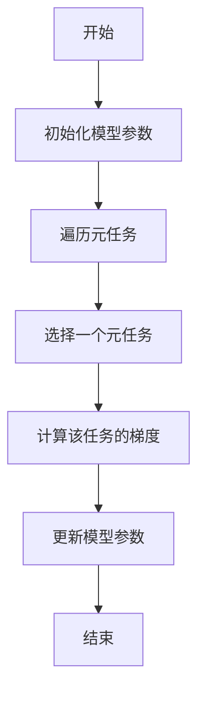
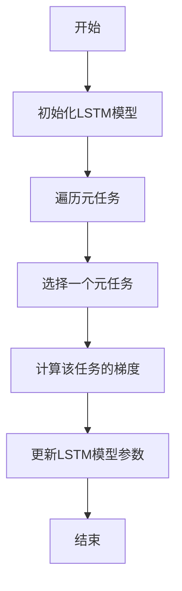
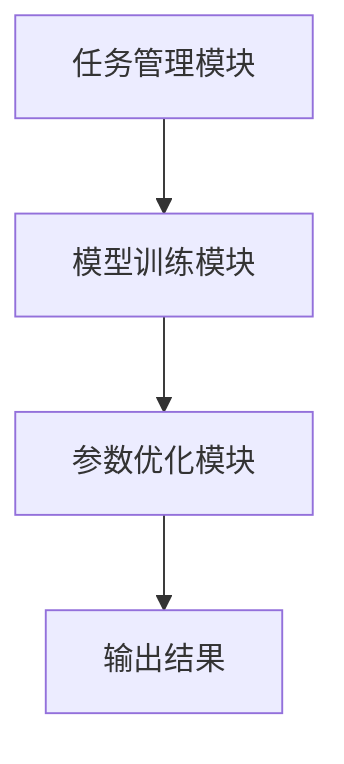
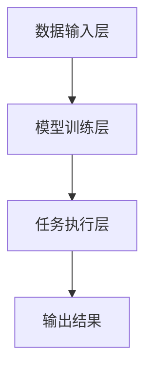

                 


# 元学习：构建能够自我改进的AI Agent

## 关键词：
元学习，AI Agent，自我改进，机器学习，深度学习，强化学习

## 摘要：
元学习是一种能够让AI Agent在不同任务和环境中快速适应和优化自身性能的学习方法。本文将从元学习的基本概念出发，深入探讨其在AI Agent构建中的应用。通过分析元学习的核心原理、算法实现、系统架构以及实际案例，我们将详细阐述如何利用元学习技术打造能够自我改进的AI Agent。本文内容涵盖背景介绍、核心概念、算法原理、系统设计、项目实战等多个方面，旨在为读者提供一个全面的元学习与AI Agent的知识框架。

---

## 第一部分: 元学习与AI Agent基础

### 第1章: 元学习与AI Agent概述

#### 1.1 元学习的基本概念
元学习（Meta-Learning）是指让模型学习如何进行学习的能力。与传统机器学习不同，元学习的目标是通过训练模型在多个任务之间进行快速迁移，从而实现对新任务的快速适应。元学习的核心思想是通过“学习如何学习”，使模型具备更强的泛化能力和适应性。

#### 1.2 AI Agent的定义与特点
AI Agent（人工智能代理）是指能够感知环境并采取行动以实现目标的智能实体。AI Agent可以是软件程序、机器人或其他智能系统，其核心能力包括感知、决策、规划和执行。AI Agent的特点包括自主性、反应性、目标导向性和社交能力。

#### 1.3 元学习在AI Agent中的应用
元学习在AI Agent中的应用主要体现在以下几个方面：
1. **快速适应新任务**：通过元学习，AI Agent可以在新任务上线时快速调整自身参数，减少训练时间。
2. **多任务学习**：元学习使AI Agent能够同时处理多个任务，并在任务之间共享学习经验。
3. **动态环境适应**：在动态变化的环境中，元学习能够帮助AI Agent快速适应新的挑战。

---

### 第2章: 元学习的核心概念与联系

#### 2.1 元学习的原理
元学习的核心原理在于通过“元任务”（meta-tasks）的训练，让模型学会如何在不同任务之间进行参数调整。元学习算法通常包括两个阶段：
1. **元训练阶段**：在多个任务上训练模型，使其学会如何调整参数。
2. **任务执行阶段**：在新任务上，模型利用元训练阶段学到的知识快速适应新任务。

#### 2.2 元学习与AI Agent的关系
元学习为AI Agent提供了自我改进的能力。通过元学习，AI Agent可以在执行任务的过程中不断优化自身的行为策略，从而实现更高的任务成功率。

#### 2.3 元学习的核心概念对比
下表展示了元学习与其他学习方法的核心区别：

| **方法** | **目标** | **特点** |
|----------|----------|----------|
| 传统机器学习 | 解决特定任务 | 需要大量标注数据，适应性差 |
| 强化学习 | 学习最优策略 | 依赖于环境反馈，训练时间长 |
| 元学习 | 学习如何学习 | 适应性强，快速迁移 |

---

### 第3章: 元学习的算法原理

#### 3.1 模型无关元学习算法
模型无关元学习算法（Model-Agnostic Meta-Learning, MAML）是一种经典的元学习方法。其核心思想是通过优化模型的参数，使得模型在多个任务之间共享参数，从而实现快速迁移。

**MAML算法流程图（使用mermaid）：**



#### 3.2 模型有关元学习算法
模型有关元学习算法（Model-Based Meta-Learning）依赖于特定的模型架构，例如LSTM或CNN。其核心思想是通过模型的内部结构来实现任务间的参数共享。

**Meta-LSTM算法流程图（使用mermaid）：**



#### 3.3 元学习算法的优缺点对比
下表展示了模型无关元学习和模型有关元学习的优缺点对比：

| **方法** | **优点** | **缺点** |
|----------|----------|----------|
| 模型无关元学习 | 参数共享能力强，适用于多种模型架构 | 对任务间关系的依赖性较高 |
| 模型有关元学习 | 依赖特定模型架构，训练效率高 | 模型架构固定，适应性有限 |

---

## 第二部分: 元学习的数学模型与公式

### 第4章: 元学习的数学模型

#### 4.1 元学习的损失函数
元学习的损失函数通常由两部分组成：元任务损失和元损失。元任务损失用于优化模型在单个任务上的性能，而元损失用于优化模型在多个任务之间的参数共享。

**元任务损失函数：**
$$ L_{\text{task}}(θ, x, y) = \text{损失函数} $$

**元损失函数：**
$$ L_{\text{meta}}(θ) = \sum_{i=1}^{N} L_{\text{task}}(θ, x_i, y_i) $$

#### 4.2 元学习的优化目标
元学习的优化目标是通过优化模型参数，使得模型在多个任务之间的损失函数最小化。

**优化目标：**
$$ \arg \min_{θ} \sum_{i=1}^{N} L_{\text{task}}(θ, x_i, y_i) $$

#### 4.3 元学习的梯度计算
元学习的梯度计算需要考虑多个任务之间的参数共享。通常，元学习的梯度计算公式如下：

**梯度计算：**
$$ \frac{\partial L_{\text{meta}}}{\partial θ} = \sum_{i=1}^{N} \frac{\partial L_{\text{task}}}{\partial θ} $$

---

### 第5章: 元学习的系统分析与架构设计

#### 5.1 系统功能设计
元学习系统的功能模块包括：
1. **任务管理模块**：负责管理多个任务的输入输出。
2. **模型训练模块**：负责训练元学习模型。
3. **参数优化模块**：负责优化模型参数。

**系统功能模块图（使用mermaid）：**



#### 5.2 系统架构设计
元学习系统的架构设计通常包括以下几个部分：
1. **数据输入层**：接收多个任务的数据输入。
2. **模型训练层**：对模型进行元训练。
3. **任务执行层**：在新任务上执行模型推理。

**系统架构图（使用mermaid）：**



---

## 第三部分: 元学习的项目实战

### 第6章: 项目实战

#### 6.1 环境安装
为了实现元学习模型，首先需要安装以下环境：
1. **Python 3.8+**
2. **TensorFlow或PyTorch**
3. **Mermaid工具**

#### 6.2 核心代码实现
以下是一个简单的MAML算法实现示例：

```python
import tensorflow as tf

class MetaLearner:
    def __init__(self, input_shape, output_shape):
        self.model = self.build_model(input_shape, output_shape)
        self.optimizer = tf.keras.optimizers.Adam(lr=0.001)
    
    def build_model(self, input_shape, output_shape):
        model = tf.keras.Sequential([
            tf.keras.layers.Dense(64, activation='relu', input_shape=input_shape),
            tf.keras.layers.Dense(output_shape)
        ])
        return model
    
    def train(self, tasks):
        for task in tasks:
            x, y = task.get_data()
            with tf.GradientTape() as tape:
                y_pred = self.model(x)
                loss = tf.keras.losses.mean_squared_error(y, y_pred)
            gradients = tape.gradient(loss, self.model.trainable_weights)
            self.optimizer.apply_gradients(zip(gradients, self.model.trainable_weights))
```

#### 6.3 案例分析与解读
以下是一个简单的案例分析：

**案例背景**：假设我们有一个AI Agent需要在多个分类任务之间进行快速迁移。

**任务执行步骤**：
1. **任务管理模块**接收多个分类任务的数据输入。
2. **模型训练模块**对模型进行元训练，优化模型参数。
3. **任务执行层**在新任务上执行模型推理，输出分类结果。

---

## 第四部分: 元学习的总结与展望

### 第7章: 总结与展望

#### 7.1 最佳实践 tips
1. 在实际应用中，建议优先选择模型无关元学习算法，以提高模型的通用性。
2. 在系统设计中，需要充分考虑任务之间的关系，以优化模型的参数共享能力。

#### 7.2 小结
元学习是一种能够显著提高AI Agent性能和适应性的学习方法。通过元学习，AI Agent可以在新任务上线时快速调整自身参数，从而实现更高的任务成功率。

#### 7.3 注意事项
1. 元学习的训练时间通常较长，需要注意计算资源的分配。
2. 元学习的效果依赖于任务之间的相似性，任务差异较大的情况下，效果可能不佳。

#### 7.4 拓展阅读
1. 《Meta-Learning: A Survey》
2. 《Deep Learning: Methods and Applications》

---

## 作者：AI天才研究院/AI Genius Institute & 禅与计算机程序设计艺术 /Zen And The Art of Computer Programming

