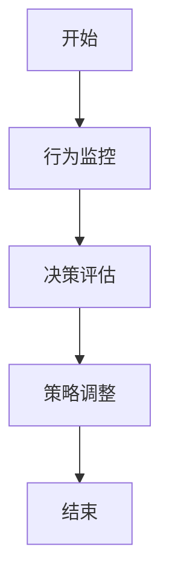
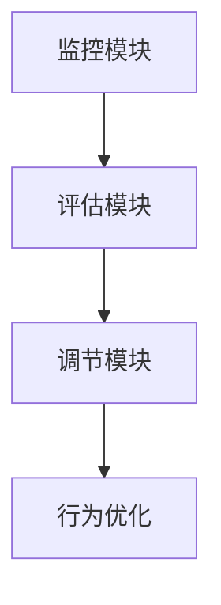
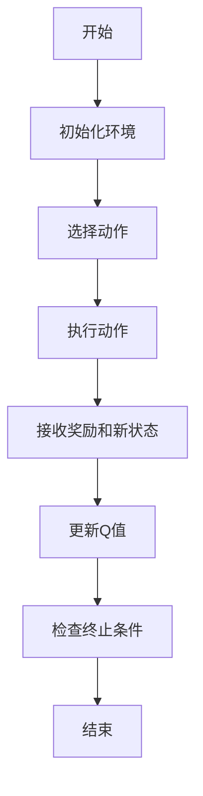
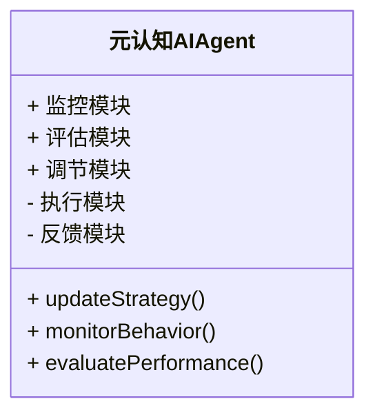
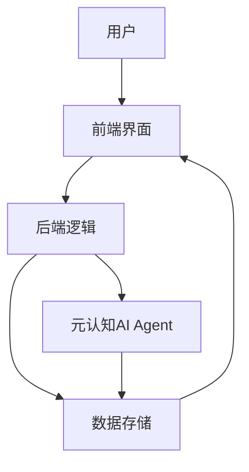
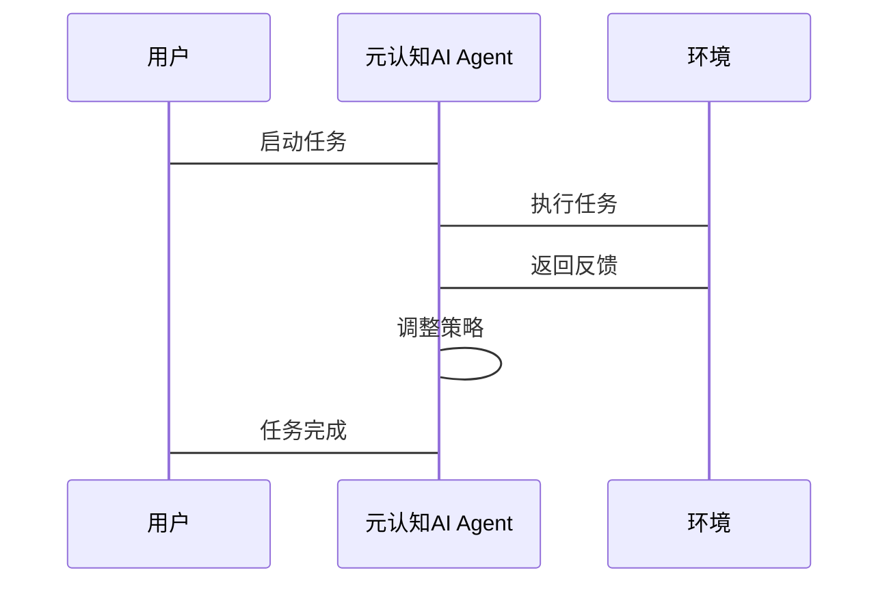

                 


# 元认知AI Agent：自我监控与调节

## 关键词：元认知AI Agent，自我监控，自我调节，人工智能，深度学习，强化学习

## 摘要：  
元认知AI Agent是一种具备自我监控和自我调节能力的先进人工智能系统，能够通过对自身认知过程的深刻理解和动态调整，显著提升任务执行的效率和准确性。本文将详细探讨元认知AI Agent的核心概念、算法原理、系统架构设计以及实际应用案例，揭示其在人工智能领域的创新价值和未来发展方向。

---

# 元认知AI Agent：自我监控与调节

## 第一部分：元认知AI Agent的背景与概念

### 第1章：元认知AI Agent的背景与问题背景

#### 1.1 元认知AI Agent的定义与核心概念  
元认知AI Agent是一种结合了元认知理论和人工智能技术的智能体，能够对自身的认知过程进行监控、评估和调节，从而优化决策和行为。其核心概念包括：  
- **元认知**：对自身认知过程的认知和调控能力。  
- **AI Agent**：具备自主决策和行动能力的人工智能实体。  
- **自我监控**：实时监测自身的行为、决策和状态。  
- **自我调节**：根据监控结果调整自身行为以适应环境变化。  

**对比表：元认知AI Agent与传统AI Agent的核心区别**  

| 属性              | 传统AI Agent                  | 元认知AI Agent                |
|-------------------|-------------------------------|--------------------------------|
| 行为决策           | 基于预设规则或训练数据         | 基于动态监控和反馈进行调整    |
| 环境适应性         | 有限的环境适应能力             | 强大的环境适应和自适应能力    |
| 决策优化           | 依赖固定模型或策略             | 通过元认知能力动态优化决策    |
| 自我改进能力       | 无或弱                          | 强，具备自我反思和改进机制    |

#### 1.2 元认知AI Agent的问题背景  
当前AI Agent在处理复杂任务时，往往面临以下挑战：  
- **环境不确定性**：复杂环境中，AI Agent难以实时调整策略。  
- **任务多样性**：单一算法难以应对多任务场景。  
- **动态变化**：环境动态变化导致传统AI Agent难以持续优化。  

元认知AI Agent通过引入自我监控和调节能力，能够有效应对上述挑战，实现动态适应和持续优化。

#### 1.3 元认知AI Agent的实现目标与设计思路  
- **实现目标**：  
  - 实时监控自身行为和决策过程。  
  - 根据监控结果动态调整策略和行为。  
  - 提升任务执行的准确性和效率。  

- **设计思路**：  
  - 结合元认知理论，构建自我监控机制。  
  - 利用强化学习和深度学习技术实现自我调节。  
  - 设计高效的反馈循环以优化决策过程。

#### 1.4 元认知AI Agent的边界与外延  
- **边界**：  
  - 仅限于具备自我监控和调节能力的智能体。  
  - 不涉及人类情感或社交智能的模拟。  

- **外延**：  
  - 可扩展至多智能体协作场景。  
  - 可应用于复杂动态环境中的任务优化。

---

## 第二部分：元认知AI Agent的核心概念与联系

### 第2章：元认知AI Agent的核心概念与原理

#### 2.1 元认知能力的实现原理  
元认知AI Agent通过以下步骤实现自我监控与调节：  
1. **行为监控**：实时收集自身行为数据。  
2. **决策评估**：分析行为数据，评估决策的合理性和效果。  
3. **策略调整**：根据评估结果优化策略和行为模式。  

**Mermaid流程图：元认知能力的实现流程**  



#### 2.2 元认知AI Agent的核心要素  
- **监控模块**：负责收集和分析行为数据。  
- **评估模块**：对行为数据进行分析和评估。  
- **调节模块**：根据评估结果调整策略和行为。  

**Mermaid实体关系图：核心要素关系**  



#### 2.3 元认知AI Agent的数学模型与公式  
元认知AI Agent的决策优化可以通过强化学习模型实现，其数学公式如下：  

状态值函数：  
$$ V(s) = r + \gamma V(s') $$  

策略优化：  
$$ \pi(a|s) = \arg\max_a Q(s,a) $$  

其中，$s$ 表示当前状态，$a$ 表示动作，$r$ 表示奖励，$\gamma$ 表示折扣因子，$Q(s,a)$ 表示Q值函数。

---

## 第三部分：元认知AI Agent的算法原理

### 第3章：元认知AI Agent的算法实现

#### 3.1 元认知AI Agent的算法选择与实现步骤  
选择深度强化学习（Deep Q-Learning）作为实现元认知AI Agent的核心算法。实现步骤如下：  

1. **环境初始化**：定义任务环境和状态空间。  
2. **神经网络构建**：使用深度神经网络近似Q值函数。  
3. **行为选择**：基于ε-greedy策略选择动作。  
4. **奖励反馈**：根据环境反馈更新Q值。  
5. **策略调节**：根据元认知监控结果动态调整ε值。  

**Mermaid流程图：深度强化学习算法流程**  



#### 3.2 元认知AI Agent的Python实现代码  

```python
import numpy as np
import gym

class MetaCognitiveAI:
    def __init__(self, env_name='CartPole-v0'):
        self.env = gym.make(env_name)
        self.model = self.build_model()
        self.epsilon = 1.0
        self.gamma = 0.99
        self.lr = 0.001
        self.epsilon_min = 0.01

    def build_model(self):
        # 简单的神经网络模型，实际可以使用更复杂的架构
        from tensorflow.keras import layers
        model = layers.Sequential([
            layers.Dense(24, activation='relu', input_shape=(self.env.observation_space.shape[0],)),
            layers.Dense(24, activation='relu'),
            layers.Dense(self.env.action_space.n, activation='linear')
        ])
        model.compile(optimizer='adam', loss='mse')
        return model

    def act(self, state):
        if np.random.random() < self.epsilon:
            return self.env.action_space.sample()
        else:
            q_values = self.model.predict(state[np.newaxis, :])[0]
            return np.argmax(q_values)

    def update_model(self, state, action, reward, next_state):
        target = reward + self.gamma * np.max(self.model.predict(next_state[np.newaxis, :])[0])
        q_values = self.model.predict(state[np.newaxis, :])[0]
        q_values[action] = target
        self.model.fit(state[np.newaxis, :], q_values[np.newaxis, :], epochs=1, verbose=0)
        self._update_epsilon()

    def _update_epsilon(self):
        self.epsilon = max(self.epsilon * 0.995, self.epsilon_min)

# 使用示例
agent = MetaCognitiveAI()
state = agent.env.reset()
for _ in range(1000):
    action = agent.act(state)
    next_state, reward, done, _ = agent.env.step(action)
    agent.update_model(state, action, reward, next_state)
    if done:
        state = agent.env.reset()
    else:
        state = next_state
```

---

## 第四部分：元认知AI Agent的系统架构设计

### 第4章：元认知AI Agent的系统架构与实现

#### 4.1 系统功能设计  
- **监控模块**：实时收集行为数据。  
- **评估模块**：分析行为数据并生成反馈。  
- **调节模块**：根据反馈调整策略。  

**Mermaid类图：系统功能设计**



#### 4.2 系统架构设计  
- **前端界面**：用户交互界面。  
- **后端逻辑**：实现元认知AI Agent的核心算法。  
- **数据存储**：存储行为数据和策略优化结果。  

**Mermaid架构图：系统架构设计**



#### 4.3 系统交互设计  
- **开始任务**：用户启动任务，触发AI Agent初始化。  
- **执行任务**：AI Agent执行任务并实时监控行为。  
- **反馈优化**：根据反馈调整策略并执行优化。  

**Mermaid序列图：系统交互流程**



---

## 第五部分：元认知AI Agent的项目实战

### 第5章：元认知AI Agent的实战案例

#### 5.1 项目环境安装与配置  
- **安装依赖**：  
  ```bash
  pip install gym numpy tensorflow keras
  ```

- **运行环境**：  
  ```bash
  python3
  ```

#### 5.2 核心代码实现  
```python
# 元认知AI Agent的核心代码
class MetaCognitiveAI:
    def __init__(self):
        self.model = self.build_model()
        self.epsilon = 1.0
        self.gamma = 0.99
        self.lr = 0.001

    def build_model(self):
        from tensorflow.keras import layers
        model = layers.Sequential([
            layers.Dense(24, activation='relu', input_shape=(4,)),
            layers.Dense(24, activation='relu'),
            layers.Dense(2, activation='linear')
        ])
        model.compile(optimizer='adam', loss='mse')
        return model

    def act(self, state):
        if np.random.random() < self.epsilon:
            return np.random.randint(0, 2)
        else:
            q_values = self.model.predict(state[np.newaxis, :])[0]
            return np.argmax(q_values)

    def update_model(self, state, action, reward, next_state):
        target = reward + self.gamma * np.max(self.model.predict(next_state[np.newaxis, :])[0])
        q_values = self.model.predict(state[np.newaxis, :])[0]
        q_values[action] = target
        self.model.fit(state[np.newaxis, :], q_values[np.newaxis, :], epochs=1, verbose=0)
        self._update_epsilon()

    def _update_epsilon(self):
        self.epsilon = max(self.epsilon * 0.995, 0.01)
```

#### 5.3 应用解读与案例分析  
通过在CartPole-v0环境中训练元认知AI Agent，可以观察其自我监控和调节能力的实现过程。运行代码后，AI Agent会逐步优化其策略，最终实现稳定控制杆子的任务目标。

#### 5.4 项目小结  
- **优势**：  
  - 具备强大的自我监控和调节能力。  
  - 可动态适应复杂环境变化。  

- **局限性**：  
  - 对计算资源要求较高。  
  - 在某些场景下可能需要额外的人类干预。  

---

## 第六部分：总结与展望

### 第6章：总结与展望

#### 6.1 本章总结  
元认知AI Agent通过引入自我监控和调节能力，显著提升了AI系统的适应性和智能性。其核心在于结合元认知理论和强化学习算法，实现动态优化和持续改进。

#### 6.2 未来展望  
元认知AI Agent的发展方向包括：  
- **多智能体协作**：实现多个元认知AI Agent的协同工作。  
- **复杂环境适应**：进一步提升在复杂动态环境中的适应能力。  
- **人机协作优化**：探索元认知AI Agent与人类协同的新模式。  

---

## 作者：AI天才研究院/AI Genius Institute & 禅与计算机程序设计艺术 /Zen And The Art of Computer Programming

